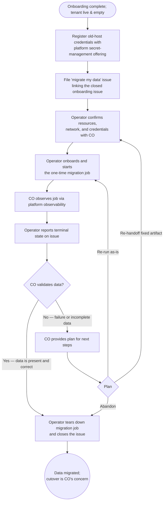

> **One-line definition:** A capability owner whose capability is already onboarded and running on the platform brings their existing end-user data over from the prior host by handing off a one-time migration process for the platform to run.

**Parent capability:** [Self-Hosted Application Platform](../_index.md)

## Persona

The actor here is the **same capability owner** described in [Host a Capability](./host-a-capability.md). They are not a different role for this journey — they are mid-lifecycle, having already completed onboarding, and now coming back to deal with one specific concern: their pre-existing data.

- **Role:** Capability owner. Their capability is already onboarded and live on the platform — compute, storage, network, identity, observability are all provisioned and running per the closed onboarding issue. The tenant is *empty*: no end-user data is in it yet.
- **Context they come from:** Their capability has historical data living somewhere else — on a vendor (e.g. a hosted Plex provider), on a local install, on a previous self-hosted setup. End users are still on that old host. The capability owner is running the new tenant and the old host **concurrently** during this period; cutting end users over is *their* concern, deliberately separate from this UX.
- **What they care about here:** Getting their existing data into the new tenant intact, so that when *they* decide to cut end users over, the new tenant is not a fresh-start regression. They want to do this with a defined, repeatable mechanism rather than ad-hoc — the operator's *2hr/week maintenance budget* depends on migrations not becoming bespoke projects.

## Goal

> "I want my existing end-user data moved from my old host into my new tenant on the platform — using a migration process I wrote, run by the platform on my behalf — so that when I cut my users over (on my own schedule), the new tenant has everything they expect."

This is a **one-shot** goal per migration: when the data has landed and the capability owner has validated it, the migration job is torn down. There is no ongoing sync.

## Entry Point

The capability owner arrives at this experience **after** [Host a Capability](./host-a-capability.md) has fully completed for their tenant — onboarding issue closed, tenant live and empty. They have a parallel, still-running deployment of their capability on a prior host (vendor or self-managed), and they have written a **migration process** — a one-time job that reads from the prior host and writes into the new tenant via the new tenant's normal interfaces — packaged in the form the platform accepts (same packaging as any other capability component).

What they have in hand:

- A reference to the closed onboarding issue (so the destination tenant is unambiguous).
- A packaged migration process artifact.
- Credentials needed by the migration process to talk to the old host.
- A rough sense of resource needs for the migration job (compute, network egress to the old host, expected runtime).

State of mind: pragmatic. They know this is bespoke to *their* capability — the platform is providing a *runner* for a process *they* wrote, not a magic mover.

## Journey

### 1. Register old-host credentials with the platform secret management offering

Before filing the issue, the capability owner registers any credentials their migration process needs (to read from the old host) with the platform's secret-management offering. The migration process artifact will reference these by name; the secrets themselves do not appear on the issue.

What they perceive: standard usage of the platform's secret-management offering. This step exists outside the issue and is the capability owner's responsibility to complete before handoff.

### 2. File a "migrate my data" issue on GitHub

The capability owner opens an issue against the infra repo using the **`migrate my data`** issue type — distinct from `onboard my capability` and `modify my capability` because the operator's review scope and the lifecycle (one-shot, torn down on completion) differ. The issue contains:

- A link to the closed onboarding issue (identifying the destination tenant).
- A description of the source (old host, format, rough data volume).
- The packaged migration process artifact (or a link to it).
- A declaration of the migration job's resource needs (compute, storage, network reachability — including egress to the old host), including any **temporary migration-only spikes** beyond the tenant's steady-state footprint, and the names of the secrets it expects to read from the platform's secret-management offering.
- A declaration of the migration process's **re-run contract**: whether it is safe to run against an already-populated destination tenant, or whether the destination must be wiped / empty before each run.

What they perceive: the issue is filed. They wait, async, just like onboarding.

### 3. Operator review on the issue

The operator reviews the migration request with a deliberately narrow scope — the *delta* the platform is being asked to support for this one-shot job. Specifically, the operator confirms with the capability owner:

- **Resources:** the migration's **peak temporary footprint** — the destination tenant's steady-state compute and storage footprint plus any migration-only spike declared on the issue — is no more than **2x** the destination tenant's steady-state compute and storage footprint, and it fits within the platform's currently available migration-process capacity. If either compute or storage exceeds that threshold, the operator rejects the request as written and asks the capability owner to split the migration into smaller runs, reduce the spike, or resize the tenant first via `modify my capability`.
- **Network:** the migration job has the egress reachability it needs to talk to the old host, and ingress to the destination tenant's storage interfaces.
- **Credentials:** the named secrets are registered and the migration process is wired to read them correctly.
- **Re-run contract:** the issue is explicit about whether retries or later top-up migrations can run against existing data, or whether each run requires an empty / wiped destination.

What the capability owner perceives: clarifying questions appear as comments on the issue. They answer in-thread. There is **no** review of the migration process's *internal logic* — that is the capability owner's domain. The operator is reviewing what the platform must provide to run it, not whether it does the right thing.

### 4. Operator onboards and starts the migration job

Once the review converges, the operator wires up the one-time migration job using the platform's migration-process offering and starts it. The capability owner does **nothing** during this step — same as the provisioning step in `host-a-capability`. They simply wait for the migration job to be running.

Concurrent migrations across different tenants are supported. The capability owner should not expect exclusive use of the migration-process offering; if other tenants are migrating at the same time, their own journey still looks the same.

### 5. Capability owner observes the running job

While the migration job runs, the capability owner watches it through the platform's observability — the same observability surface every other platform offering exposes to its tenant. They can see whether the job is making progress, whether it has errored, and whatever signals their migration process emits.

What they perceive: visibility into their own job, on their own time. There is no operator handholding during the run. Long migrations (hours, days) are normal — there is no SLA, just observability.

### 6. Operator reports the job's terminal state on the issue

When the migration job finishes — successfully or with an error — the operator reports the terminal state on the issue and asks the capability owner to validate.

### 7. Resolution — one of two branches

**7a. Success — capability owner validates data presence.** The capability owner verifies the data landed correctly, *per their capability's own definition of correct* (open the app, check counts, spot-check records — their judgment, not the platform's). When they're satisfied, they say so on the issue.

**7b. Failure — capability owner provides the plan for next steps.** If the migration job errored, or if validation reveals the data is incomplete or wrong, the capability owner is responsible for deciding what happens next — because **this is their data and their migration process**. Possible plans they may propose on the issue:

- Wipe the destination tenant's storage and re-run with a fixed migration process (re-handoff a new artifact).
- Resume from where it failed (only viable if their migration process supports this).
- Accept the partial state and run a follow-up migration for the remainder.
- Abandon this migration attempt entirely.

The platform does **not** prescribe a recovery model. The operator executes whatever next-step plan the capability owner provides, looping back through the appropriate earlier step (re-handoff → re-review → re-run, or just re-run).

### 8. Operator tears down the migration job and closes the issue

Once the capability owner confirms validation success, the operator tears down the one-time migration job (it is not retained — re-running later means filing a fresh `migrate my data` issue) and closes the issue.

The new tenant now holds the migrated data. **Cutting end users over from the old host to the new tenant is the capability owner's separate concern, outside this UX.**

### Flow Diagram

## Success

When the issue closes, the capability owner walks away with:

- Their existing end-user data sitting inside the new tenant, validated by them against their own capability's definition of correctness.
- A clean platform state: the one-time migration job is torn down, leaving only the tenant and its data behind.
- Confidence that when *they* decide to cut their end users over, the new tenant will not look like a regression.
- A known, repeatable path if they ever need to migrate again (file another `migrate my data` issue and declare the process's re-run contract again).

## Edge Cases & Failure Modes

- **Migration job errors out partway, leaving partial data in the tenant.** *Experience-level handling:* the operator reports the error on the issue; the capability owner provides the plan (wipe-and-retry, resume, accept partial, abandon). The platform does not auto-clean — the data belongs to the capability owner and they decide what to do with it.
- **Validation reveals data is wrong even though the job reported success.** Same as above — capability owner provides the plan. This is treated identically to a job-level failure from the journey's perspective.
- **Migration takes far longer than the capability owner expected.** *Experience-level handling:* there is no SLA, and the capability owner can see what is happening through the platform's observability. They can decide whether to let it run or to file a plan to abort and re-approach.
- **Migration job needs more resources than declared (storage too small in the tenant, more compute, etc.).** *Experience-level handling:* temporary migration-only spikes are allowed **only if declared up front and approved during review**, and approval is bounded by the step-3 rule that the migration's peak temporary footprint can be at most **2x** the destination tenant's steady-state compute and storage footprint. If the real job exceeds what was declared, the operator surfaces this on the issue; the capability owner may need to file a separate `modify my capability` issue against the destination tenant first (e.g., to enlarge storage), split the migration into smaller runs, or re-file the migration with a corrected declaration. The two issues are explicitly distinct because they touch different review scopes.
- **Old host becomes unavailable mid-migration (vendor outage, account suspended, etc.).** *Experience-level handling:* the migration job will fail; same as any other failure — capability owner provides the plan. The platform makes no attempt to resume on the capability owner's behalf.
- **Capability owner registered the wrong secrets, or the migration process can't authenticate to the old host.** Same as any other failure mode — surfaces during the run, capability owner adjusts and the issue iterates.
- **Another tenant is migrating at the same time.** *Experience-level handling:* no special branch. Concurrent migrations are part of the offering; the capability owner still files the same issue, waits through the same review, and observes only their own job.
- **Capability owner wants to re-run the migration months later (e.g., to top up data accumulated on the old host since the first migration).** The *experience* is still: file a fresh `migrate my data` issue. The previous migration job is gone; the new one is a separate one-shot, and the capability owner must explicitly declare whether the process is safe against existing data or whether the destination must be wiped first.

## Constraints Inherited from the Capability

This UX must respect the following items from the parent capability's Business Rules and Success Criteria — by name, so future readers can trace the lineage:

- **Operator-only operation.** As with `host-a-capability`, the only engagement surface is a GitHub issue the capability owner files; the operator personally services it. The capability owner has no direct access to start, stop, or observe migration jobs except through the platform's observability surface, which is itself an offering the operator runs.
- **Tenants must accept the platform's contract.** The migration process is packaged in the **same form** the platform accepts for any tenant component — the contract does not relax for migration. A migration process that cannot be packaged this way cannot be run by the platform. Declaring the process's resource needs and re-run contract up front is part of that contract.
- **The capability evolves with its tenants.** The existence of a *migration-process offering* — a platform-provided one-shot-job runner with the platform's standard observability — is itself an instance of this rule. The platform extends to support a need (migrating in pre-existing data) that tenants have, rather than refusing tenants whose data already exists somewhere.
- **Identity service honors tenant credential-recovery rules.** Indirectly relevant: if the migration includes user-account or credential references from the old host, the capability owner's migration process must produce data that respects whatever identity properties their capability requires (e.g. for self-hosted personal media storage, the "lost credentials cannot be recovered" property must still hold post-migration). This is the capability owner's responsibility, embedded in their migration process — the platform does not enforce it.
- **KPI: 1-hour reproducibility.** The migration *offering* itself must be reproducible from definitions, like every other offering. A specific migration *job* is per-tenant and not part of the platform's reproducible state — it is a one-shot artifact that ceases to exist after teardown.
- **KPI: 2-hr/week operator maintenance budget.** A migration that demands disproportionate operator time across the issue's review-run-iterate loop pressures this budget. Repeated failed migrations from the same capability owner — or migrations that require the operator to deeply understand the capability owner's data to make progress — would cross into the eviction-threshold rule's territory.
- **Eviction threshold.** Sustained migration friction is a possible (if unusual) path into eviction. The platform offers to *run* a migration process; it does not offer to *write* one, debug it, or shepherd a problem capability through repeated attempts.
- **No specific availability or performance SLA.** No SLA on migration completion either. Migrations take however long they take; the capability owner sees progress through observability and decides what to do about long-running jobs. Supporting concurrent migrations does **not** imply exclusive capacity or a completion-time guarantee for any one tenant's job.
- **Operator succession.** The migration job's lifespan is bounded — it exists only between steps 4 and 8 of this journey. If the operator becomes unavailable mid-migration, the successor's takeover responsibility is to keep the *platform* running, not to finish in-flight migration jobs. A mid-migration tenant simply has a stalled job; the capability owner provides a plan when a successor (or recovered operator) is back.

## Out of Scope

- **Cutting end users over from the old host to the new tenant.** This is a capability-owner concern, deliberately *outside* the platform's view. The capability owner runs old + new concurrently and cuts over on their own schedule using whatever mechanisms their capability provides for end users.
- **Ongoing sync or replication between the old host and the new tenant.** This UX is one-shot. A capability that needs continuous sync is a different capability (and likely a different UX, if it ever exists).
- **Writing or debugging the capability owner's migration process.** The platform runs what is handed to it. Logic correctness, source-format handling, schema translation, and idempotency belong to the capability owner.
- **Helping the capability owner pull data out of the old host.** The migration process must speak to the old host on its own. The platform does not maintain adapters or know about specific vendors.
- **Validation of data correctness.** Per [Move Off the Platform After Eviction](./move-off-the-platform-after-eviction.md), the platform provides bytes faithfully but does not validate semantic correctness. The same applies in reverse here — the capability owner is the only judge of "did the data land correctly."
- **Rollback to the old host.** The capability owner is already running the old host concurrently; "rollback" simply means they don't cut over. There is no platform-side rollback because there was nothing to roll back from — end users were never on the new tenant during the migration window.

## Open Questions

_None at this time._
