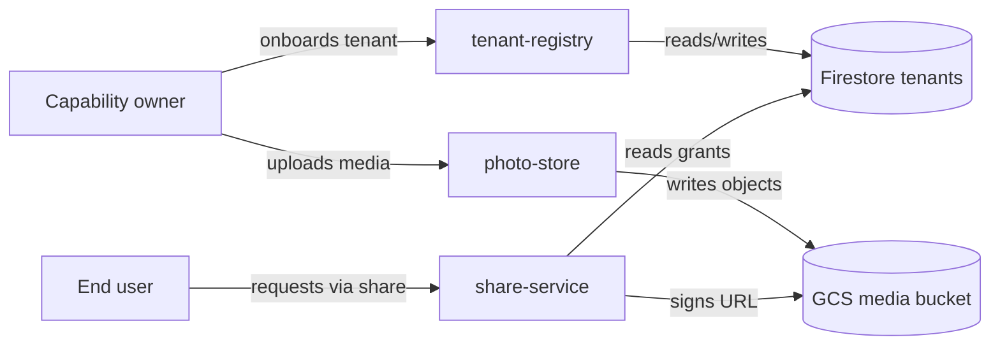

> Composed document. Synthesizes accepted ADRs and technical requirements.

**Parent capability:** [self-hosted-personal-media-storage](_index.md)
**Inputs:** [Technical Requirements](tech-requirements.md) · [ADRs](adrs/_index.md)

## Overview

The capability is realized by three Go services (`tenant-registry`, `photo-store`, `share-service`) plus two Terraform modules (`cloud/firestore-tenants`, `cloud/media-bucket`). Tenant identity flows from the platform's onboarding into the registry; media flows into the bucket via the photo store; share grants live in the registry's Firestore database and are minted as signed URLs by the share service.

## Components

### Component diagram

### Inventory

#### tenant-registry service
**Location:** `services/tenant-registry/`
**Type:** service
**Established by:** [ADR-0001](adrs/0001-tenant-state-storage.md)
**Responsibility:** Source of truth for tenant identity and lifecycle state.
**Design doc:** [components/tenant-registry.md](components/tenant-registry.md)

#### photo-store service
**Location:** `services/photo-store/`
**Type:** service
**Established by:** [ADR-0002](adrs/0002-media-storage.md)
**Responsibility:** Mediates media object I/O with per-tenant isolation.
**Design doc:** [components/photo-store.md](components/photo-store.md)

#### share-service
**Location:** `services/share-service/`
**Type:** service
**Established by:** [ADR-0003](adrs/0003-share-grants.md)
**Responsibility:** Mints and audits share grants; signs read URLs against the media bucket.
**Design doc:** [components/share-service.md](components/share-service.md)

#### firestore-tenants module
**Location:** `cloud/firestore-tenants/`
**Type:** module
**Established by:** [ADR-0001](adrs/0001-tenant-state-storage.md), [ADR-0003](adrs/0003-share-grants.md)
**Responsibility:** Provisions the Firestore database and the tenants/share-grants/audit-log collections.
**Design doc:** [components/firestore-tenants.md](components/firestore-tenants.md)

#### media-bucket module
**Location:** `cloud/media-bucket/`
**Type:** module
**Established by:** [ADR-0002](adrs/0002-media-storage.md)
**Responsibility:** Provisions the multi-region GCS bucket and IAM for the photo-store service account.
**Design doc:** [components/media-bucket.md](components/media-bucket.md)

## Data & state

- **Tenants** — owned by `tenant-registry` in the `tenants` Firestore collection.
- **Media objects** — owned by `photo-store` in the GCS bucket, prefixed by tenant ID.
- **Share grants & audit log** — owned by `share-service` in the `share-grants` and `share-audit` Firestore collections.

## How requirements are met

| TR | ADR(s) | Realized in |
|----|--------|-------------|
| TR-01 | ADR-0001, ADR-0002 | tenant-registry, photo-store, firestore-tenants, media-bucket |
| TR-02 | ADR-0002 | media-bucket |
| TR-03 | ADR-0003 | share-service |
| TR-04 | ADR-0001 | tenant-registry, firestore-tenants |
| TR-05 | ADR-0001 | tenant-registry |
| TR-06 | ADR-0003 | share-service |
| TR-07 | ADR-0003 | share-service |

## Deferred / Open

None.
