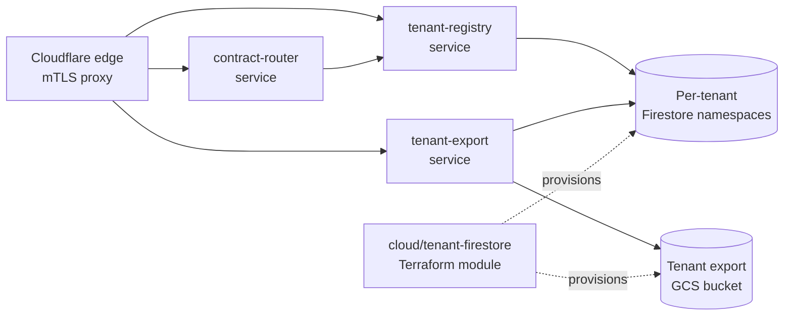

> **DRAFT — INCOMPLETE.** Composition surfaced gaps (notably TR-08 has no ADR). The audit trail below contains GAP rows. This document is not complete until those gaps are resolved per the issues filed alongside it. See "Deferred / Open" and the parent gap-issue manifest.

> **Composed document.** Synthesizes accepted ADRs in `adrs/` and the requirements in `tech-requirements.md`. For *why* a decision was made, follow the ADR link. This doc covers *what* the system looks like once the decisions are realized.

**Parent capability:** [self-hosted-application-platform](_index.md)
**Inputs:** [Technical Requirements](tech-requirements.md) · [ADRs](adrs/_index.md) · [User Experiences](user-experiences/_index.md)

## Overview

The self-hosted-application-platform hosts isolated tenant workloads on GCP behind the shared Cloudflare → GCP edge. Tenant state lives in per-tenant Firestore namespaces (ADR-0001), the platform contract is versioned via semver in the contract package path (ADR-0002), and evicted tenants retrieve their data through an on-demand export to a GCS bucket signed URL (ADR-0003). The skeleton below names the components those decisions force into existence; per-component design docs (endpoints, schemas, Terraform inputs) are authored separately via `define-component-design`. Several TRs — including TR-08 (graceful degradation when a GCP region is unreachable) — are not addressed by any accepted ADR and are recorded as gaps rather than papered over here.

## Components

The pieces that make up this capability and how they connect.

### Component diagram

### Inventory

For each component: what it is, where it lives in the repo, and which ADR(s) put it there.

#### tenant-registry service
**Location:** `services/tenant-registry/`
**Type:** service
**Established by:** [ADR-0001: Tenant State Storage](adrs/0001-tenant-state-storage.md)
**Responsibility:** Source of truth for tenant identity and lifecycle. Owns the per-tenant Firestore namespace mapping and enforces tenant isolation at the data-access layer.
**Component design:** see filed issue `story(component): tenant-registry service — self-hosted-application-platform`.

#### contract-router service
**Location:** `services/contract-router/`
**Type:** service
**Established by:** [ADR-0002: Contract Versioning](adrs/0002-contract-versioning.md)
**Responsibility:** Routes tenant traffic to the correct platform-contract version based on the semver-pathed contract package the tenant is pinned to, enabling concurrent versions during rollout.
**Component design:** see filed issue `story(component): contract-router service — self-hosted-application-platform`.

#### tenant-export service
**Location:** `services/tenant-export/`
**Type:** service
**Established by:** [ADR-0003: Tenant Eviction Export](adrs/0003-tenant-eviction-export.md)
**Responsibility:** On-demand export of an evicted tenant's Firestore namespace contents to a per-export GCS object, returning a signed URL.
**Component design:** see filed issue `story(component): tenant-export service — self-hosted-application-platform`.

#### cloud/tenant-firestore Terraform module
**Location:** `cloud/tenant-firestore/`
**Type:** module
**Established by:** [ADR-0001: Tenant State Storage](adrs/0001-tenant-state-storage.md)
**Responsibility:** Provisions a per-tenant Firestore namespace (and any IAM bindings required for isolation) when a new tenant is onboarded.
**Component design:** see filed issue `story(component): cloud/tenant-firestore module — self-hosted-application-platform`.

#### cloud/tenant-export-bucket Terraform module
**Location:** `cloud/tenant-export-bucket/`
**Type:** module
**Established by:** [ADR-0003: Tenant Eviction Export](adrs/0003-tenant-eviction-export.md)
**Responsibility:** Provisions the GCS bucket and signed-URL IAM configuration used by tenant-export.
**Component design:** see filed issue `story(component): cloud/tenant-export-bucket module — self-hosted-application-platform`.

#### pkg/contractversion package
**Location:** `pkg/contractversion/`
**Type:** package
**Established by:** [ADR-0002: Contract Versioning](adrs/0002-contract-versioning.md)
**Responsibility:** Shared parsing/validation of the semver-pathed contract package identifier used by contract-router and any contract-aware tenant SDK.
**Component design:** see filed issue `story(component): pkg/contractversion — self-hosted-application-platform`.

## Key flows

Per-UX sequence diagrams are a `define-component-design` concern and are added here as components' design docs land. Until then, this section lists the UXs and the components they touch.

### Flow: stand-up-the-platform
Realizes [UX: stand-up-the-platform](user-experiences/stand-up-the-platform.md).
Components touched: cloud/tenant-firestore, cloud/tenant-export-bucket.
Sequence detail: see component design docs once filed.

### Flow: host-a-capability
Realizes [UX: host-a-capability](user-experiences/host-a-capability.md).
Components touched: tenant-registry, contract-router, cloud/tenant-firestore.
Sequence detail: see component design docs once filed.

### Flow: platform-contract-change-rollout
Realizes [UX: platform-contract-change-rollout](user-experiences/platform-contract-change-rollout.md).
Components touched: contract-router, pkg/contractversion, tenant-registry.
Sequence detail: see component design docs once filed.

### Flow: operator-initiated-tenant-update
Realizes [UX: operator-initiated-tenant-update](user-experiences/operator-initiated-tenant-update.md).
Components touched: tenant-registry, contract-router.
Sequence detail: see component design docs once filed.

### Flow: tenant-facing-observability
Realizes [UX: tenant-facing-observability](user-experiences/tenant-facing-observability.md).
Components touched: GAP — no ADR establishes the per-tenant observability component(s).

### Flow: migrate-existing-data
Realizes [UX: migrate-existing-data](user-experiences/migrate-existing-data.md).
Components touched: GAP — no ADR establishes the migration component or guarantees losslessness/idempotency.

### Flow: move-off-the-platform-after-eviction
Realizes [UX: move-off-the-platform-after-eviction](user-experiences/move-off-the-platform-after-eviction.md).
Components touched: tenant-export, cloud/tenant-export-bucket, tenant-registry.
Sequence detail: see component design docs once filed.

## Data & state

Tenant state is stored in **per-tenant Firestore namespaces** owned by the `tenant-registry` service (ADR-0001); each tenant's data lifecycle is bounded by tenant onboarding and eviction. **Tenant export artifacts** are short-lived objects in a dedicated GCS bucket owned by the `tenant-export` service (ADR-0003), produced on-demand and accessed via signed URL. Detailed schemas, indexes, and retention policies live in the per-component design docs.

## How requirements are met

The audit trail. Every TR-NN must appear. **GAP rows below indicate this document is incomplete** — gap issues are filed and must be resolved before `plan-implementation` runs.

| TR | ADR(s) | Realized in |
|----|--------|-------------|
| TR-01 | [ADR-0001](adrs/0001-tenant-state-storage.md) | tenant-registry service; cloud/tenant-firestore module |
| TR-02 | [ADR-0002](adrs/0002-contract-versioning.md) | contract-router service; pkg/contractversion |
| TR-03 | **GAP — no ADR** | — (no component established; per-tenant observability is unaddressed) |
| TR-04 | [ADR-0001](adrs/0001-tenant-state-storage.md) | tenant-registry service (no-downtime update path against per-tenant Firestore namespaces) |
| TR-05 | [ADR-0003](adrs/0003-tenant-eviction-export.md) | tenant-export service; cloud/tenant-export-bucket module |
| TR-06 | **GAP — no ADR** | — (migration component / idempotency guarantee unaddressed) |
| TR-07 | **GAP — no ADR** | — (relies on prior shared decision; capability ADR set does not name a component for the Cloudflare→GCP path here) |
| TR-08 | **GAP — no ADR** | — (graceful regional degradation unaddressed) |

## Deferred / Open

The following gaps were surfaced during composition. None are resolved in this document; each has a corresponding gap issue. Until every gap is closed, this tech design is **not complete** and `plan-implementation` will not run against it.

- **TR-08 has no ADR (graceful regional degradation).** Either an additional ADR must be planned via `plan-adrs` / `define-adr`, or TR-08 must be dropped/amended via `define-technical-requirements`. The user explicitly flagged this gap when composing.
- **TR-03 has no ADR (per-tenant observability).** Same resolution paths as TR-08.
- **TR-06 has no ADR (lossless idempotent migrations).** Same resolution paths as TR-08.
- **TR-07 has no capability ADR.** TR-07 cites a prior shared decision; if the capability needs no new decision, an ADR-0004 stub or an explicit annotation in `tech-requirements.md` pointing to the shared `r&d/adrs/` decision would close the audit trail. Otherwise plan an ADR.
- **ADR-0002 and ADR-0003 Decision Outcome wording is "Proposed: ... Awaiting confirmation"** despite frontmatter `status: accepted`. The audit trail above treats them as accepted per the user's statement; the ADR bodies should be amended via `define-adr` to remove the contradiction so future readers aren't misled.
- **Per-component specs deferred** to `define-component-design`: tenant-id derivation rules (referenced by ADR-0001 and ADR-0006 in `r&d/adrs/`), API endpoint contracts for tenant-registry / contract-router / tenant-export, Firestore document schemas, and the export object format.
