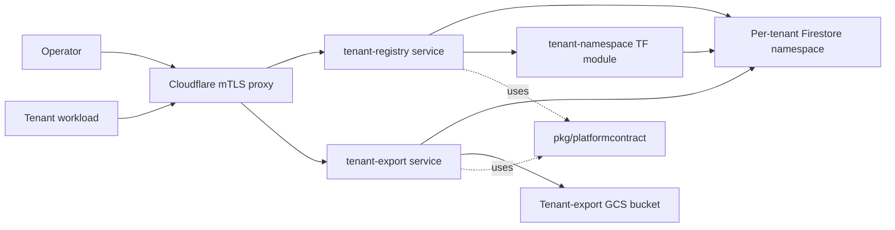

> **Composed document.** Synthesizes accepted ADRs in `adrs/` and the requirements in `tech-requirements.md`. For *why* a decision was made, follow the ADR link. This doc covers *what* the system looks like once the decisions are realized.

**Parent capability:** [self-hosted-application-platform](_index.md)
**Inputs:** [Technical Requirements](tech-requirements.md) · [ADRs](adrs/_index.md) · [User Experiences](user-experiences/_index.md)

## Overview

The self-hosted application platform is realized as a small set of GCP-hosted Go services, Terraform modules, and shared Go packages that together provide tenant onboarding, isolated state storage, contract-versioned communication, and on-demand data export. A `tenant-registry` service owns tenant identity and lifecycle, allocating a per-tenant Firestore namespace (ADR-0001) for each tenant's state. The platform contract is versioned via semver in the contract package path (ADR-0002), allowing multiple versions to be served concurrently during migration windows. A `tenant-export` service produces on-demand signed-URL exports to a tenant-scoped GCS bucket (ADR-0003) when a tenant evicts off the platform. All inter-service traffic continues to traverse the existing Cloudflare → GCP → WireGuard topology established by prior shared decisions.

## Components

The pieces that make up this capability and how they connect.

### Component diagram

### Inventory

For each component: what it is, where it lives in the repo, and which ADR(s) put it there.

#### tenant-registry service
**Location:** `services/tenant-registry/`
**Type:** service
**Established by:** [ADR-0001: Tenant State Storage](adrs/0001-tenant-state-storage.md)
**Responsibility:** Source of truth for tenant identity and lifecycle state; allocates and tears down per-tenant Firestore namespaces. Component-design issue: TBD.

#### tenant-export service
**Location:** `services/tenant-export/`
**Type:** service
**Established by:** [ADR-0003: Tenant Eviction Export](adrs/0003-tenant-eviction-export.md)
**Responsibility:** On-demand export of a tenant's Firestore-namespace state to a per-tenant GCS bucket, returning a signed URL. Component-design issue: TBD.

#### pkg/platformcontract
**Location:** `pkg/platformcontract/`
**Type:** package
**Established by:** [ADR-0002: Contract Versioning](adrs/0002-contract-versioning.md)
**Responsibility:** Defines the platform contract types and embeds the semver in the package path (e.g. `pkg/platformcontract/v1`, `pkg/platformcontract/v2`); imported by every platform service to advertise the contract version they implement. Component-design issue: TBD.

#### tenant-namespace Terraform module
**Location:** `cloud/tenant-namespace/`
**Type:** module
**Established by:** [ADR-0001: Tenant State Storage](adrs/0001-tenant-state-storage.md)
**Responsibility:** Provisions a Firestore database/namespace and the IAM bindings that enforce per-tenant isolation. Component-design issue: TBD.

#### tenant-export-bucket Terraform module
**Location:** `cloud/tenant-export-bucket/`
**Type:** module
**Established by:** [ADR-0003: Tenant Eviction Export](adrs/0003-tenant-eviction-export.md)
**Responsibility:** Provisions the per-tenant GCS bucket, lifecycle policy, and signed-URL service-account key used by `tenant-export`. Component-design issue: TBD.

## Key flows

Per-UX sequence diagrams will be added here as each component's design doc is written via `define-component-design`. Until then:

### Flow: platform-contract-change-rollout
Realizes [UX: platform-contract-change-rollout](user-experiences/platform-contract-change-rollout.md).
Components touched: pkg/platformcontract, tenant-registry.
Sequence detail: see component design docs once filed.

### Flow: move-off-the-platform-after-eviction
Realizes [UX: move-off-the-platform-after-eviction](user-experiences/move-off-the-platform-after-eviction.md).
Components touched: tenant-registry, tenant-export, tenant-export-bucket.
Sequence detail: see component design docs once filed.

### Flow: operator-initiated-tenant-update
Realizes [UX: operator-initiated-tenant-update](user-experiences/operator-initiated-tenant-update.md).
Components touched: tenant-registry, pkg/platformcontract.
Sequence detail: see component design docs once filed.

## Data & state

Tenant identity and lifecycle metadata is owned by `tenant-registry` and stored in a registry-owned Firestore namespace. Each tenant's application state lives in its own dedicated Firestore namespace, provisioned via the `tenant-namespace` module — `tenant-registry` is the only platform service authorized to address it. Export artifacts are written to per-tenant GCS buckets owned by the `tenant-export-bucket` module; their lifecycle (retention, deletion) is enforced by the bucket policy. Schemas, indexes, and field-level definitions for each of these stores live in their respective per-component design docs.

## How requirements are met

The audit trail. Every TR-NN must appear.

| TR | ADR(s) | Realized in |
|----|--------|-------------|
| TR-01 | [ADR-0001](adrs/0001-tenant-state-storage.md) | tenant-registry, tenant-namespace |
| TR-02 | [ADR-0002](adrs/0002-contract-versioning.md) | pkg/platformcontract, tenant-registry |
| TR-03 | *gap — no ADR* | *gap — see Deferred / Open* |
| TR-04 | [ADR-0001](adrs/0001-tenant-state-storage.md) | tenant-registry, tenant-namespace |
| TR-05 | [ADR-0003](adrs/0003-tenant-eviction-export.md) | tenant-export, tenant-export-bucket |
| TR-06 | *gap — no ADR* | *gap — see Deferred / Open* |
| TR-07 | *gap — no capability ADR* | *gap — see Deferred / Open* |

## Deferred / Open

### Surfaced gaps (block tech-design completion)

1. **TR-03 has no ADR.** Per-tenant observability scoping is required by `tech-requirements.md` but no ADR addresses how tenants query their own metrics/logs/traces while being denied cross-tenant data. Resolution: re-run `plan-adrs` to add an ADR for this decision.
2. **TR-06 has no ADR.** Idempotent tenant data import with verifiable integrity is required but unaddressed. Resolution: re-run `plan-adrs` to add a tenant-import ADR.
3. **TR-07 has no capability ADR.** TR-07 cites a "prior shared decision" for the Cloudflare → GCP → WireGuard topology, but the capability ADR set does not name which shared ADR it relies on, and does not specify how *this capability's* services attach to that path (which Cloudflare hostname, which GCP project, which WireGuard endpoint). Resolution: amending ADR via `define-adr` to bind this capability's services onto the existing topology, citing the shared ADR.
4. **All three accepted ADRs are missing `Realization` sections.** ADR-0001, ADR-0002, and ADR-0003 record their decisions but do not name the components that realize them. The component inventory above is inferred from the decision text; an amending ADR pass should make those realizations explicit so this doc is rebuildable.
5. **Tenant ID format unspecified.** ADR-0001 chooses per-tenant Firestore namespaces but no decision specifies how the tenant ID (and thus namespace name) is derived — operator-chosen, hash of capability name, auto-incremented? Not ADR-worthy; resolve as a per-component spec in `tenant-registry`'s `define-component-design`.
6. **Contract version negotiation mechanism unspecified.** ADR-0002 chooses semver-in-package-path but does not specify how a tenant signals which version it speaks, nor how the registry routes to the right version. Per-component spec in `pkg/platformcontract` and `tenant-registry`.
7. **Export trigger and authorization unspecified.** ADR-0003 chooses on-demand signed-URL export but does not specify who triggers it (operator? evicted tenant via a self-service endpoint?) or how the trigger is authorized. Per-component spec in `tenant-export`.

### Out of scope for this design

- End-user-facing tenant features (per capability `_index.md`).
- Operator succession credential handling (separate operational concern; not addressed by current ADR set).
- Specific availability/performance SLA (per capability `_index.md`).
