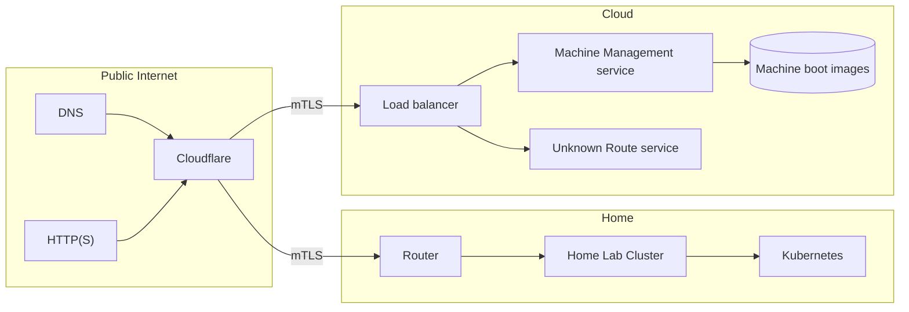
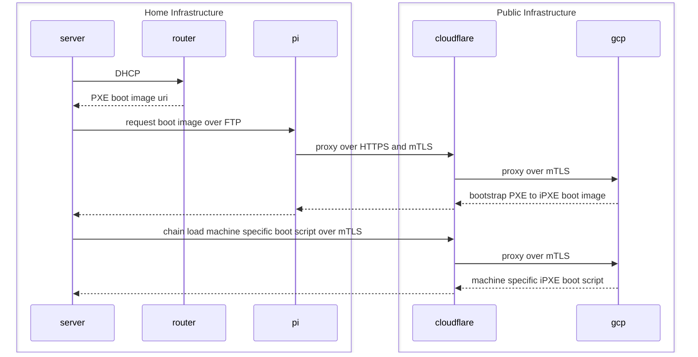

# My Infrastructure as Code Monorepo

## Network Boot Procedure

## Services

### Boot Image Proxy service

This service runs on a Raspberry Pi in my home network and is responsible for proxying
FTP based boot image requests from the servers to HTTPS requests that are then sent
to the Machine Management service. This service also uses mTLS when reaching out to
the Machine Management service.

### Machine Management Service

This service is responsible for managing and returning iPXE scripts per machine. The scripts returned
by service are referred to as boot scripts becausethey are responsible for obtaining and loading all
the necessary files for booting an operating system on the specific machine its running on.

### Unknown Route Service

This service is only responsible for returning a 503 for any routes that the load balancer does not match
any other backend services to.
