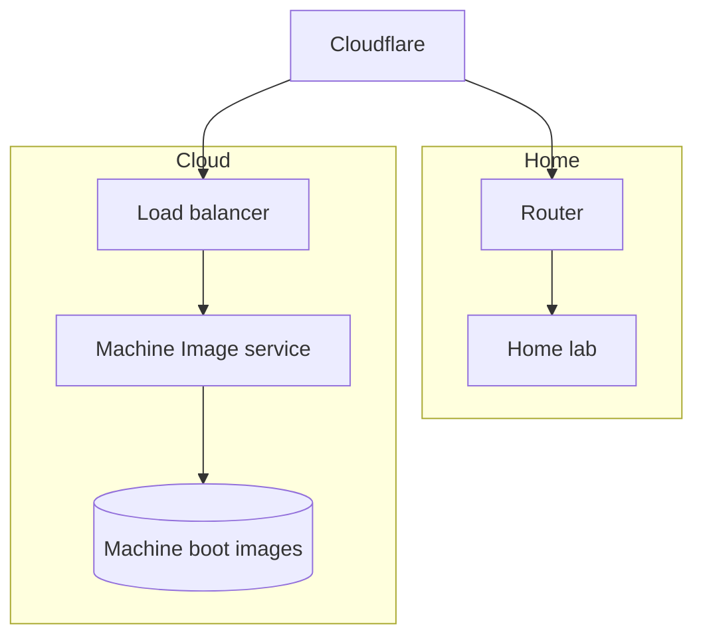

# My Infrastructure as Code Monorepo

```mermaid
flowchart TB
    cloudflare["Cloudflare"]
    homeRouter["Router"]
    homeLab["Home lab"]
    loadBalancer["Load balancer"]
    bootImages[("Machine boot images")]
    imageService["Machine Image service"]

    cloudflare --> homeRouter
    subgraph one [Home]
    homeRouter --> homeLab
    end

    cloudflare --> loadBalancer
    subgraph two [Cloud]
    loadBalancer --> imageService
    imageService --> bootImages
    end
```