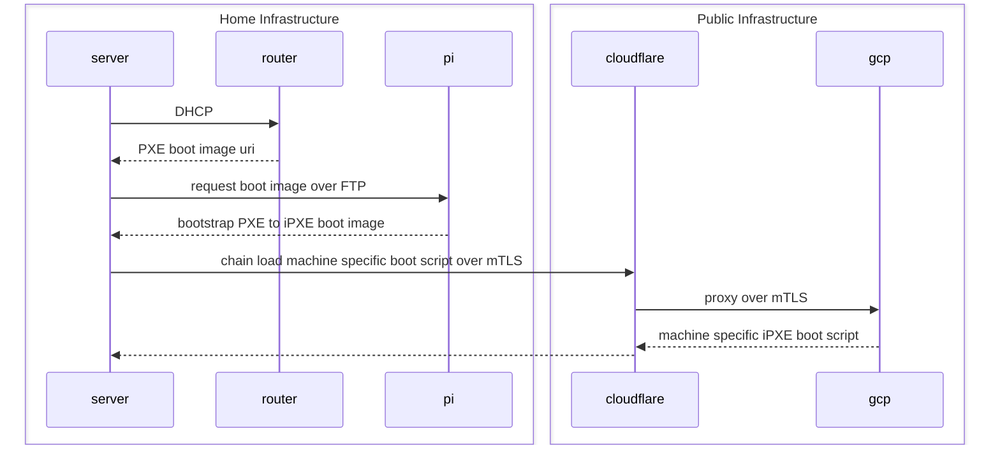

# My Infrastructure as Code Monorepo

## Network Boot Procedure

## Services

### Bootstrap iPXE service

This service runs on a Raspberry Pi in my home network and is responsible for responding
to FTP requests from the servers during boot up. It responds with a custom built iPXE image
that bootstraps a PXE environment into iPXE. After bootstrapping into iPXE, it executes a
custom iPXE script which chainloads a machine specific boot script over an mTLS connection.

### Machine Management Service

This service is responsible for managing and returning iPXE scripts per machine. The scripts returned
by service are referred to as boot scripts becausethey are responsible for obtaining and loading all
the necessary files for booting an operating system on the specific machine its running on.

### Unknown Route Service

This service is only responsible for returning a 503 for any routes that the load balancer does not match
any other backend services to.
