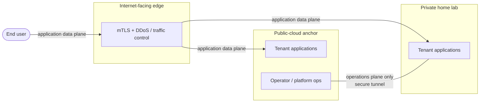

<!--
ADR Categories:
- strategic: High-level architectural decisions for this capability (auth strategy, data ownership boundaries)
- user-journey: Solutions for specific user-experience problems within this capability
- api-design: API endpoint design decisions for this capability's services

Numbering is local to this capability — start at 0001 and increment.
Status lifecycle: proposed → accepted → (later) superseded
The plan-tech-design skill refuses to compose tech-design.md until every ADR is accepted (or superseded with the superseder accepted).
-->

**Parent capability:** [Self-Hosted Application Platform]()
**Addresses requirements:** TR-03, TR-17, TR-01, TR-04, TR-18

## Context and Problem Statement

[TR-03]() forces the rebuild's first phase to establish foundations across *both* a public-cloud environment and a home-lab environment plus the connectivity between them; single-environment standup is explicitly not a supported outcome. [TR-17]() requires each tenant to receive compute, persistent storage, **internal and external network reachability**, identity, backup/DR, and observability — implemented as shared platform offerings. Neither TR names a topology.

The platform therefore needs a decided **foundational environment shape**: what sits on the public-cloud side, what sits on the home-lab side, and how the two connect. This decision is capability-scoped by confirmed framing — the platform *owns* its cross-environment topology, and every capability hosted on the platform inherits whatever shape this ADR exposes rather than deciding its own. The topology exposed to end users may differ from the platform-internal topology decided here.

The open question is whether the platform inherits the shape the repository already realizes — an Internet-facing edge (mutual-auth + traffic-control duties) in front of a public-cloud anchor, with a secure tunnel back to a private home lab — or selects a different shape for its cross-environment foundations.

## Decision Drivers

* **TR-03** — both environments *and* the link between them are phase-1 foundations, not afterthoughts; a single-environment shape is disqualified outright.
* **TR-17** — the shape must provide a clean **external** reachability tier for tenant applications, cross-environment reachability for platform operation, and must not concentrate backup/DR so narrowly that a single environment's loss is unrecoverable. *(TR-17's internal reachability — between tenants — is not satisfied by the operations plane; see the amendment note under Decision Outcome.)*
* **TR-01 / TR-02** ([def](), [rebuild]()) — the whole topology must be expressible as version-controlled definitions and rebuildable end-to-end within 60 minutes; reusing shapes already realized as reproducible definitions is favored over shapes that must be built from scratch.
* **TR-04** ([teardown]()) — each environment and the connectivity between them must be independently teardown-able at a phase checkpoint.
* **TR-18** ([admissibility]()) — the edge and tunnel components must allow configuration control, data export, and credential revocation/rotation without vendor cooperation; more vendor surface is more admissibility risk.
* **CLAUDE.md house pattern** — `Internet → Cloudflare (mTLS + DDoS) → Home Lab ↔ GCP (WireGuard)` is the repository's documented inter-environment topology, already realized in `cloud/` (`mtls/cloudflare-gcp`, `vpc-network` `allow-wireguard`, `network-load-balancer` UDP gateway). Departing from it requires explicit justification.
* **Capability tiebreaker** — *reproducibility beats vendor independence beats minimizing operator effort.*
* **Operator-effort asymmetry between environments** *(not TR-derived — recorded as an honest driver)*. Managed public-cloud compute and datastore primitives deliver much of the TR-17 inventory without operator-built machinery, where the home-lab equivalents must be built and operated. Their current low-to-zero cost at this platform's scale sharpens the asymmetry. No TR ranks hosting cost, so this driver may motivate the option set but cannot by itself justify the outcome — it is subordinate to the TR-anchored drivers above and to the tiebreaker.

## Considered Options

### Option A — Inherit the three-tier shape (edge → public-cloud anchor → secure tunnel → private home lab)

Keep the shape the repository already realizes: an Internet-facing edge tier carrying mutual-auth and traffic-control (DDoS) duties, a public-cloud environment as the anchor, and a secure tunnel back to the private home lab. Tenant workloads may be placed in either environment (see the placement sub-decision in the outcome below).

* Satisfies **TR-03**: two environments plus their connectivity, all already foundation-phase concerns.
* Strongest on **TR-01/TR-02**: the definitions already exist and are already reproducible, so it is the shortest path to a ≤60-minute rebuild.
* Provides the dedicated external-reachability + scrubbing tier that **TR-17** external reachability wants, while the tunnel carries cross-environment reachability for platform operation.
* Ranks highest on the **reproducibility** tiebreaker (reuse of proven definitions).
* Cost: carries the most vendor surface (a dedicated edge vendor), the weakest position on **TR-18** and the vendor-independence tiebreaker — the edge vendor must pass the TR-18 admissibility test (config control, export, credential rotation without vendor cooperation).

### Option B — Two-environment, edge-less (public-cloud ingress fronts directly)

Keep both environments and the tunnel, but drop the dedicated Internet-facing edge tier; the public-cloud ingress/load balancer terminates external traffic and mutual-auth directly.

* Still satisfies **TR-03**.
* Better on **TR-18** and **TR-02** (one fewer vendor, fewer moving parts to rebuild).
* Weakens **TR-17** external reachability: loses the edge scrubbing/DDoS tier and pushes all external reachability onto the cloud ingress. Diverges from the CLAUDE.md house pattern and would need that divergence justified.

### Option C — Home-lab-primary, cloud-as-thin-edge (inverted anchor)

Invert the anchor: all stateful tenant offerings live home-side; the public cloud shrinks to a minimal always-on relay for external reachability and tunnel termination.

* Satisfies **TR-03**; ranks highest on the **vendor-independence** tiebreaker (the cloud becomes a replaceable relay).
* Concentrates blast radius and **TR-17** backup/DR on the home lab; external reachability degrades during a home-lab outage; greater distance from the current definitions hurts **TR-02** reproducibility speed. Loses on the reproducibility tiebreaker.

### Option D — Single-environment (all-cloud or all-home-lab)

* **Rejected by TR-03**, which explicitly makes single-environment standup an unsupported rebuild outcome. Recorded here so the reason the simplest shape is off the table is auditable.

## Decision Outcome

Chosen option: **Option A — inherit the three-tier shape**, because it satisfies TR-03 directly, is the fastest and most faithful path to the TR-01/TR-02 reproducibility target (its definitions already exist and are proven in `cloud/`), and wins the capability's stated reproducibility-first tiebreaker. The TR-18 vendor-surface cost is accepted as a bounded, downstream admissibility check on the edge and tunnel vendors rather than a reason to rebuild the shape from scratch.

**The two cross-environment paths are strictly separated planes, and this separation is part of the decision:**

* **Application data plane (end-user traffic).** Deployed tenant applications are reached by end users **only** through the Internet-facing edge, regardless of which environment hosts them: `end user → edge (mTLS + DDoS) → tenant application`. This is the **external** reachability of TR-17. Tenant application traffic never traverses the operations tunnel.
* **Operations / maintenance plane.** The public-cloud ↔ home-lab tunnel (today WireGuard) exists **solely** for platform operation and maintenance — the operator's control of the home-lab environment from the public-cloud side. It carries no tenant application traffic.

> **Amended 2026-07-18.** This sub-decision previously described the operations tunnel as "the **internal** reachability of [TR-17]()." That was a misreading, corrected here without changing what the ADR decides. The capability defines TR-17's internal reachability as reachability **between tenants**; the tunnel provides *platform*-internal reachability — the operator reaching the home lab — which is a different thing. The two planes decided above are unchanged and remain correct. What the correction exposes is that **tenant-to-tenant reachability across environments has no plane assigned to it**: not the tunnel (excluded by rule above), and not the edge (the end-user plane). That gap is now carried as an open question below. It is currently unexercised — no UX in this capability describes tenants calling each other — but it constrains placement, and [ADR-0002]() depends on it.

**Workload placement sub-decision: both environments are valid tenant-hosting targets.**

The initial reading of this topology treated the home lab as the sole host for tenant workloads, with the public-cloud anchor limited to edge-facing reachability and the operations plane. That reading is **widened here**: the public-cloud anchor is also a first-class tenant-hosting environment, because the cloud side already offers managed compute and datastore primitives that satisfy the TR-17 inventory (compute, persistent storage, backup/DR, observability) with materially less operator-built machinery than the home-lab equivalents — which serves the tiebreaker's third term (minimizing operator effort) without spending anything on the first two.

The consistency rule is what keeps this from fragmenting the topology: **placement changes where a workload runs, never how it is reached.** A cloud-hosted tenant application is *not* exposed directly via the cloud provider's public ingress; it sits behind the same Internet-facing edge as a home-lab-hosted one, so mutual-auth and traffic-control duties stay in exactly one tier and the TR-17 external-reachability story is identical in both environments.

Which environment a given tenant lands in is a **placement policy**, deliberately not decided here — it is its own decision, scoped to its own ADR.

**Offering parity sub-decision: environments may expose unequal offering sets; placement is constrained by tenant need.**

[TR-17]() requires each tenant to receive the full inventory, implemented as shared offerings. It does **not** require every offering to exist in every environment. This ADR reads it accordingly: an environment is a valid target for a given tenant when it carries **every offering that tenant actually needs**, not when it mirrors the other environment's catalog.

The alternative — full parity as a precondition for either environment being a valid target — was rejected because it makes every offering added later a *double* build before it can ship at all, converting the duplicated-surface cost recorded below from a bounded cost into an unbounded one. Deliberately unequal environments keep that cost proportional to demand: an offering is built in the second environment when a tenant needing it is placed there, not in advance.

What this buys is bounded duplication; what it costs is that **placement becomes a matching problem**. The platform must therefore know, per environment, which offerings exist, and must refuse a placement whose tenant needs an offering the target environment lacks — a rejection is a correct outcome, not a failure. Making that inventory legible is a tech-design obligation, and the placement-policy ADR consumes it as an input.

**Migration sub-decision: placement is fixed at onboarding; cross-environment migration is not a supported platform operation.**

The consistent-reachability rule above makes moving a tenant between environments *possible* by construction — its reachability story does not change when its placement does. This ADR declines to make it *supported*. Moving a tenant means tearing it down and re-onboarding it in the other environment: an operator-run exercise using the ordinary onboarding path, with no platform-guaranteed data-migration path and no declared downtime budget.

The reason is that first-class migration would obligate **every stateful offering, in both environments, forever** to expose a matching export/import path — a permanent tax on every future offering, paid to serve a case the platform has no demonstrated demand for. Reachability continuity keeps the door open: if migration is later wanted, this decision is reversible without revisiting the topology, because nothing here bakes placement into how a tenant is reached.

**Origin-path sub-decision: the edge→origin hop is mutually authenticated in *both* environments.**

"Reachable only through the edge" is stated above as a property; it is enforced here rather than left as a convention. In both environments the edge→origin hop presents **client certificates the origin validates against the edge vendor's origin-pull trust anchor**, and the origin **refuses any request that does not present one** — so bypassing the edge and reaching an origin directly fails at the TLS layer, not at a firewall rule that could be relaxed.

The public-cloud anchor's realization of this already exists: `cloud/mtls/cloudflare-gcp/` issues the origin keypair, fetches the edge vendor's authenticated-origin-pull CA trust anchor, and stores both in Secret Manager for the origin to consume. The home-lab side must reach the same posture rather than a weaker one; the two differ in realization, not in strength. Deployment surface that terminates edge traffic without this enforcement is non-conforming to this ADR.

**Sequencing sub-decision: the operations tunnel is its own phase-1 checkpoint.**

Within rebuild phase 1, the edge and public-cloud anchor stand up first, and the **operations tunnel is a distinct checkpoint** with its own [TR-04]() teardown — not one atomic foundations unit. Standing the tunnel up separately follows the plane separation this ADR already draws: the tunnel is operations-plane machinery, and folding it into the same unit as data-plane foundations would couple two things the decision deliberately keeps apart.

The operative benefit is [TR-02](): a tunnel that fails to come up is torn down and retried against an intact cloud anchor, instead of costing a full foundations teardown and restarting the 60-minute budget. The cost is one more checkpoint boundary to define and keep deterministic. Phase 1 is still not complete until every checkpoint in it has passed — separate checkpoints subdivide the phase, they do not weaken [TR-03]()'s both-environments-plus-connectivity bar.

**Home-lab definitions sub-decision: a peer top-level definitions surface, tooling undecided.**

The home-lab foundations are expressed as **version-controlled definitions in the same tracked-changes repository, as a peer top-level surface alongside `cloud/`**, exposing a teardown entry point per phase. That is the [TR-01]()/TR-04 property this ADR fixes: home-lab state is not a second-class, hand-managed environment, and it is not a separate repository.

**Which tooling realizes it is deliberately not decided here.** Terraform is the repository's only definitions precedent, but it is a weak fit for the bare-metal and OS-level state the home lab actually carries, and this ADR is at topology altitude — committing to a tool would pre-empt a component design that is better placed to weigh it. The constraint passed downstream is the property, not the mechanism: same repository, peer surface, deterministic per-phase teardown.

Both hosting targets sit behind the same edge; no tenant application is reachable by bypassing it.

### Vendor admissibility (TR-18)

The shape above commits to two vendor-bearing layers. Both were tested against [TR-18]() — configuration control through the tracked-changes surface, portable data export, and credential revocation/rotation without vendor cooperation — and **both are admissible**, with two residual risks recorded rather than waved off.

**Edge vendor (today Cloudflare) — admissible.**

* *Configuration control.* Edge configuration is driven by the `cloudflare` provider from the definitions repository (`cloud/mtls/cloudflare-gcp/`), so it is already inside the tracked-changes surface TR-01 requires. No dashboard-only step is load-bearing.
* *Data export.* The edge is a proxy and holds no platform or tenant data of record — the export obligation is close to vacuous by construction. What it does hold, DNS zone state, is expressible as definitions and exportable independently of the vendor.
* *Credential revocation/rotation.* API tokens are revocable by the operator alone. The origin keypair is generated **operator-side** (`tls_private_key`), never by the vendor, so rotation is a local operation and the private key is never vendor-held.

*Residual risk 1 — origin certificates are edge-vendor-issued.* The origin certificate comes from the edge vendor's origin CA and is trusted only by that vendor's edge. Departing the edge vendor therefore means re-issuing origin certificates from another CA and re-pointing DNS. This is **migration work, not a lock-in that prevents departure** — it fails no limb of TR-18 — but it is the concrete cost of the "largest vendor-surface commitment" recorded below, and it should be sized rather than discovered.

*Residual risk 2 — the trust anchor is fetched live from the vendor.* The authenticated-origin-pull CA trust anchor is retrieved over HTTP from a vendor-hosted URL at apply time. A rebuild therefore has a runtime dependency on vendor availability, which sits awkwardly against the TR-02 rebuild guarantee. Vendoring the trust anchor into the definitions repository, with a tracked update path, removes the dependency; the tech design owns that change.

**Tunnel (today WireGuard) — admissible, and the least vendor-bearing layer.**

WireGuard is self-hosted and configuration-file-driven, with keys generated locally: all three TR-18 limbs are satisfied without a vendor in the loop at all. The admissibility question properly attaches to the **endpoints carrying it** — the public-cloud side (already definitions-driven via `cloud/vpc-network/` and `cloud/network-load-balancer/`) and the home-lab-side network appliance terminating it.

*Residual risk 3 — the home-lab tunnel endpoint is configured out-of-band.* Today the home-lab side of the tunnel is GUI-configured on the network appliance and documented as prose, which means it is **outside the tracked-changes surface** and is drift by TR-01's definition. This does not make the tunnel inadmissible — configuration control is fully available to the operator, which is what TR-18 tests — but it is an open TR-01 gap, and closing it is part of the home-lab definitions surface decided above.

### Consequences

* Good, because the foundations phase reuses already-reproducible `cloud/` definitions, keeping the TR-02 ≤60-minute rebuild target reachable and honoring the reproducibility tiebreaker.
* Good, because separating the application data plane (edge) from the operations plane (tunnel) gives TR-17 a clean external-reachability tier and a distinct platform-operations tier, and prevents tenant traffic from ever depending on the operations tunnel.
* Bad, because that same separation leaves **TR-17's internal (tenant-to-tenant) reachability unassigned across environments** — the tunnel is excluded by rule and the edge is the end-user plane. Two interacting tenants are therefore safely placed only in the same environment until this is decided (see Open Questions), and whole-tenant placement in ADR-0002 is forced rather than merely preferred.
* Good, because routing both environments' tenant traffic through the one edge keeps mutual-auth and traffic-control duties in a single tier — a tenant's reachability story does not change when its placement changes, and placement stays a migratable property rather than a baked-in commitment.
* Bad, because the dedicated edge vendor is the largest vendor-surface commitment, making it the weakest point against TR-18 and the vendor-independence tiebreaker; it must clear the TR-18 admissibility test.
* Bad, because two valid hosting environments means TR-17 offerings may have to be realized **in both** — the requirement is that offerings are shared across tenants, not that they exist once, and a per-environment implementation of each offering is real duplicated surface. The offering-parity sub-decision **bounds** this cost rather than eliminating it: duplication is paid per offering per environment *on demand*, not up front for the whole inventory. Divergence between two implementations of the same offering remains a live risk the tech design must contain.
* Bad, because unequal environments make placement fallible in a way full parity would not: a tenant needing an offering the target environment lacks **cannot** be placed there, and the platform must be able to say so rather than discover it during provisioning. This pushes a per-environment offering inventory into the tech design as a hard requirement.
* Bad, because declining migration support means a placement decision made at onboarding is, in practice, durable for the tenant's lifetime — a wrong call is corrected by teardown and re-onboarding, with whatever data loss or downtime that entails borne as an operator exercise. Accepted because reachability continuity keeps the decision reversible later without reopening the topology.
* Good, because separating the operations tunnel into its own phase-1 checkpoint keeps a tunnel failure from costing a full foundations teardown, protecting the TR-02 rebuild budget at the price of one additional checkpoint boundary.
* Good, because the edge and tunnel layers were tested against TR-18 and cleared it, converting the accepted vendor-surface cost from an open risk into three named, ownable obligations (see Vendor admissibility above).
* Bad, because hosting tenant workloads on managed cloud primitives deepens exposure to a single cloud provider, pressing on TR-18 (data export, credential rotation without vendor cooperation) more than a home-lab-only placement would. This is accepted because the capability tiebreaker ranks reproducibility above vendor independence, but it is a real concession and each managed primitive admitted as a tenant-hosting offering must pass TR-18 on its own.
* Requires: a downstream component design realizing the home-lab definitions surface decided above — same repository, peer to `cloud/`, deterministic per-phase teardown. The *shape* is settled here; the tooling is that design's to choose, and there is no `cloud/` analog to copy.
* Requires: a per-environment offering inventory the placement path can consult, so a placement whose tenant needs an absent offering is refused rather than half-provisioned.
* Requires: the home-lab edge→origin hop to enforce origin-pull client-certificate validation, matching the posture `cloud/mtls/cloudflare-gcp/` already gives the cloud anchor.
* Requires: the edge trust anchor to be vendored into the definitions repository with a tracked update path, removing the rebuild-time dependency on vendor availability (residual risk 2).
* Requires: the home-lab tunnel endpoint's configuration to be brought inside the tracked-changes surface as part of the home-lab definitions surface, closing the TR-01 drift gap (residual risk 3).

### Realization

* `cloud/mtls/cloudflare-gcp/` — the Internet-facing edge trust; the application data plane's entry point **and** the realization of the mutually-authenticated edge→cloud-anchor origin path decided above. Issues the operator-held origin keypair, obtains the origin certificate, and stores both plus the authenticated-origin-pull CA trust anchor in Secret Manager for the origin to validate against.
* `cloud/https-load-balancer/`, `cloud/ip/`, `cloud/dns/` — external reachability plumbing behind the edge.
* `cloud/vpc-network/` (`allow-wireguard` firewall tag) and `cloud/network-load-balancer/` (UDP gateway) — the operations-plane tunnel endpoints on the public-cloud side.
* `cloud/rest-api/`, `cloud/https-load-balancer/`, `cloud/internal-application-load-balancer/` (Cloud Run backends and their network endpoint groups) and `cloud/firestore/` — the public-cloud-side tenant-hosting offerings: managed compute and persistent storage for cloud-placed tenants, fronted by the edge rather than exposed directly.
* Home-lab-side platform offerings (tenant compute/persistent storage per TR-17) — **not yet realized**; a downstream component design owns the peer definitions surface decided above, its tooling, its per-phase teardown, its edge→origin mutual-auth enforcement, and bringing the home-lab tunnel endpoint's configuration in-repo. It need not mirror the public-cloud offering set (see the offering-parity sub-decision), but must declare what it does offer so placement can be constrained against it.
* `tech-design.md` (composed later by `plan-tech-design`) will fold this shape into the final-state narrative alongside the other accepted ADRs.

## Open Questions

One remains, surfaced by the 2026-07-18 amendment. The five realization questions this ADR originally carried are resolved and folded into the sections above; the sixth — tenant placement policy — was handed to its own ADR and has since been decided there.

* **Tenant-to-tenant reachability across environments (TR-17).** *Open.* [TR-17]() requires internal reachability, which the capability defines as reachability **between tenants**. This ADR's plane separation assigns it no path across environments: the operations tunnel carries no tenant application traffic, and the edge is the end-user data plane. Two tenants that must reach each other are therefore only safely co-placed in a single environment.
  Deciding this means choosing between routing tenant-to-tenant traffic through the edge (consistent with "reachable only through the edge", but sends internal traffic out to the Internet and back), opening a third cross-environment plane distinct from the operations tunnel (preserves the tunnel's operations-only rule at the cost of a new plane to secure and reproduce), or accepting the constraint as a placement rule and never splitting interacting tenants (free, but silently narrows placement as the tenant set grows).
  **Not decided here**, because it is currently unexercised — no UX in this capability describes tenants calling each other — and choosing a plane on a hypothetical would be guessing. The trigger to decide it is the first tenant that declares a dependency on another tenant.

### Resolved

* **Tenant placement policy (TR-17).** → **Decided in [ADR-0002]().** This ADR established that both environments are valid hosting targets, that placement is constrained by offering availability, and that the choice is durable; it deliberately left *how* a tenant's environment is chosen to a separate decision bearing on the onboarding and modify flows rather than the topology shape. ADR-0002 resolves it: placement is resolved mechanically from the resource needs the tenant already declares, matched against the per-environment offering inventory this ADR required, defaulting to the public-cloud anchor when both environments qualify, with a recorded operator override — and it is an operator-internal detail rather than part of the platform contract.

* **Edge/tunnel vendor admissibility (TR-18).** → **Both layers pass; three residual risks recorded as obligations.** The edge vendor clears all three limbs (provider-driven config in the definitions repo, no data of record held, operator-generated keypair and independently revocable tokens); the tunnel is self-hosted with no vendor in the loop. Residual: origin certificates are edge-vendor-issued (departure is migration work, not lock-in), the trust anchor is fetched live from the vendor at apply time, and the home-lab tunnel endpoint is configured out-of-band ([Vendor admissibility](#vendor-admissibility-tr-18), [Consequences](#consequences)).
* **Home-lab definitions surface (TR-01/TR-04).** → **A peer top-level definitions surface in the same repository as `cloud/`, with a per-phase teardown entry point — tooling deliberately undecided.** The property is fixed here so the home lab cannot become a hand-managed second-class environment; the mechanism stays with a component design better placed to weigh Terraform's poor fit for bare-metal and OS-level state ([Decision Outcome](#decision-outcome), [Realization](#realization)).
* **Ops-plane sequencing within phase 1 (TR-03/TR-04).** → **Its own checkpoint.** The edge and cloud anchor stand up first; the operations tunnel follows as a distinct checkpoint with its own TR-04 teardown. A failed tunnel is retried against an intact anchor instead of costing a full foundations teardown and the TR-02 budget. Phase 1 still completes only when every checkpoint passes ([Decision Outcome](#decision-outcome)).
* **Cross-environment offering parity (TR-17).** → **No parity requirement; environments may expose deliberately unequal offering sets, and placement is constrained by what a tenant needs.** Full parity would make every future offering a double build before it could ship at all. The cost moved onto placement: the platform must know each environment's offerings and refuse placements it cannot satisfy ([Decision Outcome](#decision-outcome), [Consequences](#consequences)).
* **Migration between environments (TR-17).** → **Not supported; placement is fixed at onboarding.** Moving a tenant means teardown and re-onboarding through the ordinary path — an operator exercise with no platform-guaranteed data-migration path or downtime budget. First-class migration would tax every stateful offering in both environments forever for undemonstrated demand. Reachability continuity keeps the decision reversible later without reopening the topology ([Decision Outcome](#decision-outcome), [Consequences](#consequences)).
* **Edge→cloud-anchor origin path.** → **Mutually authenticated in both environments, enforced at the TLS layer.** The origin validates the edge's client certificate against the vendor's origin-pull trust anchor and refuses requests without one, so "reachable only through the edge" holds by enforcement rather than convention. Realized cloud-side today by `cloud/mtls/cloudflare-gcp/`; the home-lab side must match it ([Decision Outcome](#decision-outcome), [Realization](#realization)).
