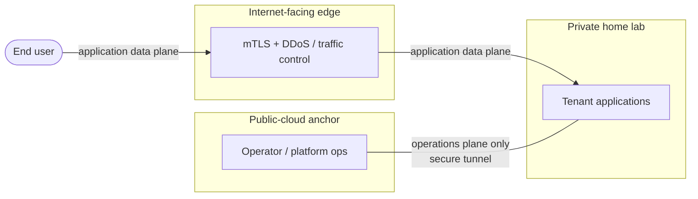

<!--
ADR Categories:
- strategic: High-level architectural decisions for this capability (auth strategy, data ownership boundaries)
- user-journey: Solutions for specific user-experience problems within this capability
- api-design: API endpoint design decisions for this capability's services

Numbering is local to this capability — start at 0001 and increment.
Status lifecycle: proposed → accepted → (later) superseded
The plan-tech-design skill refuses to compose tech-design.md until every ADR is accepted (or superseded with the superseder accepted).
-->

**Parent capability:** [Self-Hosted Application Platform]()
**Addresses requirements:** TR-03, TR-17

## Context and Problem Statement

[TR-03]() forces the rebuild's first phase to establish foundations across *both* a public-cloud environment and a home-lab environment plus the connectivity between them; single-environment standup is explicitly not a supported outcome. [TR-17]() requires each tenant to receive compute, persistent storage, **internal and external network reachability**, identity, backup/DR, and observability — implemented as shared platform offerings. Neither TR names a topology.

The platform therefore needs a decided **foundational environment shape**: what sits on the public-cloud side, what sits on the home-lab side, and how the two connect. This decision is capability-scoped by confirmed framing — the platform *owns* its cross-environment topology, and every capability hosted on the platform inherits whatever shape this ADR exposes rather than deciding its own. The topology exposed to end users may differ from the platform-internal topology decided here.

The open question is whether the platform inherits the shape the repository already realizes — an Internet-facing edge (mutual-auth + traffic-control duties) in front of a public-cloud anchor, with a secure tunnel back to a private home lab — or selects a different shape for its cross-environment foundations.

## Decision Drivers

* **TR-03** — both environments *and* the link between them are phase-1 foundations, not afterthoughts; a single-environment shape is disqualified outright.
* **TR-17** — the shape must provide a clean **external** reachability tier for tenant applications and **internal** cross-environment reachability for platform operation, and must not concentrate backup/DR so narrowly that a single environment's loss is unrecoverable.
* **TR-01 / TR-02** ([def](), [rebuild]()) — the whole topology must be expressible as version-controlled definitions and rebuildable end-to-end within 60 minutes; reusing shapes already realized as reproducible definitions is favored over shapes that must be built from scratch.
* **TR-04** ([teardown]()) — each environment and the connectivity between them must be independently teardown-able at a phase checkpoint.
* **TR-18** ([admissibility]()) — the edge and tunnel components must allow configuration control, data export, and credential revocation/rotation without vendor cooperation; more vendor surface is more admissibility risk.
* **CLAUDE.md house pattern** — `Internet → Cloudflare (mTLS + DDoS) → Home Lab ↔ GCP (WireGuard)` is the repository's documented inter-environment topology, already realized in `cloud/` (`mtls/cloudflare-gcp`, `vpc-network` `allow-wireguard`, `network-load-balancer` UDP gateway). Departing from it requires explicit justification.
* **Capability tiebreaker** — *reproducibility beats vendor independence beats minimizing operator effort.*

## Considered Options

### Option A — Inherit the three-tier shape (edge → public-cloud anchor → secure tunnel → private home lab)

Keep the shape the repository already realizes: an Internet-facing edge tier carrying mutual-auth and traffic-control (DDoS) duties, a public-cloud environment as the anchor, and a secure tunnel back to the private home lab where tenant workloads run.

* Satisfies **TR-03**: two environments plus their connectivity, all already foundation-phase concerns.
* Strongest on **TR-01/TR-02**: the definitions already exist and are already reproducible, so it is the shortest path to a ≤60-minute rebuild.
* Provides the dedicated external-reachability + scrubbing tier that **TR-17** external reachability wants, while the tunnel carries the internal cross-environment reachability.
* Ranks highest on the **reproducibility** tiebreaker (reuse of proven definitions).
* Cost: carries the most vendor surface (a dedicated edge vendor), the weakest position on **TR-18** and the vendor-independence tiebreaker — the edge vendor must pass the TR-18 admissibility test (config control, export, credential rotation without vendor cooperation).

### Option B — Two-environment, edge-less (public-cloud ingress fronts directly)

Keep both environments and the tunnel, but drop the dedicated Internet-facing edge tier; the public-cloud ingress/load balancer terminates external traffic and mutual-auth directly.

* Still satisfies **TR-03**.
* Better on **TR-18** and **TR-02** (one fewer vendor, fewer moving parts to rebuild).
* Weakens **TR-17** external reachability: loses the edge scrubbing/DDoS tier and pushes all external reachability onto the cloud ingress. Diverges from the CLAUDE.md house pattern and would need that divergence justified.

### Option C — Home-lab-primary, cloud-as-thin-edge (inverted anchor)

Invert the anchor: all stateful tenant offerings live home-side; the public cloud shrinks to a minimal always-on relay for external reachability and tunnel termination.

* Satisfies **TR-03**; ranks highest on the **vendor-independence** tiebreaker (the cloud becomes a replaceable relay).
* Concentrates blast radius and **TR-17** backup/DR on the home lab; external reachability degrades during a home-lab outage; greater distance from the current definitions hurts **TR-02** reproducibility speed. Loses on the reproducibility tiebreaker.

### Option D — Single-environment (all-cloud or all-home-lab)

* **Rejected by TR-03**, which explicitly makes single-environment standup an unsupported rebuild outcome. Recorded here so the reason the simplest shape is off the table is auditable.

## Decision Outcome

Chosen option: **Option A — inherit the three-tier shape**, because it satisfies TR-03 directly, is the fastest and most faithful path to the TR-01/TR-02 reproducibility target (its definitions already exist and are proven in `cloud/`), and wins the capability's stated reproducibility-first tiebreaker. The TR-18 vendor-surface cost is accepted as a bounded, downstream admissibility check on the edge and tunnel vendors rather than a reason to rebuild the shape from scratch.

**The two cross-environment paths are strictly separated planes, and this separation is part of the decision:**

* **Application data plane (end-user traffic).** Deployed applications on the platform — the home-lab workloads — are reached by end users **only** through the Internet-facing edge: `end user → edge (mTLS + DDoS) → home-lab-hosted application`. This is the **external** reachability of TR-17. Tenant application traffic never traverses the operations tunnel.
* **Operations / maintenance plane.** The public-cloud ↔ home-lab tunnel (today WireGuard) exists **solely** for platform operation and maintenance — the operator's control of the home-lab environment from the public-cloud side. It is the **internal** reachability of TR-17 and carries no tenant application traffic.

### Consequences

* Good, because the foundations phase reuses already-reproducible `cloud/` definitions, keeping the TR-02 ≤60-minute rebuild target reachable and honoring the reproducibility tiebreaker.
* Good, because separating the application data plane (edge) from the operations plane (tunnel) gives TR-17 a clean external-reachability tier and a distinct internal-reachability tier, and prevents tenant traffic from ever depending on the operations tunnel.
* Bad, because the dedicated edge vendor is the largest vendor-surface commitment, making it the weakest point against TR-18 and the vendor-independence tiebreaker; it must clear the TR-18 admissibility test.
* Requires: the home-lab-side foundations must be expressed as version-controlled definitions (TR-01) — there is no `cloud/` analog for the home lab today; a downstream component design must define that surface and its TR-04 teardown.

### Realization

* `cloud/mtls/cloudflare-gcp/` — the Internet-facing edge trust (mTLS origin certs); the application data plane's entry point.
* `cloud/https-load-balancer/`, `cloud/ip/`, `cloud/dns/` — external reachability plumbing behind the edge.
* `cloud/vpc-network/` (`allow-wireguard` firewall tag) and `cloud/network-load-balancer/` (UDP gateway) — the operations-plane tunnel endpoints on the public-cloud side.
* Home-lab-side platform offerings (tenant compute/persistent storage per TR-17) — **not yet** a `cloud/` module; a downstream component design owns how the home-lab foundations are expressed as definitions and torn down.
* `tech-design.md` (composed later by `plan-tech-design`) will fold this shape into the final-state narrative alongside the other accepted ADRs.

## Open Questions

* **Edge/tunnel vendor admissibility (TR-18).** The specific vendors realizing each layer are out of scope for this topology decision, but each must pass the TR-18 admissibility test (config control, data export, credential revocation/rotation without vendor cooperation). This is a downstream check, not a reopening of the shape.
* **Home-lab definitions surface (TR-01/TR-04).** How the home-lab-side foundations are expressed as version-controlled definitions and given a deterministic per-phase teardown has no `cloud/` precedent yet; it belongs to a downstream component design.
* **Ops-plane sequencing within phase 1 (TR-03/TR-04).** Whether the operations tunnel is stood up and torn down as its own checkpoint relative to the edge and the cloud anchor, or as a single foundations unit, is left to the tech design.
