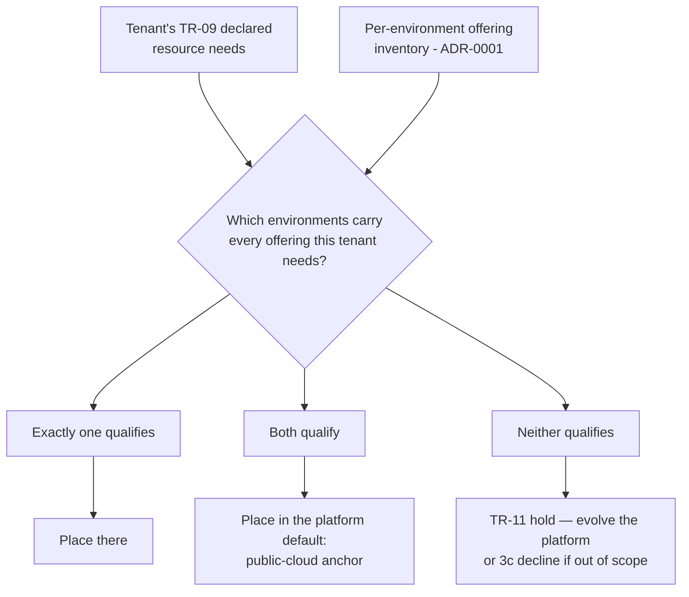

<!--
ADR Categories:
- strategic: High-level architectural decisions for this capability (auth strategy, data ownership boundaries)
- user-journey: Solutions for specific user-experience problems within this capability
- api-design: API endpoint design decisions for this capability's services

Numbering is local to this capability — start at 0001 and increment.
Status lifecycle: proposed → accepted → (later) superseded
The plan-tech-design skill refuses to compose tech-design.md until every ADR is accepted (or superseded with the superseder accepted).
-->

**Parent capability:** [Self-Hosted Application Platform]()
**Addresses requirements:** TR-17, TR-09, TR-10, TR-11, TR-19, TR-20, TR-21, TR-01, TR-54

## Context and Problem Statement

[ADR-0001]() established that **both** the public-cloud anchor and the private home lab are valid tenant-hosting environments, that environments may expose deliberately unequal offering sets, and that a placement is fixed at onboarding because cross-environment migration is not a supported platform operation. It deliberately declined to decide *how a given tenant's environment is chosen*, and handed that decision two inputs: the per-environment offering inventory the placement path must consult, and the fact that the choice is durable for the tenant's lifetime.

This ADR answers what ADR-0001 left open:

* **Who decides** — the operator, the capability owner, or a rule the platform evaluates mechanically?
* **On what basis** — declared tenant needs, operator judgment, or a default-with-override?
* **What is promised** — is placement a visible part of the platform contract a tenant can rely on, or an operator-internal detail?

**"When" is not open.** ADR-0001's migration sub-decision already fixed it: placement is chosen at onboarding and is durable; changing it means teardown and re-onboarding through the ordinary path. This ADR does not reopen that, and the consequence it inherits is recorded below — the modify flow ([TR-21]()) never carries a placement delta.

The decision is capability-scoped: it bears on the onboarding and modify engagement flows, not on the topology shape, and every constraint it consumes is internal to this capability.

### What the platform already knows about a tenant

The option set is bounded by what a tenant actually tells the platform. [TR-09]() fixes the declaration set at exactly four items — resource needs (compute, storage, network), the packaged artifact, the identity choice, and acceptance of the platform's availability characteristics — declared in the tenant's own tech design rather than at a separate acceptance gate.

**No declaration is placement-shaped.** There is no data-residency field, no latency or proximity requirement, and no hardware-access declaration anywhere in this capability. Where specialized hardware and regulatory constraints *do* appear — in the capability's eviction rule and in the host-a-capability UX's "the platform will never have GPUs" example — they are grounds for **declining to host at all**, not inputs that steer a tenant toward one environment. Any option that resolves placement from a declared *location* preference is therefore proposing a fifth declaration, not reading an existing one.

## Decision Drivers

* **[TR-17]()** — every tenant receives the full inventory as shared offerings. Combined with ADR-0001's offering-parity sub-decision, a placement is only valid if the target environment carries every offering that tenant needs; the platform must be able to *refuse* a placement it cannot satisfy rather than discover the gap during provisioning.
* **[TR-09]()** — the declaration set is a hard precondition of the provisioning gate. Growing it is a change to the platform contract, not a free extension.
* **[TR-11]()** — when a tenant needs an offering the platform lacks, the flow holds and resumes without a refile. This is the platform's existing answer to an unsatisfiable need, and a placement policy should route into it rather than invent a parallel failure mode.
* **[TR-01]()** — every per-tenant binding must be expressible as a version-controlled definition. Whatever decides placement, the *result* is tracked state; a placement arrived at by unrecorded reasoning is drift by this requirement's definition.
* **[TR-54]()** — every operator-facing surface is bounded by its share of a 2-hour weekly budget. The host-a-capability UX describes the onboarding review scope as **deliberately narrow** — exactly two questions — so adding a third is a real cost, not a formality.
* **[TR-19]() / [TR-20]() / [TR-21]()** — engagement is a single append-only thread per lifecycle event, typed by scope, with modify review restricted to the delta. Any placement negotiation has to land on that thread or it does not exist.
* **Capability tiebreaker (full chain)** — *tenant adoption beats reproducibility beats vendor independence beats minimizing operator effort.* Adoption at the top is the one term that argues for giving tenants a placement voice; reproducibility immediately below it argues for a rule in the definitions repository over per-tenant judgment.
* **Capability Out of Scope — "Dictating the implementation."** "Homelab", "Kubernetes", and any specific stack are named as *possible implementations* of this capability, not part of its definition. Substrate is explicitly not a tenant-facing concept.
* **Onboarding UX step 5 precedent** — while the operator provisions, the capability owner does "nothing" and is explicitly "not pinged for DNS choices or secrets." That is the repository's archetype of a legitimately operator-internal provisioning decision.
* **Counter-precedent — the identity choice.** Identity *is* a tenant declaration, made in the tech design and "not a fresh question at onboarding." A tenant-declared placement would have a working structural model to copy, so the case for Option B is real rather than straw.
* **Anti-snowflake rule** — provisioning must run the platform's existing definitions, not hand-rolled per-tenant configuration; bespoke manual config is a Reproducibility-KPI failure, not a tolerable exception.

## Considered Options

### Option A — Operator judgment at provisioning time

The operator chooses the environment during step 5 of onboarding, alongside DNS names and secrets. Nothing is declared, no review question is added, and the outcome is recorded as a per-tenant binding.

* Satisfies **TR-09** trivially — no schema change — and **TR-10** without a new gate, since the choice rides on the authorization signal that already exists.
* Best possible position on **TR-54**: zero added operator-facing surface, and it fits the step-5 precedent exactly.
* Satisfies **TR-01** only for the *result*. The **reasoning** is nowhere: why a tenant landed in one environment is unrecoverable, so a later operator cannot tell a deliberate placement from an arbitrary one. Over a tenant set this trends toward per-tenant judgment calls, which is the shape the anti-snowflake rule exists to prevent.
* Weak on **TR-17**: nothing forces the operator to consult the per-environment offering inventory ADR-0001 requires. A placement into an environment lacking a needed offering fails at provisioning rather than at review — precisely the outcome ADR-0001 called "a rejection is a correct outcome, not a failure."
* Loses the **reproducibility** tiebreaker term to Option C, which expresses the same policy as a definition.

### Option B — The capability owner declares a target environment

Placement becomes a fifth **TR-09** declaration, made in the tenant's tech design following the identity-choice precedent. The operator honors it or refuses it at review.

* Strongest on the **tenant adoption** tiebreaker term — the top of the chain. A tenant with a genuine environment-specific need gets a channel to express it instead of being routed to a decline.
* Fails **TR-09** as currently written: the declaration set grows from four to five, and because the tech design *is* the contract acceptance, this is a platform-contract change rather than a form field. With live tenants it would require a [TR-24]() rollout; today it is cheap only because no tenant exists yet.
* Presses on **TR-54**: adds a third question to a review scope the UX describes as deliberately narrow.
* **Contradicts ADR-0001 in a way that cannot be repaired here.** A declared placement is a lever the tenant can pull once and never again — migration is not supported, so a tenant that later wants a different environment must be torn down and re-onboarded. Promising something the platform has no supported path to change is worse than not promising it.
* Collides with the capability's **"Dictating the implementation"** Out of Scope entry by making substrate a tenant-facing, contractual concept.

### Option C — Mechanical resolution from declared needs, with a default and a recorded override

The platform resolves placement from the resource needs the tenant **already** declares under TR-09, matched against each environment's offering inventory: exactly one environment qualifies → that one; both qualify → a declared platform default; neither qualifies → the TR-11 hold or a decline. The operator may override, and the override is recorded with its reason.

* Satisfies **TR-09** with no schema change and no contract change — it consumes the resource-needs declaration that already exists.
* Directly discharges **TR-17** and ADR-0001's stated obligation: the offering inventory becomes a load-bearing input, and an unsatisfiable placement is refused at review rather than discovered at provisioning.
* Strongest on **TR-01** and the **reproducibility** tiebreaker term: the resolution rule is itself a version-controlled definition, so the placement *and the reasoning that produced it* are both tracked, and the same inputs reproduce the same placement on a rebuild.
* Good on **TR-54**: mechanical resolution costs no operator time per tenant, and it folds into step 2's existing offering-alignment question rather than adding a third one. The override is an exception path, not routine work.
* Routes an unsatisfiable placement into **TR-11**'s existing hold-and-resume rather than a new failure mode, which is also what BR-64's evolve-the-platform default demands.
* Cost: makes the per-environment offering inventory a **blocking** prerequisite — it must exist and be machine-readable before the first onboarding, where ADR-0001 left its timing open.
* Cost: weaker than Option B on **tenant adoption**, since a tenant with a real environment preference still has no channel to state it.

### Option D — One default environment for every tenant

No per-tenant placement exists. Every tenant lands on the public-cloud anchor; the home lab hosts tenants only once it carries an offering the cloud lacks. A tenant the cloud cannot serve is a TR-11 hold or a decline.

* Best possible position on **TR-54**, **TR-01**, and **TR-02** — there is no per-tenant placement state to define, record, or reproduce.
* Consistent with ADR-0001's recorded honest driver: managed cloud primitives deliver much of the TR-17 inventory without operator-built machinery.
* Presses hardest on **TR-18** and the **vendor-independence** tiebreaker term by concentrating every tenant's data in one cloud provider — a concession ADR-0001 already flagged as real.
* Makes ADR-0001's "both environments are valid tenant-hosting targets" true on paper but inert in practice, with no written path for the home lab to ever start receiving tenants.

## Decision Outcome

Chosen option: **Option C — mechanical resolution from declared needs, with a default and a recorded override.**

It is the only option that satisfies **TR-17**'s refuse-what-you-cannot-satisfy obligation without spending anything on **TR-09**'s declaration set, and the only one that puts the *reasoning* behind a placement inside the **TR-01** tracked-changes surface rather than leaving it in the operator's head. It folds into the existing narrow review scope, so it costs **TR-54** nothing per tenant, and it reuses **TR-11**'s hold rather than inventing a parallel failure path. Option B was rejected because it promises a tenant something ADR-0001 gives the platform no supported way to change; Option A because it satisfies TR-01 for the result but not the reasoning, trending toward exactly the per-tenant judgment the anti-snowflake rule forbids; Option D because it leaves ADR-0001's second hosting environment with no written path to ever receive a tenant.

### The resolution rule

Placement is resolved as a function of the tenant's declared resource needs and the per-environment offering inventory:

**The rule is a version-controlled definition, not operator practice.** This is the TR-01 property this ADR fixes: the same declared needs against the same inventory must produce the same placement, on a rebuild as on the original onboarding.

### Sub-decision: the default when both environments qualify is the public-cloud anchor

The default has to be *some* environment, and cloud-first is the only default that is realizable today — ADR-0001's realization section records the cloud-side tenant-hosting offerings as existing (`cloud/rest-api/`, `cloud/firestore/`, and the reachability plumbing) and the home-lab-side offerings as **not yet realized**. It also matches ADR-0001's honest operator-effort driver.

This is deliberately the **weakest-committed** part of the decision. It is a single value in the definitions repository, it binds only tenants for whom *both* environments are valid — meaning the choice is by construction never the difference between a tenant being hostable and not — and reversing it requires no change to the rule, the declaration set, or the topology. If the home lab later grows enough offering surface to be the better default, flipping it is a one-line change, though per ADR-0001 it applies only to tenants onboarded afterward.

### Sub-decision: placement is not part of the platform contract

Placement is an **operator-internal detail**. A tenant does not declare it, is not told it as a guarantee, and cannot rely on it. This follows the capability's "Dictating the implementation" Out of Scope entry — substrate is not part of the capability's definition — and the step-5 precedent, where the operator settles DNS and secrets without pinging the capability owner.

The distinction being drawn is between *needs* and *location*: a tenant declares what it needs, and the platform is accountable for meeting those needs (TR-17). **Where** it meets them is the platform's business, exactly as the platform's availability characteristics are something a tenant accepts rather than negotiates.

The concrete consequence is that the resolved placement, though recorded as tracked state under TR-01 and legible to the operator, is not a promise. Nothing in the tenant-facing contract prevents the platform from changing how the rule resolves for *future* tenants.

### Sub-decision: an operator override exists and must be recorded with its reason

The operator may override the resolved placement. Without an escape hatch the rule would become the kind of surface TR-54 warns about — one whose failure mode is unbounded operator work to route around it — and TR-14 makes the operator the only principal on administrative surfaces anyway.

The override is bounded by two conditions that keep it from eroding the decision:

* **It may not override a refusal.** An override can only choose between environments that *both* satisfy the tenant's needs. Forcing a tenant into an environment lacking a needed offering is not an override, it is a TR-17 violation, and the correct outcomes there remain the TR-11 hold or a decline.
* **It must be recorded on the engagement thread with its reason**, per [TR-19]() — on the onboarding issue, which is already the channel of record. An unrecorded override is Option A with extra steps, and reintroduces exactly the untracked reasoning that disqualified it.

A recurring override is a signal that the rule or the inventory is wrong, and should be answered by changing the definition rather than by repeating the override.

### Sub-decision: the modify flow carries no placement delta

Inherited from ADR-0001, recorded here because it is this ADR's flows that would otherwise be its home. Since placement is fixed at onboarding and cross-environment migration is unsupported, a **TR-21** modify review never surfaces a placement change, and **TR-20**'s modify issue type needs no placement field.

A modify request *can* change a tenant's declared resource needs — and those needs are the rule's input. This ADR resolves the resulting question explicitly: **a modify that would resolve to a different environment does not move the tenant.** If the tenant's new needs can be met in its current environment, they are met there. If they cannot, the outcome is a TR-11 hold to add the missing offering *to the environment the tenant is already in* — consistent with BR-64's evolve-the-platform default — or, if that is out of scope, the ordinary decline. Re-resolution on modify would be migration by another name, which ADR-0001 forbids.

### Sub-decision: placement is whole-tenant, and this is forced rather than preferred

A tenant's components are placed together, in one environment. Independent per-component placement is not admissible.

This was originally left open on the grounds that whole-tenant was merely the conservative reading. It is not — [ADR-0001]() leaves it no alternative. Split placement requires intra-tenant traffic to cross environments, and ADR-0001's plane separation gives that traffic **no lawful path**: the operations tunnel carries no tenant application traffic, and the edge is the end-user data plane. Split placement is therefore not a trade-off this ADR declines to make; it is unrealizable under an accepted ADR.

The [TR-17]() internal-reachability question this raises is **broader than placement** and is not resolved here. Establishing it exposed that ADR-0001 had mapped TR-17's internal reachability onto the operations tunnel, when the capability defines internal reachability as reachability *between tenants* — a different thing. ADR-0001 was amended to correct the mapping and now carries the resulting gap as its own open question. The consequence this ADR inherits: **two tenants that must reach each other can only be safely placed in the same environment**, and the resolution rule has no way to express that today, because a tenant declares its own needs and not its dependencies on other tenants. This is acceptable while the tenant set is small and no tenant declares such a dependency; the first one that does is the trigger to revisit both ADRs.

Note that the host-a-capability UX reviews offering alignment **per component**, which is what made per-component placement look plausible. That review granularity is preserved and is not in tension with whole-tenant placement: every component must be satisfiable in the chosen environment, which is exactly the per-component check the UX already describes. Per-component *review*, whole-tenant *placement*.

### Sub-decision: declared needs are authored machine-readably in the tenant's own capability docs

The authoritative machine-readable declaration of a tenant's resource needs lives **with the tenant capability's documentation**, authored by the capability owner, and the platform reads it at onboarding.

This keeps [BR-13]() intact — the tenant declares, in its own design, and the declaration *is* the contract acceptance — while satisfying [TR-01]() at no extra cost, because capability documentation and platform definitions already share one tracked-changes repository. There is no transcription step, so the declaration the platform matches against cannot drift from the declaration the tenant made.

The rejected alternatives are recorded for the same reason the main option set is: **operator-transcribed into the platform's definitions** was rejected because it makes the operator restate what the tenant declared, straining BR-13 and introducing exactly the divergence risk the shared repository otherwise eliminates; **carried on the onboarding issue** was rejected because issue state is not a version-controlled definition, so a rebuild could not reproduce the placement from it — a direct TR-01 failure, notwithstanding that [TR-19]() makes the issue the channel of record for the *engagement*.

**The serialization format is not decided here** and remains a tech-design concern. What is fixed is ownership and location: capability-owner-authored, in the tenant's docs, in this repository. This is a *representation* obligation, not a change to what TR-09 requires be declared, so it is not a platform-contract change.

### Sub-decision: the offering inventory subdivides on demand, starting at TR-17's inventory

The per-environment offering inventory begins at the granularity [TR-17]() already names — compute, persistent storage, network reachability, identity, backup/DR, observability — and an entry is **subdivided only when a real tenant declaration forces a distinction an environment cannot meet.** A tenant needing GPU compute is what splits `compute` into a general and a GPU-bearing entry; the split does not exist in anticipation of that tenant.

This follows [BR-64]() — the platform evolves in response to a tenant need rather than ahead of one — and keeps the inventory bounded by [TR-54](), since every entry is surface the operator maintains. A designed taxonomy fixed up front was rejected as speculative: it grows maintained surface for distinctions no tenant has asked for, against a capability rule that explicitly does not oblige the platform to grow without bound. Letting each environment declare its own offering names at its own grain was rejected because it leaves no shared vocabulary — matching would degrade into string comparison across independently-chosen names, and divergence would be silent rather than caught.

The accepted cost is that **the rule stays degenerate longer.** At TR-17 granularity both environments either carry an offering or do not, so until a real tenant forces the first subdivision, every placement resolves to the default. That is the same degeneracy already recorded in Consequences, now with a decided mechanism for exiting it: the first tenant whose needs one environment cannot meet is what makes the inventory discriminating, and the TR-11 hold is what absorbs that tenant while the split is made.

### Consequences

* Good, because a placement whose target environment lacks a needed offering is refused at review rather than discovered mid-provisioning, discharging the obligation ADR-0001 pushed onto this decision.
* Good, because the resolution rule is a definition rather than operator practice, so both the placement and the reasoning behind it are inside the TR-01 tracked-changes surface and a rebuild reproduces the same placements.
* Good, because it costs the TR-09 declaration set nothing — no fifth declaration, no platform-contract change, no third question added to a review scope the UX deliberately kept narrow.
* Good, because an unsatisfiable placement routes into TR-11's existing hold-and-resume rather than a new failure mode, keeping BR-64's evolve-the-platform default as the first response.
* Good, because keeping placement out of the contract avoids promising a property that ADR-0001 leaves the platform no supported way to change.
* Bad, because a tenant with a genuine environment-specific need has **no channel to express it**. The rule reads needs, not preferences, so such a tenant is routed to a decline that Option B would have avoided — a real cost against the adoption term at the top of the tiebreaker chain. Accepted because the capability currently treats specialized-hardware and regulatory needs as grounds for declining to host at all, so this option removes no channel that exists today; if such a tenant ever appears, that is the trigger to revisit, and BR-64 says the response is to evolve the platform.
* Bad, because the per-environment offering inventory becomes a **blocking** prerequisite for the first onboarding, where ADR-0001 left its timing open. The placement path cannot resolve anything without it.
* Bad, because **today the rule degenerates to its default.** No home-lab tenant offerings are realized yet, and "compute, storage, network" is not discriminating enough to separate the environments, so every current tenant resolves to the public-cloud anchor — making this operationally identical to Option D until the home lab carries something the cloud does not. This is accepted knowingly: the rule's value is that the growth path is decided and written down *before* the first divergent offering exists, rather than being improvised under the pressure of a tenant that needs it. It also means the rule ships largely unexercised, and its first real test will be its first non-degenerate resolution.
* Bad, because concentrating every current tenant in the public cloud presses on TR-18 and the vendor-independence tiebreaker term, exactly as ADR-0001 recorded. Each managed primitive admitted as a tenant-hosting offering must still pass TR-18 on its own.
* Requires: a per-environment offering inventory, machine-readable and version-controlled, that the resolution rule consults — the input ADR-0001 named and this ADR makes blocking.
* Requires: the tenant's declared resource needs to be captured in a form the rule can evaluate against that inventory, rather than as prose in a tech design. This is a TR-09 *representation* obligation on the tech design, not a change to what is declared.
* Requires: the resolved placement to be persisted as a per-tenant binding in the definitions repository (TR-01), so provisioning and any later rebuild consume it rather than re-deriving it.
* Requires: the onboarding engagement thread to carry the override and its reason when one is exercised (TR-19).

### Realization

* **Definitions repository (top level, alongside `cloud/`)** — the per-environment offering inventory and the resolution rule live here as tracked definitions, not as service code. Placement is decided at onboarding by the operator running the platform's definitions; it is not a runtime request path, so no service under `services/` owns it and no HTTP endpoint, protobuf message, or `pkg/errorpb` problem type is introduced by this decision.
* **Per-tenant bindings** — the resolved placement is recorded as part of the tenant's version-controlled binding, consumed by provisioning and reproduced on rebuild.
* `cloud/rest-api/`, `cloud/firestore/`, `cloud/https-load-balancer/`, `cloud/internal-application-load-balancer/`, `cloud/ip/`, `cloud/dns/` — the public-cloud anchor's tenant-hosting offerings, and therefore the cloud side's entries in the offering inventory the rule reads.
* **Home-lab definitions surface** (peer to `cloud/`, tooling undecided per ADR-0001) — must declare what it offers so the rule can resolve against it. Until it declares a tenant-hosting offering, it qualifies for no tenant and the rule resolves to the default for every tenant.
* `cloud/mtls/cloudflare-gcp/` — unchanged by this decision, and the reason it is unchanged is load-bearing: ADR-0001's rule that placement changes *where* a workload runs and never *how* it is reached means the edge path is identical for both resolutions.
* `tech-design.md` (composed later by `plan-tech-design`) will fold the inventory, the resolution rule, and the per-tenant binding into the onboarding-flow narrative.

## Open Questions

None remain in this ADR's scope. The three questions it opened on 2026-07-18 were resolved the same day and folded into Decision Outcome as sub-decisions.

One question **left this ADR's scope rather than closing**: resolving placement granularity established that ADR-0001 had misread TR-17's internal reachability, and the real gap — **tenant-to-tenant reachability across environments** — is topology-altitude. ADR-0001 was amended to correct the mapping and now carries that gap as its own open question. What this ADR inherits from it is a constraint, not a question: two tenants that must reach each other are only safely placed in the same environment.

### Resolved

* **Placement granularity.** → **Whole-tenant, and forced rather than preferred.** Split per-component placement would require intra-tenant traffic to cross environments, which ADR-0001's plane separation gives no lawful path. Per-component *review* is preserved; per-component *placement* is not admissible ([sub-decision](#sub-decision-placement-is-whole-tenant-and-this-is-forced-rather-than-preferred)).
* **Representation of declared needs.** → **Machine-readable, authored by the capability owner, in the tenant capability's own docs.** Keeps BR-13 intact and satisfies TR-01 without a transcription step, because capability docs and platform definitions share one repository. Serialization format stays with the tech design ([sub-decision](#sub-decision-declared-needs-are-authored-machine-readably-in-the-tenants-own-capability-docs)).
* **Offering-inventory granularity.** → **Starts at TR-17's inventory; subdivides only when a real tenant declaration forces a distinction.** Follows BR-64 and stays bounded by TR-54; the accepted cost is that the rule remains degenerate until the first such tenant, absorbed by the TR-11 hold ([sub-decision](#sub-decision-the-offering-inventory-subdivides-on-demand-starting-at-tr-17s-inventory)).
* **Who decides.** → **The platform, mechanically, from declarations the tenant already makes.** Not the operator's per-tenant judgment (Option A, rejected for leaving the reasoning untracked) and not the capability owner (Option B, rejected for promising a property ADR-0001 cannot let the platform change).
* **On what basis.** → **Declared resource needs matched against the per-environment offering inventory**, with the public-cloud anchor as the default when both environments qualify and an operator override bounded to cases where both already satisfy the tenant.
* **What is promised.** → **Nothing.** Placement is an operator-internal detail on the same footing as DNS names and secrets. The tenant declares needs and the platform is accountable for meeting them; where it meets them is not contracted.
* **When.** → **Inherited from ADR-0001, not decided here:** at onboarding, durably. This ADR adds the corollary that a modify request changing a tenant's declared needs does not re-resolve placement — the missing offering is added to the tenant's current environment, or the request is declined.
