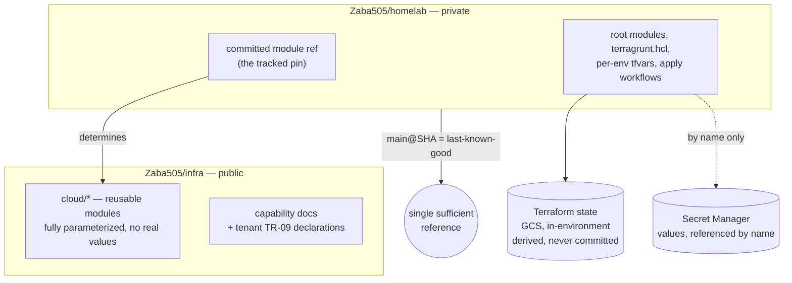

<!--
ADR Categories:
- strategic: High-level architectural decisions for this capability (auth strategy, data ownership boundaries)
- user-journey: Solutions for specific user-experience problems within this capability
- api-design: API endpoint design decisions for this capability's services

Numbering is local to this capability — start at 0001 and increment.
Status lifecycle: proposed → accepted → (later) superseded
The plan-tech-design skill refuses to compose tech-design.md until every ADR is accepted (or superseded with the superseder accepted).
-->

**Parent capability:** [Self-Hosted Application Platform]()
**Addresses requirements:** TR-01, TR-04, TR-05, TR-02, TR-18, TR-54, TR-06, TR-07

## Context and Problem Statement

[TR-01]() makes a tracked-changes definitions repository the **only** authoritative surface for platform-modifying writes: every offering, every per-tenant binding, every shared piece of configuration must be expressible there, and *anything modifiable outside it is drift*. [TR-04]() requires each rebuild phase to expose a deterministic, definitions-driven teardown. [TR-05]() requires a preflight drift check against a **last-known-good reference** that fails closed.

None of the three name a repository, a mechanism, or a form for that reference. This ADR decides all three, because every later offering's definitions surface sits on top of the answer.

Both accepted siblings have already **assumed** a substrate without deciding one. [ADR-0001]() fixed the home-lab foundations as *"version-controlled definitions in the same tracked-changes repository, as a peer top-level surface alongside `cloud/`"*. [ADR-0002]() rested its declared-needs sub-decision on the claim that *"capability documentation and platform definitions already share one tracked-changes repository"*, using that to eliminate a transcription step. Those assumptions are load-bearing and this ADR must either honor or explicitly reconcile them.

### What exists today

The substrate is not greenfield. It is a **module / root-module split across two repositories**, and the seam is already drawn cleanly at the content level:

| Layer | What it is | Lives in | Secret-bearing |
|---|---|---|---|
| Modules | reusable, fully parameterized components | `Zaba505/infra` (**public**) — `cloud/*` | no |
| Declarations | a tenant's [TR-09]() ask | `Zaba505/infra` (**public**) — capability docs, per ADR-0002 | no |
| Bindings | root modules, `terragrunt.hcl`, per-env `terraform.tfvars`, apply workflows | `Zaba505/homelab` (**private**) | secret *references*, not values |
| Applied state | Terraform state | GCS bucket, project `infra-home-lab` | **yes — plaintext, routinely** |
| Secret values | — | Secret Manager, per [TR-44]() | yes |

Three facts about this arrangement were verified rather than assumed, and each bears on the decision:

* **The public repository is clean.** `cloud/*` contains no real domain, IP, or project identifier — every module is fully parameterized and every real value arrives as `tfvars` from the private repository. The seam is not aspirational; it is holding.
* **The repositories are joined by a module reference.** The private repository's root `terragrunt.hcl` sources modules as `git::https://github.com/Zaba505/infra.git//${TF_INFRA_MODULE_PATH}?ref=${TF_INFRA_MODULE_REF}`.
* **That reference is untracked.** Each per-component workflow supplies it as `TF_INFRA_MODULE_REF: ${{ inputs.module_ref }}` — a `workflow_dispatch` input **typed by hand at dispatch time**, per component. It is recorded in no definition, in either repository.

The third fact is the problem this ADR exists to fix. Which version of the platform's modules gets applied is the most load-bearing value in any apply, and it lives only in a workflow run record. That is [TR-01]()'s definition of drift verbatim, and it breaks [TR-02]() concretely: the operator whom the [standup UX]() describes as arriving at minute zero with *"the definitions repo, pulled fresh"* **cannot reproduce the platform from it**, because the definitions do not contain the refs. They would be re-typing remembered values, per component, with nothing recording which combination was ever known-good.

The decision is capability-scoped: it fixes where this capability's definitions live and what gate owns mutations to them. It does not decide the engagement channel ([TR-19]()/[TR-20]()), which is its own decision, nor how drift comparison is performed, which is the downstream drift-detection ADR's.

## Decision Drivers

* **[TR-01]()** — the definitions repository is the only authoritative surface for platform-modifying writes. Any value that determines what gets applied and lives outside it is drift by definition, not by degree.
* **[TR-02]()** — a fresh pull must be *sufficient* to drive an end-to-end rebuild inside 60 minutes. A substrate that requires remembered out-of-band inputs fails this before the clock starts.
* **[TR-05]()** — the preflight check needs a last-known-good reference it can compare against and fail closed on. A reference that is a *tuple* of independently-moving values is materially weaker than a single one, because no atomic commit binds the members together.
* **[TR-04]()** — per-phase teardown must be deterministic and definitions-driven. Teardown depends on applied state, so where that state lives is part of this decision rather than an implementation detail.
* **[TR-18]()** — every third-party component must allow config control, portable export, and credential rotation without vendor cooperation. Git scores near-perfectly: every clone is a complete export and the forge is replaceable. Forge-specific state is the residual.
* **[TR-54]()** — every operator-facing surface is bounded by its share of a 2-hour weekly budget. Each additional repository is another ruleset, another CI surface, and another thing to keep current.
* **[TR-14]()** — administrative surfaces admit only the operator. A private binding repository requires a standing write grant to anyone else who must contribute; a public one does not, because fork-and-PR needs no grant at all.
* **ADR-0001 constraint** — home-lab definitions are a *peer* surface, not a second-class hand-managed environment, with a per-phase teardown entry point.
* **ADR-0002 constraint** — tenant declarations are authored by the capability owner in the tenant capability's own docs, with **no transcription step**. Any option that separates declarations from capability docs reintroduces the divergence that sub-decision rejected by name.
* **Capability tiebreaker** — *tenant adoption beats reproducibility beats vendor independence beats minimizing operator effort.* Reproducibility is the operative term here and it argues for a single sufficient reference.
* **Confidentiality of aggregated operational data** *(not TR-derived — recorded as an honest driver)*. See the [privacy sub-decision](#sub-decision-the-publicprivate-seam-is-justified-by-aggregation-not-obscurity); the honest form of this driver is narrower than it first appears, and the ADR records the narrow form so it does not decay into security-by-obscurity.

## Considered Options

### Option A — Keep the split; make the module reference a tracked definition

Retain the two repositories and the content seam exactly as they stand. Change one thing: the private repository **commits** the `infra` module reference as a definition instead of accepting it as a `workflow_dispatch` input.

* Discharges the **TR-01** violation directly and at its actual location — the untracked value moves inside the tracked-changes surface.
* Satisfies **TR-02**: a fresh pull of the private repository becomes *sufficient*, since `homelab@X` transitively determines `infra@Y`. Nothing must be remembered.
* Strongest realistic position on **TR-05**: the last-known-good reference collapses from a tuple to a single commit SHA on one repository.
* Costs **TR-54** almost nothing — one committed value, no new repository, no new ruleset, no new CI surface.
* Honors **ADR-0002** without amendment (declarations stay in capability docs) and **ADR-0001** at the module layer (see the [reconciliation note](#reconciling-adr-0001s-peer-surface-with-the-seam)).
* Preserves the confidentiality position for the reasons recorded in the privacy sub-decision.
* Cost: the two repositories still exist, so **TR-18**'s forge-portability story must be told twice, and a contributor to declarations (public) is a different flow from a contributor to bindings (private).
* Cost: does not by itself close the ~20-month staleness gap between the repositories (recorded under Consequences).

### Option B — Status quo: keep the split, keep the reference at dispatch

Change nothing.

* **Fails TR-01** on the module reference — the value that determines what is applied is modifiable, and only modifiable, outside the repository.
* **Fails TR-02**'s pull-fresh-and-rebuild property: the definitions are insufficient, and the shortfall scales with the component count.
* **Fails TR-05**: there is no reference to compare against, so a preflight check has nothing to fail closed on. The check could not be built on this substrate at all.
* Best possible **TR-54** position (zero change), which is the only thing it wins on.
* Recorded so the rejection is auditable rather than implied.

### Option C — Vendor the modules into the binding repository

Drop the cross-repository `source` entirely; copy `cloud/*` into the private repository so one repository fully determines an apply.

* Strongest possible **TR-05** and **TR-02** position: a single repository, single clone, no cross-repository reference of any kind.
* Satisfies **TR-01** trivially — there is nowhere else for a value to hide.
* Costs the public module surface and its reuse; `cloud/*` maintenance would be duplicated or abandoned.
* **Contradicts ADR-0002.** Declarations live in capability docs; if the binding repository is the sole substrate, either declarations move private (reintroducing the transcription step that sub-decision rejected) or the substrate is two repositories again and the option collapses into A.
* Presses on **TR-54**: vendored modules drift from upstream unless a sync ritual is maintained, and that ritual is operator work with no natural forcing function.

### Option D — Collapse everything except docs into one private repository

Modules, declarations, bindings, and workflows all move private; only the published Hugo docs remain public.

* Single reference, single ruleset, single clone — strong on **TR-05**, **TR-02**, and **TR-54**.
* **Contradicts ADR-0002** the same way Option C does, and more directly: declarations become private, so either capability owners receive standing write grants on the platform's binding repository or the operator transcribes their declarations. The first strains **TR-14**'s posture; the second is exactly what ADR-0002 rejected.
* Loses the public module surface, which is the part of the current arrangement most clearly working.
* Would require an accepted ADR to be amended to proceed, which is a real cost and not merely procedural.

## Decision Outcome

Chosen option: **Option A — keep the split; make the module reference a tracked definition.**

It is the only option that fixes the actual **TR-01** violation while changing no content, requiring no new surface against **TR-54**, and contradicting no accepted sibling. Options C and D both buy a marginally stronger TR-05 reference by breaking ADR-0002's no-transcription sub-decision — paying an accepted decision's coherence for a property Option A already obtains by committing one value. Option B is disqualified outright: it does not merely score poorly on TR-05, it makes the required preflight check *unbuildable*, since there is nothing to compare against.

### The substrate

### Sub-decision: the module reference is a tracked definition, not a dispatch input

The private repository commits the `infra` module reference. `TF_INFRA_MODULE_REF` ceases to be a `workflow_dispatch` input supplied by hand and becomes a value read from the repository.

**This is the whole point of the ADR.** With it, the private repository's `main` at a given commit fully determines what an apply produces; without it, no amount of structure elsewhere makes the definitions sufficient. It is also what makes [TR-05]()'s preflight check *possible* rather than merely unimplemented.

**Granularity: a single repository-wide pin, not per-component.** The reference is one value covering every component, rather than eleven independently-set ones. Per-component pins would reconstruct precisely the tuple problem this decision exists to collapse — a rebuild could combine refs that were never validated together, and the last-known-good reference would again have no atomic representation.

The accepted cost is that **a module change cannot be rolled out component-by-component**: bumping the pin moves every component to the new modules at once. Staged rollout is available by pinning a branch of `infra` that carries only the intended change, which keeps the value single and tracked. Divergence by editing individual components' refs is a deliberate escape from this sub-decision and, if ever exercised, must be recorded in-repo rather than typed at dispatch.

### Sub-decision: the private repository's `main` is the authoritative reference; last-known-good is a commit SHA

`main` in the binding repository — not any branch, working copy, or applied environment — is what the definitions *are*. The last-known-good reference for [TR-05]() is a **commit SHA on that branch**: specifically the SHA at which a rebuild's canary ([TR-07]()) last went green.

The existing ruleset supplies the immutability [BR-51]() asks for, at no cost: required signatures, required linear history, no force-push, no deletion. A commit SHA under those rules is a tamper-evident pointer to an exact definitions state, and git's content addressing means comparison needs no separate manifest format.

**What is fixed here is the *form* of the reference.** How the SHA is captured on a green canary, where it is recorded, and how comparison against live infrastructure is performed are the downstream drift-detection ADR's to decide. This ADR's obligation was to make a single sufficient reference *exist*.

### Sub-decision: applied state is derived, lives in the target environment, and is never committed

Terraform state is **not** a definition. It is a derived cache of the mapping between definitions and real resources, and this ADR classifies it as such: [TR-01]()'s "entirely expressible as version-controlled definitions" is satisfied by layers 1–3 of the table above, and state is downstream of them.

State stays where it is — a GCS bucket in the target environment, per-component-prefixed — and is **never committed to either repository**. Two independent reasons, either sufficient: Terraform state routinely contains secret material in plaintext, and a drill ([TR-06]()) runs the same definitions against different infrastructure, which is only coherent if state is a property of the target rather than of the definitions.

The consequence to carry forward is that **[TR-04]() teardown depends on state durability**. A phase's deterministic teardown is driven by definitions but executed against state; losing state does not merely inconvenience a teardown, it strands resources the definitions can no longer address. State durability is therefore a teardown correctness concern, not an operational nicety.

### Sub-decision: the state backend is bootstrapped by a definitions-driven phase 0 that adopts its own state

The sub-decision above creates a chicken-and-egg: the bucket holding applied state cannot be managed by the state it holds. It is resolved here rather than deferred, because the state-location decision is what creates it.

**The bootstrap is a definitions-driven phase 0.** A bootstrap root module in the binding repository — committed like any other definition, not a hand-run command — creates the state bucket with versioning and retention. It runs against a *local* backend on its first execution and then migrates its own state into the bucket it just created, after which it is an ordinary component managed exactly like every other. The chicken-and-egg is discharged once, at the only moment it exists.

Committing the bootstrap's state to the binding repository instead was considered and rejected: a bucket-only state is unlikely to carry secret material, but the never-committed rule above admits no per-case exceptions without becoming a judgment call at every future component.

**It is a new phase, and it counts against the TR-02 budget.** The [standup UX]() enumerates four phases beginning at foundations and has no provisioning step before the preflight check; phase 0 precedes [TR-03]()'s foundations phase and is a required change to that UX. Excluding it from the 60-minute budget was considered and rejected: the budget is a *target* rather than a gate — missing it files a follow-up issue and does not stop the platform going into service — so exclusion protects nothing, while it would let the reproducibility KPI be measured against a rebuild that was not actually from scratch.

**It is parameterized by target, which is what makes [TR-06]() literally true.** A drill creates its own scratch bucket by running the same phase 0 against a different target. Without this, "drill mode and live mode differ only in the underlying target" would be true of everything except the one resource the drill most needs to not share.

**Its [TR-04]() teardown exists but carries an ordering constraint: phase 0 tears down last**, after every phase whose state it holds. Torn down out of order it strands precisely what the state-durability consequence above warns about. "Delete everything provisioned so far and start over" stays viable at every checkpoint; what is fixed here is the order in which that unwinds.

The residual is real and recorded: after adoption, the bootstrap module's own state lives in the bucket that module manages. Losing the bucket therefore also loses the record of how to rebuild it. It is recoverable — the bucket is re-creatable and re-importable by re-running phase 0 — but recovery is a manual exception rather than the ordinary path.

### Sub-decision: secrets live in Secret Manager and are referenced by name in both repositories

No secret value is committed to either repository, including the private one. Definitions carry references; [TR-44]()'s secret-management surface carries values.

Stated explicitly because the private repository's privacy makes the weaker discipline tempting, and because the [privacy sub-decision](#sub-decision-the-publicprivate-seam-is-justified-by-aggregation-not-obscurity) below leans on secrets being absent from *both* surfaces rather than on one surface being unreadable.

### Sub-decision: mutations are gated by pull request into `main`, under the existing ruleset

The tracked-changes mechanism is git plus the forge's pull-request gate, under the ruleset already active on `Zaba505/infra` and to be matched on `Zaba505/homelab`: required signatures, required linear history, no force-push, no branch deletion, pull request required with **zero required approving reviews** — the last of which is what makes the mechanism viable for a platform whose [TR-14]() posture admits exactly one principal. A gate requiring a second reviewer would be unsatisfiable by construction.

The pull request is what gives [TR-05]()'s fail-closed check, `terraform fmt`, and any future validation a place to attach *before* a change becomes authoritative. Direct signed commits to `main` were considered and rejected for exactly this: they satisfy TR-01 in form — still version-controlled, still signed, still immutable — while leaving no pre-merge point at which anything can be checked, and no proposed-versus-accepted artifact for an engagement thread to reference.

**The administrative bypass is retained.** The ruleset's admin bypass (`bypass_mode: always`) stays in place as an emergency escape hatch, and the discipline of routing changes through the gate is a matter of operator convention rather than enforcement.

This is a deliberate choice and its cost is recorded rather than minimized: **the operator can mutate `main` outside the gate, so TR-01 is enforced by convention rather than by construction, and TR-05's preflight check cannot distinguish a bypassed change from genuine drift.** Every bypass is indistinguishable from the failure mode the check exists to catch. If a bypass is ever exercised, that is the trigger to revisit this sub-decision — either by removing the bypass or by adopting the recorded-override discipline [ADR-0002]() uses for placement.

### Sub-decision: the public/private seam is justified by aggregation, not obscurity

The seam is retained as it stands — modules, docs, and declarations public; bindings, per-environment values, and workflows private. The rationale matters as much as the outcome, because the obvious rationale is wrong.

**Obscurity is explicitly not load-bearing.** Domain names and public IP addresses are public by construction: Certificate Transparency publishes every hostname for which a publicly-trusted certificate is issued, and CT logs are monitored continuously; full-IPv4 scanning is cheap and constant. A hostname fronted by the edge is discoverable within minutes of certificate issuance whether or not it appears in a repository. An ADR recording "bindings are private so crawlers do not find the hosts" would be false on the day it was written.

Three narrower rationales do survive scrutiny, and they are the recorded basis:

* **Aggregation.** CT tells a scanner that a hostname exists. The binding repository would tell it the full stack, the wiring, which tenant sits where, and what is behind each name — assembled, with no reconnaissance. Each fact is individually discoverable; the collection is not.
* **Pre-disclosure.** A merged definition names a host *before* apply — before its defenses exist. CT cannot leak a certificate that has not been issued.
* **Mistake blast radius.** The binding layer carries secret references and may one day carry a mistake. In a public repository an accidentally-committed credential is harvested within seconds and is permanently public; in a private one it is a recoverable incident.

The actual control remains architectural, not confidential: per [ADR-0001]() the origin refuses any request that does not present an edge-issued client certificate, so traffic reaching an origin directly fails at the TLS layer. **Discovery buys an attacker noise, not access** — conditional on that posture holding, which ADR-0001 requires of both environments and which the home-lab side has not yet realized.

### Sub-decision: forge-held non-git state is admissible under TR-18; rulesets are the live gap

Git gives [TR-18]() a near-vacuous answer for the definitions themselves, but the forge also holds state that is *not* git. That state is three unlike things, and TR-18's three limbs must be applied to each separately rather than to "the forge" as a lump.

**Rulesets are configuration, and they are the actual gap.** TR-18's limb (a) requires configuration control *through the platform's tracked-changes surface* — not merely that the operator can change it. Rulesets are set through the forge's web UI and recorded in no definition, which is drift by [TR-01]()'s plain reading, the same failure class as [ADR-0001]()'s residual risk 3.

This one is worth stating sharply because it is self-referential: **the ruleset that enforces this ADR's pull-request gate is itself an untracked value.** The mechanism the substrate leans on for tamper-evidence is configured the same way the module reference was, and is drift for the same reason. Expressing both repositories' rulesets as definitions is therefore an obligation of this decision, not a downstream nicety.

**Workflow run history is derived, and this ADR is what makes that true.** It was load-bearing only because the module reference lived in it and nowhere else — the violation this ADR exists to fix. Once the pin is a tracked definition, run history is operational telemetry downstream of the definitions, in the same class as applied state but without state's teardown role. It carries no export obligation.

**Issues are data of record, and limb (b) passes.** The [TR-19]()/[TR-20]() engagement thread is genuinely platform-held data, and the operator can export it in portable form through a documented API with no vendor approval, negotiation, or plan change. **"Without vendor cooperation" means without needing the vendor's permission — not without using the vendor's interfaces.** The stricter reading is rejected on consistency grounds as much as on merit: it would retroactively disqualify the edge vendor that ADR-0001 already admitted, since that vendor's configuration is likewise driven through its API. An accepted sibling cannot be invalidated by a reading adopted here in passing.

What limb (b) demands is that the export be *routine rather than theoretical*. An export path that has never been run is an assumption, not a capability.

**Scope discipline.** This settles the forge's admissibility as the **substrate's host** — the question this ADR opened. It does not choose the engagement channel, which remains its own decision. What that decision inherits is a narrowed constraint rather than an open question: whatever channel it selects must carry an operator-executable export of the thread, and if it selects this forge it inherits the ruleset obligation above as well.

### Reconciliation sequencing: clean plans per component, then one drill

The binding repository's ~20-month staleness must be closed before [TR-05]()'s preflight check can produce a meaningful result — but closing it is itself a large tracked change, and the check that would validate it does not yet work. The resolution splits the problem in two rather than choosing between evidence and tractability.

**Stage 1 — clean-plan reconciliation, component by component.** A `terraform plan` that proposes no changes against live infrastructure *is* a drift check for that component: it demonstrates the definitions and reality agree. This needs no new machinery and no scratch infrastructure, and it decomposes — each component is a separate tracked change, separately reviewable, rather than one enormous diff whose failure modes cannot be localized. Removal or migration of the legacy `terraform/` tree happens here.

The limit is important and is the reason stage 2 exists: **a clean plan reconciles the definitions to what *is*, not to what *should be*.** Drift that is itself wrong gets ratified into the definitions by a process that only ever drives the diff to zero. Each plan's revealed differences must therefore be *inspected and judged*, not merely eliminated — the operator is deciding, per difference, whether reality or the definition is correct.

**Stage 2 — one full drill establishes the baseline.** With every component planning clean, a single [TR-06]() drill runs the rebuild end-to-end against scratch infrastructure, and the [TR-07]() canary going green stamps the first last-known-good SHA. This is what makes the initial TR-05 baseline *demonstrated* rather than asserted. Accepting the reconciliation on inspection alone was rejected for exactly that: it would poison the baseline at the moment it is established, and every later drift check would measure against a reference no one had ever validated.

**Ordering.** Stage 2 depends on the phase-0 bootstrap being parameterized by target, since the drill needs its own state bucket — which is why the bootstrap sub-decision sequences ahead of reconciliation. Reconciliation is deliberately **not** gated on the home-lab module surface, which does not exist yet: waiting for it would hold the TR-05 baseline hostage to a build-out that is separate work.

### Reconciling ADR-0001's "peer surface" with the seam

[ADR-0001]() required home-lab foundations to be *"version-controlled definitions in the same tracked-changes repository, as a peer top-level surface alongside `cloud/`"*. That wording predates this ADR naming the seam, and read literally against a two-repository substrate it is ambiguous. This ADR resolves the ambiguity **without weakening what ADR-0001 decided**:

* Home-lab **modules** are a peer top-level surface alongside `cloud/` in the public repository — same repository, same standing, exactly as ADR-0001 required.
* Home-lab **bindings** follow the same seam as every other component's bindings: private repository, per-environment values, apply workflow.

The property ADR-0001 was protecting — that the home lab not become a hand-managed, second-class environment outside the tracked-changes surface — is fully preserved, since both layers are tracked definitions. What changes is only that "the same repository" resolves per *layer* rather than per *environment*, which is the seam this ADR decides. ADR-0001's tooling-undecided caveat is untouched.

This also gives ADR-0001's **residual risk 3** (the home-lab tunnel endpoint configured out-of-band, via GUI, documented as prose) a decided destination: it is drift until it is expressed as a module in the public repository and bound in the private one.

### Consequences

* Good, because the module reference — the single most load-bearing value in any apply — moves inside the tracked-changes surface, closing a TR-01 violation at its actual location rather than compensating for it elsewhere.
* Good, because a fresh pull of the binding repository becomes *sufficient* to rebuild, which is what TR-02's 60-minute budget presumes and what the standup UX describes the operator as having in hand at minute zero.
* Good, because TR-05's last-known-good reference collapses from a tuple to a single commit SHA, and the existing ruleset makes that SHA tamper-evident for free — no manifest format, no signing scheme, no new machinery.
* Good, because it changes no content and contradicts no accepted sibling, where the two single-repository options both required an accepted ADR to be amended.
* Good, because git gives TR-18 a near-vacuous answer for the definitions themselves: every clone is a complete export and the forge is replaceable without vendor cooperation.
* Bad, because **TR-01 remains enforced by convention rather than by construction.** The retained administrative bypass means the operator can mutate `main` outside the gate, and TR-05's preflight cannot tell a bypassed change from drift. This is accepted knowingly; the first exercised bypass is the trigger to revisit.
* Bad, because a single repository-wide pin means module changes roll out to every component at once. Staged rollout is available only by pinning a purpose-made branch, which is more ceremony than editing one component's ref would be.
* Bad, because two repositories mean two rulesets, two CI surfaces, and two contribution flows — a public fork-and-PR path for declarations, a private grant-based path for bindings — all of which is TR-54 surface that a single repository would not spend.
* Bad, because **the binding repository is roughly 20 months stale** (last pushed 2024-11-16) relative to the modules it pins, and it retains a legacy `terraform/` tree predating the Terragrunt layout. The first preflight drift check under TR-05 will therefore run against a large accumulated gap, and reconciling it is real work that this decision creates rather than resolves.
* Bad, because TR-04 teardown now visibly depends on applied-state durability: losing state strands resources the definitions can no longer address. Classifying state as derived is correct, but it does not make teardown independent of it.
* Good, because the forge's non-git state was tested against TR-18 limb by limb and cleared, converting an open risk into one named obligation (rulesets as definitions) and one narrowed constraint handed to the engagement-channel ADR (a routine thread export).
* Good, because the phase-0 bootstrap is parameterized by target, which makes TR-06's "drill and live differ only in the underlying target" true of applied state as well — the drill no longer needs a hand-made bucket to be honest.
* Good, because reconciliation decomposes into per-component clean plans rather than one large diff, so the work is separately reviewable and needs no scratch infrastructure until the final baseline drill.
* Bad, because **the ruleset enforcing this ADR's own pull-request gate is untracked configuration** — the substrate's tamper-evidence rests on a value configured the same way the module reference was. Recorded as an obligation rather than resolved, and it compounds the bypass cost above: neither the gate nor its configuration is enforced by construction today.
* Bad, because phase 0 adds a rebuild phase the standup UX does not have, and its teardown carries an ordering constraint the other phases do not — phase 0 must tear down last, so "delete everything and start over" is order-sensitive in a way TR-04's flat per-phase framing does not anticipate.
* Bad, because after adoption the bootstrap module's state lives in the bucket it manages, so losing the bucket loses the record of how to rebuild it. Recovery is re-running phase 0 and re-importing — possible, but a manual exception rather than the ordinary path.
* Bad, because clean-plan reconciliation drives the diff to zero against *current* reality, which ratifies any drift that is itself wrong unless each revealed difference is judged rather than merely eliminated. The stage-2 drill bounds this but does not remove it — the operator's inspection is load-bearing.
* Requires: the module reference committed to the binding repository, and every per-component workflow changed to read it rather than accept a `workflow_dispatch` input.
* Requires: a phase-0 bootstrap root module in the binding repository that creates the state bucket, adopts its own state into it, and is parameterized by target; plus a standup-UX change introducing phase 0 ahead of foundations, with its teardown documented as last-out.
* Requires: both repositories' rulesets expressed as definitions rather than set through the forge's UI, closing the self-referential TR-01 gap on this ADR's own enforcement gate.
* Requires: the engagement thread's export path exercised at least once, so TR-18 limb (b) rests on a demonstrated capability rather than a documented one.
* Requires: the `Zaba505/infra` ruleset (signatures, linear history, no force-push, no deletion, PR with zero required approvals) replicated on `Zaba505/homelab`, which has no equivalent today.
* Requires: reconciliation of the binding repository against current `cloud/*`, including removal or migration of the legacy `terraform/` tree, before the first TR-05 preflight check can be meaningful — sequenced as per-component clean plans followed by one baseline drill, per the [reconciliation note](#reconciliation-sequencing-clean-plans-per-component-then-one-drill).
* Requires: a home-lab module surface in the public repository, peer to `cloud/`, per the reconciliation note — the destination for ADR-0001's residual risk 3.
* Requires: the first last-known-good SHA to be stamped by a green canary on a full drill, not asserted on inspection — so TR-05's baseline is demonstrated from the outset.

### Realization

* **`Zaba505/infra` (public)** — `cloud/*` reusable modules; capability docs including tenant TR-09 declarations per ADR-0002; `pkg/` and `services/` unchanged by this decision. Gains a home-lab module surface peer to `cloud/`.
* **`Zaba505/homelab` (private)** — root modules and the Terragrunt layout (`{component}/{env}/terragrunt.hcl` + `terraform.tfvars`, with optional `{region}/terraform.tfvars`), per-component apply workflows, and **the committed module pin** this ADR introduces. Its `main` is the platform's authoritative reference.
* **`terragrunt.hcl` (repository root of the binding repo)** — the seam's mechanism: `source = "git::https://github.com/Zaba505/infra.git//${module_path}?ref=${module_ref}"`, with `module_ref` becoming a tracked value. Also generates the backend and provider configuration.
* **GCS state bucket, project `infra-home-lab`** — applied state, per-component prefixed via `path_relative_to_include()`. Outside both repositories by decision, and a TR-04 teardown dependency. Created by phase 0 rather than assumed present.
* **Phase-0 bootstrap root module (binding repository)** — **new.** Creates the state bucket with versioning and retention, adopts its own state into it on first run, and is parameterized by target so drills bootstrap scratch state. Tears down last.
* **Ruleset definitions for both repositories** — **new.** The signatures / linear-history / no-force-push / no-deletion / PR-required configuration expressed as definitions rather than set through the forge's UI, on `Zaba505/infra` and `Zaba505/homelab` alike.
* **Secret Manager** — secret values, referenced by name from both repositories; already the destination for the origin keypair and trust anchor per `cloud/mtls/cloudflare-gcp/`.
* **`cloud/mtls/cloudflare-gcp/`** — ADR-0001's residual risk 2 (trust anchor fetched live from the vendor at apply time) now has a decided home: the anchor belongs vendored in the public module surface with a tracked update path. A vendored copy already exists in the binding repository's legacy `terraform/load-balancer/` tree, on the wrong side of the seam.
* `tech-design.md` (composed later by `plan-tech-design`) will fold this substrate into the rebuild-flow narrative alongside the other accepted ADRs.

## Open Questions

**None remain.** The three questions this ADR previously carried are resolved and folded into the sections above. What is *handed downstream* is not a set of open questions but a set of constraints already decided here:

* The **rebuild-orchestrator ADR** inherits phase 0 as a decided phase — definitions-driven, target-parameterized, inside the TR-02 budget, torn down last — rather than a chicken-and-egg to solve. It still owns how the phases are sequenced and checkpointed.
* The **drift-detection ADR** inherits a last-known-good reference whose form is fixed (a commit SHA) and whose first value has a decided provenance (stamped by a green canary on the stage-2 drill). It still owns capture and comparison.
* The **engagement-channel ADR** inherits a constraint, not a question: whatever channel it picks must carry an operator-executable export of the thread, and if it picks this forge it inherits the ruleset obligation too. It still owns the channel choice.

### Resolved

* **Which repository holds platform state.** → **Two, with a decided seam.** Public: reusable modules, capability docs, tenant declarations. Private: root modules, per-environment values, apply workflows. The seam falls between *reusable and parameterized* and *specific and bound* — not between "platform" and "tenant" ([Decision Outcome](#decision-outcome)).
* **What tracked-changes mechanism owns mutations.** → **Git plus a pull-request gate into `main`**, under a ruleset requiring signatures and linear history and forbidding force-push and deletion, with zero required approving reviews so a single-operator platform can satisfy it. Direct-to-`main` signed commits were rejected for leaving no pre-merge point for validation to attach to ([sub-decision](#sub-decision-mutations-are-gated-by-pull-request-into-main-under-the-existing-ruleset)).
* **The untracked module reference.** → **Committed as a definition, single repository-wide pin.** The value that determines what gets applied moves inside the tracked-changes surface, making a fresh pull sufficient to rebuild. Per-component pins were rejected for reconstructing the tuple this decision collapses ([sub-decision](#sub-decision-the-module-reference-is-a-tracked-definition-not-a-dispatch-input)).
* **Form of TR-05's last-known-good reference.** → **A commit SHA on the binding repository's `main`** — the SHA at which a rebuild's canary last went green. The ruleset makes it tamper-evident without additional machinery. Capture and comparison remain the drift-detection ADR's ([sub-decision](#sub-decision-the-private-repositorys-main-is-the-authoritative-reference-last-known-good-is-a-commit-sha)).
* **Where applied state lives.** → **In the target environment, never committed.** State is derived, not a definition; it contains plaintext secret material; and drill-versus-live parity under TR-06 only works if state is a property of the target. The cost is that TR-04 teardown depends on state durability ([sub-decision](#sub-decision-applied-state-is-derived-lives-in-the-target-environment-and-is-never-committed)).
* **Administrative bypass of the gate.** → **Retained; discipline is convention.** Accepted with its cost recorded in full: TR-01 is enforced by convention rather than construction, and TR-05 cannot distinguish a bypass from drift. The first exercised bypass is the trigger to revisit ([sub-decision](#sub-decision-mutations-are-gated-by-pull-request-into-main-under-the-existing-ruleset)).
* **Why the private side is private.** → **Aggregation, pre-disclosure, and mistake blast radius — explicitly not obscurity.** Hostnames and IPs are public by construction via Certificate Transparency and continuous IPv4 scanning; the recorded rationale is narrowed accordingly so it does not decay into security-by-obscurity ([sub-decision](#sub-decision-the-publicprivate-seam-is-justified-by-aggregation-not-obscurity)).
* **State-backend bootstrap (TR-02, TR-04).** → **A definitions-driven phase 0 that adopts its own state, counts against the budget, and tears down last.** A committed bootstrap module creates the bucket against a local backend, then migrates its state into the bucket it created. It is parameterized by target, which is what makes TR-06's drill-versus-live parity true of applied state. Exclusion from the 60-minute budget was rejected because the budget is a target rather than a gate, so exclusion protects nothing while letting the KPI be measured against a rebuild that was not from scratch ([sub-decision](#sub-decision-the-state-backend-is-bootstrapped-by-a-definitions-driven-phase-0-that-adopts-its-own-state)).
* **Forge-held non-git state under TR-18.** → **Admissible, on a three-way classification.** Rulesets are configuration and are the live gap — untracked today, and self-referentially so, since the ruleset enforcing this ADR's gate is itself undefined in any definition. Workflow run history is derived and carries no export obligation, a classification this ADR's own pin makes true. Issues are data of record and pass limb (b), because "without vendor cooperation" means without the vendor's permission, not without the vendor's interfaces — the strict reading would retroactively disqualify the edge vendor ADR-0001 already admitted ([sub-decision](#sub-decision-forge-held-non-git-state-is-admissible-under-tr-18-rulesets-are-the-live-gap)).
* **Reconciliation sequencing.** → **Per-component clean plans, then one baseline drill.** A no-op `terraform plan` is itself a per-component drift check, needing no new machinery and decomposing the work into separately reviewable changes; a single TR-06 drill whose TR-07 canary goes green then stamps the first last-known-good SHA. Acceptance on inspection was rejected for poisoning the TR-05 baseline at the moment it is established. The recorded limit is that clean plans reconcile to what *is*, so each revealed difference must be judged rather than merely zeroed ([reconciliation note](#reconciliation-sequencing-clean-plans-per-component-then-one-drill)).
* **ADR-0001's "peer surface alongside `cloud/`".** → **Honored at the module layer; bindings follow the seam.** "Same repository" resolves per layer rather than per environment. The property ADR-0001 protected — that the home lab is not a hand-managed second-class environment — is preserved intact ([reconciliation note](#reconciling-adr-0001s-peer-surface-with-the-seam)).
