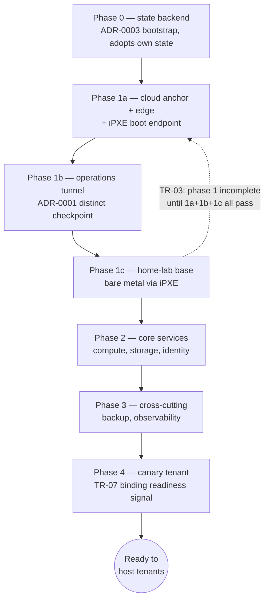

<!--
ADR Categories:
- strategic: High-level architectural decisions for this capability (auth strategy, data ownership boundaries)
- user-journey: Solutions for specific user-experience problems within this capability
- api-design: API endpoint design decisions for this capability's services

Numbering is local to this capability — start at 0001 and increment.
Status lifecycle: proposed → accepted → (later) superseded
The plan-tech-design skill refuses to compose tech-design.md until every ADR is accepted (or superseded with the superseder accepted).
-->

**Parent capability:** [Self-Hosted Application Platform]()
**Addresses requirements:** TR-02, TR-03, TR-04, TR-06, TR-07

## Context and Problem Statement

[TR-02]() requires a **single operator-invocable entry point** that drives the rebuild from a fresh pull of the definitions, sequences the phases automatically, and can complete inside 60 minutes. It permits manual checkpoints between phases and forbids manual driving of each step. [TR-03]() fixes the first phase's scope: both environments plus the connectivity between them, with single-environment standup not a supported outcome. [TR-04]() requires every phase to expose a deterministic, definitions-driven teardown callable at every checkpoint, so that "delete everything and start over" is always viable. [TR-06]() requires the same entry point to run against scratch infrastructure, with drill and live differing *only* in the underlying target.

None of the four name a tool, an execution location, or a checkpoint mechanism. This ADR decides all three, plus the phase list and its ordering.

### What exists today

**There is no orchestrator.** [ADR-0003]() records the substrate as per-component Terragrunt root modules in the private `Zaba505/homelab`, each applied by its own GitHub Actions `workflow_dispatch`. Nothing sequences them. The ordering between components exists only in the operator's memory — which is the same failure class ADR-0003 closed for the module reference, one level up: a rebuild today would be the operator dispatching workflows in a remembered order, with nothing recording what that order is or whether it was ever validated end to end.

The public repository contributes reusable modules under `cloud/*` and nothing that drives them. Confirmed by inspection: there is no `Makefile`, no `Taskfile`, no root `terragrunt.hcl`, and no orchestration workflow — `.github/workflows/` carries only docs, CodeQL, and Terraform linting.

### What the siblings already fixed

This ADR inherits rather than re-opens:

* **[ADR-0003]()** hands over **phase 0** as decided — a definitions-driven state-backend bootstrap, parameterized by target, counted inside the TR-02 budget, and **torn down last**. Its Open Questions section states this ADR "still owns how the phases are sequenced and checkpointed."
* **[ADR-0001]()** subdivides phase 1: the edge and public-cloud anchor stand up first, and the **operations tunnel is a distinct checkpoint with its own teardown**, so a failed tunnel is retried against an intact cloud anchor rather than costing a full foundations teardown. It also leaves **home-lab tooling deliberately undecided**, noting Terraform is "a weak fit for the bare-metal and OS-level state the home lab actually carries."
* **The [standup UX]()** fixes the operator's experience: automation provisions, pauses at each phase boundary, prints a summary, and waits for the operator to validate against provider UIs and signal `continue`. On any failure the operator tears down everything and restarts from the top; partial state is never carried forward.

### What is actually undecided

The phase *list* is therefore largely determined. What is not:

1. **What holds the phase model** — the ordering, the teardown inverse, and the target parameterization.
2. **Where it executes.** ADR-0001 leaves home-lab tooling open, so the orchestrator must sequence *heterogeneous* work: cloud API calls on one side, bare-metal provisioning on the other. These have incompatible execution requirements, and that turns out to constrain the decision more than the phase list does.
3. **How the operator's `continue` is realized**, given that the platform admits exactly one principal ([TR-14]()).

## Decision Drivers

* **[TR-02]()** — one entry point, automated, 60-minute-capable. An orchestrator that requires the operator to invoke each phase by hand puts the sequence back in their memory and fails the property, even if each phase is itself automated.
* **[TR-03]()** — phase 1 spans both environments plus the link. The orchestrator must drive work whose execution requirements differ fundamentally between the two sides, not just work that runs in two places.
* **[TR-04]()** — deterministic per-phase teardown at every checkpoint. "Deterministic" is the operative word: a teardown that is a hand-maintained mirror of the apply path drifts from it silently, and the drift is only discovered when teardown is needed most.
* **[TR-06]()** — drill and live differ only in target. This is a statement about *parameterization*, so target selection must be a single input threaded through every phase rather than a set of independently-set values.
* **[TR-01]()** — inherited from ADR-0003. The orchestrator and the phase model are themselves platform state, so they are definitions, and so is the toolchain they invoke. A rebuild whose result depends on which Terragrunt version happened to be on the runner is not reproducible from definitions.
* **[TR-18]()** — configuration control, portable export, and credential rotation without vendor cooperation. An orchestrator expressed entirely in one forge's YAML is exportable in the trivial sense and portable in no useful sense: the phase model would have to be rewritten to move.
* **[TR-54]()** — the 2-hour weekly operator budget. A bespoke orchestrator is a thing that can rot, and its maintenance is charged here.
* **[TR-14]()** — exactly one principal. Any checkpoint mechanism requiring a second party is unsatisfiable by construction, exactly as ADR-0003 found for pull-request approvals.
* **ADR-0003 constraint** — phase 0 exists, is target-parameterized, is inside the budget, and tears down last. The teardown order is not flat.
* **ADR-0001 constraint** — the tunnel is its own checkpoint; home-lab tooling is undecided and must not be pre-empted here beyond what sequencing requires.
* **Capability tiebreaker** — *tenant adoption beats reproducibility beats vendor independence beats minimizing operator effort.* Reproducibility is again the operative term: it argues for the phase model being testable and the toolchain being pinned, and it outranks the operator-effort cost of building that.

## Considered Options

### Option A — GitHub Actions caller workflow holds the phase model

One `rebuild.yml` in the private repository, `workflow_dispatch` with a `target` input, one job per phase, `needs:`-chained. Each job invokes the relevant tool directly. Checkpoints are environment protection rules with the operator as required reviewer.

* Satisfies **TR-02** cleanly on the entry-point property: one dispatch drives everything.
* Satisfies **TR-06** — the `target` input threads down through the jobs.
* **The checkpoint mechanism as specified is unavailable.** GitHub's documentation is explicit that on Free, Pro, and Team plans, required reviewers, wait timers, and custom deployment protection rules are **only available for public repositories**. `Zaba505/homelab` is private, so environment-gated approval requires GitHub Enterprise. This is a plan-tier blocker, not a configuration detail. (Self-approval itself is *not* the obstacle — "Prevent self-review" defaults off, so a solo operator could approve their own job if the gate were available at all.)
* Weak on **TR-04**: teardown becomes a second workflow that mirrors the apply path in YAML. Nothing enforces that the mirror stays accurate, and it cannot be tested.
* Weak on **TR-18**: the phase model *is* the forge's YAML. Moving forges means rewriting the decision, not porting it.
* Weak on **TR-01**: tool versions come from whatever the runner image or a setup action provides, so the toolchain is ambient rather than defined.

### Option B — One `workflow_dispatch` per phase

`rebuild-phase.yml` taking `phase` and `target`. The operator dispatches once per phase; the checkpoint *is* the decision to dispatch the next one.

* Best possible **TR-54** position and the only option needing no new machinery at all. No plan upgrade, no polling, no third-party dependency.
* **Fails TR-02's central property.** The sequence lives in the operator's head — precisely the defect ADR-0003 closed one level down for the module reference. A "single top-level entry point" that must be invoked six times in a remembered order is not one entry point; it is the status quo with better labels.
* Weak on **TR-04** for the same reason as Option A, plus the ordering of teardown is also unrecorded.
* Recorded so the rejection is auditable, since it is the cheapest option and its cheapness is real.

### Option C — A purpose-built orchestrator in Go in the public repository; the forge is a thin invoker

The phase model, ordering, teardown inverse, and target parameterization live in code in `Zaba505/infra`. CI supplies the target and hosts the checkpoints; it holds no sequencing logic.

* Strongest **TR-04** position available: teardown is a first-class inverse of the phase model rather than a parallel artifact, and it is unit-testable. This is the only option where "deterministic" is a property that can be *asserted in a test* rather than hoped for.
* Strongest **TR-06**: target selection is one typed parameter threaded through every phase by construction.
* Strongest **TR-18**: the phase model survives a forge change intact, and it runs identically on a workstation and in CI — which also makes it debuggable without burning a CI run.
* Honors ADR-0003's seam without amendment: orchestration logic is reusable and parameterized, so it belongs in the public repository alongside `cloud/*`; the target definitions that bind it are specific and bound, so they stay private.
* Cost against **TR-54**: this is the most work of any option, and a bespoke orchestrator is a maintenance obligation with no natural forcing function to keep it current.
* Does not by itself supply a checkpoint mechanism — it still needs one from the layer above.

### Option D — A dedicated workflow engine (Argo Workflows, Temporal)

* Real DAG execution, retries, and pause/resume as first-class primitives — nominally the best fit for **TR-02** and **TR-04**.
* **Circular and therefore disqualified.** The engine needs compute to run on, and that compute is platform state this very flow is rebuilding. Phases 0 and 1 would depend on something phase 2 provisions. There is no ordering that makes this work.
* Enormous **TR-54** cost for a single-operator platform even if the circularity were solved.

### Option E — Ansible as the single orchestrator across both environments

* Genuinely spans **TR-03**'s both-sides scope in one tool, has a native `pause` for checkpoints, and post-iPXE the home lab needs OS-level configuration anyway — so it would fill ADR-0001's undecided home-lab tooling at the same time.
* Weak on **TR-04** relative to graph-derived teardown: Ansible teardown is hand-written, so it carries Option A's mirror-drift problem in a different language.
* **Pre-empts a decision ADR-0001 deliberately deferred.** Choosing the home-lab configuration tool as a side effect of choosing the orchestrator is exactly the coupling ADR-0001 declined to make, and it would be made here without the component-design context ADR-0001 said was better placed to weigh it.
* Retains the execution-location problem unchanged — Ansible still needs a control node.

## Decision Outcome

Chosen option: **Option C — a purpose-built orchestrator in Go in the public repository, realized as a [Dagger](https://dagger.io) module, with the forge as a thin invoker.**

It is the only option under which **TR-04**'s determinism is testable rather than aspirational, and the only one that does not bet the phase model on a single forge (**TR-18**). Options A and B both put sequencing in YAML the operator maintains by hand, and Option B additionally fails **TR-02**'s entry-point property outright by returning the sequence to the operator's memory. Option D is circular. Option E buys one-tool coverage of **TR-03** by pre-empting ADR-0001's deferred home-lab tooling decision, which is not this ADR's to make.

Option A's environment-protection blocker is worth stating plainly, because it would otherwise look like the obvious design: **it is unavailable at this repository's plan tier**, and discovering that during implementation rather than here would have cost a rewrite of the checkpoint layer.

### Why Dagger specifically

Dagger is chosen over hand-rolled Go orchestration for three reasons that map onto cited TRs, not on general merit:

* **It makes the toolchain a definition (TR-01).** Terragrunt, OpenTofu, and every other tool a phase invokes are pinned container images rather than whatever the runner image happens to carry. Without this, a rebuild's result depends on ambient runner state, and "reproducible from definitions" is false in a way no amount of definition discipline elsewhere repairs.
* **It makes the orchestrator genuinely portable (TR-18).** The same module runs on a workstation and in CI, which is what turns Option C's portability claim from an assertion into a property. It also means a forge migration moves an invocation, not a phase model.
* **The operator has prior production experience with it**, which materially lowers the TR-54 maintenance cost that is Option C's main liability.

Dagger's costs are accepted with their consequences recorded below: it is **pre-1.0** (v0.21.x, no API-stability guarantee, with a breaking Modules v2 redesign shipped in v0.21), and its engine **must run privileged**, making the host the security boundary.

### The phase model

Each boundary is an operator checkpoint. Teardown unwinds in reverse, with phase 0 last.

### Sub-decision: the tunnel precedes home-lab bare metal, reordering ADR-0001's phase 1

[ADR-0001]() fixed that the cloud anchor stands up first and that the tunnel is a distinct checkpoint. It did **not** fix the tunnel's order relative to home-lab bare metal. This ADR fixes it: **the tunnel comes first.**

The reason is a circularity that only appears once execution location is considered. Bare-metal provisioning must be *triggered* — a machine that is powered off will never boot, whatever the boot infrastructure looks like. Triggering it means reaching the home lab's LAN, whether by BMC power-on or otherwise. If home-lab bare metal preceded the tunnel, the orchestrator would need a path to the LAN that the rebuild has not yet built.

Ordering the tunnel first discharges this, because **the tunnel's home-lab endpoint does not depend on any home-lab host the rebuild provisions.** ADR-0001 records that endpoint as configured out-of-band today (its residual risk 3), which means it lives on always-on network equipment rather than on a rebuilt machine. That property — inherited, not introduced here — is what makes the ordering work.

This does not weaken [TR-03](). Phase 1 remains incomplete until all three checkpoints pass, and single-environment standup remains unsupported; what changes is only the order in which the three are attempted, and the ADR-0001 benefit of retrying a failed tunnel against an intact cloud anchor is preserved exactly.

### Sub-decision: iPXE chainloads from a stable cloud-hosted endpoint

The home lab's boot artifacts — the iPXE script, kernel, initrd, and OS image — are served over HTTPS from the **public-cloud anchor**, provisioned as part of phase 1a. The only home-lab-local configuration is the DHCP directive pointing at the chainload URL.

The alternative considered was an always-on LAN appliance hosting boot artifacts and a self-hosted runner. It was rejected because it converts a large amount of platform state into a hand-built device that the rebuild flow depends on but does not build — so a disaster-recovery rebuild would begin with an untracked manual step, and the reproducibility claim would quietly exclude it.

Two consequences follow and are decided here rather than left to implementation:

* **The chainload URL must be a stable DNS name**, not an address or hostname that phase 1a mints fresh. If the URL changed per rebuild, the router's DHCP configuration would need hand-editing during every rebuild and drill — reintroducing the manual step this sub-decision exists to avoid, at the worst possible moment. The name is stable; what it resolves to is provisioned by phase 1a.
* **Boot artifacts are integrity-critical but not confidential.** They are served over HTTPS from the cloud anchor; transport authentication is the control. They carry no secret material, so their public readability is not a finding.

The residual is recorded honestly: **the router's DHCP configuration remains out-of-band GUI state**, which is drift under [TR-01]() in exactly the class of ADR-0001's residual risk 3. This sub-decision shrinks the home lab's untracked surface to approximately its minimum — one DHCP directive — but does not eliminate it, and it inherits rather than creates the obligation to express network-equipment configuration as definitions.

### Sub-decision: the executor moves from hosted to cloud-anchor runner after phase 1a

Phases 0 and 1a run on **GitHub-hosted runners**: they touch only cloud APIs over outbound HTTPS, and nothing in them needs LAN reachability.

From phase 1b onward, execution moves to a **self-hosted runner on the public-cloud anchor**, provisioned by phase 1a. This runner reaches the home lab over the operations tunnel once phase 1b establishes it. Self-hosted runners require only outbound HTTPS to register and poll, so this needs no inbound exposure of the cloud anchor.

The point worth stating is what this arrangement *avoids*: **no runner is required inside the home lab, and none is a precondition of the rebuild.** The executor for home-lab-touching work is platform state that the rebuild itself provisions in phase 1a, so it is definitions-driven like everything else. An always-on LAN runner would have been a hand-built precondition, with the same objection as the appliance rejected above.

The accepted cost is a **runner handoff in the middle of the rebuild**, which is real complexity: phase 1a must provision and register a runner that later phases then target, and a failure to register is a phase-1a failure with a somewhat unintuitive symptom. It is recorded rather than minimized.

### Sub-decision: checkpoints are separate invocations gated on the engagement thread

Dagger has **no primitive for waiting on human input** — `Terminal()` exists for debugging, not for pipeline-time approval — so the checkpoint cannot live inside the orchestrator. Combined with Option A's finding that environment protection rules are unavailable on a private repository below Enterprise, the mechanism is fixed as follows:

Each phase is a **separate invocation of the orchestrator** from a `needs:`-chained job in a single `rebuild.yml`. Between phases, a gate step posts the phase summary to a GitHub issue and polls until the operator replies `continue`.

This satisfies [TR-02]() on both limbs: **one** `workflow_dispatch` drives the whole rebuild, so the entry point is genuinely single, while the operator validates at boundaries without driving steps. The phase model stays in Go regardless — what CI holds is the invocation sequence and the gate, not the ordering logic.

Routing the gate through an issue thread is not merely a workaround for the plan tier. It lands checkpoint acknowledgments on the [TR-19]()/[TR-20]() engagement channel that is already the platform's record of operator action, so the rebuild leaves an auditable trail of what was validated and when — which environment approvals would have recorded only in run metadata.

The costs are accepted: a job parked on a poll **consumes runner minutes**, unlike an environment approval, and hosted jobs cap at six hours. Neither binds a rebuild targeting 60 minutes, but an abandoned rebuild left parked overnight is waste rather than merely idle.

### Sub-decision: every side-effecting operation carries a per-run cache-buster

This is the highest-risk item in the design and it is decided as a hard correctness rule, not an optimization.

Dagger caches function calls on module source plus argument values, and caches `withExec` operations at the BuildKit layer. Critically, the documented `cache="never"` control on a function **does not disable layer caching for the execs inside it**. The failure mode this produces is documented in the wild — [dagger#7090](https://github.com/dagger/dagger/issues/7090) and [dagger#9607](https://github.com/dagger/dagger/issues/9607) both record deploy and destroy operations returning **cached success while the infrastructure no longer existed.**

For this capability that is not a performance bug. A teardown that reports success without executing defeats [TR-04]() precisely when it matters — the operator believes "delete everything and start over" succeeded, restarts onto state that was never removed, and carries partial state forward, which is the one outcome the [standup UX]() rules out by name. A cached apply is the same defect pointed the other way, and it would make the [TR-07]() canary's green signal untrustworthy.

**The rule:** every exec that mutates infrastructure — apply, destroy, boot-trigger, canary deploy — takes a per-run unique value (the rebuild's run identifier) as an environment variable used only for cache invalidation. Read-only operations may cache freely.

Enforcing this by convention alone was considered and rejected: the failure is silent, and a missed cache-buster surfaces as a *successful-looking* rebuild. The obligation recorded below is therefore that side-effecting operations be constructed through a single helper that injects the buster, so that omitting it requires bypassing the helper rather than merely forgetting a parameter.

### Sub-decision: the teardown contract

Every phase exposes a teardown callable at every checkpoint, per [TR-04](). Four properties are fixed:

* **Teardown unwinds in reverse phase order, and phase 0 is last** — inherited from ADR-0003, whose state bucket holds the state every other phase's teardown depends on. Torn down out of order it strands exactly the resources the definitions can no longer address.
* **Terraform-backed phases derive teardown from the dependency graph rather than a hand-written inverse.** Terragrunt reverses the graph on destroy, so dependents are removed before dependencies. This is what makes "deterministic" mean something stronger than "we wrote a second script."
* **Phase membership and teardown order are verifiable before execution.** Terragrunt can emit the exact unit set and destroy-order a given scope selects, so a phase's teardown can be dry-run and asserted in a test rather than trusted. The orchestrator uses this as the definition of a phase's Terraform-backed membership.
* **Teardown must be scoped so it cannot exceed its phase.** `run --all destroy` destroys external dependencies of the selected units **by default**, which would let one phase's teardown reach outside itself. Phase scoping must exclude external dependencies explicitly, and this is a correctness requirement of the teardown contract rather than a tuning flag.

Two limits are recorded rather than solved. Terragrunt offers **no resume-from-failure and no transactional rollback**, so a teardown interrupted partway leaves a partially-destroyed graph that the next attempt must be able to tolerate — re-running teardown must be safe. And **phase 1c's teardown is not resource deletion**: tearing down bare metal means powering off and wiping, which is a different determinism story than a cloud API destroy and is the weakest link in the per-phase contract.

### Sub-decision: drill-vs-live is a single named target

[TR-06]() requires drill and live to differ only in the underlying target, so target selection is **one parameter naming a target definition**, not a set of independently-set values. A target definition binds the GCP project, the state bucket, the DNS zone, the boot endpoint, and the home-lab target in one tracked object. Every phase receives it; no phase reads any of those values from anywhere else.

The single-parameter form is the decision, and its rationale is the same one ADR-0003 used for collapsing the module reference from a tuple to a single pin: independently-set values can be combined into a state that was never validated, and here that state would be a drill pointed at live infrastructure.

Target definitions are **specific and bound**, so per ADR-0003's seam they live in the private repository; the orchestrator that consumes them is reusable and parameterized, so it lives in the public one.

### Sub-decision: a drill's home-lab target is virtual hosts on the home-lab LAN

The single-target form above is straightforwardly satisfiable for every cloud phase — a drill target names a different project, bucket, and zone. It is not straightforwardly satisfiable for **phase 1c**: a drill cannot reprovision the live home lab's bare metal without destroying the thing it is drilling against, and there is no second set of hardware.

The decision: **a drill target's home-lab target names virtual machines on existing home-lab hypervisor capacity**, where a live target names the physical hosts. Phase 1c then runs *unchanged* — same chainload, same boot artifacts, same OS image, same post-boot definitions — against virtual NICs and virtual disks. [TR-06]()'s "differ only in the underlying target" stays literally true, because the virtualization is a property of the target rather than a branch in the flow.

**Why home-lab capacity rather than the cloud.** Virtualizing the home-lab side *into the cloud anchor* was the cheaper-looking variant and is rejected: it would make phase 1b degenerate, with the tunnel terminating on both ends inside one environment. A drill would then no longer span two environments, and [TR-03]()'s both-sides-plus-the-link coverage would be silently narrowed in exactly the mode that exists to verify it. Keeping the virtual hosts on the home-lab LAN preserves the tunnel as a real crossing, which is the property a drill most needs to hold.

[BR-50]()'s "without touching live platform state" is satisfied on the distinction that matters: a drill VM consumes live *capacity* but produces no live platform state.

The two alternatives are recorded with their rejections. **Spare hardware as a standing precondition** gives the highest fidelity, and is rejected on the same objection that killed the LAN boot appliance above — it makes the rebuild flow depend on a hand-maintained device the rebuild does not itself build. **Cloud-only drills** cost nothing, and are rejected because they make drill and live differ in *scope* as well as target, which lets the reproducibility KPI certify a rebuild that skips a phase.

Two consequences follow and are decided here rather than left to implementation:

* **Drill hosts sit on an isolated segment with their own DHCP chainload directive.** The stable name decided above points at the *live* target's boot endpoint. A drill VM booting on the live LAN's DHCP scope would therefore chainload live artifacts — a drill that quietly rebuilds from the live target is worse than no drill at all, because it returns a green signal for something it never tested. The drill segment's directive points at the drill target's boot endpoint. This grows the out-of-band router surface from one directive to two; it does not change its class.
* **What a drill does not prove is named rather than implied.** Firmware, BMC power-on, disk controller and layout, and NIC driver behaviour — the failure modes specific to metal — go unexercised. A drill certifies the phase model, the sequencing, the definitions, and the teardown; it does not certify that *this hardware* boots. That is the honest bound on what the reproducibility KPI demonstrates, and it belongs next to the KPI rather than being discovered after a disaster-recovery event.

### Sub-decision: phase 4 exposes an idempotent canary teardown, and a canary that will not tear down is a phase-4 failure

[TR-07]() has the canary deployed, exercised, and torn down *within* phase 4, so its teardown is partly intrinsic to the success path. That is not sufficient for [TR-04](), and the reason is specific: the checkpoint at which phase 4's teardown is actually reached is the one where the **canary failed** — the [standup UX]()'s "canary tenant fails to come up" case — and there the intrinsic teardown never ran. A phase whose teardown assumes the success path has no teardown for the case it exists to serve.

Phase 4 therefore exposes the standard TR-04 entry point as an **idempotent removal of the canary's runtime footprint wherever it landed** — compute, persistent storage, identity registration, backup enrolment, and observability series, matching the surfaces the standup UX has the canary exercise. Idempotence is the operative property, because the teardown cannot know which of three states it faces: a canary that removed itself cleanly, one that removed itself partway, or one that never deployed. All three must be safe.

What it does **not** remove is the canary's definitions. TR-07 maintains the canary alongside the platform definitions, so it is a permanent artifact; teardown removes what a rebuild instantiated, never the canary itself.

The second half of the decision is a claim about readiness: **a canary that comes up green but does not tear down cleanly is a phase-4 failure.** TR-07 names deployment, exercise, and teardown as one obligation, but the reason is not symmetry — the canary's teardown *is* the platform's tenant-offboarding path exercised for real. A canary that cannot be removed has demonstrated that the platform cannot offboard a tenant, which is a readiness defect exactly as much as one that cannot be onboarded, and the standup UX's rule that readiness does not bend for a failed canary applies unchanged.

This is also where the cache-buster rule is load-bearing a second time. Canary deploy and canary teardown are both side-effecting and both go through the mandatory helper; a cached canary teardown would report a clean removal that never happened, leaving residue that the next rebuild's canary then collides with.

### Sub-decision: checkpoint wait time counts against the 60-minute budget

The [TR-02]() budget is measured as **wall-clock from invocation to canary-green, including time parked at checkpoints.**

Excluding operator validation time was considered and rejected on ADR-0003's precedent, which refused to exclude phase 0 from the budget on the reasoning that the budget is a *target* rather than a gate — missing it files a follow-up issue and does not stop the platform going into service, so exclusion protects nothing while letting the KPI be measured against something other than the real rebuild. The same logic applies here, and more directly: the [standup UX]() has the operator record how long the rebuild took, which is unambiguously the elapsed experience rather than the automation's share of it.

The consequence is that the KPI partly measures operator validation speed, which is honest rather than unfortunate — a rebuild requiring 40 minutes of squinting at provider consoles genuinely is a slow rebuild, and the follow-up issue it generates is pointed at a real problem.

### Consequences

* Good, because the phase model, its ordering, and its teardown inverse become **testable code** rather than a hand-maintained YAML mirror — the only option under which TR-04's "deterministic" is a property that can be asserted rather than hoped for.
* Good, because the toolchain is pinned into container images, so a rebuild's result no longer depends on ambient runner state. This closes a TR-01 gap that none of the YAML-held options address.
* Good, because the orchestrator runs identically on a workstation and in CI, which makes TR-18 portability real and lets the phase model be debugged without burning CI runs.
* Good, because target selection collapses to one parameter, so a drill cannot be assembled into a configuration that partly points at live infrastructure.
* Good, because ordering the tunnel ahead of home-lab bare metal discharges a circularity — that bare metal must be *triggered* over a path the rebuild has not yet built — without weakening TR-03 or losing ADR-0001's independent-tunnel-retry benefit.
* Good, because no runner and no boot appliance is required inside the home lab; the executor for home-lab-touching phases is provisioned by phase 1a, so it is definitions-driven rather than a hand-built precondition.
* Good, because checkpoint acknowledgments land on the TR-19/TR-20 engagement thread, leaving an auditable record of what the operator validated and when — which environment approvals would have left only in run metadata.
* Good, because drills exercise phase 1c for real rather than skipping it — the home-lab target is virtualized rather than the flow being branched, so TR-06's "differ only in target" stays literally true and the reproducibility KPI certifies the whole phase model rather than its cloud half.
* Good, because keeping the drill's virtual hosts on the home-lab LAN keeps phase 1b's tunnel a genuine cross-environment crossing during a drill, so TR-03's coverage is not quietly narrowed in the mode that exists to verify it.
* Good, because phase 4's teardown is idempotent across all three states the canary can be left in, so TR-04 holds at the checkpoint the operator actually reaches most often — the failed canary, where the intrinsic success-path teardown never ran.
* Good, because treating a canary that will not tear down as a phase-4 failure makes each rebuild exercise the tenant-offboarding path and not only the onboarding one.
* Bad, because **Dagger's caching can silently skip side-effecting operations**, and the documented `cache="never"` control does not cover execs. A cached teardown reports success without executing, which produces exactly the carried-forward partial state the standup UX rules out. This is mitigated by a mandatory per-run cache-buster, but the mitigation is the design's most load-bearing convention and its failure mode is a *successful-looking* rebuild.
* Bad, because **Dagger is pre-1.0** with no API-stability guarantee, and shipped a breaking Modules v2 redesign in the current minor line. The orchestrator inherits an upgrade treadmill charged against TR-54, and version pinning is mandatory rather than prudent.
* Bad, because **the Dagger engine must run privileged**, so the host is the security boundary. This is acceptable on a dedicated runner and would not be on a shared one.
* Bad, because **iPXE cannot run inside Dagger.** There is no host-network mode, and DHCP/TFTP is broadcast traffic that a NAT'd container bridge does not reach. Phase 1c's boot-trigger work runs host-side, outside the Dagger graph — a real seam in an otherwise uniform execution model, and the one place where "the orchestrator holds the phase model" is qualified.
* Bad, because **the runner handoff mid-rebuild is genuine complexity**: phase 1a provisions and registers the runner that later phases target, and a registration failure is a phase-1a failure with an unintuitive symptom.
* Bad, because **the router's DHCP configuration remains out-of-band GUI state** — drift under TR-01, in ADR-0001's residual-risk-3 class. This decision shrinks the home lab's untracked surface to roughly one directive but does not reach zero.
* Bad, because **a job parked on a checkpoint poll consumes runner minutes**, where an environment approval would not, and hosted jobs cap at six hours. Neither binds a 60-minute rebuild; an abandoned one is waste.
* Bad, because **Option C is the most work of any option considered**, and a bespoke orchestrator has no natural forcing function keeping it current. The operator's prior Dagger experience lowers this cost but does not remove it.
* Bad, because **phase 1c's teardown is not resource deletion.** Powering off and wiping bare metal is a weaker determinism story than a cloud destroy, making it the weakest link in the per-phase teardown contract.
* Bad, because **a virtualized drill target does not exercise metal.** Firmware, BMC power-on, disk controller and layout, and NIC driver behaviour go unproven, so the reproducibility KPI certifies the phase model and the definitions rather than that this hardware boots. This is recorded as the honest bound on the KPI rather than mitigated, and it is the residual a spare-hardware precondition would have bought out.
* Bad, because **a drill's phase-1c teardown is VM deletion rather than power-off-and-wipe**, so drills exercise a teardown path that is both stronger than and different from the live one. The weakest link in the teardown contract is precisely the link drills do not test.
* Bad, because **the drill's home-lab hosts require a second out-of-band DHCP directive** on an isolated segment. Without it a drill chainloads the live target's boot artifacts and returns a green signal for something it never tested. The untracked router surface grows from one directive to two — the same TR-01 class, twice.
* Bad, because **drill hosts consume live home-lab capacity.** No live platform state is touched, which is what BR-50 tests, but a drill and the live platform contend for the same hypervisor — so drill sizing is bounded by what the home lab can spare while still serving.
* Bad, because **phase 4's teardown must be written defensively rather than derived.** Unlike the Terraform-backed phases, the canary's footprint spans identity, backup, and observability enrolments whose removal has no dependency graph to reverse, so this is the one teardown that is a hand-written inverse — the mirror-drift problem this ADR rejected Option A over, readmitted at one phase and accepted because TR-07's canary surface is small and fixed.
* Neutral but load-bearing: **Terragrunt provides no resume-from-failure and no transactional rollback**, so re-running a teardown must be safe against a partially-destroyed graph. This is a property the orchestrator must hold, not one it inherits.
* Requires: a Dagger module in `Zaba505/infra` holding the phase model, per-phase apply and teardown functions, and the target parameter, with the Dagger version and every tool image pinned.
* Requires: a single helper through which all side-effecting execs are constructed, injecting the per-run cache-buster, so omission requires bypassing the helper rather than forgetting a parameter.
* Requires: `rebuild.yml` in `Zaba505/homelab` — one `workflow_dispatch` taking the target, `needs:`-chained per-phase jobs invoking the module, and the issue-thread gate step between phases.
* Requires: target definitions in `Zaba505/homelab` binding project, state bucket, DNS zone, boot endpoint, and home-lab target as one tracked object per target.
* Requires: phase 1a extended to provision the iPXE boot-artifact endpoint behind a stable DNS name, and to provision and register the cloud-anchor self-hosted runner.
* Requires: phase scoping that excludes external dependencies on teardown, plus a test asserting each phase's membership and destroy order against the dry-run output.
* Requires: a standup-UX update — phase 0 from ADR-0003, the 1a/1b/1c subdivision with the tunnel ahead of bare metal, and the issue-thread checkpoint replacing the implied local `continue`.
* Requires: empirical verification that outbound TCP from a Dagger container reaches an RFC1918 address over the tunnel, before phases 2 and 3 are built on the assumption. Official documentation does not guarantee it.
* Requires: drill target definitions to name virtual home-lab hosts on an isolated LAN segment, with that segment's own DHCP chainload directive pointing at the drill target's boot endpoint — not the live one.
* Requires: home-lab hypervisor capacity sufficient to stand up the drill's virtual host set alongside live workloads, which is a capacity floor the home-lab definitions surface must account for rather than discover at drill time.
* Requires: phase 4 to expose an idempotent canary teardown covering compute, persistent storage, identity registration, backup enrolment, and observability, safe against a canary that removed itself, removed itself partway, or never deployed — and constructed through the cache-buster helper like every other side-effecting operation.
* Requires: the [standup UX]() update already noted above to additionally record that a canary which will not tear down cleanly fails phase 4, and that drills exercise the home-lab phase virtually.

### Realization

* **`Zaba505/infra` (public)** — **new** Dagger module (Go, Modules v2) holding the phase model, per-phase apply/teardown functions, the target parameter type, and the cache-buster helper. Reusable and parameterized, so it sits on the public side of ADR-0003's seam alongside `cloud/*`. Unit tests assert teardown ordering and phase membership.
* **`Zaba505/homelab` (private)** — **new** `rebuild.yml` (single `workflow_dispatch`, `needs:`-chained phase jobs, issue-thread gate steps) and **new** target definitions binding each drill/live target as one object. Existing per-component workflows are superseded by phase invocations.
* **`cloud/dns/`** — the stable DNS name fronting the iPXE chainload URL, which must survive across rebuilds independently of what phase 1a provisions behind it.
* **`cloud/storage-bucket/`** — boot artifacts (iPXE script, kernel, initrd, OS image) served over HTTPS from the cloud anchor.
* **`cloud/compute-engine/` + `cloud/service-account/`** — the cloud-anchor self-hosted runner provisioned by phase 1a, plus its registration identity.
* **Phase-0 bootstrap root module (`Zaba505/homelab`)** — from ADR-0003; invoked here as phase 0 and torn down last.
* **`cloud/vpc-network/` and the tunnel module** — phase 1b, ADR-0001's distinct checkpoint, reordered ahead of home-lab bare metal.
* **Home-lab module surface (`Zaba505/infra`, peer to `cloud/`)** — from ADR-0003's reconciliation note; phase 1c's definitions land here once ADR-0001's deferred tooling decision is made. The boot-trigger work runs host-side, outside Dagger. Must address both a physical and a virtual host target, and declare the hypervisor capacity a drill requires.
* **Canary tenant definitions (`Zaba505/infra`)** — from TR-07, maintained alongside the platform definitions and never removed by teardown. Phase 4's apply deploys and exercises it; phase 4's teardown removes its runtime footprint idempotently across compute, storage, identity, backup, and observability.
* `tech-design.md` (composed later by `plan-tech-design`) will fold the phase model into the rebuild-flow narrative alongside the other accepted ADRs.

## Open Questions

None remain. Both questions this ADR previously carried are resolved and folded into the sections above.

### Resolved

* **How the home-lab side of a drill is exercised.** → **A drill target's home-lab target names virtual machines on existing home-lab hypervisor capacity**, so phase 1c runs unchanged against virtual NICs and disks and TR-06's "differ only in target" stays literally true. Virtualizing into the cloud anchor was rejected for making phase 1b's tunnel degenerate and narrowing TR-03 coverage in the mode that exists to verify it; spare hardware was rejected on the LAN-appliance objection; cloud-only drills were rejected for making drill and live differ in scope. Recorded limits: metal-specific failure modes go unproven, drill hosts need their own DHCP chainload directive, and drill teardown is VM deletion rather than the live power-off-and-wipe ([sub-decision](#sub-decision-a-drills-home-lab-target-is-virtual-hosts-on-the-home-lab-lan)).
* **The canary's teardown relationship to phase 4.** → **Phase 4 exposes the standard TR-04 entry point as an idempotent removal of the canary's runtime footprint, and a canary that will not tear down cleanly fails phase 4.** The intrinsic success-path teardown is insufficient because the checkpoint where teardown is reached is the *failed* canary, where it never ran; idempotence is required because teardown cannot know whether the canary removed itself, removed itself partway, or never deployed. The canary's definitions are never removed. Failure is a readiness failure because the canary's teardown is the tenant-offboarding path exercised for real ([sub-decision](#sub-decision-phase-4-exposes-an-idempotent-canary-teardown-and-a-canary-that-will-not-tear-down-is-a-phase-4-failure)).

* **What holds the phase model.** → **A Dagger module in Go in the public repository.** The forge holds the invocation sequence and the checkpoint gate; it holds no ordering logic. Chosen for testable teardown (TR-04), pinned toolchain (TR-01), and forge portability (TR-18) ([Decision Outcome](#decision-outcome)).
* **Phase ordering.** → **0 → 1a cloud anchor + edge → 1b tunnel → 1c home-lab bare metal → 2 core → 3 cross-cutting → 4 canary.** The tunnel is reordered ahead of bare metal because bare metal must be triggered over a LAN path the rebuild would not otherwise have built yet. TR-03 is unweakened: phase 1 completes only when all three checkpoints pass ([sub-decision](#sub-decision-the-tunnel-precedes-home-lab-bare-metal-reordering-adr-0001s-phase-1)).
* **Home-lab boot infrastructure.** → **iPXE chainloads from a stable cloud-hosted endpoint** provisioned in phase 1a. An always-on LAN appliance was rejected for making the rebuild depend on a hand-built device it does not itself build. The residual is one out-of-band DHCP directive ([sub-decision](#sub-decision-ipxe-chainloads-from-a-stable-cloud-hosted-endpoint)).
* **Execution location.** → **Hosted runners for phases 0–1a; a cloud-anchor self-hosted runner, provisioned by phase 1a, from 1b onward**, reaching the home lab over the tunnel. No runner is required inside the home lab. The cost is a runner handoff mid-rebuild ([sub-decision](#sub-decision-the-executor-moves-from-hosted-to-cloud-anchor-runner-after-phase-1a)).
* **Checkpoint mechanism.** → **Separate per-phase invocations from one `workflow_dispatch`, gated on an issue thread.** Environment protection rules are unavailable on a private repository below Enterprise, and Dagger has no wait-for-human primitive. Routing the gate through the TR-19/TR-20 engagement channel makes checkpoint acknowledgments auditable ([sub-decision](#sub-decision-checkpoints-are-separate-invocations-gated-on-the-engagement-thread)).
* **Cache correctness.** → **Every side-effecting exec carries a per-run cache-buster, injected through a single mandatory helper.** Dagger's `cache="never"` does not cover execs, and cached-success deploys and destroys are documented in the wild. A cached teardown produces the carried-forward partial state the standup UX rules out by name ([sub-decision](#sub-decision-every-side-effecting-operation-carries-a-per-run-cache-buster)).
* **Teardown contract.** → **Reverse phase order with phase 0 last; graph-derived for Terraform-backed phases; membership and order verifiable by dry-run; scoped to exclude external dependencies.** Recorded limits: no resume-from-failure, and bare-metal teardown is power-off-and-wipe rather than resource deletion ([sub-decision](#sub-decision-the-teardown-contract)).
* **Drill-vs-live parameterization.** → **One parameter naming a target definition** that binds project, state bucket, DNS zone, boot endpoint, and home-lab target together. Independently-set values were rejected on ADR-0003's tuple reasoning — here the never-validated combination would be a drill pointed at live ([sub-decision](#sub-decision-drill-vs-live-is-a-single-named-target)).
* **What counts against the 60-minute budget.** → **Wall-clock including checkpoint waits.** Excluding operator validation time was rejected on ADR-0003's precedent that the budget is a target rather than a gate, so exclusion protects nothing while making the KPI measure something other than the real rebuild ([sub-decision](#sub-decision-checkpoint-wait-time-counts-against-the-60-minute-budget)).
