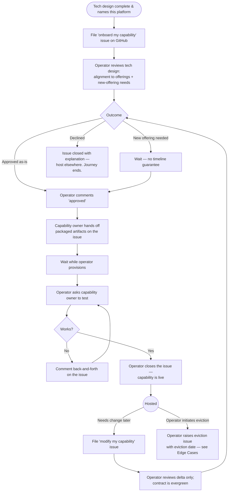

> **One-line definition:** A capability owner brings a fully-designed capability onto the platform, gets it provisioned and live, and continues to evolve its needs over time.

**Parent capability:** [Self-Hosted Application Platform](../_index.md)

## Persona

The actor here is a **capability owner** — one of the people named in the parent capability's *Primary actors*. Although the capability doc notes this is currently the operator wearing a different hat, this UX is written **as if the capability owner were a separate person** from the platform operator. The role boundary is treated as real: there is an interface, a handoff, and a contract between them.

- **Role:** Capability owner. They have just finished defining one of the operator's capabilities — its UX docs and its tech design are both complete. The tech design picked this platform as the host.
- **Context they come from:** They are not building the platform; they are a *customer* of it. They arrive with a capability doc, a tech design that calls out which components must run on the platform, and (ideally, but not strictly required) a mapping from those components to specific platform offerings.
- **What they care about here:** Getting their capability running on a controlled, reproducible substrate, declaring its needs once, understanding what they are signing up for, and having a clear path to change those needs later — without onboarding becoming a multi-day project for either side of the handoff.

## Goal

> "I want my capability running on the platform — with its compute, storage, network, and identity needs declared once, the platform's contract understood, and a clear path to update those needs later — and I want it to *stay* running healthily as my capability evolves."

This is a **lifecycle goal**, not just an onboarding one: the change-later branch lives in the same journey as the initial onboarding because it shares the same persona, surface, and contract.

## Entry Point

The capability owner arrives at this experience having just finished the tech-design phase of *their* capability. Specifically:

- Their capability's UX docs are complete.
- Their tech design is complete and explicitly designates this platform as the host for the components that need to run somewhere.
- Their decision about whether to use platform-provided identity or bring their own has already been made and recorded *in the tech design itself* — it is not a fresh question at onboarding.

What they have in hand: the capability doc and the tech design. Nothing else is required. A tech design that already names specific platform offerings per component is nice; one that doesn't can have those gaps filled during onboarding.

Their state of mind depends on what they're asking for:

- **Fully confident** if every component in their tech design maps to an offering the platform already provides.
- **Semi-confident** if some component requires something the platform may or may not be able to support (e.g. their capability needs GPU compute, which the platform may never provide because no GPUs are installed and buying them is out of scope).

## Journey

The capability owner's journey is a single end-to-end flow with three branches that can occur during operator review (approved as-is, new-offering needed, declined) and one re-entry loop for changing requirements after going live.

### 1. File an "onboard my capability" issue on GitHub

The capability owner opens an issue against the infra repo using the *onboard my capability* issue type. GitHub issues are the **only** channel for engaging the platform — there is no self-service portal and no other front door — and this is the issue type for onboarding. They link or attach the capability doc and the tech design.

What they perceive: the issue is filed, and now they wait. There is no response-time guarantee — this is personal-scale, async by default.

### 2. Operator review on the issue

The operator reviews the tech design with a deliberately narrow scope:

- Does each platform-hosted component align with an **existing** platform offering?
- Are there any components that would require a **new** platform offering to be added?

What the capability owner perceives: clarifying questions appear as comments on the issue, and possibly a meeting if the operator deems it necessary. They answer the questions in-thread.

### 3. Resolution — one of three branches

**3a. Approved as-is.** The operator comments **"approved"** on the issue. That comment is the moment the capability owner knows hosting is real. There is no separate contract-acceptance step at this point: the contract was accepted by virtue of the tech design already conforming to it (declared resource needs, identity choice, packaging, availability expectations).

**3b. New offering needed.** The operator agrees the right answer is to add a new platform offering to support the capability, and that the offering is still within the platform's intended scope — meaning the platform can add it while keeping the offering reproducible within the parent capability's *Reproducibility* KPI and routine operation within the *Operator maintenance budget* KPI. The operator **does not commit to a timeline**. The capability owner waits. While they wait, there is nothing for them to do on their side. Eventually the operator returns and the journey resumes at step 3a.

**3c. Declined — host elsewhere.** The operator closes the issue with a comment explaining why the request cannot be supported. That can be because it is simply impossible (e.g. the platform will never have GPUs because the hardware cannot be added), or because it is only *technically* possible and would require the platform to grow into an offering the operator does not want to carry as routine scope — specifically, one the platform could not keep reproducible within the parent capability's *Reproducibility* KPI or operate within the *Operator maintenance budget* KPI. The capability owner now knows this capability has to be hosted somewhere else; the journey ends here.

### 4. Hand off packaged artifacts

For each component in the tech design that needs to be deployed, the capability owner provides a **packaged artifact** in the form the platform accepts. The capability owner does the packaging themselves; they do not hand over raw source for the operator to package.

What they perceive: they post or link the artifacts on the issue and wait.

### 5. Wait while the operator provisions

While the operator is actually wiring up compute, storage, networking, identity, backup, and observability for the new tenant, the capability owner does **nothing**. They are not pinged for DNS choices or secrets. They simply wait until the operator asks them to test.

### 6. Test on request

The operator comments asking the capability owner to test the deployed capability. The capability owner exercises it however they would normally validate that *their* capability works (this is their judgment — the platform doesn't prescribe a test plan).

- If something is wrong (the deployment doesn't work right, networking can't reach it, an artifact failed to deploy as-given), the capability owner comments on the issue and the two iterate back-and-forth in comments until it works.
- If everything works, the capability owner says so on the issue.

### 7. Operator closes the issue

The operator closes the onboarding issue. The capability is now live on the platform.

### 8. Change-later loop (re-entry)

When the capability owner needs something different — more storage, a new external endpoint, a new component, a routine version bump, retirement of a component — they file a **different** issue type: *modify my capability* (distinct from the onboarding type, and the distinction is meaningful to the capability owner because the operator's review scope differs).

Operator review on a *modify* issue covers **only the delta**, not a full re-evaluation. The platform contract is **evergreen** — the capability owner does not re-accept it on each modification. If the platform's own contract changes, the operator is responsible for communicating the change ahead of time and migrating existing tenants; it is never sprung on the capability owner during a modify request.

The flow from issue → review → branches → artifact handoff → test → close repeats.

### Flow Diagram

## Success

When the onboarding issue closes, the capability owner walks away with:

- Their capability is running on infrastructure they trust to be reproducible and operator-controlled.
- The operator knows exactly what they signed up to host — needs were declared in the tech design and reviewed before approval.
- A known, low-friction path back when needs change: file a *modify my capability* issue and run the same loop.
- No surprises: there is no hidden ongoing obligation on their side beyond filing issues for changes.

For change-later iterations, success looks the same in miniature: the delta is reviewed, deployed, tested, and closed without re-litigating the entire capability.

## Edge Cases & Failure Modes

- **Test step fails after provisioning.** Capability owner sees their capability isn't working post-deploy. *Experience-level handling:* the issue stays open and the two iterate via comments until the deployment works. The journey doesn't reset to the start; it loops between test and operator action.
- **Operator goes silent / issue stalls.** There is no response-time guarantee, so some waiting is normal. The signal that the silence has gone on *too long* is not a timer; it is the capability owner explicitly commenting that they are withdrawing the request and hosting elsewhere because they can no longer wait (or closing the issue saying so). *Experience-level handling:* that outcome is recorded on the issue itself and counts as a lost tenant against the parent capability's *Tenant adoption* KPI. When the operator returns, the response is to acknowledge the loss in-thread and close the issue if it is still open — not to let the thread silently rot.
- **Handed-off artifact is broken or undeployable.** Symmetric with the test-fails case: comment back-and-forth on the issue until a working artifact is in place.
- **New offering requested but no commitment.** The capability owner's request to add a new offering is accepted in principle but with no timeline. They wait indefinitely. If they cannot wait, they say so on the issue and host elsewhere; that is a tracked *Tenant adoption* KPI loss, not invisible churn.
- **Capability is evicted later.** This is **operator-initiated**, not capability-owner-initiated, so it is not a step inside this journey. From the capability owner's perspective: at some point the operator opens an eviction issue tagging them and naming the eviction date. The capability owner now knows they must move off the platform by that date. Eviction is governed by the parent capability's *Eviction threshold* rule (the request would push routine maintenance sustainably above 2× the maintenance budget, or break reproducibility).
- **Operator-driven update because tenant components fell behind.** Out of scope for this UX — see *Out of Scope*.

## Constraints Inherited from the Capability

This UX must respect the following items from the parent capability's Business Rules and Success Criteria — by name, so future readers can trace the lineage:

- **Operator-only operation.** There is no self-service onboarding flow. The journey's only engagement surface is a GitHub issue the capability owner files, which the operator personally services. No co-operator or delegated administration appears anywhere in the journey.
- **Tenants must accept the platform's contract.** Contract acceptance is implicit in the tech-design submission: the design declares resource needs, identity choice, packaging form, and availability expectations conforming to the platform's contract. There is no explicit "I accept" gate — the design *is* the acceptance.
- **Identity service honors tenant credential-recovery rules.** Whichever identity option is named in the capability owner's tech design must be one the platform actually offers. The platform-provided identity service must be capable of honoring "lost credentials cannot be recovered." If a capability needs that property and bring-your-own is chosen, it is the capability owner's responsibility to honor it themselves.
- **Eviction threshold.** The operator may raise eviction when routine accommodation would exceed 2× the operator-maintenance-budget KPI or break the reproducibility KPI. This UX surfaces eviction only as an *external* operator-initiated event affecting the capability owner — see Edge Cases.
- **The capability evolves with its tenants.** The "new offering needed" branch in step 3 is the operationalization of this rule: the default response when a tenant needs something the platform doesn't yet provide is to consider expanding the platform, not to refuse the tenant. But the operator is not obligated to grow the platform without bound. A request is declined once satisfying it would require a new ongoing offering the platform could not keep reproducible within the *Reproducibility* KPI or operate within the *Operator maintenance budget* KPI, even if the offering is technically buildable.
- **No specific availability or performance SLA.** The journey does not include any negotiation of availability targets — tenants accept whatever the platform's current implementation offers. A capability owner needing stronger guarantees should not have arrived here (their tech design would have picked a different host).
- **KPI: Tenant adoption.** A capability owner who explicitly gives up on onboarding because the operator stayed silent too long is counted as a lost tenant, not waved away as "they changed their mind." The signal is the GitHub issue itself: they say they are hosting elsewhere because waiting no longer works for them. The response is to leave that loss recorded in-thread and close the issue, so the KPI reflects what actually happened.
- **KPI: 1-hour reproducibility.** Implication for this UX: provisioning during step 5 must be done by running the platform's existing definitions, not by the operator hand-rolling per-tenant snowflake configuration. If onboarding *requires* bespoke manual config that cannot be captured as definitions, the platform itself has fallen out of compliance with this KPI — and the right response is to update the platform's definitions, not to tolerate the snowflake.
- **KPI: 2-hr/week operator maintenance budget.** Implication for this UX: change-later iterations (step 8) must remain quick enough that running them does not eat the operator's weekly budget across all hosted tenants. A tenant whose modify requests routinely cost disproportionate operator time crosses into the eviction-threshold rule. The same KPI also bounds the admission of new offerings: "technically possible" is still a decline if the resulting routine platform scope would no longer fit inside this budget.

## Out of Scope

- **Data migration of an existing tenant.** Bringing data from a prior vendor or local install into the newly-provisioned tenant is a separate UX, not covered here. This UX is strictly about *provisioning the capability on the platform*.
- **Operator-initiated tenant updates ("your component has fallen behind").** When the operator notices a tenant's components have aged out of platform support, the operator initiates the conversation — that is a different journey with the operator as the primary actor and the capability owner as the responder. It belongs in its own UX doc.
- **End-user observability for the capability owner.** Today, observability of running tenants is purely operator-facing. The capability owner does not get a "is my thing healthy right now?" view as part of this journey; they learn about problems through their own end users (or by their own checks). Tenant-facing observability is out of scope for this UX.
- **Platform-side standup or rebuild.** The operator standing up the platform from scratch is one of the parent capability's other triggers, not this UX.
- **The capability owner's tech-design phase.** The decision to use this platform was made before this journey starts. How that decision is made (build vs. buy, host-here vs. host-elsewhere) is a tech-design concern, not a hosting-UX concern.

## Open Questions

_None at this time._
