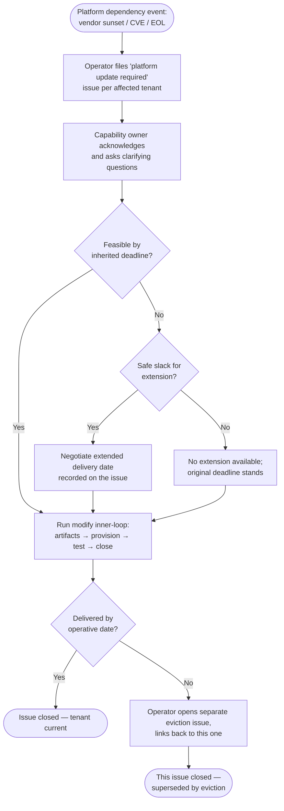

> **One-line definition:** The operator notices a hosted tenant's components have fallen behind what the platform supports, opens the conversation, and works with the capability owner to bring them current — without evicting.

**Parent capability:** [Self-Hosted Application Platform](../_index.md)

## Persona {#persona}

The actor here is the **operator** — the *Owner / Accountable party* from the parent capability's Stakeholders. The capability owner is a responder in this journey, not the initiator. As with `host-a-capability`, this UX is written as if the operator and the capability owner were separate people: the role boundary is treated as real, even though today both hats are worn by the same person.

- **Role:** Operator. Sole administrator of the platform; the only person who can see across tenants and notice that one of them has aged out of what the current platform offers.
- **Context they come from:** They have just learned that something in the platform itself must change — a cloud provider is sunsetting a service the platform depends on; a CVE has landed against a platform component; a runtime version the platform offers is being retired upstream. The change forces an update on every tenant still using the affected component.
- **What they care about here:** Getting affected tenants migrated *with* their capability owners, on a timeline driven by the real external pressure, without burning down the "we work with you, we don't evict for fall-behind" promise — and without letting the situation drag past the point where the platform itself becomes unsafe or unsupportable.

## Goal {#goal}

> "I want every tenant still on the falling-behind component to be moved onto what the platform now supports, on a timeline that fits the external pressure that forced this — and I want to do it by working *with* each capability owner rather than evicting them."

## Entry Point {#entry-point}

The operator arrives at this experience because of a **platform-level dependency event** that is not under their control:

- A cloud provider has announced a sunset date for a service the platform uses.
- A CVE has been disclosed against a platform component, so the platform itself must update — and any tenant pinned to the affected component must update with it.
- An upstream runtime, library, or base image the platform offers is reaching end-of-life.

The deadline is therefore *inherited* from the external event, not invented by the operator. The operator's state of mind is "I have to do this anyway; how many tenants am I dragging through it with me, and what do they each need to ship?"

What they have in hand: knowledge of which platform offering is changing, by when, and which currently-hosted tenants are using it.

There is no formal tenant-facing pending-update view ahead of this moment. If the platform ever adds an earlier deprecation or pending-update signal for capability owners, that signal would live in [Tenant-Facing Observability](./tenant-facing-observability.md) rather than in this operator-side journey. The operator-filed issue remains the first official signal that this journey has begun.

## Journey {#journey}

### 1. File a "platform update required" issue per affected tenant

For each affected tenant, the operator opens an issue against the infra repo using the **platform update required** issue type. This is a *distinct* issue type from `onboard my capability` and `modify my capability` — the distinct type is the signal to the capability owner that this is not optional cleanup, it is a required update with a real deadline behind it.

If the same tenant is hit by two unrelated forcing events at roughly the same time, the operator opens **separate** `platform update required` issues — one per event — and cross-links them if the remediation overlaps. The forcing event, reason, and deadline stay distinct even when the same code change may help satisfy more than one thread.

The issue tags the capability owner and contains:

- What is falling behind (the specific platform offering / component / version).
- What it is being replaced by, or what the new platform-supported version is.
- The shape of the update being asked for — repackage against a new runtime, swap a dependency, rebuild against a new base, etc.
- The deadline, with the external reason for it (sunset date, CVE remediation window, EOL date).

What the operator perceives at this point: the issue is filed and the capability owner has been notified. They wait for acknowledgment.

### 2. Capability owner acknowledges and plans

The capability owner reads the issue, asks any clarifying questions in-thread, and indicates whether the requested shape of update is feasible within the deadline. The operator answers questions as they come.

If the capability owner needs more time than the inherited deadline allows, the conversation moves into step 4 (slack negotiation) before any artifacts are handed off. Otherwise it proceeds to step 3.

### 3. Run the modify inner-loop

From here the mechanics are identical to the `modify my capability` journey:

- The capability owner hands off updated packaged artifacts on the issue.
- The operator re-provisions against the platform's new offering.
- The operator asks the capability owner to test.
- They iterate in comments until it works.
- The operator closes the issue.

The inner loop is the same surface; only the *initiator* and the *issue type* differ. End-user impact during the test/redeploy step is the same as a routine `modify` — typically a brief outage during cutover, nothing more.

### 4. Negotiate slack against the inherited deadline

If the capability owner cannot ship within the inherited deadline, the operator and capability owner first determine whether the external pressure leaves any safe slack at all. If it does, they negotiate an **extended delivery date** in the issue thread. The extension is not unbounded — the operator sets it based on how much slack the external pressure actually allows (a CVE with a known exploit allows much less slack than a vendor sunset announced 18 months out).

If the inherited deadline leaves **no** safe slack, the operator declines the extension and the original inherited deadline remains the operative date. The capability owner still gets the chance to ship against that date; they just do not get more time.

Whether extended or not, the date the operator and capability owner are now working against is recorded clearly on the issue. The journey then resumes at step 3.

### 5. Tip into eviction (after the last workable date is missed)

If the capability owner misses the operative delivery date — either the original inherited deadline when no extension was possible, or an agreed extended delivery date when one was — the operator opens a **separate eviction issue** (per the parent capability's eviction journey — to be defined as its own UX) that **links back to this issue** for context. The eviction issue carries its own eviction date.

This update issue is then closed as superseded by the eviction. The journey ends here from the operator's side; the capability owner's experience continues in the *Capability owner moves off the platform after eviction* UX.

The decision to evict is governed by the parent capability's **Eviction threshold** rule: continuing to accommodate this tenant would either push routine maintenance sustainably above 2× the operator-maintenance-budget KPI, or break the reproducibility KPI by leaving the platform stuck on a snowflake configuration to keep one tenant alive. A missed operative delivery date is the operational signal that the threshold has been crossed; it is not eviction-by-policy for being late.

### Flow Diagram

## Success {#success}

When the issue closes cleanly, the operator walks away with:

- Every affected tenant is now running on what the platform currently supports — no stragglers pinned to the retired offering.
- The "we work with you, we don't evict for fall-behind" promise was honored: each capability owner was given the chance to ship the update, with extension where the inherited deadline didn't fit **and safe slack existed**.
- The platform is free to actually retire the old offering, since there are no tenants left on it. The external pressure that started the whole journey can now be fully addressed.
- A trail on each issue showing what was asked for, when, and what was shipped — useful the next time a similar dependency event happens.

## Edge Cases & Failure Modes {#edge-cases}

- **Multiple tenants affected by the same platform event.** Each gets its own issue, so each capability owner sees a request scoped to their capability. The operator coordinates timelines across all of them but does not bundle them into a single thread.
- **Capability owner goes silent.** Same shape as silence in `host-a-capability` — there is no formal SLA in either direction. *Experience-level handling:* the operator can grant an extension only if safe slack exists, but if silence persists past the operative delivery date, step 5 applies.
- **Update cannot be shipped at all (capability fundamentally incompatible with the new offering).** This is functionally the same as a missed operative delivery date: the operator opens an eviction issue. The right *root* response, per the parent capability's "the capability evolves with its tenants" rule, is to consider whether the platform should keep supporting the old form — but if the external pressure (CVE, hard vendor sunset) makes that impossible, eviction is the honest outcome.
- **CVE with active exploit shortens the timeline aggressively.** The operator may file the issue with very little slack, and the extension in step 4 may be much smaller than for a routine sunset — or unavailable entirely. The journey shape is unchanged; the deadlines just compress.
- **Update reveals a new requirement that the platform doesn't yet offer.** Hand off into the `host-a-capability` change-later loop's "new offering needed" branch — the platform-update issue stays open while the new offering is added, then resumes at step 3.
- **Multiple overlapping platform updates against the same tenant.** The operator opens one issue per forcing event, even for the same tenant, so each deadline and external reason stays legible. If the remediation overlaps, the issues cross-link and the operator coordinates them together.

## Constraints Inherited from the Capability {#constraints-inherited}

This UX must respect the following items from the parent capability — by name, so the lineage is traceable:

- **Eviction is allowed when needs and capabilities diverge — but fall-behind cases work *with* the tenant.** This UX is the operationalization of that carve-out. The default outcome is "we update together," not "we evict." Eviction enters this journey only via the missed-final-date branch and only as a *separate, linked* issue.
- **Eviction threshold.** A missed operative delivery date is the operational signal that continuing to accommodate this tenant would cross the 2×-maintenance-budget or reproducibility threshold. The numeric threshold lives with the KPI; this UX inherits whatever it currently is.
- **The capability evolves with its tenants.** Before transitioning to eviction in step 5, the operator considers whether the *platform* should keep supporting the older form — sometimes the right answer is to absorb the maintenance, not push the tenant forward. That choice is constrained by what the external pressure actually allows (a CVE generally rules it out; a vendor sunset announced years ahead may not).
- **Operator-only operation.** The operator is the only person who can see that a tenant has fallen behind, because cross-tenant visibility lives only with the operator. There is no automated tenant-side warning system surfacing this from the platform to the capability owner today.
- **KPI: 2-hr/week operator maintenance budget.** A tenant that routinely needs hand-holding through these updates — repeatedly missing deadlines, repeatedly needing extensions — is consuming disproportionate operator time and crosses into the eviction-threshold rule on its own merits, even before any single missed operative delivery date.
- **KPI: 1-hour reproducibility.** Implication for this UX: the re-provision step in the inner loop must run through the platform's existing definitions (now updated to the new offering), not through a per-tenant snowflake patch. If the only way to keep a tenant alive is bespoke manual config, that is itself eviction-threshold material.

## Out of Scope {#out-of-scope}

- **The eviction journey itself.** When step 5 fires, the operator opens a separate eviction issue and the capability owner's experience continues in *Capability owner moves off the platform after eviction* — a sibling UX, not part of this one.
- **Platform-contract changes that aren't forced by an external dependency event.** When the *operator* decides to change the platform's contract (retire a packaging form, alter availability characteristics) absent external pressure, that's the *platform-contract-change rollout* UX, not this one. The seam: this UX is reactive (something outside the operator's control forced the update); the contract-change UX is proactive (the operator chose to change something).
- **The capability owner's side as a primary journey.** This UX is written from the operator's seat. The capability owner's experience of receiving and responding to one of these issues is captured here as a responder, not as a separate document — it shares enough surface with `modify my capability` (artifacts, test, iterate, close) that a separate doc would mostly duplicate.
- **Detection of fall-behind itself.** *How* the operator notices a tenant is on a falling-behind component (vendor announcement watching, CVE feeds, manual review) is operational detail, not part of the user experience. This UX starts at the moment the operator has decided to act.
- **Tenant-facing visibility into pending platform updates before the issue is filed.** Capability owners do not get an official warning surface ahead of the issue in this UX. If the platform later adds an earlier deprecation or pending-update signal, that signal belongs in [Tenant-Facing Observability](./tenant-facing-observability.md), not here, and does not replace issue filing as the start of this journey.
- **Routine modify requests.** A capability owner shipping a version bump on their own initiative is the change-later loop in `host-a-capability`, not this UX.

## Open Questions

_None at this time._
