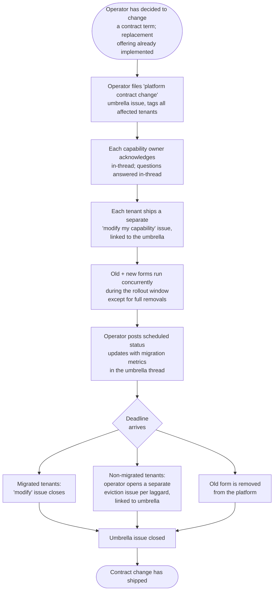

> **One-line definition:** The operator proactively changes a term of the platform's contract — retiring an offering, changing a packaging form, altering availability characteristics — communicates that change to every affected tenant ahead of time, and migrates them all onto the new contract before the old one is retired.

**Parent capability:** [Self-Hosted Application Platform](../_index.md)

## Persona

The actor here is the **operator** — the *Owner / Accountable party* from the parent capability's Stakeholders. The capability owners are responders in this journey, not initiators. As with `host-a-capability` and `operator-initiated-tenant-update`, this UX is written as if the operator and the capability owners were separate people: the role boundary is treated as real even though today both hats are worn by the same person.

- **Role:** Operator. Sole administrator of the platform; the only person who can change the platform's contract and the only person who can see across tenants to know which ones are affected.
- **Context they come from:** They have decided to change a term of the platform's contract — retire an offering, change a packaging form, alter availability characteristics, alter platform-imposed constraints. The decision has already been made and is *not* forced by external pressure. They have flushed out the technical details of the change and (where applicable) prepared a migration guideline for tenants. Where the change replaces an offering with a new one, the replacement offering has already been implemented and is running on the platform alongside the old one.
- **What they care about here:** Getting every affected tenant migrated onto the new contract by a hard deadline, without surprising anyone, while honoring the *evergreen contract* promise — change is communicated ahead of time and tenants are migrated, not sprung on.

## Goal

> "I want to change a term of the platform's contract — retire an offering, change a packaging form, alter availability characteristics — communicate that change to every affected tenant ahead of time, and have them all migrated onto the new contract before the old one is retired, without surprising anyone."

## Entry Point

The operator arrives at this experience having *chosen* to change the contract. The deciding (the *why* — cost, simplification, security posture, no longer wanting to maintain two runtimes, etc.) is upstream of this UX and not part of it. What they have in hand at step 0:

- The full technical details of the change — what term is changing, what it is becoming, or that it is being removed entirely.
- A migration guideline for tenants, where applicable (i.e. when a replacement offering exists and tenants need to repackage or reconfigure against it).
- The replacement offering, if one exists, already implemented and running on the platform. Building the replacement is a *precondition* of this journey, not a step inside it.
- Knowledge of which currently-hosted tenants are using the affected term.

The operator's state of mind is "I have decided this is changing; how do I get everyone moved over by a date I'm choosing, without anyone being surprised?"

The seam with `operator-initiated-tenant-update` (UX #2) is sharp: that journey is *reactive* (an external event — vendor sunset, CVE, EOL — forced the update and dictated the deadline). This journey is *proactive* (the operator chose the change and is choosing the deadline).

## Journey

### 1. File a "platform contract change" umbrella issue

The operator opens a single **umbrella issue** against the infra repo using the **platform contract change** issue type. This is a distinct issue type, separate from `onboard my capability`, `modify my capability`, and `platform update required`. The distinct type is the signal to capability owners that this is the operator changing the rules — not an externally-forced update and not optional cleanup.

A single umbrella issue is used (rather than one issue per tenant, as in UX #2) because the change applies identically to everyone, the migration guideline is shared, and tenants benefit from cross-tenant visibility — a clarifying question one tenant asks may be the answer another tenant needed.

The umbrella issue tags every affected capability owner and contains:

- What term is changing, and what it is changing to (or that it is being removed entirely).
- The migration guideline, if applicable.
- The hard deadline by which all migrations must complete and after which the old form will be removed.
- The reason for the change. Even though the operator chose it, capability owners deserve to know *why* (cost, simplification, security posture, etc.) so they can plan and so the trail makes sense to readers later.
- The status-update cadence the operator has chosen for this rollout (see step 3).

What the operator perceives at this point: the umbrella issue is filed and every affected capability owner has been notified. They wait for acknowledgments.

### 2. Capability owners acknowledge in-thread

Each tagged capability owner is **required** to acknowledge the change in-thread. Silence is not acceptable in an umbrella issue — silence in a multi-tenant thread is ambiguous (did they see it? are they planning?), so explicit acknowledgment is the contract.

Clarifying questions are asked in the umbrella thread, not in side channels, so that answers are visible to every other affected tenant at the same time. The operator answers questions as they come.

The deadline is **not** negotiable per-tenant. Capability owners do not get to ask for a slip — the deadline applies uniformly to everyone or it isn't a deadline. (Whether the operator may *globally* push the deadline if the migration guideline turns out to be insufficient is covered in Edge Cases.)

### 3. Tenants migrate via separate `modify my capability` issues

Each affected tenant ships its migration as a **separate** `modify my capability` issue, linking back to the umbrella issue for context. The umbrella thread tracks acknowledgments, cross-tenant questions, and the global deadline; each `modify` issue tracks the actual artifact handoff / provision / test / close inner loop for one tenant. This keeps the umbrella thread readable as a coordination surface rather than a sprawling multi-tenant inner loop.

During the rollout window, the platform serves **both the old and the new form of the contract concurrently** — the replacement offering runs alongside the old one so tenants have time to migrate at their own pace within the deadline. The exception is a **full offering removal**: when there is no replacement, there is nothing to run alongside, and the change is effectively all-or-nothing at the deadline.

The operator posts **status updates on a regular schedule** in the umbrella thread. The cadence is chosen by the operator at the time the umbrella issue is filed and is sized to the overall timeline — daily for a roughly-week-long rollout, weekly for a roughly-month-long rollout, and so on. Each status update carries metrics: how many tenants are still on the old form, how many have migrated, which `modify` issues are open, and how much time remains until the deadline. Status updates are how every party — operator and capability owners alike — sees rollout progress without having to chase it.

### 4. Deadline arrives

On the hard deadline:

- For each tenant whose migration completed: the `modify` issue is closed in the normal way and that tenant is now on the new form.
- The **old form is removed** from the platform regardless of whether anyone is still on it. Any tenant that has not migrated by the deadline is now broken on a removed offering — which is exactly why the operator must ensure laggards are moved into eviction *before* this point if it is clear they will not make it.
- For each tenant that did **not** migrate by the deadline: the operator opens a **separate eviction issue** per laggard tenant, linking back to the umbrella issue for context. The eviction issue carries its own eviction date and is governed by the parent capability's eviction journey (to be defined as its own UX).
- The umbrella issue is closed. Its job ends here — every affected tenant has either completed migration (their `modify` issue closed) or has an eviction issue in-flight (linked from the umbrella). Subsequent activity for laggards lives on their respective eviction issues, not on the umbrella.

### Flow Diagram

## Success

When the umbrella issue closes, the operator walks away with:

- The contract change has shipped — the old form is gone from the platform, the new form is the only form.
- Every affected tenant has either migrated onto the new contract or has an eviction issue in-flight; no tenant is silently broken on a removed offering.
- The *evergreen contract* promise was honored: the change was announced ahead of time with a migration guideline and a hard deadline, no tenant was surprised at retirement, and tenants were given a coordinated window in which both old and new ran concurrently (except for full removals, where concurrency is impossible).
- A trail across the umbrella issue, the per-tenant `modify` issues, and any linked eviction issues — showing what changed, why, who migrated when, and who didn't. Useful the next time a contract change ships.

## Edge Cases & Failure Modes

- **Capability owner does not acknowledge in the umbrella.** *Experience-level handling:* the operator chases — in-thread mention, direct ping, separate message as the deadline approaches. If no acknowledgment arrives by the deadline, the missing acknowledgment is treated as non-engagement and the laggard branch (eviction issue per tenant) applies. Acknowledgment is required, but the consequence of withholding it is the same as failing to migrate.
- **Migration guideline turns out to be wrong or insufficient mid-rollout.** Two sub-cases:
  - *Isolated miss* (the guideline doesn't cover one tenant's specific case): the guideline is amended in the umbrella thread, the affected tenant continues, and the deadline does not move. Other tenants are unaffected.
  - *Big miss* (the guideline is fundamentally insufficient and many or most tenants are blocked on it): the deadline is pushed out and the new deadline is announced in the umbrella thread. The hard-deadline rule still applies to the *new* date — extension is a global event, not a per-tenant slip.
- **Tenant says outright "we can't migrate — the new contract makes our capability unviable."** Straight to eviction. The capability owner now has to find a new platform or revamp their capability so that it works with the new contract. The umbrella issue still tracks this tenant via the linked eviction issue at deadline time, but the migration itself is not going to happen.
- **Full offering removal (no replacement to run alongside).** Step 3's "old + new run concurrently" does not apply. The change is all-or-nothing at the deadline. Tenants must be off the offering by the deadline; there is no grace window during which both forms exist. Migration in this case usually means moving to a different offering entirely or moving the workload off-platform — whichever the migration guideline directs.
- **Many tenants miss the deadline at once.** This is a signal that the operator picked a deadline that was too aggressive given the size of the change. The hard-deadline rule still applies — the operator opens an eviction issue per laggard — but the operator should treat the cluster of evictions as a learning event for the next contract-change rollout. (See Open Questions on choosing deadlines.)
- **Cross-tenant question reveals a conflict in the migration guideline.** Same shape as the isolated-miss branch above: amend in-thread, continue. The umbrella thread is the source of truth for the guideline as it evolves during the rollout.

## Constraints Inherited from the Capability

This UX must respect the following items from the parent capability — by name, so the lineage is traceable:

- **Evergreen contract.** This UX is the operationalization of the evergreen-contract promise made in `host-a-capability`. Contract changes are communicated ahead of time, tenants are migrated, and no tenant is sprung on. The hard deadline plus the rollout-window concurrency (where applicable) is what "communicated ahead of time and migrated" actually looks like in practice.
- **Operator-only operation.** Only the operator can change the contract, and only the operator can see across tenants to know which ones are affected. The umbrella-issue mechanic is consistent with this — it is the operator's tool, not a capability-owner-driven coordination surface.
- **Tenants must accept the platform's contract.** After this rollout completes, the *new* contract is the contract every remaining tenant has accepted. Acceptance is implicit in their having migrated; tenants that cannot accept the new contract end up evicted, which is consistent with the parent rule.
- **Eviction is allowed when needs and capabilities diverge.** Laggards who miss the deadline are evicted via the parent capability's eviction journey. This UX feeds eviction; it does not perform it.
- **Eviction threshold.** A missed deadline is the operational signal that continuing to accommodate this tenant would either push routine maintenance sustainably above the 2×-budget threshold or break reproducibility (e.g. by forcing the platform to keep the old form running indefinitely just for one tenant). The numeric threshold lives with the KPI; this UX inherits whatever it currently is.
- **The capability evolves with its tenants.** There is real tension between this rule and the present UX: this rule says the *default* response when a tenant needs something is to update the platform rather than push the requirement back. Yet this UX is the operator pushing change *toward* tenants. The reconciliation: this UX applies when the operator has *already decided* to change the contract — typically because the cost of continuing to support the old form (maintenance, security posture, complexity) has tipped against keeping it. The migration-guideline + concurrent-rollout shape is how the platform absorbs as much of the cost as it can. But once the deadline is set, it is set.
- **No specific availability or performance SLA.** Contract changes that affect availability characteristics are in scope of this UX (the operator may alter availability characteristics under the rules of this rollout). Tenants needing stronger guarantees than the new contract offers are subject to the same eviction path as any other "fundamentally incompatible" case.
- **KPI: 2-hr/week operator maintenance budget.** Implication for this UX: the rollout cadence — including status updates and per-tenant `modify` reviews — must fit within the operator's weekly budget across the rollout window. A contract change that would clearly blow the budget is a signal to reduce the scope of the change, lengthen the deadline, or stage the rollout, *before* the umbrella issue is filed.
- **KPI: 1-hour reproducibility.** Implication for this UX: the new contract must itself be reproducible from definitions. A contract change that ships with the *platform* itself stuck on a snowflake configuration to keep both forms running has failed the rule. Concurrent old/new during rollout is fine; permanent dual-form support is not the goal.

## Out of Scope

- **Externally-forced updates.** Vendor sunset, CVE remediation, runtime EOL — those are *reactive* updates with deadlines inherited from outside, and they belong in `operator-initiated-tenant-update` (UX #2). The seam: that UX is reactive; this UX is proactive.
- **Routine modify requests.** A capability owner shipping a version bump or new component on their own initiative is the change-later loop in `host-a-capability`, not this UX.
- **The eviction journey itself.** When a laggard misses the deadline, the operator opens a separate eviction issue per tenant. The capability owner's experience continues in *Capability owner moves off the platform after eviction* — a sibling UX, not part of this one.
- **The decision to change the contract.** *Why* the operator chose to retire an offering, change a packaging form, or alter availability characteristics is upstream of this UX. The journey starts the moment the operator has decided.
- **Building the replacement offering.** Where the contract change replaces an old offering with a new one, the replacement must already be implemented and running on the platform before the umbrella issue is filed. Building it is a precondition, not a step in this UX. (Following on from `host-a-capability`'s "new offering needed" branch — which was the path by which the new offering may originally have entered the platform.)
- **The capability owner's responder side as a separate doc.** As with UX #2, the capability owner's experience of receiving and responding to the umbrella issue is captured here as a responder. The actual migration work runs through the existing `modify my capability` surface, which is already documented in `host-a-capability`. A separate doc would mostly duplicate.

## Open Questions

- **How does the operator pick a "good" deadline absent external pressure?** UX #2 inherits its deadline from outside. This UX requires the operator to choose one. Too short and many tenants miss it (signaling, in retrospect, that the operator under-budgeted the rollout); too long and the change drags. There is no formula yet — the cluster-of-evictions branch in Edge Cases hints at the feedback loop, but the heuristic for picking a first deadline is undefined. Likely converges with experience.
- **Threshold for "isolated miss" vs "big miss" in the migration guideline.** Whether a guideline gap blocks one tenant or many is the deciding factor between continuing on the original deadline and pushing the deadline globally — but the threshold is operator judgment today. May want to be made explicit if rollouts ever happen at scale (which, given the personal-scale context, is unlikely).
- **Status-update format and storage.** Status updates carry metrics (how many tenants on old vs new, which `modify` issues open, time remaining). Whether those metrics live as comments on the umbrella issue, as a checked-list in the issue body that the operator updates in place, or somewhere else — not yet decided. Will likely shake out the first time a real contract-change rollout happens.
- **Coordinating multiple in-flight contract changes.** If two contract changes are in flight at once and a single tenant is affected by both (one umbrella issue per change, but the same `modify` from the tenant might satisfy both), how is that coordinated? Probably "two umbrella issues, two acknowledgments, one combined `modify` if practical" — but undefined until it actually happens.
