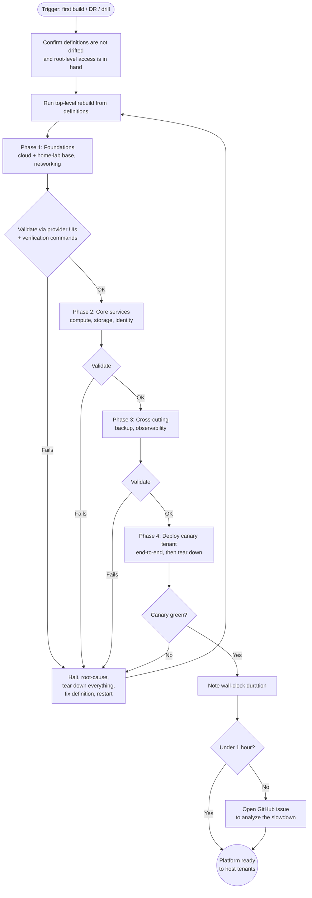

> **One-line definition:** The operator rebuilds the platform from its definitions — back to ready-to-host-tenants — confidently and verifiably, whether it's the first build ever, recovery after total loss, or a periodic drill.

**Parent capability:** [Self-Hosted Application Platform](../_index.md)

## Persona

The actor here is **the operator** — the parent capability's *Owner / Accountable party* and sole administrator. There are no co-operators in this journey, and the sealed successor credentials are not in play during routine standup.

If a successor has taken over (because the primary operator is unavailable), they run this same journey. The act of breaking the seal and asserting takeover is a separate experience; once they have access to the operator's context, the rebuild flow is identical. From this UX's perspective there is one persona — *whoever is currently the operator*.

- **Role:** The operator. Sole party with administrative access to the platform and accountable for it existing and running.
- **Context they come from:** Either there is no platform yet (first-ever build) or the platform is gone / being rebuilt in parallel. Either way, what they have in hand is the **definitions repo**, root-level access to the underlying infrastructure (cloud account, home-lab), and — for disaster recovery — backups of tenant data sitting somewhere reachable.
- **What they care about here:** Confidence that the platform really is reproducible from its definitions. Speed matters too (the *Reproducibility* KPI is 1 hour) but takes second place — a fast rebuild that leaves the operator unsure whether anything was missed is worse than a slower one that finishes verifiably clean.

## Goal

> "I want to rebuild the platform from nothing back to ready-to-host-tenants — confidently and verifiably, fast enough that the 1-hour KPI holds — so that total loss is recoverable, not catastrophic."

Confidence beats speed when the two conflict. The operator is rebuilding the substrate that everything else of theirs depends on; a hurried rebuild that they don't trust is its own kind of failure.

## Entry Point

Three triggers converge on this same flow:

- **First-ever build.** No platform has existed before; the operator is bringing it into being.
- **Disaster recovery.** The platform existed and is now gone (cloud project lost, home-lab destroyed, ransomware, etc.); the operator is rebuilding on top of root-level access that survived the disaster.
- **Drift / reproducibility drill.** The operator periodically rebuilds the platform *in parallel* on scratch infrastructure to prove the KPI still holds, while the live platform keeps serving. The drill is identical to the real flow — only the underlying infrastructure differs.

What the operator has in hand at minute zero:
- The **definitions repo**, pulled fresh.
- **Root-level access** to the underlying infrastructure (cloud-provider account, home-lab access). Loss of these is *not* in scope for this UX — they are foundational and must already be in place before the platform can be (re)built.
- For disaster recovery only: tenant-data **backups**. Restoring those into newly-provisioned tenants is a separate UX; this UX ends before that begins.

The operator's state of mind is steady, not panicked: this journey exists precisely so total loss isn't catastrophic, and a drill rehearses it on purpose.

What is **not** assumed at entry:
- Definitions drift. The operator is trusting the definitions repo to reflect reality. If drift exists, it must be detected and fixed *before* this journey begins, not discovered partway through. (See *Constraints*.)
- The sealed successor credentials. They stay sealed during routine standup, including DR.

## Journey

The rebuild is **automated, with manual operator-validation checkpoints between phases**. The operator is on standby throughout — watching log output and system-level signals, ready to validate at each checkpoint, but not driving each step by hand.

### 1. Decide to rebuild and confirm preconditions

The operator decides to rebuild — first build, DR, or scheduled drill — and confirms what they have in hand: a fresh pull of the definitions repo and root-level access to the target infrastructure (the live infra for first-build/DR, scratch infra for a drill). They confirm the definitions are not drifted from what was running. If drift is suspected, they stop and resolve it before starting the rebuild.

What they perceive: nothing yet on the target infrastructure; a clean definitions repo on their workstation; the underlying provider UIs (cloud console, IPMI) showing the empty starting state.

### 2. Kick off the top-level rebuild

The operator runs the single top-level entry point that drives the rebuild from the definitions repo. From here on, automation does the work of provisioning; the operator's job is to validate at each checkpoint.

What they perceive: log output begins streaming. The first phase is underway.

### 3. Phase 1 — Foundations

Automation provisions the underlying foundations: cloud project / home-lab base, network plumbing including the connectivity between cloud and home-lab. On completion the automation **pauses** and prints a phase summary.

The operator validates by checking the underlying provider's UIs (cloud console, home-lab IPMI) and running any verification commands the runbook calls for. When satisfied, they signal `continue`.

If validation fails, see *Edge Cases — Phase fails*.

### 4. Phase 2 — Core platform services

Automation provisions compute, persistent storage, and the platform-provided identity service on top of the foundations. Pauses. Operator validates the same way — provider UIs plus verification commands (e.g. identity service is reachable and issuing tokens). Signals `continue`.

### 5. Phase 3 — Cross-cutting services

Automation provisions backup and observability so they cover the platform itself before any tenant arrives. Pauses. Operator validates that backup is wired in and observability is collecting. Signals `continue`.

### 6. Phase 4 — Readiness verification and canary tenant

The platform deploys a **known-good canary tenant** end-to-end — a tiny tenant whose only purpose is to prove the platform can host tenants — exercises it (it should run, be reachable, store and read back data, authenticate against the platform-provided identity service, be picked up by backup and observability), then tears it down.

What the operator perceives: a clear pass/fail on the canary. The canary's success is the readiness signal — "ready to host tenants" is operationally identical to "did host a tenant just now."

If the canary fails, see *Edge Cases — Canary fails*.

### 7. Note the wall-clock and close out

The operator records how long the rebuild took. If it came in under the 1-hour KPI, they're done — the platform is ready for tenant restoration (a separate UX). If it took longer, the platform is still ready; the operator opens a GitHub issue capturing the cause of the slowdown so it can be analyzed and improved later. Either way, the journey ends here.

### Flow Diagram

## Success

When the canary comes up green and is cleanly torn down, the operator walks away with:

- A platform that is **ready to host tenants** — every platform-provided service has been exercised end-to-end by a real tenant deployment, not just by self-checks.
- **Confidence in reproducibility.** The rebuild ran from the definitions repo, with no manual snowflake configuration, and produced a working platform. The KPI is honestly met (or, if not, the gap is captured for follow-up rather than papered over).
- A **clean handoff** to tenant restoration. Any previously-hosted tenants come back via their own restoration journey; the platform-side standup ends cleanly without entangling itself in tenant data.
- For drills specifically: a renewed assurance that "we can rebuild this in an hour" is a real property, not a hope.

## Edge Cases & Failure Modes

- **Phase fails mid-rebuild.** The automation hits an error during one of the phases. The operator halts, root-causes the failure, fixes the underlying issue (typically a definition that needs updating), **tears down everything that was provisioned so far**, and restarts the rebuild from the top. Partial state is itself a snowflake risk and is not trusted. This implies each phase must be reversible — at minimum, "delete everything" must be a viable rollback. (See *Constraints*.)

- **Definitions are drifted.** Out of scope at the moment of rebuild. Drift is supposed to be prevented by the platform's enforcement of tracked changes and immutability, and detected/fixed *before* this journey starts. If drift somehow surfaces during the rebuild (e.g. canary fails because something was running that the definitions don't describe), the operator treats it as a definitions bug — fix the definition, tear down, restart.

- **1-hour KPI is missed.** The platform is still up and ready for tenants. The operator records the wall-clock and opens a GitHub issue to analyze why it took longer than it should have. The KPI is missed *for that rebuild*, but the platform doesn't get blocked from going back into service; KPI improvement is a follow-up concern, not part of this journey.

- **Canary tenant fails to come up.** The platform is **not** ready, regardless of how green every prior phase looked. The operator root-causes the canary failure, fixes the relevant definition, tears down, and restarts. Until the canary is green, the platform is not marked ready for tenants — even if the operator is under time pressure, this rule does not bend.

- **Successor at the keyboard.** A successor who has taken over runs this same journey from the operator's context. The act of breaking the sealed credentials and asserting takeover is a separate UX (not yet defined); once the successor is *in*, the rebuild flow does not differ.

- **First build has no backups.** First-build and DR/drill produce the same platform-side outcome from this UX's perspective. Tenant data restore is out of scope here, so the absence of backups during a first build is simply a non-event for this journey.

## Constraints Inherited from the Capability

This UX must respect the following items from the parent capability — by name, so future readers can trace the lineage:

- **KPI: 1-hour reproducibility.** This is the journey the KPI is measured against. The 1-hour budget is a *target*, not a hard fail — missing it does not stop the platform from going into service, but it does generate a tracked follow-up issue. The KPI cannot be honestly evaluated unless drills run this same flow on parallel infrastructure routinely.

- **Operator-only operation.** No co-operators, no delegated administration, no shared driving of the rebuild. The sealed successor credentials are not used during routine standup, including DR. A successor uses them only after takeover, and from that point operates as "the operator" through this same UX.

- **The platform may span public and private infrastructure.** Phase 1 (foundations) explicitly crosses cloud and home-lab boundaries — the rebuild is not a single-environment affair. Connectivity between the two is part of the foundation, not an afterthought.

- **Reproducibility beats vendor independence beats minimizing operator effort** (the parent capability's stated tiebreaker). Manifests here as the rule that partial state is not trusted: tearing down and restarting from scratch on any phase failure is more operator effort than incremental fix-and-resume, but it is what reproducibility honesty requires.

- **Operator succession.** Successor takeover converges on this same UX — sealed credentials grant access to the operator's context, after which the rebuild flow is identical. The seal-breaking event itself is a separate journey.

- **No specific availability or performance SLA.** The journey ends at "ready to host tenants" — what tenants experience after that is governed by the platform's normal availability characteristics, not by this UX.

- **Tracked changes and immutability across all platform UXs.** Implied by edge-case (b): drift erodes confidence in reproducibility, so every UX that can introduce platform state must enforce tracked changes and immutability rather than allowing ad-hoc modification. This is a property the platform's definitions and operations must hold, not a step in this journey — but this UX is the one that *exposes* drift if it ever creeps in.

- **Each phase must be reversible.** Implied by the "phase fails → tear down everything and restart" edge-case rule. The platform's definitions must support a clean teardown of any partially-provisioned state. "Delete everything and start over" must be a viable, reliable option at every checkpoint.

## Out of Scope

- **Tenant data restoration.** Bringing previously-hosted tenants' data back into newly-provisioned tenants is a separate UX. This journey ends at "platform is ready to host tenants" — full stop.

- **Re-onboarding tenants after rebuild.** Each tenant's return is governed by its own journey (likely a variant of [Host a Capability](./host-a-capability.md), possibly seeded by a backup-restore step). Not handled here.

- **Migration to new underlying infrastructure.** Moving the platform to a different cloud account or different home-lab hardware while the old one is still running is a different journey (the old platform serves traffic while the new one comes up). Out of scope until migration becomes a realistic case worth defining.

- **Sealed-credential takeover by the successor.** The act of breaking the seal, asserting authority, and gaining access to the operator's context belongs in its own UX. This UX picks up *after* takeover, where the successor is operating as the operator.

- **Drift detection and repair as a process.** Drift is treated here as a precondition that has either already been resolved or not. The mechanism that prevents and detects drift across the platform is a cross-cutting concern, not a step in this journey.

- **Loss of root-level foundations** (cloud account itself, all home-lab access). These are assumed in place before the platform was deployed in the first place. Recovery from their loss is not part of the platform's capability.

## Open Questions

- **What exactly is the canary tenant?** A purpose-built no-op tenant maintained alongside the platform definitions, or a small real tenant chosen for this role? The trade-off is between purity (no-op is purely a test) and realism (a real small tenant exercises more of the platform).

- **How is drift detected as a precondition?** This UX assumes drift is caught and fixed before the rebuild starts, but the *mechanism* by which the operator gains that confidence is undefined here. Likely belongs in a sibling UX or a cross-cutting platform concern, but worth flagging.

- **How often is the drill run?** The drill is described as periodic but not scheduled. Cadence affects how reliable the KPI claim actually is — quarterly? annually? after every significant platform change? Operator judgment for now; may want an explicit policy as the platform matures.

- **What does "verification commands" mean concretely at each checkpoint?** This UX names them but does not enumerate them. They become a real artifact maintained alongside the definitions. Their definition belongs to the platform's tech design, not this UX, but the existence of a maintained verification checklist is load-bearing for the journey to work.
