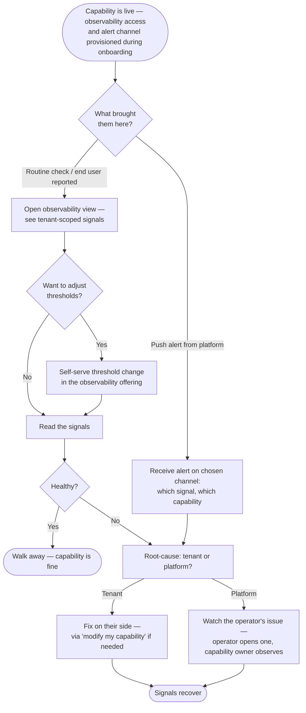

> **One-line definition:** A capability owner with a live tenant checks whether their hosted capability is healthy — either pulling the view themselves or being pushed an alert when something crosses a threshold they set.

**Parent capability:** [Self-Hosted Application Platform](../_index.md)

## Persona

The actor is a **capability owner** whose capability has already been onboarded via [Host a Capability](./host-a-capability.md) and is currently running on the platform. As with that UX, this is written **as if the capability owner were a separate person** from the operator, even though today they are the same human wearing different hats.

- **Role:** Capability owner of a live tenant. They are not operating the platform; they are operating *their capability*, which happens to be hosted here.
- **Context they come from:** Their capability is live and serving its end users. They are not in the middle of onboarding or modifying — that's a different journey. They want to know how their thing is doing right now, or they have just been pinged that something is wrong.
- **What they care about here:** Knowing the health of *their* capability without depending on end users to report problems first, and without having to interrupt the operator to ask.

## Goal

> "I want to know whether my hosted capability is healthy right now — and I want the platform to ping me if it isn't — so I find out before my end users do, and I can tell whether the problem is mine to fix or the platform's."

Two arrival modes share this goal: **proactive pull** (capability owner goes looking) and **reactive push** (an alert reaches them). The view they reach is the same in both cases.

## Entry Point

Two distinct entries, converging on the same view.

**Pull entry.** The capability owner opens the observability offering's tenant view. They might be doing this:
- Routinely (e.g. before promoting a new release of their capability to end users).
- Reactively, because an end user reported something looked off and they want to confirm.
- Out of curiosity / habit.

They reach it by authenticating to the observability offering and being scoped to their tenant. There is no separate URL per tenant — the same offering serves everyone, and access control narrows the data.

**Push entry.** The platform's alerting reaches them on the channel they chose during onboarding. They are pulled away from whatever they were doing and now have a concrete "your capability looks unhealthy" signal in hand.

In both cases their access was provisioned automatically as part of the original `onboard my capability` flow (step 5 of [Host a Capability](./host-a-capability.md#5-wait-while-the-operator-provisions)) — observability is part of being hosted, not an add-on they request later.

## Journey

### 1. Access is already in place (set up during onboarding)

By the time the capability owner has a live tenant, they already have:

- A working login to the observability offering, scoped to their tenant.
- A configured alert channel — chosen during onboarding from whatever the platform supports (email, chat, push notification, etc.).
- A set of signals being measured for their capability — the specifics were nailed down in the tech-design phase, drawing from the *category* of signals the platform's observability offering provides.

Nothing in this UX requires them to set any of that up. If they ever need to change the channel or the measured signals, that goes through `modify my capability` — not this journey.

### 2. (Pull mode) Capability owner opens the observability view

They authenticate to the observability offering and land on a view scoped to their tenant. They see the current state of every signal being measured for their capability — error rates, latencies, restarts, resource pressure, whatever the tech design specified.

What they perceive: a current-state read of their capability's health, plus enough recent history to tell whether something is trending bad. They cannot see other tenants — only the operator can.

### 3. (Pull mode) Capability owner tunes thresholds, if needed

While in the offering, the capability owner can self-serve their alert thresholds — the values that, when crossed, will fire a push alert to them. Thresholds are *their* call: the platform does not prescribe what's unhealthy enough to wake them up.

This is the one self-service surface the platform exposes to capability owners. Everything else still goes through GitHub issues; thresholds are an exception because they are a tuning knob the capability owner needs to iterate on without operator involvement.

### 4. (Push mode) An alert reaches the capability owner

A signal crossed a threshold they set. The platform pushes an alert on their chosen channel. The alert names *which* signal and *which* capability — enough for them to start without opening anything else.

What they perceive: their capability is unhealthy enough that they wanted to be told. They now have to figure out whose problem it is.

### 5. Root-cause — is this the tenant or the platform?

The capability owner investigates. They have two possible conclusions:

**5a. It's the tenant.** The signals point at their capability — their code, their data, their config. They handle it the way they would handle any problem with their capability: fix on their side, ship a new artifact via `modify my capability` if it requires a deployment, or operate within the running tenant if the tools to do so exist.

**5b. It's the platform.** The signals point at something below their capability — the host is gone, networking is broken, the storage offering is degraded. They look for an open operator-side issue tracking it. If the operator has already opened one, they **watch that issue**; the operator owns the fix, and the capability owner's role from here is to stay aware so they can communicate to their own end users. If no such issue exists yet, the operator will probably open one shortly (the operator gets the same signals); the capability owner does not need to file anything themselves.

### 6. Resolution

Either:
- They fix their side of it and signals return to healthy. The alert (if there was one) does not need to be acknowledged — the platform stops alerting because the threshold is no longer crossed.
- The operator fixes the platform side of it and signals return to healthy. The operator-side issue closes. The capability owner has been a passive watcher.

In either case the capability owner walks away with the same end state: their capability is healthy again, and they knew about the unhealth without an end user telling them.

### Flow Diagram

## Success

A successful experience looks like:

- The capability owner learned about a health problem **before** their end users had to tell them, *or* confirmed health proactively before promoting a change.
- They could tell, from the signals alone, whether the problem was theirs or the platform's — without having to interrupt the operator to ask.
- If it was theirs, they fixed it through the channels they already use (modify issue, in-tenant tools, redeploy).
- If it was the platform's, they had something concrete to watch (the operator's issue) and could relay status to their own end users.
- They did not have to set anything up to make this work — onboarding put it in place.

## Edge Cases & Failure Modes

- **Alert fatigue / ignored alerts.** A capability owner who stops responding to their own alerts is not the platform's problem — alerts are a courtesy; tenant health is tenant responsibility. The platform keeps emitting; what the capability owner does with them is their call.
- **Threshold set too tight, capability owner spammed.** Self-serve thresholds means the capability owner can fix this themselves. The platform does not intervene to "save them from themselves."
- **Threshold set too loose, real problems missed.** Same — their call, their consequence. The platform's defaults (whatever the observability offering ships with) provide a starting point.
- **Operator hasn't opened a platform-side issue yet when the capability owner is investigating.** The capability owner does not need to file one themselves. The operator gets the same signals and will open one. If they don't and the problem persists, that is an operator-side failure, not a capability-owner-side action.
- **Capability owner suspects the platform but signals look fine for the platform.** They surface this on a *modify my capability* issue or a comment to the operator — same surface they would use for anything ambiguous. This UX does not introduce a new issue type for "I think it's you, not me."
- **Alert channel itself is broken (email bounces, chat down).** Out of scope here — the alert simply doesn't arrive. The pull mode still works, and the capability owner will notice eventually. Channel reliability is a property of the chosen channel, not something the platform engineers around.
- **Capability owner wants to change channel or measured signals.** Goes through `modify my capability`, not this UX — it's a contract change about what the platform delivers to the tenant, even if a small one.

## Constraints Inherited from the Capability

This UX must respect the following items from the parent capability's Business Rules and Success Criteria:

- **Operator-only operation.** The capability owner is *not* an operator. Their access is scoped to their own tenant; the operator is the only role that sees across tenants. The one self-service surface (threshold tuning) does not violate this — it adjusts only their own alerts, not platform configuration.
- **Direct outputs include observability.** The parent capability lists observability as a direct output: *"the operator can tell whether each tenant is up and healthy without the tenant having to instrument that itself."* This UX extends that same plumbing to the capability owner with tenant-scoped data access — observability is offered *as an offering*, with cross-tenant visibility kept to the operator.
- **No direct end-user access to the platform.** The capability owner's end users do not get observability access. This view stops at the capability owner.
- **Tenants must accept the platform's contract.** The signals available are whatever the observability offering measures; capability owners pick from that menu in their tech design rather than asking the platform to instrument arbitrary metrics.
- **The capability evolves with its tenants.** If multiple tenants need a signal the offering does not yet measure, the right response is to expand the offering's category — not to push instrumentation back onto the tenant.
- **KPI: 2-hr/week operator maintenance budget.** Implication: the alerting path must not produce so many false positives that the operator is constantly fielding "is this me or you?" questions from capability owners. Self-serve thresholds and "operator gets the same signals" are both pressure-reliefs on this — capability owners can tune their noise themselves, and they do not need to escalate "is this the platform?" questions to the operator because they can read the signals directly.

## Out of Scope

- **Changing measured signals or alert channel.** Both go through [Host a Capability](./host-a-capability.md)'s *modify* loop, not here. They are contract changes about what the platform delivers.
- **End-user-facing observability.** End users of a tenant do not get a "is the thing I use up?" view from the platform. If a tenant wants a status page for their end users, that is a feature of the tenant capability, not the platform.
- **Operator-side observability.** The operator's view across all tenants is its own surface, used during operator-driven journeys (rebuild, contract rollout, eviction decisions). This UX is strictly the *capability owner's* slice.
- **Platform-side incident management.** When the capability owner concludes "this is the platform's problem and I'll watch the operator's issue," what the operator does inside that issue is operator workflow — not part of this UX.
- **Threshold-tuning best practices.** This UX provides the surface for self-serve threshold tuning; it does not document *what* thresholds a capability owner should pick. That belongs in the observability offering's own documentation.

## Open Questions

- **Concrete signal category.** This UX names "signals" generically — error rate, latency, restarts, resource pressure — but the *exact* category the observability offering will provide is a design-time decision for that offering, not for this UX. The category needs to be wide enough that tech designs across capabilities can pick from it without the offering having to be expanded for every new tenant.
- **Channel menu.** The set of supported alert channels is undefined. Email is the obvious floor; chat / push are plausible adds. Whichever ships first must be reliable enough that capability owners trust silence to mean health, not channel failure.
- **What "tenant-scoped access" looks like in practice.** This UX takes for granted that the observability offering can scope a capability owner's view to their own tenant. The mechanism (separate auth, ACLs in the offering, per-tenant dashboards) is an implementation detail to be settled when the offering is designed.
