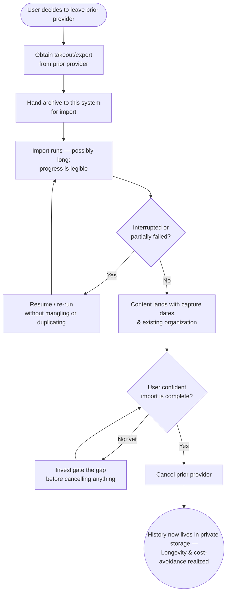

> **One-line definition:** A user moving off a commercial cloud provider brings their entire existing library — with its dates and organization intact — into their own storage in one go, so they can trust this as their new home and stop paying the old provider.

**Parent capability:** [Self-Hosted Personal Media Storage](../_index.md)

<!--
Every H2 below carries an explicit `{#anchor}` annotation. Downstream skills (extract-business-requirements, define-technical-requirements) cite these sections via Hugo `ref` shortcodes, and Hugo's autogenerated heading IDs are not stable across heading-text edits. Do not strip the anchors when editing this doc.
-->

## Persona {#persona}

The actor is a **recently-provisioned user** — one of the parent capability's *Primary actors* — who is mid-migration off a commercial cloud provider. They have already joined (see [Join as an Invited User](./join-as-an-invited-user.md)) and understand the deal; now they want to move their *history*, not just their new captures.

- **Role:** A user with a large, years-deep library sitting on a commercial provider (e.g. Google Photos, iCloud Photos, a Nextcloud instance they are leaving). They are not a data engineer; they think "my whole photo library," not "an export archive with sidecar metadata."
- **Context they come from:** They have decided — or are close to deciding — to stop paying the commercial provider. The one thing standing between them and cancelling is *their existing content*. This is explicitly a **one-time migration**, distinct from the routine ongoing capture in [Upload Content](./upload-content.md).
- **What they care about here:** Getting *everything* over — with the capture dates and albums it already has — and being **confident nothing was silently dropped** before they pull the trigger on cancelling the old subscription. The fear underneath the whole journey is "what if I cancel and then discover a year of photos never made it?"

## Goal {#goal}

> "I want my whole existing photo library — years of it, with the dates and albums it already has — brought over in one move, and I want to be confident nothing got dropped before I cancel my old provider."

## Entry Point {#entry-point}

The user has decided to leave their prior provider and comes to this system to move their history across. Concretely, they arrive having obtained (or being about to obtain) an **export/takeout archive** from the prior provider — produced by that provider's own export process, which this system does not control. Their state of mind is a mix of relief (finally leaving the vendor) and low-grade anxiety (this is their life's photos; a botched move is not acceptable).

They may arrive *before* enabling routine device backup, or after — the two are independent. This journey is specifically about the back-catalog, not the go-forward stream.

## Journey {#journey}

1. **Obtain the takeout from the prior provider.** The user runs the prior provider's export and ends up with an archive of their library. What that archive contains and how faithful its metadata is are entirely the prior provider's doing — the user (and this system) inherit whatever the vendor chose to include.
2. **Hand the archive to this system for import.** The user gives the archive to the system and asks it to bring the library in. From here the user's job is mostly to wait and, at the end, to verify. This is a **fully self-service** action: the user does not need the operator to run, stage, or babysit their import, and the operator is not a step in the routine path. That posture is deliberate — an operator-assisted import would turn every migration into bespoke operator labor, which the neighboring platform capability's *operator-maintenance-budget* KPI explicitly guards against (migrations must not become one-off projects). If a user genuinely *cannot* complete an import self-service, that is treated as a **product gap to close**, not as routine operator work. The system accepts takeout from an **explicitly named, deliberately small set of supported providers** — the ones the operator's closed circle actually leaves (e.g. Google Photos Takeout, an Apple/iCloud Photos export) — rather than promising to swallow any arbitrary archive. For each supported source it publishes an honest, per-source **fidelity contract**: what it can promise about capture dates and album/grouping survival *from that specific provider's export*, because providers differ wildly (one splits metadata into JSON sidecars, another flattens album structure). A source the system does not support is refused plainly up front — "this provider isn't supported" — rather than best-effort imported into a silently degraded library, because a generic guess would violate the honest-expectations principle this whole journey rests on. The supported-source list grows by operator decision as the circle's needs demand, matching the capability's closed, small user set.
3. **The import runs — potentially for a long time.** Years of media is a lot. The user perceives that it is working and gets a legible sense of how far along it is and roughly how much remains, so a long-running import reads as "progressing," not "hung."
4. **Content lands, dated and organized.** As the import completes, items appear in the user's library carrying their **capture dates** and — as far as the takeout preserves it — their **existing organization** (albums/groupings). The user's history slots into place as history, not as an undated dump. Items whose takeout carried **no reliable capture date** are not dropped, hidden, or stamped with an invented date; they land in an explicit, first-class **"undated" state** the user can later resolve — assigning the right date or album by hand — rather than sitting under a permanent, un-actionable flag. These items are fully stored, private, and durable from the moment they land; only their *metadata* is pending, so *Zero data loss* never waits on a date being figured out. The actual correction happens over in [View and Organize Content](./view-and-organize-content.md); this journey's job is to surface the undated set honestly and make it fixable, not to guess.
5. **Verify completeness.** Before doing anything irreversible, the user gains genuine confidence that the import is **complete** — that what was in the old library is now in the new one. This is the pivotal step: the whole journey's value hinges on the user being able to *trust* the import, not just be told it finished. Concretely, completeness is presented as a **reconciliation against the archive the user actually handed over**, layered so a non-technical user can trust the headline and still drill in when they want to: (a) a top-line **count reconciliation** — "of the N items in your archive, M imported" — as the at-a-glance trust anchor; (b) an explicit, itemized **exceptions list** of everything that could *not* be imported and why (unsupported item types, corrupt files, items with no usable metadata), so "couldn't import" is never silent; and (c) where the source preserved albums, a **per-album check** so the user can confirm the groupings they care about came across intact rather than trusting a single aggregate number. The reconciliation is deliberately scoped to *the archive the user handed over* — not "everything you ever had" — and it says so plainly, so the user cannot mistake "imported everything in this takeout" for "imported everything that ever existed" when the vendor's export was itself short (see Edge Cases).
6. **Cancel the prior provider.** Only after that verification does the user cancel the commercial subscription. This ordering is the point at which the capability's **Longevity** and **cost-avoidance** outcomes actually land — the user has stopped depending on the vendor *and* stopped paying them, without a gap.

### Flow Diagram

## Success {#success}

A successful bulk import leaves the user with:

- **Their whole history in their own private storage** — dated and organized closely enough to what they had that it feels like the same library, moved, not a pile of loose files.
- **Enough confidence to cancel the commercial provider.** The emotional core of success is the moment they cancel *without dread* — because they verified completeness rather than hoping.
- **The capability's outcomes made real.** This is the journey where *Longevity* (no longer depending on a vendor's roadmap or pricing) and *cost avoidance* (stop paying per-GB) stop being promises and become facts for this user.
- **A private result.** Everything imported is visible only to them; the operator cannot see it (see *Constraints Inherited* — **Private by default**).

## Edge Cases & Failure Modes {#edge-cases}

- **Import is interrupted or partially fails.** *Experience-level handling:* the import can be **resumed or safely re-run** without producing a mangled half-library or a doubled one. The user is never left unsure whether they now have some, all, or one-and-a-half copies of their history.
- **The takeout has missing or degraded metadata.** Some providers strip or flatten capture dates, or scatter album structure across sidecar files. Where the archive lacks a capture date, the system must set **honest expectations** — it surfaces that those items arrived without reliable dates rather than **inventing** plausible-but-wrong ones. The user would rather know "these 40 items have no date" than silently get 40 wrong dates. Those items land in the fixable **"undated" state** described in [Journey step 4](#journey) — visible, resolvable by the user later, and never blocking the rest of the import.
- **Overlap with content already added.** If some items were already brought in via [Upload Content](./upload-content.md) or an earlier partial import, the user must not end up with a doubled library. Re-importing the same takeout is safe.
- **A very large archive takes a long time.** The user can walk away and come back; the import does not demand babysitting, and its progress remains legible across sessions so the user can check in.
- **Gaining genuine confidence the import is complete — the crux.** Premature trust is the dangerous failure here: the user believes the import is done, cancels the old provider, and only later discovers a silent gap that is now permanent (a **Zero data loss** failure). So the experience must give the user a real basis for the completeness judgment — a way to see that the count/scope of what came in matches what they had — not just a green "import finished" that hides omissions.
- **The prior provider's export itself is incomplete.** If the vendor's takeout was missing content to begin with, no import can conjure it. This is outside the system's control, but the experience should not let the user mistake "imported everything in the archive" for "imported everything you ever had" if those differ — the verification should be about the archive the user actually handed over, and the user should understand that boundary.

## Constraints Inherited from the Capability {#constraints-inherited}

This UX must respect the following items from the parent capability's Business Rules and Success Criteria — named so future readers can trace the lineage:

- **No storage quotas.** A user's entire multi-year library must fit — there is no per-user cap, and the user never has to prune to make room. Capacity planning is the operator's concern. Without this rule, bulk import would be self-defeating.
- **Private by default.** Everything imported is private to the user. No third party — **including the operator** — can see the imported library. Import is not a sharing action.
- **Off-site backup is allowed.** Imported content benefits from the same durability guarantees as any other content, including any off-site replication, provided privacy is preserved. Invisible to the user, but part of why "it's safe now" is true.
- **Lost credentials = lost data.** Once the user cancels the prior provider, this system holds the *only* live copy of their history, concentrated behind a single account whose credentials only they hold — so the same trade-off that protects that history (no operator backdoor) is now the one they carry: losing their credentials means losing the imported library, unrecoverably. That makes the unrecoverable-credentials trade-off (covered in depth by [Join as an Invited User](./join-as-an-invited-user.md)) especially consequential here, and raises the stakes on the habit of pulling proactive exports (see [View and Organize Content](./view-and-organize-content.md)); the import is the moment those habits stop being abstract.
- **KPI — Zero data loss.** This journey has an unusually sharp relationship to the KPI, because the user takes an **irreversible external action** (cancelling the prior provider) based on the import's completeness. A silent drop that would be a minor annoyance elsewhere becomes *permanent* loss here. The verification step exists specifically to protect this KPI.
- **Purpose priority — Longevity and cost avoidance.** Bulk import is the concrete moment the capability delivers its *Longevity* outcome (independence from a vendor) and its secondary *cost-avoidance* outcome (ending the subscription). The journey is designed so the user only realizes these once the content is safely across — Longevity is never traded for the convenience of cancelling early.
- **KPI — Number of active users.** A successful import is a strong signal of a genuinely *adopted* user — someone who moved their real history in, not just an idle provisioned account. It also front-loads a large amount of content that the user will then view, organize, and share, feeding sustained activity.

## Out of Scope {#out-of-scope}

- **Routine, ongoing capture.** Everyday uploads and automatic device backup — the go-forward stream — are [Upload Content](./upload-content.md). This doc is strictly the one-time back-catalog move.
- **The prior provider's own export process.** How the user generates the takeout on Google Photos / iCloud / etc. is the vendor's flow, not this system's. This journey begins when the user has an archive in hand.
- **Verifying, browsing, and re-organizing the landed library in depth.** Confirming completeness is part of this journey, but living in the library afterward — searching, making new albums, pulling a full export — is [View and Organize Content](./view-and-organize-content.md).
- **Sharing the imported content.** Making any of it visible to others is [Share Content](./share-content.md).
- **Leaving *this* system and taking data back out.** The reverse move — exporting from here on departure — is covered by [View and Organize Content](./view-and-organize-content.md) (on-demand export) and [Delete Content and Leave](./delete-content-and-leave.md) (departure).

## Open Questions {#open-questions}

None remaining. The four questions this journey previously carried have been resolved and folded into the sections above:

- **Accepted takeout formats & per-source metadata fidelity** → the system accepts an **explicitly named, deliberately small set of supported providers** (the ones the operator's closed circle actually leaves) and publishes an honest **per-source fidelity contract** for date/album survival, rather than promising to swallow any arbitrary archive; unsupported sources are refused plainly instead of silently degraded ([Journey, step 2](#journey)).
- **How completeness verification is presented** → a **reconciliation against the archive the user handed over**, layered as a top-line count reconciliation, an itemized exceptions list of what couldn't be imported and why, and a per-album check where the source preserved albums — scoped explicitly to the handed-over archive, not "everything you ever had" ([Journey, step 5](#journey)).
- **Self-service vs. operator-assisted** → **fully self-service**; the operator is not a step in the routine import path, because an operator-assisted import would make every migration bespoke labor the platform capability's *operator-maintenance-budget* KPI guards against. An import a user genuinely cannot complete alone is treated as a product gap to close, not routine operator work ([Journey, step 2](#journey)).
- **Handling items without reliable metadata** → they land in an explicit, first-class, **fixable "undated" state** the user can resolve later (never an invented date, never a permanent un-actionable flag), while remaining fully stored, private, and durable in the meantime ([Journey, step 4](#journey) and [Edge Cases](#edge-cases)).
