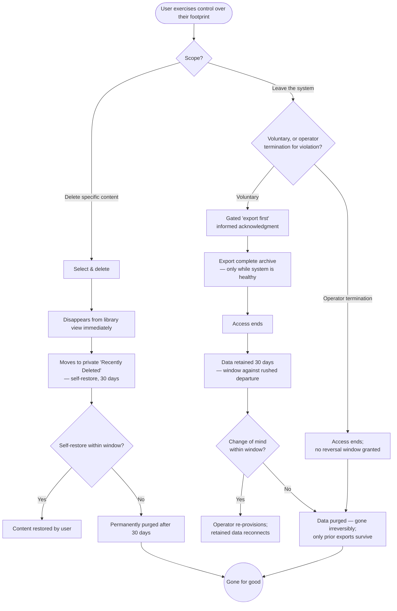

> **One-line definition:** A user removes content they no longer want — with a 30-day safety net — and, if they ever choose, leaves the system entirely, exporting first because after the retention window their data is gone for good.

**Parent capability:** [Self-Hosted Personal Media Storage](../_index.md)

<!--
Every H2 below carries an explicit `{#anchor}` annotation. Downstream skills (extract-business-requirements, define-technical-requirements) cite these sections via Hugo `ref` shortcodes, and Hugo's autogenerated heading IDs are not stable across heading-text edits. Do not strip the anchors when editing this doc.
-->

## Persona {#persona}

The actor is a **user managing or removing their own footprint** — a *Primary actor* from the parent capability's Stakeholders — acting anywhere on the spectrum from deleting a single unwanted photo to departing the system entirely.

- **Role:** An everyday user exercising control over their own content: getting rid of what they don't want, and — at the far end — deciding to leave altogether. Non-technical is the default assumption; they think "delete this," "I'm done with this service," not "issue a purge."
- **Context they come from:** Small deletions come up constantly (a bad shot, a duplicate, something embarrassing). Departure is rare and weighty — a decision to leave the circle, or simply to stop using the system. Both are moments where the user wants to feel *in control* and *safe from their own mistakes*.
- **What they care about here:** Removing what they mean to remove, **not** losing something by accident, and — if they leave — taking their archive with them and understanding, honestly, that the system's copy will be gone afterward.

## Goal {#goal}

> "I want to get rid of stuff I don't want — but not lose something by accident — and if I ever decide to leave, I want to take my archive with me and know my data is truly gone afterward."

## Entry Point {#entry-point}

Two related entries, distinguished by scope and weight:

- **Delete specific content.** The user is in their library ([View and Organize Content](./view-and-organize-content.md)) and decides one or more items should go.
- **Leave the system entirely.** The user decides they are done — or the operator is removing them under the **Closed user set** rule (e.g. a credible **No illegal content** violation, or simply parting ways). This is a deliberate, infrequent, high-stakes act.

## Journey {#journey}

### Branch A — Delete specific content

1. **Select and delete.** The user picks the content and deletes it. It **disappears from their main library view immediately**, so the library reflects their intent right away.
2. **Safety net — a private "Recently Deleted" surface, 30 days.** Deleted content moves into a **"Recently Deleted" surface** the user can open at any time within the window. It is **self-service and visible to the user alone** (never to the operator — **Private by default**), it shows each item with the **time remaining before purge**, and the user can **restore any item back into their library themselves**, with no operator involvement. This is the safety net made *usable*: recovery is a thing the user does, on their own, not a favor they request.
3. **Permanent purge.** After 30 days, the content leaves "Recently Deleted" and is **permanently purged** — genuinely gone, with no operator recovery path. The window exists for accident recovery, not indefinite retention.

### Branch B — Leave the system entirely

1. **Decide to leave (or be removed).** The user initiates departure, or the operator removes them (only the operator can add or remove users). A *voluntary* departure follows the gated, reversible flow below; an *operator termination for a credible **No illegal content** violation* is handled differently — see step 5 and *Edge Cases*.
2. **Export first — gated, not merely offered.** Before a voluntary departure completes, the user must pass through an explicit **"export first"** step that plainly states the stakes: **the system's copy ends after 30 days, and an export is their only lasting copy** (see [View and Organize Content](./view-and-organize-content.md)). The experience **gates departure behind an informed acknowledgment** — the user cannot leave by accident or without being told, and export is offered right there. The system does **not**, however, force the download to actually happen (it cannot verify the user kept the file); the acknowledgment ensures the choice is *informed and deliberate*, and the 30-day window backstops a rushed exit. This step is available only *while the system is healthy* (**Operator succession**).
3. **Access ends.** The user's access to the system is closed.
4. **Retention — 30 days, reversible via the operator.** Their data is **retained for 30 days**. Because it still exists and has not purged, a departure is **reversible within the window**: if the user changes their mind, the **operator re-provisions them** (**Closed user set** — only the operator can re-add a user) and the **retained data reconnects** to the restored account. Departure starts the purge clock; it does not, by itself, sever the data. This reversal is **operator-mediated and whole-account** — deliberately unlike the self-service, per-item "Recently Deleted" restore of Branch A.
5. **Purge.** After 30 days, their data is **purged**. From that point it is gone irreversibly — the same finality as **Lost credentials = lost data** — and re-provisioning after purge is a fresh start, not a recovery. If they kept no export and the window has passed, only what they previously pulled survives.

### Flow Diagram

## Success {#success}

A successful delete-and-leave experience leaves the user with:

- **Their intent, realized safely.** What they meant to remove is gone from their view immediately, and they were protected from their own mistakes by a real recovery window.
- **No accidental loss.** The 30-day net means a fat-fingered deletion or a rushed "I'm leaving" is recoverable — the capability's *Zero data loss* promise holds even around destructive actions.
- **A clean, honest departure (if they leave).** They walked away with their archive in hand and a clear understanding that the system's copy ends after 30 days — no false hope of an indefinite backup, and no nasty surprise.
- **Confirmation of control.** Deletion and departure both feel like *their* decision, fully in their hands, with the operator unable to peek at or resurrect content against the privacy posture.

## Edge Cases & Failure Modes {#edge-cases}

- **Accidental deletion.** *Experience-level handling:* self-recoverable within the 30-day window from the private **"Recently Deleted"** surface (Branch A) — the user restores the item themselves, no operator request needed. This window is precisely what keeps *intended* deletion from ever becoming *unintended* data loss. (See the KPI note below for why deliberate deletion is not a KPI breach.)
- **Two recovery mechanisms, not one.** *Experience-level handling:* recovering an individually **deleted item** and recovering a **whole departed account** are deliberately **distinct experiences**, and the user should never confuse them. Deleted items live in the self-service, per-item **"Recently Deleted"** surface the user restores from alone; a departed account is brought back only through **operator re-provisioning** at whole-account granularity. Different scope (item vs. account), different agency (self-service vs. operator-mediated), different weight (casual undo vs. reversing a deliberate exit) — the experience keeps them from blurring so a user tidying their library never feels they are "leaving," and a user reconsidering departure never expects a one-click item-style undo.
- **Change of mind about leaving, within the window.** *Experience-level handling:* a voluntary departure is **reversible for the full 30 days**, because the user's data is retained and unpurged the whole time. Reversal runs through the operator (**Closed user set** — only the operator can re-add a user), and on re-provisioning the **retained data reconnects** to the restored account; departure starts the purge clock but does not sever the data on its own. The experience is honest about what it *does* promise: not a self-service, one-click return (re-entry is operator-mediated, a variant of [Join as an Invited User](./join-as-an-invited-user.md)), but the real assurance that "your data still exists, and the operator can bring you back to it, until the window closes." After purge there is nothing to reconnect to, and return is a fresh start.
- **Deleting content that was shared.** If the user deletes an original they had shared, recipients lose the shared view (cross-reference [Share Content](./share-content.md) and [Receive Shared Content](./receive-shared-content.md)), but copies recipients already **downloaded** remain theirs. The experience is honest that deletion reaches the owner's copy and the shared views of it, but not copies that already left.
- **Operator-initiated removal for illegal content.** *Experience-level handling:* this is treated **differently from a voluntary departure — the reversible 30-day safety net does not apply.** The retention window exists to protect a user from *their own* rushed or mistaken exit; it is not a courtesy hold owed to a user terminated on credible evidence of a **No illegal content** violation, and holding flagged content for 30 days would cut against the very reason for removing it. So a violation termination ends access **without granting the user a reversal window**, and the operator is free to remove the offending content on its own timeline rather than parking it in retention. The operator still **cannot inspect content directly** — termination acts on credible external evidence, not inspection — and there is no gated "export first" step for a removal the operator initiates. (A user's *voluntary* departure remains fully reversible per the case above; the two paths are deliberately distinct.)
- **Waiting too long to export on the way out.** The complete export is available only **while the system is healthy** (**Operator succession**). A user who defers grabbing their archive until the system is down may find only **previously-pulled** exports survive. The experience should encourage exporting *before* leaving, not as a later step.
- **Deleting an album vs. deleting content.** Emptying or deleting an *album* is organizing, not deletion of content, and is handled in [View and Organize Content](./view-and-organize-content.md). This journey is about deleting the underlying content itself. The two must stay clearly distinct so a user cannot destroy originals while merely tidying.
- **Purge is truly irreversible.** Once the 30-day window elapses, there is no operator recovery path — by design. The experience must not imply any "call the operator to get it back" escape hatch after purge; that would contradict both **Lost credentials = lost data** and the privacy posture.

## Constraints Inherited from the Capability {#constraints-inherited}

This UX must respect the following items from the parent capability's Business Rules and Success Criteria — named so future readers can trace the lineage:

- **30-day retention after deletion / departure.** The spine of this entire journey. Deleted content and departed users' data are retained for 30 days for accident recovery, then purged. Both branches are literal expressions of this rule.
- **KPI — Zero data loss (precise reading).** The KPI is: *no user ever loses content they did not themselves delete.* Deliberate deletion, and its permanent purge after the window, are **expected behavior — not a KPI failure.** The KPI is protected here by the recovery window (against accidents) and by the non-destructive-organizing guarantee elsewhere. The experience should make this distinction real: the user destroys their own content *on purpose*, with a safety net, and that is the system working as intended.
- **Lost credentials = lost data.** Departure and post-window purge share the same finality as losing credentials: once gone, gone, with no operator backdoor. This is the deliberate privacy trade-off, applied to the exit.
- **Operator succession.** The export-before-leaving step is the user-facing use of the capability's on-demand-export mechanism, including the "only while the system is healthy" caveat. Exports are what preserve the user's data across their departure.
- **Closed user set.** Only the operator adds or removes users. A user leaving, or being removed, and any later return, all pass through the operator — there is no self-service account deletion-and-recreation loop that bypasses this.
- **Private by default.** Throughout deletion, retention, and purge, the operator cannot see the user's content. Retention is not an operator-readable archive; it is a private safety net that purges itself.
- **Off-site backup is allowed.** Because durability may rely on off-site replication, a deletion — and the eventual purge after the window — must reach those copies too. From the user's seat, deleting is a single decision that takes effect *everywhere*; they should never have to wonder whether a backup somewhere still holds what they removed after the window closes.

## Out of Scope {#out-of-scope}

- **Organizing (deleting albums, un-grouping).** Non-destructive tidying is [View and Organize Content](./view-and-organize-content.md), not deletion of content.
- **The mechanics of exporting.** Pulling the complete archive is described in [View and Organize Content](./view-and-organize-content.md); this doc references it as the "export before you leave" step but does not re-specify it.
- **Revoking a share without deleting the content.** Taking back access while keeping the content is [Share Content](./share-content.md). This journey covers deletion of the underlying content (which also ends shared views of it).
- **Re-onboarding after departure.** If a departed user returns, their re-provisioning is a variant of [Join as an Invited User](./join-as-an-invited-user.md), governed by the operator. Within the 30-day window that re-provisioning *reconnects* the user's retained data (see [Journey Branch B step 4](#journey)); the mechanics of the join flow itself live in that experience, not here.
- **Operator-side capacity reclamation.** What the operator does with freed space after a purge is an operational concern, not part of the user's experience.

## Open Questions {#open-questions}

None remaining. The five questions this journey previously carried have been resolved and folded into the sections above.

- **Can a departed user return within the 30-day window and recover their data, and how?** → **Yes — departure is reversible for the full window; it starts the purge clock but does not sever the data.** Because the data is retained and unpurged, the **operator re-provisions** the user (**Closed user set**) and the **retained data reconnects** to the restored account. Return is operator-mediated (a variant of [Join as an Invited User](./join-as-an-invited-user.md)), not one-click self-service; after purge there is nothing to reconnect to ([Journey Branch B step 4](#journey), [Edge Cases](#edge-cases)).
- **Does the 30-day retention window apply to operator-initiated termination for illegal content?** → **No — a violation termination is handled differently and grants no reversal window.** The retention net protects a user from *their own* mistaken exit; it is not owed to a user removed on credible **No illegal content** evidence, and the operator may remove offending content on its own timeline rather than hold it. The operator still cannot inspect content directly ([Journey Branch B step 1](#journey), [Edge Cases](#edge-cases)).
- **Is there any distinction between "delete this content" recovery and "I left" recovery?** → **Yes — they are deliberately distinct.** Deleted items are recovered by the user alone, per-item, from the private **"Recently Deleted"** surface; a departed account is recovered only through **operator re-provisioning** at whole-account granularity. Different scope, agency, and weight, kept from blurring so the two are never confused ([Journey](#journey), [Edge Cases](#edge-cases)).
- **How is the user reminded to export before leaving, and how strongly?** → **Departure is gated behind an informed acknowledgment, with export offered right there — stronger than a mere offer, short of forcing the download.** A voluntary departure cannot complete without passing an explicit "export first — the system's copy ends after 30 days, this is your only lasting copy" step; the system cannot verify the file was kept, so the gate ensures the choice is *informed and deliberate*, with the 30-day window backstopping a rushed exit ([Journey Branch B step 2](#journey)).
- **What exactly does a user see during the retention window?** → **A visible, private "Recently Deleted" surface they self-restore from** — not invisible-but-recoverable-on-request. Deleted items appear there for the user alone (never the operator — **Private by default**), each showing time remaining before purge, and the user restores any item themselves with no operator involvement ([Journey Branch A step 2](#journey), [Edge Cases](#edge-cases)).
