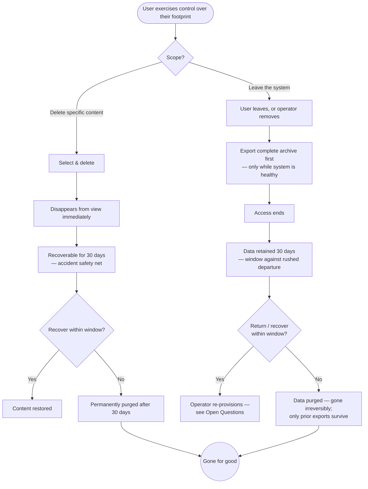

> **One-line definition:** A user removes content they no longer want — with a 30-day safety net — and, if they ever choose, leaves the system entirely, exporting first because after the retention window their data is gone for good.

**Parent capability:** [Self-Hosted Personal Media Storage](../_index.md)

<!--
Every H2 below carries an explicit `{#anchor}` annotation. Downstream skills (extract-business-requirements, define-technical-requirements) cite these sections via Hugo `ref` shortcodes, and Hugo's autogenerated heading IDs are not stable across heading-text edits. Do not strip the anchors when editing this doc.
-->

## Persona {#persona}

The actor is a **user managing or removing their own footprint** — a *Primary actor* from the parent capability's Stakeholders — acting anywhere on the spectrum from deleting a single unwanted photo to departing the system entirely.

- **Role:** An everyday user exercising control over their own content: getting rid of what they don't want, and — at the far end — deciding to leave altogether. Non-technical is the default assumption; they think "delete this," "I'm done with this service," not "issue a purge."
- **Context they come from:** Small deletions come up constantly (a bad shot, a duplicate, something embarrassing). Departure is rare and weighty — a decision to leave the circle, or simply to stop using the system. Both are moments where the user wants to feel *in control* and *safe from their own mistakes*.
- **What they care about here:** Removing what they mean to remove, **not** losing something by accident, and — if they leave — taking their archive with them and understanding, honestly, that the system's copy will be gone afterward.

## Goal {#goal}

> "I want to get rid of stuff I don't want — but not lose something by accident — and if I ever decide to leave, I want to take my archive with me and know my data is truly gone afterward."

## Entry Point {#entry-point}

Two related entries, distinguished by scope and weight:

- **Delete specific content.** The user is in their library ([View and Organize Content](./view-and-organize-content.md)) and decides one or more items should go.
- **Leave the system entirely.** The user decides they are done — or the operator is removing them under the **Closed user set** rule (e.g. a credible **No illegal content** violation, or simply parting ways). This is a deliberate, infrequent, high-stakes act.

## Journey {#journey}

### Branch A — Delete specific content

1. **Select and delete.** The user picks the content and deletes it. It **disappears from their view immediately**, so the library reflects their intent right away.
2. **Safety net — 30 days.** The deleted content remains **recoverable for 30 days**. If the user changes their mind, or deleted something by accident, they can get it back within that window.
3. **Permanent purge.** After 30 days, the content is **permanently purged** and is genuinely gone. The window exists for accident recovery, not indefinite retention.

### Branch B — Leave the system entirely

1. **Decide to leave (or be removed).** The user initiates departure, or the operator removes them (only the operator can add or remove users).
2. **Export first — strongly encouraged.** Before their access ends, the user is expected to **pull a complete export of their content** (see [View and Organize Content](./view-and-organize-content.md)). This exported archive is their **only lasting copy** once the retention window elapses. This step is available only *while the system is healthy* (**Operator succession**).
3. **Access ends.** The user's access to the system is closed.
4. **Retention — 30 days.** Their data is **retained for 30 days**, giving a window against a rushed or mistaken departure.
5. **Purge.** After 30 days, their data is **purged**. From that point it is gone irreversibly — the same finality as **Lost credentials = lost data**. If they kept no export and the window has passed, only what they previously pulled survives.

### Flow Diagram

## Success {#success}

A successful delete-and-leave experience leaves the user with:

- **Their intent, realized safely.** What they meant to remove is gone from their view immediately, and they were protected from their own mistakes by a real recovery window.
- **No accidental loss.** The 30-day net means a fat-fingered deletion or a rushed "I'm leaving" is recoverable — the capability's *Zero data loss* promise holds even around destructive actions.
- **A clean, honest departure (if they leave).** They walked away with their archive in hand and a clear understanding that the system's copy ends after 30 days — no false hope of an indefinite backup, and no nasty surprise.
- **Confirmation of control.** Deletion and departure both feel like *their* decision, fully in their hands, with the operator unable to peek at or resurrect content against the privacy posture.

## Edge Cases & Failure Modes {#edge-cases}

- **Accidental deletion.** *Experience-level handling:* recoverable within the 30-day window. This window is precisely what keeps *intended* deletion from ever becoming *unintended* data loss. (See the KPI note below for why deliberate deletion is not a KPI breach.)
- **Change of mind about leaving, within the window.** Whether the user can return, and whether their data is still recoverable, depends on re-provisioning (**Closed user set** — only the operator can re-add them) and on the 30-day window not having elapsed. The exact re-entry semantics are unresolved — see Open Questions — so the experience should not *promise* seamless return, only the honest "your data still exists for 30 days."
- **Deleting content that was shared.** If the user deletes an original they had shared, recipients lose the shared view (cross-reference [Share Content](./share-content.md) and [Receive Shared Content](./receive-shared-content.md)), but copies recipients already **downloaded** remain theirs. The experience is honest that deletion reaches the owner's copy and the shared views of it, but not copies that already left.
- **Operator-initiated removal for illegal content.** The operator's termination lever under **No illegal content** can end a user's access. How retention interacts with a *violation-driven* removal — whether the standard 30-day window still applies, or whether a termination is treated differently — is unresolved and surfaced as an Open Question. The operator still cannot inspect content directly; termination acts on credible evidence, not inspection.
- **Waiting too long to export on the way out.** The complete export is available only **while the system is healthy** (**Operator succession**). A user who defers grabbing their archive until the system is down may find only **previously-pulled** exports survive. The experience should encourage exporting *before* leaving, not as a later step.
- **Deleting an album vs. deleting content.** Emptying or deleting an *album* is organizing, not deletion of content, and is handled in [View and Organize Content](./view-and-organize-content.md). This journey is about deleting the underlying content itself. The two must stay clearly distinct so a user cannot destroy originals while merely tidying.
- **Purge is truly irreversible.** Once the 30-day window elapses, there is no operator recovery path — by design. The experience must not imply any "call the operator to get it back" escape hatch after purge; that would contradict both **Lost credentials = lost data** and the privacy posture.

## Constraints Inherited from the Capability {#constraints-inherited}

This UX must respect the following items from the parent capability's Business Rules and Success Criteria — named so future readers can trace the lineage:

- **30-day retention after deletion / departure.** The spine of this entire journey. Deleted content and departed users' data are retained for 30 days for accident recovery, then purged. Both branches are literal expressions of this rule.
- **KPI — Zero data loss (precise reading).** The KPI is: *no user ever loses content they did not themselves delete.* Deliberate deletion, and its permanent purge after the window, are **expected behavior — not a KPI failure.** The KPI is protected here by the recovery window (against accidents) and by the non-destructive-organizing guarantee elsewhere. The experience should make this distinction real: the user destroys their own content *on purpose*, with a safety net, and that is the system working as intended.
- **Lost credentials = lost data.** Departure and post-window purge share the same finality as losing credentials: once gone, gone, with no operator backdoor. This is the deliberate privacy trade-off, applied to the exit.
- **Operator succession.** The export-before-leaving step is the user-facing use of the capability's on-demand-export mechanism, including the "only while the system is healthy" caveat. Exports are what preserve the user's data across their departure.
- **Closed user set.** Only the operator adds or removes users. A user leaving, or being removed, and any later return, all pass through the operator — there is no self-service account deletion-and-recreation loop that bypasses this.
- **Private by default.** Throughout deletion, retention, and purge, the operator cannot see the user's content. Retention is not an operator-readable archive; it is a private safety net that purges itself.
- **Off-site backup is allowed.** Because durability may rely on off-site replication, a deletion — and the eventual purge after the window — must reach those copies too. From the user's seat, deleting is a single decision that takes effect *everywhere*; they should never have to wonder whether a backup somewhere still holds what they removed after the window closes.

## Out of Scope {#out-of-scope}

- **Organizing (deleting albums, un-grouping).** Non-destructive tidying is [View and Organize Content](./view-and-organize-content.md), not deletion of content.
- **The mechanics of exporting.** Pulling the complete archive is described in [View and Organize Content](./view-and-organize-content.md); this doc references it as the "export before you leave" step but does not re-specify it.
- **Revoking a share without deleting the content.** Taking back access while keeping the content is [Share Content](./share-content.md). This journey covers deletion of the underlying content (which also ends shared views of it).
- **Re-onboarding after departure.** If a departed user returns, their re-provisioning is a variant of [Join as an Invited User](./join-as-an-invited-user.md), governed by the operator and the open questions below.
- **Operator-side capacity reclamation.** What the operator does with freed space after a purge is an operational concern, not part of the user's experience.

## Open Questions {#open-questions}

- **Can a departed user return within the 30-day window and recover their data, and how?** Re-provisioning is the operator's to do (**Closed user set**), but whether return *reconnects* the retained data to a re-created account, or whether departure severs it regardless of the window, is undecided — and it materially changes how safe "leaving" feels.
- **Does the 30-day retention window apply to operator-initiated termination for illegal content, or is that handled differently?** A violation-driven removal may warrant different treatment than a voluntary departure; the capability doesn't settle this.
- **Is there any distinction between "delete this content" recovery and "I left" recovery** during their respective 30-day windows, or are they the same mechanism from the user's view? Unclear whether a departing user recovers *individually deleted* items differently from their *whole account*.
- **How is the user reminded to export before leaving, and how strongly?** The journey depends on the user exporting first, but whether the experience merely offers it, actively blocks departure until acknowledged, or nudges after the fact is undecided — and it directly affects whether departures cause avoidable loss.
- **What exactly does a user see during the retention window** — is deleted content visible in some "recently deleted" surface they can restore from, or is it invisible-but-recoverable-on-request? This shapes how usable the safety net actually is.
