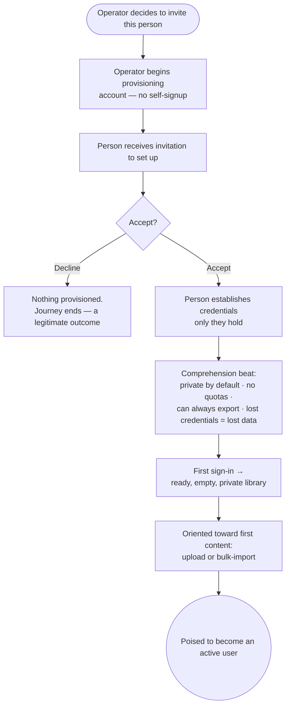

> **One-line definition:** A person the operator has chosen is invited into the closed circle, sets up credentials only they hold, comes to genuinely understand the trade-offs they are accepting (private by default, no quotas, lost credentials = lost data), and ends up with a ready but empty library.

**Parent capability:** [Self-Hosted Personal Media Storage](../_index.md)

<!--
Every H2 below carries an explicit `{#anchor}` annotation. Downstream skills (extract-business-requirements, define-technical-requirements) cite these sections via Hugo `ref` shortcodes, and Hugo's autogenerated heading IDs are not stable across heading-text edits. Do not strip the anchors when editing this doc.
-->

## Persona {#persona}

The actor here is a **prospective user** — a family member or friend the operator (Carson) has personally decided to invite. They map to the parent capability's *Primary actors*, but at the very start of their relationship with the system, before they have stored anything.

- **Role:** A newly-invited member of the operator's trusted circle. Assume they are **not technical**: they think in terms of "my photos" and "my account," not credentials, keys, or recovery flows.
- **Context they come from:** They likely already keep their photos on a commercial cloud provider and have a vague unease about privacy, cost, or lock-in — or they simply trust the operator's recommendation. They did **not** seek out and sign up for this system; they cannot, because there is no public sign-up. They are here because the operator reached out to them.
- **What they care about here:** Getting an account that is genuinely theirs, understanding in plain terms what they are agreeing to, and knowing what to do next. Underneath that: they want to feel they have been let into something private and trustworthy — not enrolled in a product that will mine their photos.

The **operator** is a secondary actor in this journey: they initiate and provision, but a load-bearing property of the whole capability is that the operator drives this onboarding **without ever gaining the ability to see the user's future content**.

## Goal {#goal}

> "I've been invited to this thing Carson runs. I want to get my own account set up, understand what I'm actually agreeing to, and know how to start putting my photos somewhere I trust — somewhere that's really mine."

The goal is not merely "an account exists." It is "an account exists that only I control, **and** I understood the deal well enough to rely on it." The understanding is part of the goal, because the capability's central trade-off (lost credentials = lost data) only works if the user genuinely accepted it rather than clicking past it.

## Entry Point {#entry-point}

The journey begins **out of band**, on the operator's initiative. The operator — in a conversation, a text, an in-person chat — tells the person they are being added and starts provisioning them. There is no invite link the person discovered, no "request access" button they pressed, no waitlist they joined.

This is a direct consequence of the **Closed user set** rule: the operator is the only person who can add a user, and there is no self-signup. The prospective user's state of mind is therefore one of having been *offered* something by someone they trust, not of having shopped for a service. That trust is the currency the rest of the journey spends and must not betray.

## Journey {#journey}

The journey is a mostly-linear flow with one decision point (accept or decline) and a strong emphasis on a single comprehension beat in the middle — the moment the user actually understands the lost-credentials trade-off.

### 1. The operator invites and begins provisioning

The operator decides this person belongs in the circle and starts setting up their account. From the prospective user's perspective, this is simply "Carson said he's adding me." Nothing is required of them yet.

Because provisioning is entirely operator-driven, the user is never asked to prove eligibility, pick a plan, or agree to terms-of-service boilerplate. The "terms" they will accept are the handful of real trade-offs surfaced in step 4, in plain language — not a legal document.

### 2. The person receives the invitation

The person perceives an invitation to set up their account — an unmistakable signal that it is their turn to act, arriving through whatever channel the operator uses. What matters at the experience level is that it is clearly *for them*, clearly *from the operator they trust*, and clearly *time-bound to a setup action they take now*.

### 3. Accept or decline

The person decides whether to join.

- **Decline.** The circle is closed and trust-based; there is no pressure and no consequence. Nothing further is provisioned, and the journey ends here. This is a legitimate outcome, not a failure — a person choosing not to store their photos here is simply not part of the user set.
- **Accept.** They proceed to establish their credentials.

### 4. Establish credentials only they hold — and understand what that means

The person sets up the credentials they will use to sign in. The defining property, which they must come to understand, is that **only they** hold these credentials. The operator does not learn them and cannot reset them into any form that would expose the user's content.

This is the **comprehension beat** — the emotional and conceptual center of the whole onboarding. Before the user relies on the system, they are walked, in plain terms, through the deal they are accepting:

- **Their content will be private by default.** No third party — *including the operator who runs the system* — can see their photos unless they explicitly share them. This is stated as a promise, not a setting.
- **There are no storage limits.** They will never be told they are out of space or asked to pay for more. (For someone leaving a commercial provider, this is a pleasant surprise worth naming.)
- **They can always get their stuff out.** They can pull a complete copy of everything they own, on their own, whenever the system is healthy — and they are encouraged to do so periodically. This is their safety line and their exit.
- **If they lose their credentials, their data is gone.** This is the hard one. The operator *cannot* rescue them — not "won't," *can't* — because the same property that keeps the operator out of their content also keeps the operator from recovering it. This is a deliberate Signal-style trade-off in service of privacy.

The experience-level obligation here is **informed consent**: the user should leave this step genuinely understanding the no-recovery trade-off and knowing they are responsible for safeguarding their credentials (e.g. keeping them in a password manager). Burying this in fine print would be a failure of the journey, because a user who did not understand it will later experience an unrecoverable loss as a betrayal rather than a known trade-off they accepted.

### 5. First sign-in to a ready, empty library

The person signs in for the first time and lands in their own space: private, theirs, and empty. The emptiness is an invitation — the system points them at what to do next.

### 6. Pointed toward first content

The account is ready, so the journey hands off to the user's first real use. They are oriented toward the two natural next steps: [uploading content](./upload-content.md) (a first photo, or turning on automatic device backup) or [bulk-importing](./bulk-import-from-a-prior-provider.md) their whole existing library from a prior provider. This handoff is where "provisioned" starts becoming "active."

### Flow Diagram

## Success {#success}

A successful onboarding leaves the person with:

- **An account only they control.** The credentials are theirs alone; the operator provisioned access without acquiring the ability to read their content.
- **Genuine understanding of the trade-off.** They did not merely click "I agree" — they can state, in their own words, that losing their credentials means losing their data, and that this is the price of nobody (including the operator) being able to snoop. They accepted it knowingly.
- **A clear next step.** They know how to start — upload a photo, turn on backup, or import their old library — so the empty library is a starting line, not a dead end.

Emotionally, success feels like *being let into a trusted, private circle* — the opposite of signing up for a product. The person's trust in the operator has been honored, not spent down.

## Edge Cases & Failure Modes {#edge-cases}

- **The person declines the invitation.** Handled in the journey: nothing is provisioned, no pressure is applied, and this is recorded simply as "not a user." The closed, trust-based nature of the circle makes declining unremarkable.
- **The person loses their credentials immediately after setup, before storing anything.** The loss is genuinely unrecoverable — but the stakes are near zero because the library is empty. *Experience-level handling:* treat this as a low-cost teaching moment. The operator can re-provision a **fresh** account (the operator can always add a user), but this is a *new* account, not a recovery of the old one — consistent with lost-credentials-equals-lost-data. The value of losing an empty account is that it reinforces the trade-off before anything is at stake.
- **The person never uses the account after provisioning.** They become a **dormant** provisioned user, not an **active** one, per the *Number of active users* KPI. *Experience-level handling:* this is not an error state to fix inside the flow, but the journey should end by pointing clearly at a first action, precisely so that provisioned-and-idle is the exception rather than the default. Chronic dormancy is a signal the capability isn't meeting the person's real need — it is tracked, not papered over.
- **The person doesn't understand, or is uncomfortable with, the no-recovery deal.** This is the most important failure mode to get right. *Experience-level handling:* the honest response is to make sure they understand *before* they rely on the system — informed consent is part of onboarding, not fine print. If, having understood it, they are not comfortable with it, that discomfort is legitimate and may mean this system isn't right for them. The wrong handling would be to soften or hide the trade-off to keep them; that would only convert a clear up-front choice into a future betrayal.
- **The operator later removes the person from the circle.** Only the operator can do this (closed user set). From the user's side this is a departure, and it is governed by the same 30-day retention mechanics as leaving voluntarily — see [Delete Content and Leave](./delete-content-and-leave.md). It is out of scope for the onboarding journey itself.
- **Someone tries to join without an operator invite.** There is no path for this — there is no front door to knock on. Not an edge case the flow handles so much as a property of the closed user set that this journey depends on.

## Constraints Inherited from the Capability {#constraints-inherited}

This UX must respect the following items from the parent capability's Business Rules and Success Criteria — named so future readers can trace the lineage:

- **Closed user set.** The entire entry point is operator-initiated. There is no self-signup, no invite link the user found on their own, no request-access flow. The operator is the sole party who can add a user, and this journey is the operationalization of that rule from the invited person's seat.
- **Lost credentials = lost data.** This is the conceptual center of the journey (step 4). The onboarding's job is not just to create credentials but to secure the user's *informed consent* to the fact that losing them is unrecoverable, because the operator cannot reset access in a way that exposes content. Getting this comprehension right at onboarding is what makes a later loss a known accepted trade-off rather than a support failure.
- **Private by default.** Surfaced explicitly during onboarding as a promise: the operator who is provisioning the account cannot see the content that will live in it, and no other user can either, absent an explicit share. The user should leave onboarding believing this, because it is true.
- **No storage quotas.** Named during the comprehension beat as a concrete benefit, especially salient for someone migrating off a metered commercial provider.
- **Operator succession.** The user-facing half of this rule — "you can pull a complete on-demand archive of your own content, and you should do so proactively while the system is healthy" — is introduced here as the user's standing safety line and exit path. The sealed-successor half is an operator concern and not surfaced to the user.
- **KPI — Number of active users.** This journey is the *top of the funnel* for that KPI. Provisioning a user is necessary but not sufficient; the metric counts users who actually {upload, view, download, share}. Ending the flow by pointing at a concrete first action is how onboarding contributes to *active* rather than merely *dormant* counts.
- **KPI — Zero data loss.** A precise boundary matters here: a user losing their *own* credentials is **not** a violation of this KPI. The KPI is about the system never losing content the user did not themselves delete or lose access to. Onboarding must convey this distinction so the guarantee ("we won't lose your stuff") isn't heard as a promise the trade-off contradicts ("even if you lose your key").

## Out of Scope {#out-of-scope}

- **The user's first upload or import.** Onboarding ends at a ready, empty library pointed at the next step. The actual first-content journeys live in [Upload Content](./upload-content.md) and [Bulk-Import from a Prior Provider](./bulk-import-from-a-prior-provider.md).
- **The operator's provisioning mechanics.** *How* the operator stands up an account (identity technology, invitation delivery, account creation steps) is a design and operational concern, not part of the user's experience. This doc only covers what the invited person perceives.
- **Removal / departure and the 30-day retention window.** When the operator removes a user, or a user chooses to leave, that is [Delete Content and Leave](./delete-content-and-leave.md). This journey only notes that operator-initiated removal exists and is governed there.
- **Credential recovery.** Explicitly excluded by the capability itself. There is no recovery journey to document; the absence is the design.
- **Sharing and being shared with.** A brand-new user with an empty library is neither sharing nor receiving yet. Those are [Share Content](./share-content.md) and [Receive Shared Content](./receive-shared-content.md).

## Open Questions {#open-questions}

- **Depth of the comprehension check.** The journey asserts the user should *genuinely understand* the lost-credentials trade-off, but stops short of prescribing how comprehension is confirmed (a simple acknowledgement vs. a more deliberate confirmation that they have safeguarded their credentials). How strong a confirmation is appropriate — without turning a trusted-circle onboarding into a bureaucratic gate — is unresolved.
- **Invitation expiry and re-invitation.** Whether an unaccepted invitation should expire, and how the operator re-invites someone who let it lapse, is not specified at the experience level.
- **Guided vs. self-directed first step.** Whether the system should actively walk a non-technical user into their first upload/import, or simply point at the options and let them proceed, is an open experience question that affects the active-vs-dormant KPI outcome.
