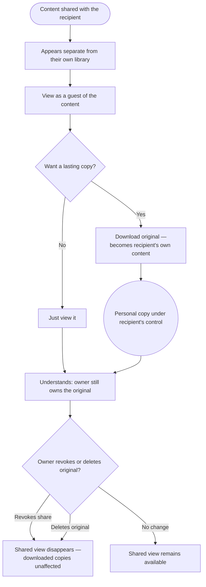

> **One-line definition:** A user who has been granted access to someone else's content finds it, views it, downloads the copies they want, and understands the boundaries of what's been shared with them.

**Parent capability:** [Self-Hosted Personal Media Storage](../_index.md)

<!--
Every H2 below carries an explicit `{#anchor}` annotation. Downstream skills (extract-business-requirements, define-technical-requirements) cite these sections via Hugo `ref` shortcodes, and Hugo's autogenerated heading IDs are not stable across heading-text edits. Do not strip the anchors when editing this doc.
-->

## Persona {#persona}

The actor is a **recipient** — the capability's *Secondary actor / consumer*: an existing, provisioned user whom a content owner (see [Share Content](./share-content.md)) has explicitly granted access to specific content, individually or via a shared group/album. This journey is the mirror image of [Share Content](./share-content.md), seen from the other side.

- **Role:** A user on the receiving end of a share — the grandparent who was given access to the new baby photos, a family member in the shared "family album." They are a full user in their own right (they have their own library), but *in this journey* they are consuming someone else's content, not managing their own.
- **Context they come from:** Someone in the circle decided to show them something. They arrive either because the shared content surfaced for them, or because they were told out of band ("check the album, I added photos").
- **What they care about here:** Seeing what was shared, keeping the parts they care about, and understanding the relationship — what is *theirs* versus what they are merely being *shown* — without confusion.

## Goal {#goal}

> "Someone in our circle shared photos with me — I want to see them, keep the ones I care about, and know what I'm allowed to do with them."

## Entry Point {#entry-point}

The recipient becomes aware that content has been shared with them. Critically, they arrive at *shared* content — they never arrive by browsing the owner's private library, because they cannot: they only ever see what was **explicitly shared to them** (see *Constraints Inherited* — **Private by default**). Awareness comes in one of two ways, and the system leans on the first as its baseline: the shared content simply **appears in a distinct "shared with me" surface** the next time the recipient looks (a *pull* signal they discover on their own terms), optionally reinforced by an **out-of-band nudge** from the owner ("check the album, I added photos"). The system deliberately does **not** push a dedicated alert, email, or notification of its own — it neither operates a notification channel nor reveals recipient presence/activity back to the owner, keeping sharing a quiet relationship inside the circle rather than an eventful one. The trade-off is accepted openly: a recipient who never looks may not notice a share until they next visit, and nudging is left to the people, not the system.

## Journey {#journey}

1. **Notice the shared content.** The recipient perceives that new content has been shared with them, kept clearly distinct from their own library so the two never blur together.
2. **View it.** They look through what was shared — the photos, the video, the album — as a guest of that content, not as its owner.
3. **Download what they want to keep.** For items they want a lasting personal copy of, they download the **original**. A downloaded copy becomes **their own content**, now living under their control (and their own deletion/retention behavior if they later remove it). The copy carries **no system-enforced provenance** — once saved it is indistinguishable from the recipient's own uploads, with no "originally shared by X" marker the system maintains or surfaces. This is the clean, honest consequence of the boundary model: a downloaded copy is *fully theirs*, not a tracked derivative the owner still has a thread into. (If a recipient wants to remember where a photo came from, that is theirs to note; the system does not do it for them, and does not report the download back to the owner.)
4. **Understand the boundaries.** The recipient understands, through how the experience behaves, that:
   - the content still **belongs to the owner**;
   - the owner can **revoke** the shared view at any time, at which point the recipient sees a plain **"no longer shared"** state rather than a silent disappearance (see step 5 of [Share Content](./share-content.md) and *Edge Cases* below);
   - a copy they downloaded is theirs and is *not* revoked when the owner revokes the share;
   - removing a shared item from their own view does **not** delete the owner's original — they can only dismiss it from their side.
5. **Keep shared and owned separate.** Throughout, "shared with me" stays visually and conceptually separate from "my own library," so the recipient never mistakes one for the other.

### Flow Diagram

## Success {#success}

A successful receive-shared experience leaves the recipient with:

- **What was meant for them, seen clearly.** They viewed exactly what the owner intended to show, with no friction and no accidental exposure to the owner's other content.
- **The copies they wanted, under their own control.** Anything they chose to keep is now genuinely theirs.
- **An accurate mental model.** They understand the borrowed-view-versus-owned-copy distinction, so nothing about a later revocation or deletion feels like a betrayal or a bug — it matches what they already understood.
- **No clutter or confusion.** Shared-with-me content never contaminates their own library.

## Edge Cases & Failure Modes {#edge-cases}

- **The owner revokes access.** *Experience-level handling:* the recipient's shared view is removed going forward, but it does **not** simply blink out of existence — the recipient sees a plain, neutral **"no longer shared"** state, enough to read the change as intentional ("the owner changed their mind") rather than a bug or a loss. That message is deliberately incurious: it does **not** reveal *why* access ended, and it does **not** distinguish a revoke from the owner deleting the original — so a recipient can never reverse-engineer the owner's private actions from it. Anything they already **downloaded** remains theirs; revocation does not reach copies that already left the owner's control. This is the recipient-side mirror of the resolution in [Share Content](./share-content.md).
- **The owner deletes the original.** The shared view goes away for the recipient (consistent with revocation); a copy the recipient already downloaded is unaffected. Cross-reference: [Delete Content and Leave](./delete-content-and-leave.md).
- **Confusing shared-with-me for my-own.** The recipient must never believe that deleting a shared item removes the owner's original — it does not. They can only remove it from *their* view. The experience keeps this unambiguous so a recipient "cleaning up" cannot imagine they are affecting someone else's library.
- **A recipient loses their own credentials.** The **Lost credentials = lost data** trade-off applies to the recipient exactly as to any user: copies they downloaded and keep live in *their* account, and are as unrecoverable as anything else they own if they lose access. Being a recipient does not exempt them from the capability's core trade-off.
- **Wanting to re-share onward.** *Experience-level handling:* re-sharing the owner's shared view is **not possible** — a recipient cannot forward, re-share, or add anyone else to what was shared with them. This preserves the owner's guarantee that content reaches *only the people the owner explicitly named*. The one path by which shared content ever reaches someone new runs through the boundary the capability already accepts: the recipient **downloads** it, at which point the downloaded copy is *their own content*, and they may share *that copy* as its new owner — a fresh share of a distinct copy they own, not the owner's original share propagating onward (the owner's original and its access list are untouched). This is the single, consistent answer shared with [Share Content](./share-content.md).
- **A downloaded copy carries no provenance.** *Experience-level handling:* once the recipient downloads and keeps content, it becomes indistinguishable from their own uploads — the system attaches **no** "originally shared by X" marker and maintains no ongoing link back to the owner. This is intentional: it keeps the copy genuinely the recipient's, avoids a lingering tracking thread that would sit oddly against the no-surveillance posture, and matches the clean owned-vs-borrowed split the rest of the journey relies on. Any memory of where a copy came from is the recipient's to keep, not the system's to enforce.
- **Never seeing the owner's other content.** No path in this journey ever exposes the owner's broader private library. The recipient's world is bounded by what was explicitly shared.

## Constraints Inherited from the Capability {#constraints-inherited}

This UX must respect the following items from the parent capability's Business Rules and Success Criteria — named so future readers can trace the lineage:

- **Private by default.** The recipient sees **only** what was explicitly shared to them — never the owner's wider library. This rule defines the entire boundary of the recipient's experience. The operator, likewise, sees nothing extra as a result of any share between users.
- **Closed user set.** The recipient is themselves a provisioned member of the circle; only users can be on the receiving end of a share. There is no anonymous or public recipient.
- **Lost credentials = lost data.** Applies to the recipient's *own* copies. Content they download and keep is theirs, protected by their own credentials, with the same no-recovery trade-off as any user's content.
- **No affected-party recourse process.** If the recipient is also someone *depicted* in content shared by another, they have no special in-system removal right by virtue of being depicted; that is resolved interpersonally, per the capability. Their rights in this journey come from being an explicitly-named recipient, not from being a subject.
- **KPI — Number of active users.** Viewing and downloading shared content are two of the four counted **active-user** actions ({upload, view, download, share}). A recipient who regularly engages with shared content is an active user, even in periods when they upload nothing of their own — shared consumption is a legitimate, counted form of getting value from the system.
- **KPI — Zero data loss (precise reading).** This KPI is about a user losing content *they own and did not delete*. A recipient losing a **shared view** when the owner revokes or deletes is **not** a data-loss failure — the recipient never owned that view; they were a guest. Only the recipient's own downloaded copies fall under the KPI for them. The experience should reflect this so a vanished shared view reads as "the owner changed their mind," not "the system lost my data."

## Out of Scope {#out-of-scope}

- **The owner's side of sharing.** Deciding to share, choosing recipients, and revoking are [Share Content](./share-content.md). This doc is only the recipient's experience.
- **Managing the recipient's own library.** Once a recipient downloads a copy, browsing/organizing/exporting it is [View and Organize Content](./view-and-organize-content.md), and deleting it is [Delete Content and Leave](./delete-content-and-leave.md) — the same journeys as for any content they own.
- **Becoming a user in the first place.** The recipient is already provisioned; onboarding is [Join as an Invited User](./join-as-an-invited-user.md).
- **Group administration.** How shared groups (e.g. a family album) are created and who manages membership is a shared concern surfaced in [Share Content](./share-content.md), not resolved here.

## Open Questions {#open-questions}

None remaining. The four questions this journey previously carried have been resolved and folded into the sections above. The re-sharing and revocation-visibility questions are **shared with [Share Content](./share-content.md)**; the answers below are the single, consistent resolution both journeys use.

- **May a recipient re-share content shared with them?** → **No — re-sharing the owner's shared view is blocked.** A recipient cannot forward, re-share, or add anyone else to what was shared with them. Content reaches someone new only when the *owner* shares it directly, or when the recipient **downloads** it: a downloaded copy becomes the recipient's *own* content, which they may then share as its new owner. The owner's original share never propagates onward ([Edge Cases](#edge-cases)). *(Shared with Share Content.)*
- **How is the recipient notified of a new share?** → **A pull-based "shared with me" surface, optionally reinforced by an out-of-band nudge from the owner — no dedicated system alert.** Shared content appears in a distinct surface the recipient finds when they next look; the system pushes no alert of its own and reports nothing about the recipient back to the owner. The accepted trade-off is that a recipient who never looks may not notice until their next visit ([Entry Point](#entry-point)).
- **What does the recipient see when a share is revoked or the original deleted?** → **A graceful, neutral "no longer shared" state, not a silent disappearance** — enough to read the change as intentional, without revealing *why* access ended or distinguishing a revoke from a delete, and with any already-downloaded copies left untouched ([Journey step 4](#journey), [Edge Cases](#edge-cases)). *(Shared with Share Content.)*
- **Does downloaded shared content carry provenance?** → **No.** Once downloaded and kept, a copy is indistinguishable from the recipient's own uploads — the system attaches no "originally shared by X" marker and keeps no ongoing link to the owner. The copy is genuinely the recipient's, consistent with the download boundary and the no-surveillance posture ([Journey step 3](#journey), [Edge Cases](#edge-cases)).
