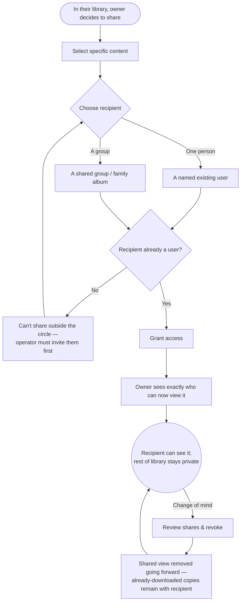

> **One-line definition:** A content owner grants a specific fellow user, or a shared group/album, access to chosen content — and can review and revoke that access later — while everything else stays private.

**Parent capability:** [Self-Hosted Personal Media Storage](../_index.md)

<!--
Every H2 below carries an explicit `{#anchor}` annotation. Downstream skills (extract-business-requirements, define-technical-requirements) cite these sections via Hugo `ref` shortcodes, and Hugo's autogenerated heading IDs are not stable across heading-text edits. Do not strip the anchors when editing this doc.
-->

## Persona {#persona}

The actor is a **content owner** — a *Primary actor* from the parent capability's Stakeholders — who wants to let someone else in the trusted circle see specific media of theirs. The recipient's side of this interaction is a separate journey ([Receive Shared Content](./receive-shared-content.md)); this doc is strictly the owner deciding to share and staying in control of that decision.

- **Role:** A user who owns content and wants a *specific* person, or a defined group, to see *specific* items — a grandparent seeing the new baby photos, a "family album" the whole family can see.
- **Context they come from:** They are in their own library ([View and Organize Content](./view-and-organize-content.md)) and something there is worth showing to someone. Their reference point is the commercial photo app's sharing — but with a sharper expectation of privacy, because privacy is *why* they left.
- **What they care about here:** That *exactly* the people they intend can see *exactly* what they chose — no more — that the rest of their library stays private, and that they can take access back later if they change their mind.

## Goal {#goal}

> "I want just these photos seen by just this person — or our family album — nobody else, and I want to be able to take that access back later."

## Entry Point {#entry-point}

The owner is in their own library and decides that some specific content should be seen by someone specific. The trigger is social, not systemic: a moment worth sharing, a person who would want to see it, an album the family keeps together. They arrive already knowing *what* they want to share and roughly *with whom*.

## Journey {#journey}

1. **Select the content.** The owner picks the specific item(s) to share — one photo, a set, a whole album's worth. Everything they do *not* pick stays private; sharing is strictly additive and scoped to the selection.
2. **Choose the recipient.** The owner picks who gets access, in one of two shapes:
   - **One-to-one** — another **named existing user** in the circle.
   - **A shared group** — e.g. a "family album" that a defined set of users can see.
   In both shapes, the recipient must **already be a user** (see *Constraints Inherited* — **Closed user set**). There is no sharing to an email address, a public link, or anyone outside the invited set.
3. **Grant access.** The owner shares. The content becomes visible to the chosen recipient(s) and to no one else.
4. **See exactly who can now see it.** The owner gets a clear, truthful picture of who has access to this content as a result — so "who can see this?" always has an answer they can check, not a vague sense that they shared it "somewhere."
5. **Review and revoke later.** At any later point the owner can look at what they have shared and with whom, and **revoke** access. Revocation removes the recipient's shared view going forward.

### A note on what revocation can and cannot do

Revocation reliably removes the *shared view*. It cannot reach a copy a recipient already **downloaded** — once a recipient saves a copy, that copy is theirs (see [Receive Shared Content](./receive-shared-content.md)). The experience must be honest about this boundary so the owner shares with correct expectations rather than a false sense of total recall.

### Flow Diagram

## Success {#success}

A successful share leaves the owner with:

- **Precisely-scoped visibility.** Exactly the intended people can see exactly the intended content, and nothing else of theirs leaked.
- **A clear, checkable picture of access.** They know who can see what, and can revisit it — sharing never becomes a fog of "who did I show this to?"
- **Retained control.** They can revoke, and they understand the one honest limit (downloaded copies), so their expectations match reality.
- **Undisturbed privacy everywhere else.** The act of sharing one thing did not weaken the privacy of everything else; their library is still private by default.

## Edge Cases & Failure Modes {#edge-cases}

- **Sharing with someone who isn't a user yet.** *Experience-level handling:* not possible directly. The owner can only choose from people already in the **Closed user set**. To share with someone new, that person must first be invited and provisioned by the operator ([Join as an Invited User](./join-as-an-invited-user.md)); only then can the owner share with them. There is no public link and no external-email share — this is a deliberate consequence of the capability's *Public sharing* being out of scope.
- **Revoking after a recipient has downloaded.** The shared view disappears, but a downloaded copy is now the recipient's own and is beyond the owner's reach. The experience states this plainly rather than implying revocation claws back copies.
- **Shared-group membership changes.** When someone is added to or removed from a shared group, the experience makes clear how that affects who can see content already shared to the group — so the owner is never surprised by a new group member gaining access to old content, or a removed member losing it.
- **A person depicted in the shared media objects.** There is **No affected-party recourse process** in the system — a non-user depicted in a photo has no system-provided way to force its removal, and even a *user* who is merely depicted (not the owner) has no override. Such objections are expected to be resolved **interpersonally, outside the system**; the owner decides. The **sole** exception is the operator's termination lever under **No illegal content**: where a depiction is itself illegal in the operator's jurisdiction, the operator may act on credible evidence — but the operator still cannot inspect content directly. The experience should not imply any in-system "report this share" flow beyond that narrow, operator-driven lever.
- **The operator is not a privileged viewer.** Sharing among users never makes content visible to the operator. The operator sees a user's content only if that user explicitly shares it *to* the operator, exactly as they would with anyone else.
- **Over-broad selection.** If the owner accidentally selects more than they meant (e.g. a whole album when they wanted one photo), the review-access step is their safety check — they can see the full scope of what they just exposed and pull it back before it matters.

## Constraints Inherited from the Capability {#constraints-inherited}

This UX must respect the following items from the parent capability's Business Rules and Success Criteria — named so future readers can trace the lineage:

- **Private by default.** This is the rule the whole journey turns on. All content is private to its owner *unless the owner explicitly shares it*. Sharing is the **only** mechanism by which anyone else — including the operator — ever sees a user's content. Nothing about this journey erodes the default; it is a scoped, deliberate exception the owner controls.
- **Closed user set.** Recipients must be members of the invited circle. Only the operator adds or removes users; an owner cannot conjure a recipient. There is no public sign-up and, correspondingly, no public sharing — *Public sharing* is explicitly out of scope in the capability.
- **No affected-party recourse process.** People depicted in shared media have no system-provided removal path; objections are resolved interpersonally. This is a deliberate capability decision, not a gap this UX should try to fill.
- **No illegal content.** The single operator lever that can override an owner's sharing is termination on credible evidence of illegal content, governed by the operator's jurisdiction. This UX surfaces that lever precisely and does not overstate it into general operator moderation of shares.
- **Lost credentials = lost data.** Sharing does not create an operator backdoor or a recovery path. A recipient still holds their own credentials, and the privacy posture (no operator visibility without explicit share) is preserved throughout.
- **KPI — Zero data loss.** Reviewed here for the guarantee it imposes on this journey: sharing and revoking are **non-destructive to the owner's content**. Sharing is purely additive — it grants visibility, and never moves, copies out, or deletes the underlying item — so it cannot cause the owner to lose anything. Revoking a share must remove *visibility*, never the content itself; a revoke that deleted the owner's original would be a *zero data loss* failure hiding inside a sharing action. The one place data *does* leave the owner's control — a recipient's downloaded copy surviving revocation — is **not** a loss of the owner's data (their original is untouched); it is a limit on recall, addressed honestly in the revocation note above. This journey therefore has no path that undermines the zero-data-loss guarantee.
- **KPI — Number of active users.** Sharing is one of the four counted **active-user** actions ({upload, view, download, share}). A circle that actually shares with each other is a circle getting real value from the system — sharing is arguably the strongest signal that the capability is meeting a social need the old provider met.

## Out of Scope {#out-of-scope}

- **The recipient's experience.** What the recipient sees, does, and is allowed to do with shared content is [Receive Shared Content](./receive-shared-content.md). This doc stops at the owner's side of the interaction.
- **Selecting and browsing content to share.** Finding and picking the content happens in [View and Organize Content](./view-and-organize-content.md); this doc picks up once the owner has decided to share.
- **Provisioning a new recipient.** If the intended recipient isn't a user yet, inviting them is the operator's job, covered by [Join as an Invited User](./join-as-an-invited-user.md).
- **Deleting shared content.** What happens to a share when the owner *deletes the underlying content* (recipients lose the view; downloaded copies remain) is covered by [Delete Content and Leave](./delete-content-and-leave.md).
- **Public sharing of any kind.** Sharing outside the invited circle is explicitly out of scope for the entire capability and therefore impossible in this journey.

## Open Questions {#open-questions}

- **Can a recipient re-share content the owner shared with them?** The capability says content is shared "only to explicitly named recipients," which cuts against unbounded re-sharing — but whether re-sharing is blocked, allowed, or allowed-only-back-into-the-same-group is unresolved. This is the mirror of an open question in [Receive Shared Content](./receive-shared-content.md).
- **Is the owner notified when a recipient views or downloads shared content?** Whether the owner gets any feedback about what recipients did (especially downloads, given the revocation limit) is undecided.
- **Who owns and administers a shared group?** For a "family album," it is unclear whether one user owns it, whether membership is operator-managed, and who can add/remove members or content. Group semantics need their own resolution.
- **What does a recipient see about *why* access changed** when an owner revokes or deletes — anything, or does the content simply disappear? This affects how abrupt/confusing revocation feels on the other side.
