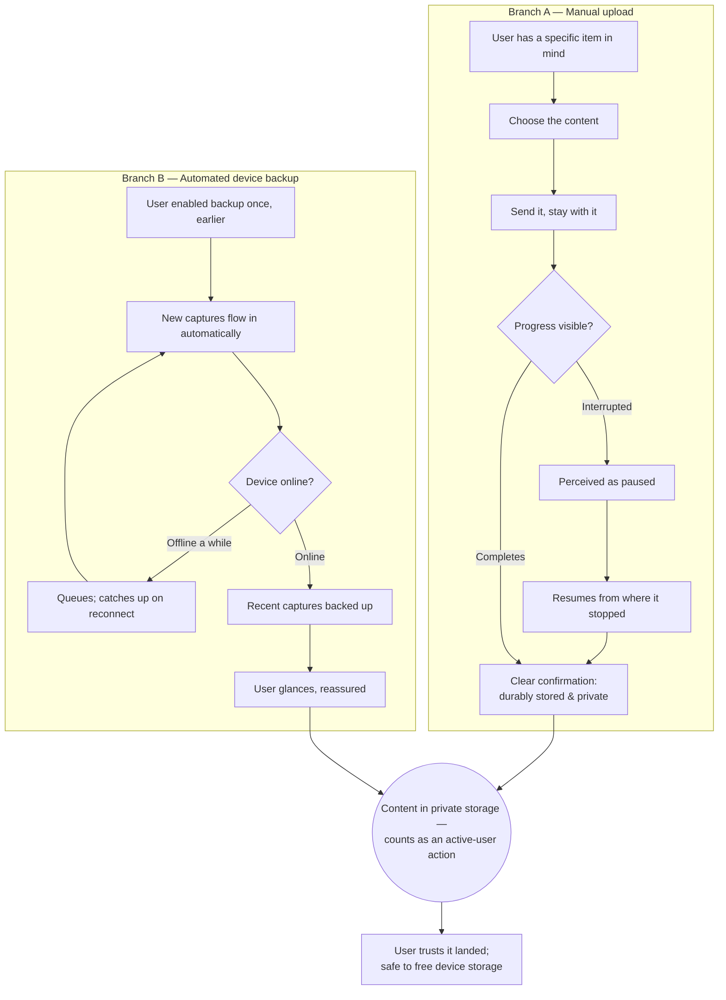

> **One-line definition:** A provisioned user gets their media into their own storage — sometimes a specific file they deliberately choose, sometimes automatically from their device without thinking about it — and trusts it landed safely and privately.

**Parent capability:** [Self-Hosted Personal Media Storage](../_index.md)

<!--
Every H2 below carries an explicit `{#anchor}` annotation. Downstream skills (extract-business-requirements, define-technical-requirements) cite these sections via Hugo `ref` shortcodes, and Hugo's autogenerated heading IDs are not stable across heading-text edits. Do not strip the anchors when editing this doc.
-->

## Persona {#persona}

The actor is an **active user** — one of the *Primary actors (initiators)* named in the parent capability's Stakeholders: the operator, a family member, or a friend, acting on their own content. They have already been invited and provisioned (see [Join as an Invited User](./join-as-an-invited-user.md)); this journey is about the everyday act that makes the account worth having.

- **Role:** An everyday user putting their own photos, videos, and files into their own storage. Non-technical is the default assumption — they think in terms of "my photos," not "objects" or "buckets."
- **Context they come from:** They just took a photo, shot a video, or have a file on a device they want kept safely. Their prior mental model is a commercial cloud provider's camera-roll sync — the thing they are trying to replace. They expect "it just backs up" to be the baseline, not a feature they have to earn.
- **What they care about here:** That the content they intend to keep is *actually* kept, that it is private to them, and — for automatic backup — that it keeps happening without their attention so they never lose a memory to a dropped, lost, or upgraded device.

## Goal {#goal}

> "I want my photos, videos, and files safely in my own storage — sometimes a specific thing I pick, sometimes just automatically from my phone — so I never lose a memory, and so nobody but me can see it."

## Entry Point {#entry-point}

There are **two distinct entry points into the same journey**, and the difference in the user's state of mind is the whole reason both belong in one doc:

- **Manual upload (deliberate, attended).** The user has a specific thing in mind — a photo they want off a borrowed camera, a document they want kept, a video someone sent them. They come to the system *on purpose* and expect to watch it land.
- **Automated device backup (passive, set-and-forget).** The user configured backup once, at some earlier moment, and is now *not thinking about the system at all*. New captures on their device are expected to flow in on their own. The user only re-engages to occasionally reassure themselves it is working — or when something makes them doubt it.

Both entries share the same goal (content stored, private, durable) and the same success condition (trust that it landed). They diverge only in how much attention the user is paying.

## Journey {#journey}

### Branch A — Manual upload

1. **Choose the content.** The user picks the specific item(s) they want stored — one photo, a handful, a large video, an arbitrary file. There is no size or count ceiling they have to plan around (see *Constraints Inherited* — **No storage quotas**).
2. **Send it.** The user starts the upload and stays with it — this is the attended case.
3. **Perceive progress.** For anything that takes more than a moment (a long video, a batch), the user sees that it is progressing and roughly how much remains. Progress is legible enough that they are not left wondering whether the system is stuck.
4. **Get an unambiguous confirmation.** When it is done, the user sees a clear signal that the content is now **durably stored** and **private to them**. This confirmation is load-bearing: it is what lets them safely delete the copy on their device. A vague or premature "done" that isn't actually durable would quietly threaten the *Zero data loss* KPI, so the confirmation must mean what it says.

### Branch B — Automated device backup

1. **Turn it on once.** At some earlier point the user enables backup for their device. This is a one-time, deliberate act; everything after is passive.
2. **New captures flow in on their own.** From then on, new photos and videos taken on the device are picked up automatically, in the background, without the user initiating anything. The user's expectation — inherited from the commercial product they are replacing — is "I take a photo, and later it is just there in my storage."
3. **Reassure at a glance.** When the user *does* look, they can quickly confirm that recent captures are backed up and see whether anything is still pending — enough to trust the mechanism without having to audit it item by item.
4. **Catch up after being offline.** If the device was offline, out of range, or powered off for a while, backup resumes and catches up when connectivity returns. The user does not have to babysit it or manually re-trigger the missed items.

### Where the branches meet

Whichever entry the user came through, the end state is identical: the content is in their private storage, it counts as *their* content under every rule the capability defines, and the act of putting it there registered them as an **active user** for that period.

### Flow Diagram

## Success {#success}

A successful upload experience leaves the user with:

- **Trust that what they meant to store is stored.** For manual uploads, the confirmation is explicit enough that they will delete the on-device copy without anxiety. For backup, they have a standing, low-effort way to confirm the mechanism is keeping up.
- **A private result.** They know the content is visible only to them — no third party, including the operator, can see it (see *Constraints Inherited* — **Private by default**).
- **Freedom from the old provider's anxieties.** No quota warning, no "you're running out of space, upgrade now." The system quietly absorbs whatever they throw at it.
- **For backup specifically: the feeling of not having to think about it.** The best version of this experience is invisible — the user takes photos for years and their memories are simply, continuously safe.

## Edge Cases & Failure Modes {#edge-cases}

- **Network drops mid-upload.** *Experience-level handling:* the upload is perceived as **paused**, not failed, and it **resumes from where it stopped** when connectivity returns — it is not silently abandoned, and it does not restart from zero. The user is never left believing something was stored when it wasn't.
- **The same photo is already backed up.** Re-running backup, or a device re-reporting content it already sent, must **not** pile up duplicates. The user is not punished for caution; their library does not fill with copies of the same moment. (How de-duplication is achieved is an implementation concern, not part of this experience.)
- **A very large file or video.** There is no quota to bump into, but large items take longer. The experience keeps the user informed (Branch A) or simply handles it in the background over time (Branch B). The user is not forced to sit and watch.
- **Device offline for days, then reconnects.** Backup catches up on its own. The user who returns from a trip with a full camera roll finds it all backing up without manual intervention.
- **The user needs to *believe* "backed up" before freeing device space.** This trust is the crux of the *Zero data loss* KPI at the moment of upload: users delete on-device copies based on the system's confirmation. So the experience must never show "backed up" for something not yet durable. If there is any state where an item is *in progress* versus *safely stored*, the user can tell the two apart before they rely on it.
- **Partial batch upload.** If some items in a batch land and others don't (e.g. connectivity died mid-way), the user can see which succeeded and which still need to complete, rather than getting an all-or-nothing verdict that hides a gap.

## Constraints Inherited from the Capability {#constraints-inherited}

This UX must respect the following items from the parent capability's Business Rules and Success Criteria — named so future readers can trace the lineage:

- **No storage quotas.** Users upload freely; there is no per-user limit to plan around and no upsell. Capacity is the operator's problem, not the user's. The experience must never confront the user with a quota wall.
- **Private by default.** Uploaded content is visible only to its owner. No third party — **including the operator** — can see it. Nothing in the upload flow shares content; sharing is a separate, explicit act (see [Share Content](./share-content.md)).
- **Off-site backup is allowed.** Durability may be achieved partly by replicating content off-site, provided the off-site copy preserves the same privacy properties. From the user's seat this is invisible — it simply strengthens the "it won't be lost" promise behind their confirmation.
- **Lost credentials = lost data.** Uploaded content is bound to the user's own account, which only they can access. This is not central to the act of uploading, but it frames what "their storage" means: it is theirs alone, and the same trade-off that protects it (no operator backdoor) is the one covered in depth by [Join as an Invited User](./join-as-an-invited-user.md).
- **KPI — Zero data loss.** The upload confirmation is the exact point where this KPI is won or lost in daily use: users free device space on the strength of it. "Confirmed stored" must be genuinely durable, and a paused upload must never masquerade as a completed one.
- **KPI — Number of active users.** Uploading is the canonical **active-user** signal (the KPI counts {upload, view, download, share} in a trailing 30-day window). Automated device backup is what turns a one-time uploader into a *continuously* active user, because content keeps arriving without the user having to remember to act — making it the single most important contributor to non-attrition on this KPI.

## Out of Scope {#out-of-scope}

- **Bulk-importing an existing library from another provider.** Moving years of history out of Google Photos / iCloud in one go is a different journey with a different mindset (a one-time migration, verified for completeness before cancelling the old provider). It lives in [Bulk Import from a Prior Provider](./bulk-import-from-a-prior-provider.md), not here. This doc covers routine, ongoing capture.
- **Viewing, searching, and organizing what was uploaded.** Once content is stored, browsing and arranging it is [View and Organize Content](./view-and-organize-content.md).
- **Sharing uploaded content.** Making content visible to another user is [Share Content](./share-content.md).
- **The initial decision to enable backup during onboarding.** Where and how a new user is first pointed at "turn on backup" is part of [Join as an Invited User](./join-as-an-invited-user.md). This doc assumes an already-provisioned user.

## Open Questions {#open-questions}

- **What granularity of backup status does the user need to feel safe?** "Recent captures backed up" is the goal, but it is unsettled whether users need per-item confirmation, a simple "all caught up as of <time>" signal, or something in between to trust it enough to free device space. This drives how the *Zero data loss* trust is earned.
- **Does the user get to choose what a device backs up (e.g. photos only vs. all files, specific folders)?** The capability says nothing about backup scope. Whether backup is all-or-nothing per device or configurable is unresolved.
- **How, if at all, is a user told that a backup has silently stopped** (e.g. the device revoked permission, or hasn't checked in for a long time)? A backup the user believes is running but isn't is the most dangerous failure for the *Zero data loss* KPI, and the notification posture for it is undecided.
