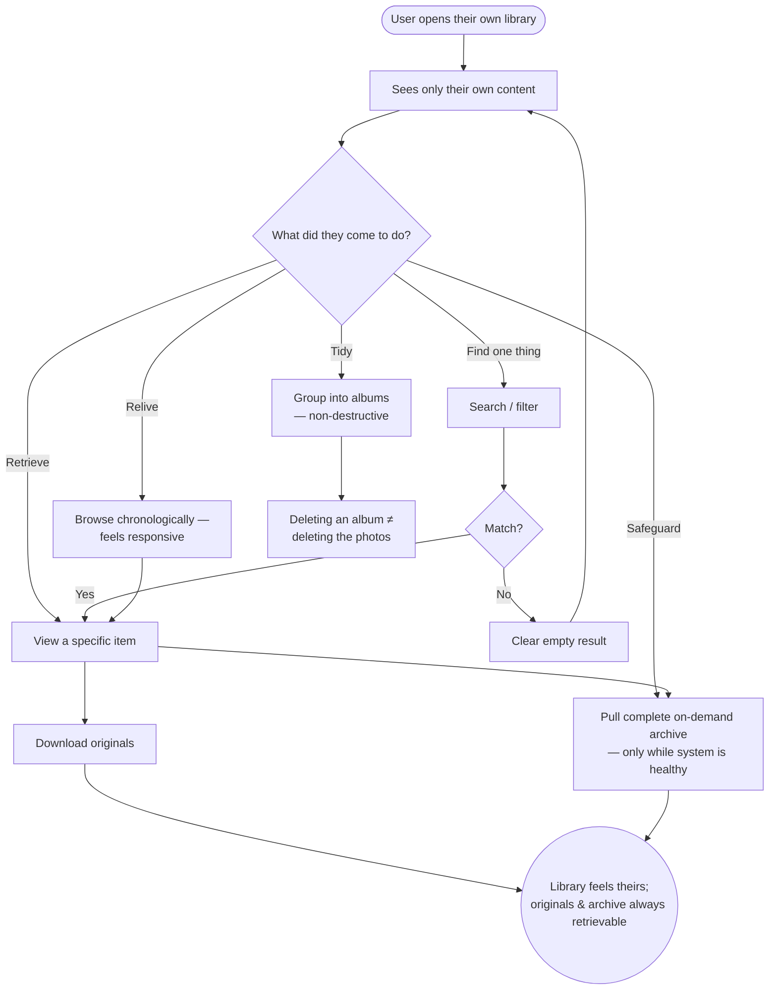

> **One-line definition:** A user browses, finds, and organizes their own media, views and downloads originals, and can pull a complete on-demand export of everything they own.

**Parent capability:** [Self-Hosted Personal Media Storage](../_index.md)

<!--
Every H2 below carries an explicit `{#anchor}` annotation. Downstream skills (extract-business-requirements, define-technical-requirements) cite these sections via Hugo `ref` shortcodes, and Hugo's autogenerated heading IDs are not stable across heading-text edits. Do not strip the anchors when editing this doc.
-->

## Persona {#persona}

The actor is an **active user** — a *Primary actor* from the parent capability's Stakeholders — spending time in their *own* library. They have already stored content (via [Upload Content](./upload-content.md) or [Bulk Import from a Prior Provider](./bulk-import-from-a-prior-provider.md)) and now want to *use* it.

- **Role:** An everyday user browsing, finding, arranging, and retrieving their own photos, videos, and files. Non-technical is the default assumption — they think "my albums," "that trip," "the photo of the receipt," not "queries" or "objects."
- **Context they come from:** They are here to relive a memory, find one specific thing, tidy up, or grab an original to use elsewhere. Their reference point is the commercial photo app they left, which set expectations for fast scrolling, a timeline, search, and albums.
- **What they care about here:** That their library feels like *theirs* — well-ordered, quick to move through, private — and that they can always get their originals, and their whole archive, back out.

## Goal {#goal}

> "I want to look through my own memories — see them by time, find a specific moment, group things into albums — get the original file when I want it, and be able to pull my whole archive out whenever I choose."

## Entry Point {#entry-point}

The user opens their own library. The trigger is usually one of:

- **Relive / browse** — no specific target, just looking through their memories.
- **Find one thing** — they need a particular photo or file (the receipt, the photo to print, the document to attach somewhere).
- **Tidy** — they want to arrange things into albums or groups.
- **Retrieve** — they want the original file to use outside the system.
- **Safeguard** — they want to pull a complete copy of everything, for their own peace of mind or on a schedule.

Whatever the trigger, they arrive already authenticated as themselves, seeing only their own content.

## Journey {#journey}

1. **Open the library.** The user lands in their own content — and *only* their own. Someone else's photos are never mixed in here; content shared *with* them lives in a separate experience ([Receive Shared Content](./receive-shared-content.md)).
2. **Browse.** The user moves through their library in a way that matches how they remember — typically chronologically. Scrolling through years feels responsive rather than laborious.
3. **Search / filter.** When they have something specific in mind, they narrow down to find it. In this journey, search spans only **metadata the system already holds without having to "understand" the content** — filenames, capture dates and date ranges, and the user's own organization (album names, favorites). It deliberately does **not** include content-understanding search (e.g. typing "beach" and matching pixels) in the baseline, because the tiebreaker in the parent capability is *Privacy beats convenience*: any feature that derives searchable meaning *from the content itself* is only acceptable if it can do so without ever exposing that content — or the derived index — to the operator or any third party. Until such a mechanism exists (per-user-key or on-device derivation that stays unreadable to the operator), richer content-based search stays out; if it is ever added, **Private by default** governs it, not the other way around. A search that matches nothing returns a clear empty result, not an error or a dead end.
4. **Organize.** The user groups content into **albums** — the one organizing primitive this journey commits to, chosen because it maps directly onto how the non-technical persona already thinks ("that trip," "the kids"). Alongside albums, two lightweight aids ride on metadata the system already has, so they cost the user nothing to learn: **favorites** (a one-tap "keep this handy" marker) and **date/date-range navigation** over the existing timeline. Heavier taxonomy — freeform tags, nested collections, place-based search — is **deliberately deferred, not designed in**: it adds cognitive load for a non-technical user and, in the case of place/content search, reopens the privacy question above, so it waits until a real need in the operator's circle pulls for it rather than being built speculatively. Crucially, **organizing is non-destructive**: albums and favorites are ways of *seeing* their content, not copies of it and not the content itself.
5. **View a specific item.** They open an individual photo, video, or file to look at it closely.
6. **Download originals.** When they want a local copy — to print, to send outside the system, to edit — they retrieve the **original** file, not a degraded version.
7. **Pull a complete on-demand export.** At any time, the user can request a **full archive of everything they own**, without operator involvement, *while the system is healthy*. This is the user-facing home of the capability's **Operator succession** export mechanism: users are expected to pull these proactively, and may do so on a schedule, because on-demand export is only available when the system is up. This is also the concrete expression of the **Longevity** and **Control** outcomes — their data is always theirs to take. Two things about the archive are settled here in favor of the **stronger Longevity guarantee**:
   - **What's in it:** the export contains **originals *plus* the user's organization**, not originals alone. Originals land as first-class, unmodified files; the user's structure — album membership, favorites, and capture dates — travels alongside them in an **open, self-describing, non-proprietary form** (a portable manifest/sidecar readable without this system). A takeout that dropped album structure would be a weaker Longevity guarantee — the user would keep their pixels but lose the years of arranging that made the library *theirs* — so the archive is designed to be understandable, and re-importable, even if this system no longer exists.
   - **Scheduling and destination:** the user **can schedule recurring exports themselves**, self-service, exactly as the capability's "may schedule periodic pulls" language intends — no operator step. Because the entire point of a proactive pull is to survive the system being down, a scheduled archive must land somewhere the user controls that is **independent of this system's health** (a destination the user designates — their own machine or their own off-system storage). An "export" that only ever wrote back into the same system would defeat its own purpose, so the destination is deliberately *outside* the system's fate.

### Flow Diagram

## Success {#success}

A successful view-and-organize experience leaves the user with:

- **A library that feels like theirs.** Ordered, searchable, and arranged the way they think about their own memories — good enough that they stop missing the commercial app they left.
- **What they came for.** They found the specific thing, relived the trip, or grabbed the original they needed.
- **Standing assurance of control.** They know they can always download originals and pull their entire archive out — so the system never feels like a place their data is *trapped*. This is what makes them comfortable treating it as their primary store.
- **No accidental destruction.** They tidied without fear, because organizing never risks their content.

## Edge Cases & Failure Modes {#edge-cases}

- **A large library.** *Experience-level handling:* browsing years of media feels responsive; the user can leave and come back without losing their place, and no single view forces them to wait on the whole collection loading before they can do anything.
- **Organizing must never destroy content.** Deleting or emptying an **album** removes a *way of seeing* the content — it does **not** delete the photos in it. The experience keeps this distinction unmistakable, so a user tidying up can never be tricked into destroying originals. (Actual deletion of content is a separate, deliberate act — see [Delete Content and Leave](./delete-content-and-leave.md).) This guard is a direct defense of the *Zero data loss* KPI.
- **Export only while the system is healthy.** The on-demand full archive is available when the system is up. If the system is down, only **previously-pulled** exports survive — an honest caveat inherited from **Operator succession**. The experience should make proactive/scheduled pulls feel like the natural habit, not an afterthought, precisely because a user who waits until the system is down has waited too long.
- **A search finds nothing.** The user sees a clear "nothing matched," not an error — and can adjust and try again.
- **A very large export takes a while.** Pulling everything is a big operation; the user perceives it as progressing and can retrieve the finished archive when it is ready, rather than being blocked staring at it.
- **A scheduled export's destination is unreachable.** Because a scheduled recurring export targets a user-controlled destination *outside* this system, that destination can be full, offline, or revoked when a run fires. The experience treats a failed scheduled pull as **legibly failed, not silently skipped** — the user learns their safety habit didn't run, so a lapsed backup never masquerades as a healthy one. This honesty is what keeps scheduled export a real hedge rather than a false sense of security.
- **Downloading a huge original or batch.** Retrieving originals — especially many at once or a large video — is legible and resumable in spirit (the user is not left guessing whether a stalled download failed), consistent with how uploads behave in [Upload Content](./upload-content.md).

## Constraints Inherited from the Capability {#constraints-inherited}

This UX must respect the following items from the parent capability's Business Rules and Success Criteria — named so future readers can trace the lineage:

- **Private by default.** The user browses only their own content, and **no third party — including the operator — can browse it**. There is no operator "view all libraries" surface. Content becomes visible to anyone else only through the explicit, separate act of [Share Content](./share-content.md). This is the rule that keeps content-understanding search out of the baseline ([Journey, step 3](#journey)): any search index derived *from the content itself* would be a new surface on which the operator could read content, so it is not built unless it can be derived and stored in a form the operator cannot read.
- **Operator succession.** The on-demand full export lives in this journey. The capability requires that every user can pull a complete archive of their own content without operator involvement while the system is healthy — this UX is where that promise is exercised, including the "only while healthy" caveat and the expectation that users pull proactively. The capability's "may schedule periodic pulls" language is resolved here as **user-scheduled, self-service recurring exports** whose archive lands in a **user-controlled destination outside this system** ([Journey, step 7](#journey)), so a scheduled pull actually survives the system going down.
- **No storage quotas.** Nothing in browsing or organizing pushes the user toward pruning to save space; they organize for their own sake, not to stay under a limit.
- **Off-site backup is allowed.** Invisible here, but it is part of why the originals the user retrieves are trustworthy and durable.
- **Lost credentials = lost data.** The on-demand export is the user's hedge against loss, which is why the journey urges pulling it proactively — but the experience must stay honest that it is not a *recovery* mechanism: a user who loses their own credentials loses access to the library itself, exports included, with no operator backdoor. Export protects against the system failing; it does not protect against the user losing their key.
- **KPI — Zero data loss.** The non-destructive-organizing guarantee is this journey's contribution to the KPI: tidying, re-arranging, and deleting albums must never cost the user actual content.
- **KPI — Number of active users.** Viewing, downloading, and organizing are three of the four counted **active-user** actions (the fourth being sharing). A user who comfortably lives in their library is, by definition, an active — and retained — user. A library that feels slow or untrustworthy would show up as attrition on this KPI.

## Out of Scope {#out-of-scope}

- **Getting content *in*.** Uploading and device backup are [Upload Content](./upload-content.md); the one-time migration of a prior library is [Bulk Import from a Prior Provider](./bulk-import-from-a-prior-provider.md).
- **Sharing.** Selecting content to share *starts* from the library, but the act of granting someone access — choosing a recipient or a shared group, and revoking later — is its own journey, [Share Content](./share-content.md).
- **Viewing content shared *with* the user.** Content others shared with them is not part of their own library; it is [Receive Shared Content](./receive-shared-content.md).
- **Deleting content and leaving.** Deletion is initiated from the library too, but its safety net (30-day retention) and the departure journey are [Delete Content and Leave](./delete-content-and-leave.md).

## Open Questions {#open-questions}

None remaining. The four questions this journey previously carried have been resolved and folded into the sections above:

- **Organizing primitives** → the journey commits to **albums** as the single organizing primitive (it matches how the non-technical persona already thinks), plus two zero-learning aids that ride on metadata the system already holds — **favorites** and **date/date-range navigation**. Heavier taxonomy (freeform tags, nested collections, place-based search) is **deliberately deferred** until a real need pulls for it, rather than designed in speculatively ([Journey, step 4](#journey)).
- **What search spans** → **only metadata the system already holds without "understanding" the content** — filenames, capture dates/ranges, album names, favorites. Content-understanding search (e.g. "beach") is kept out of the baseline under the *Privacy beats convenience* tiebreaker, and may be added later **only** if it can be derived and stored in a form the operator cannot read — **Private by default** governs it, not the reverse ([Journey, step 3](#journey) and [Constraints](#constraints-inherited)).
- **What a "complete export" contains, and in what form** → the **stronger Longevity guarantee**: **originals *plus* the user's organization** (album membership, favorites, capture dates) in an **open, self-describing, non-proprietary form** readable and re-importable without this system — not originals alone ([Journey, step 7](#journey)).
- **User-scheduled recurring exports and their destination** → **yes, self-service**, with the archive landing in a **user-controlled destination outside this system** so a scheduled pull actually survives the system going down; a failed scheduled run fails legibly rather than silently ([Journey, step 7](#journey), [Edge Cases](#edge-cases), and [Constraints](#constraints-inherited)).
