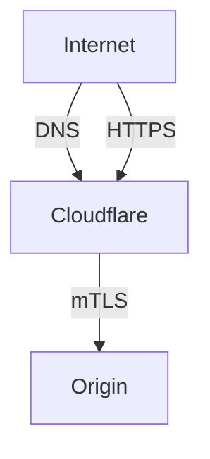
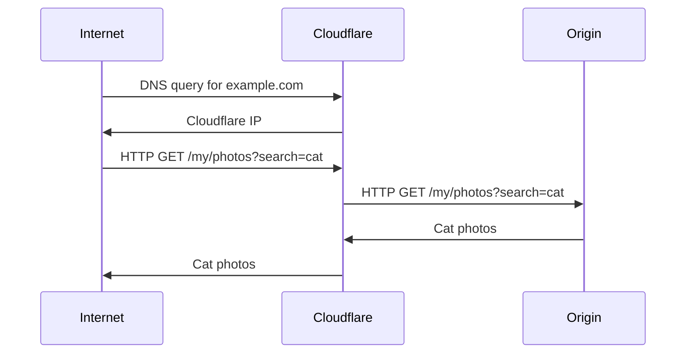

## Overview

In the diagram above, Cloudflare is leveraged as both a DNS provider
and HTTP/HTTP(s) reverse proxy, via [Proxied Records](#proxied-records), to services hosted
at the Origin server. Furthermore, the Origin server is protected
with full strict [mTLS](https://en.wikipedia.org/wiki/Mutual_authentication),
where it requires Cloudflare to present a client certificate for authentication
and authorization when proxying requests.

## Proxied Records

Cloudflare offers [Proxied Records](https://developers.cloudflare.com/dns/manage-dns-records/reference/proxied-dns-records/#proxied-records),
which are DNS records that resolve to Cloudflare IP addresses. These records then allow Cloudflare
to serve as an HTTP/HTTP(s) reverse proxy to your Origin server. This helps prevent exposing your
Origin server IP to the internet and it being associated to your domain, which could
make it a prime target for DDoS attacks. Proxied Records also give Cloudflare the ability
to optimize and cache certain requests (e.g. static content) made to your Origin server.
Below is a simple sequence diagram to provide a visualization of how Proxied Records work.

## Home Lab DNS Records

### machine

`machine.example.com` is used for pointing to all the network boot related services hosted
on a [Public Cloud]({}).

| Properties | |
| ---------- | ---- |
| Client to Cloudflare | mTLS |
| Cloudflare to Origin | mTLS |

[mTLS](https://en.wikipedia.org/wiki/Mutual_authentication) between Client and Cloudflare
is used here because of the sensitive nature of network boot media. All types of raw boot
media (e.g. PXE, iPXE, ISO) will be accessible via this subdomain, which means any unauthorized actor who
obtains access would be able to easily deconstruct and discover key aspects of the home
lab e.g. local network names, local storage configs, etc. This information could
potentially then lead to a leak of the location of the homelab and potential vulnerabilities
it may have.