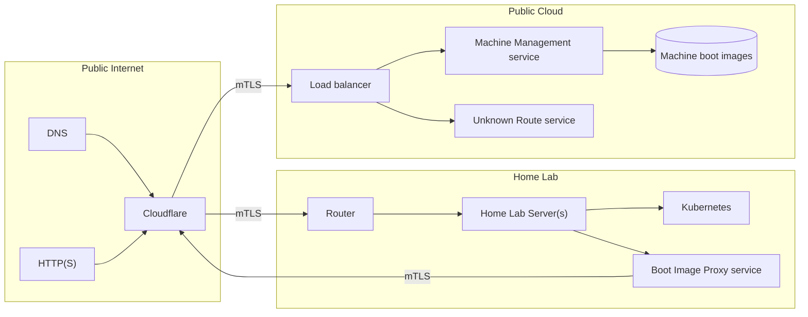

```mermaid
flowchart LR

    dns["DNS"]
    https["HTTP(S)"]
    cloudflare["Cloudflare"]
    homeRouter["Router"]
    homeLab["Home Lab Server(s)"]
    imageProxy["Boot Image Proxy service"]
    k8s["Kubernetes"]
    loadBalancer["Load balancer"]
    bootImages[("Machine boot images")]
    imageService["Machine Management service"]
    sinkService["Unknown Route service"]

    subgraph a [Public Internet]
        dns --> cloudflare
        https --> cloudflare
    end

    subgraph one [Home Lab]
        homeRouter --> homeLab
        homeLab --> k8s
        homeLab --> imageProxy
    end

    subgraph two [Public Cloud]
        loadBalancer --> imageService
        loadBalancer --> sinkService
        imageService --> bootImages
    end

    cloudflare -->|mTLS| loadBalancer
    cloudflare -->|mTLS| homeRouter
    imageProxy --> |mTLS| cloudflare
```