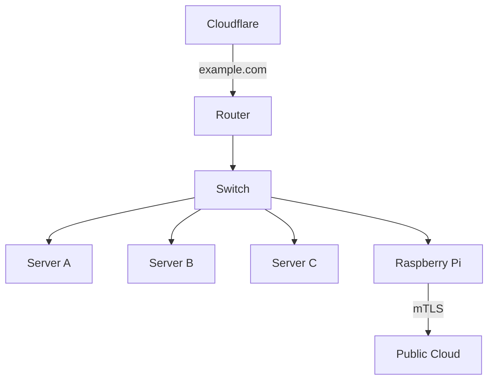
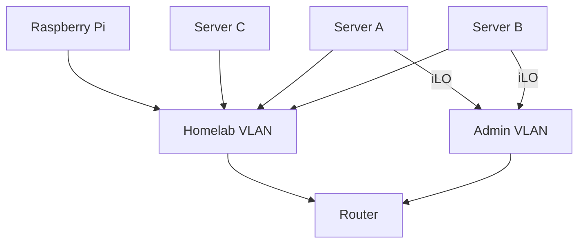

## Overview

The above diagram documents the high level architecture for the physical infrastructure of my home lab.

## Equipment

### Router

Ubiquiti Dream Machine Pro

### Switch

Ubiquiti 48 port PoE

### Servers

- HP ProLiant DL360 Gen 9
    - CPU: 2 x Intel(R) Xeon(R) CPU E5-2620 v3
    - Mem:  8 x 16GB DDR4-2133 RDIMM
    - Boot: 1 x 250GB Samsung 970 Evo Plus M.2-2280 PCIe 3.0 NVME
    - Storage: 4 x 1TB Samsung 870 Evo
    - Power: 2 x HP 500W Flex Slot Platinum Power Supply
    - Accelerator: N/A
- HP ProLiant DL360 Gen 9
    - CPU: 2 x Intel(R) Xeon(R) CPU E5-2620 v3
    - Mem: 8 x 16GB DDR4-2133 RDIMM
    - Boot: 1 x 250GB Samsung 970 Evo Plus M.2-2280 PCIe 3.0 NVME
    - Storage: 4 x 1TB Samsung 870 Evo
    - Power: 2 x HP 500W Flex Slot Platinum Power Supply
    - Accelerator: N/A
- Custom build
    - CPU: 1 x Ryzen 5 5600X
    - Mem: 2 x 8GB DDR4-3600 CL19
    - Boot: N/A
    - Storage: 1 x 1TB Samsung 970 Evo Plus M.2-2280 PCIe 3.0 NVME
    - Power: 1 x EVGA SuperNOVA 750 GT 750 W 80+ Gold
    - Accelerator: 1 x Gigabyte EAGLE Radeon RX 6700 XT 12 GB

## Network Topology

