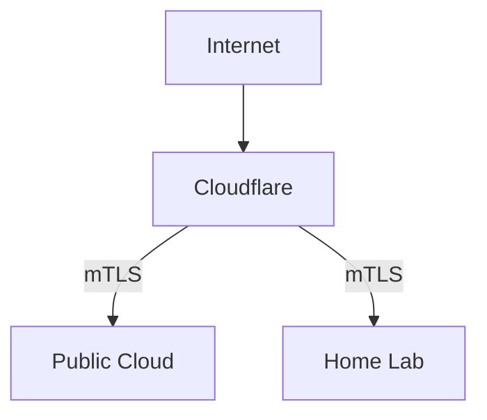

## High Level Diagram

## Cloudflare

Cloudflare is leveraged as both a DNS provider and HTTP(s) proxy
to services hosted on the [Public Cloud](#public-cloud) and [Home Lab](#home-lab).
The primary goals of leveraging Cloudflare are the following:

- [DDoS](https://en.wikipedia.org/wiki/Denial-of-service_attack) protection for all services, especially those self-hosted via the Home Lab.
- Home IP address hiding via [proxied records](https://developers.cloudflare.com/dns/manage-dns-records/reference/proxied-dns-records/#proxied-records)
    - aka, proxy HTTP/HTTP(s) from Internet through Cloudflare before getting to Home Lab

## Public Cloud

A public cloud provider (e.g. AWS, GCP, Azure) is used to host services needed
by the [Home Lab](#home-lab) for various tasks like network booting.

## Home Lab

Any and all computer hardware primarily dedicated to self-hosting services, content,
and experiments is often referred to as a home lab or [home server](https://en.wikipedia.org/wiki/Home_server)
in the context of a single server.