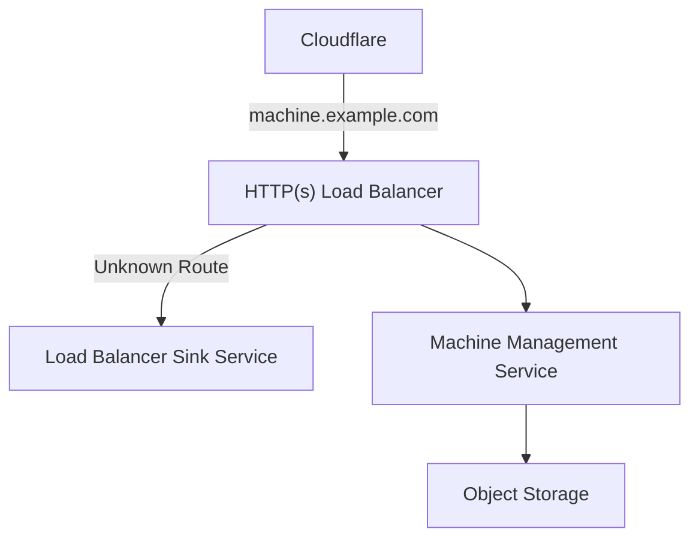
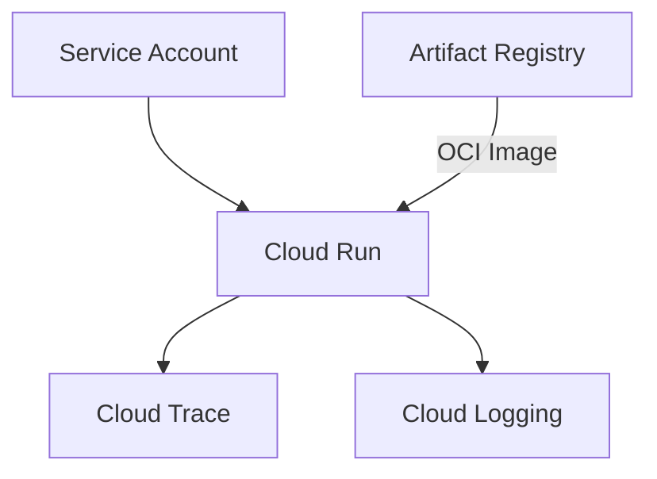
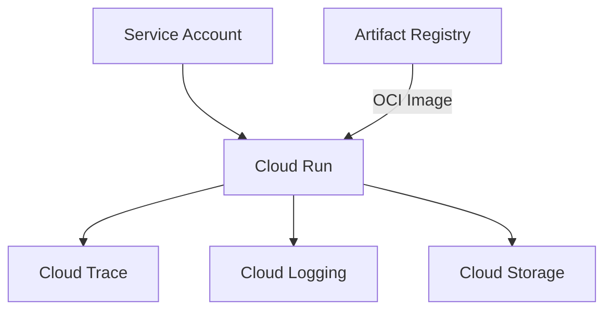

## Overview

The above diagram documents the high level architecture deployed on [Google Cloud](https://cloud.google.com).
All services are a part of the network boot process for the home lab physical infrastracture.

## HTTP(s) Load Balancer

## Load Balancer Sink Service

This service is needed as part of deployment process for an HTTP/HTTP(s) Load Balancer on Google Cloud.
Its role is to receive any requests which do not match any of the patterns defined in the URL map for
the Load Balancer. Upon receiving the request, the service simply responds with a [503 Service Unavailable](https://developer.mozilla.org/en-US/docs/Web/HTTP/Status/503)
HTTP status code.

## Machine Management Service

