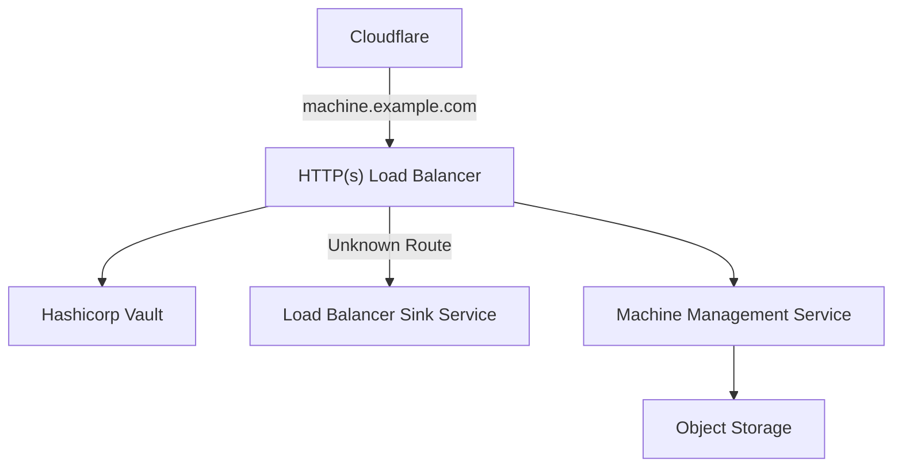
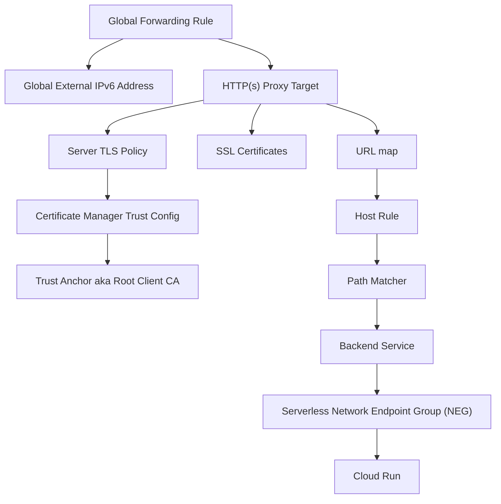
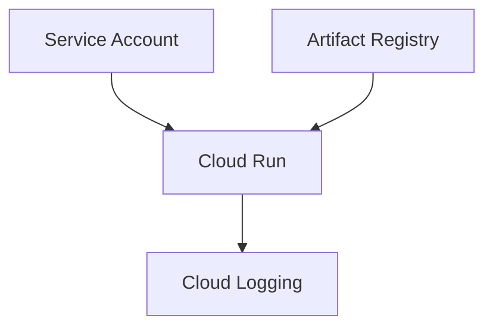
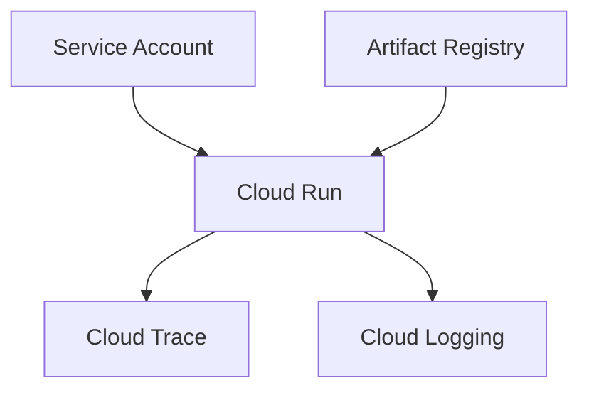
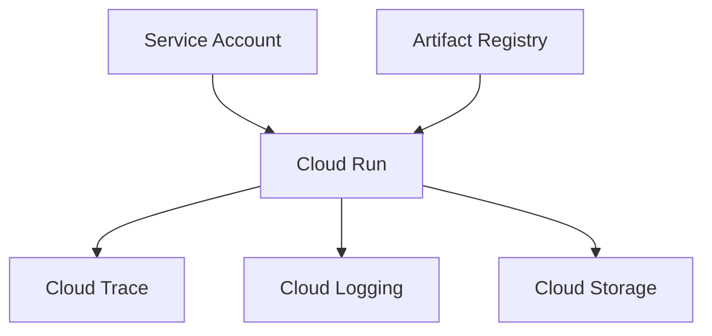

## Overview

The above diagram documents the high level architecture deployed on [Google Cloud](https://cloud.google.com).
All services are a part of the network boot process for the home lab physical infrastracture.

### Google Cloud Products

Below is a possibly exhaustive list of Google Cloud products used:

- [Artifact Registry](https://cloud.google.com/artifact-registry/)
- [Cloud Run](https://cloud.google.com/run)
- [Cloud Storage](https://cloud.google.com/storage)
- [Cloud Logging](https://cloud.google.com/logging)
- [Cloud Monitoring](https://cloud.google.com/monitoring)
- [Cloud Trace](https://cloud.google.com/trace)
- [IAM](https://cloud.google.com/security/products/iam)
- [Certificate Manager](https://cloud.google.com/certificate-manager/docs/overview)
- [Cloud Load Balancing](https://cloud.google.com/load-balancing)

## HTTP(s) Load Balancer

### Forwarding Rule

The forwarding rule is what connects the external IP address to an actual HTTP(s) reverse
proxy. Thus, making the load balancer callable from the internet.

### HTTP(s) Proxy Target

The reverse proxy target is made up of 3 key components:

- **Server TLS Policy:** Defines client certificate validation for mTLS support.
- **SSL certificates:** The certificates that the load balancer hands out to clients for TLS connections.
- **URL map:** Relates HTTP hosts and paths to backend services.

### URL map

The URL map allows for multi-host, multi-path configurations where each path can map
to a distinct backend service.

For each path matcher, a default service is also required to handle unmatched paths. That's
where the [Load Balancer Sink Service](#load-balancer-sink-service) comes in to play.

## Hashicorp Vault

Vault is deployed within Google Cloud to help store secret values such as the mTLS related
certificates used by [Cloudflare]({}) and the [HTTP(s) Load Balancer](#https-load-balancer).
The biggest priority with introducing Vault into the architecture is to allow for the decoupling
of secret management from any singular provider. It also allows for direct integration with Terraform,
which reduces the footprint of what is interacting with secrets e.g. Github Actions secrets can only
be used directly in workflow YAML and not Terraform.

## Load Balancer Sink Service

This service is needed as part of deployment process for an HTTP/HTTP(s) Load Balancer on Google Cloud.
Its role is to receive any requests which do not match any of the patterns defined in the URL map for
the Load Balancer. Upon receiving the request, the service simply responds with a [503 Service Unavailable](https://developer.mozilla.org/en-US/docs/Web/HTTP/Status/503)
HTTP status code.

## Machine Management Service

This is core of the network boot procedure for the homelab physical infrastructure. It is
responsible for serving the appropriate boot scripts and images from [Cloud Storage](https://cloud.google.com/storage)
based on unique machine requests.