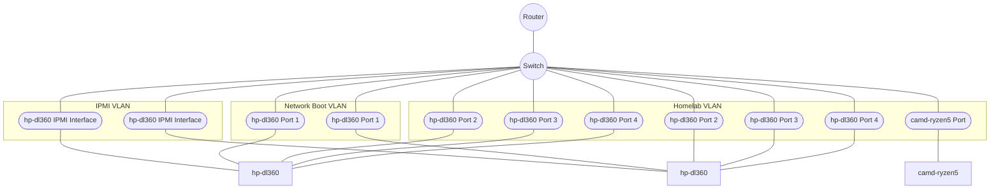

## Components

### Router

[Ubiquiti Dream Machine Pro](https://store.ui.com/us/en/products/udm-pro)

### Switch

[Ubiquiti 48 port PoE](https://store.ui.com/us/en/category/all-switching/products/usw-48-poe)

### Servers

#### hp-dl360 - HP ProLiant DL360 Gen 9
- CPU: 2 x Intel(R) Xeon(R) CPU E5-2620 v3
- Mem:  8 x 16GB DDR4-2133 RDIMM
- Boot: 1 x 250GB Samsung 970 Evo Plus M.2-2280 PCIe 3.0 NVME
- Storage: 4 x 1TB Samsung 870 Evo
- Power: 2 x HP 500W Flex Slot Platinum Power Supply
- Accelerator: N/A

#### camd-ryzen5 - Custom PC
- CPU: 1 x Ryzen 5 5600X
- Mem: 2 x 8GB DDR4-3600 CL19
- Boot: N/A
- Storage: 1 x 1TB Samsung 970 Evo Plus M.2-2280 PCIe 3.0 NVME
- Power: 1 x EVGA SuperNOVA 750 GT 750 W 80+ Gold
- Accelerator: 1 x Gigabyte EAGLE Radeon RX 6700 XT 12 GB

## Network Topology

### IPMI VLAN

This VLAN groups the [IPMI](https://en.wikipedia.org/wiki/Intelligent_Platform_Management_Interface)
or IPMI-like interfaces for all servers in the homelab so that each machine
can be remotely accessed. Most importantly, this access can be restricted via
VLAN firewall rules.

### Network Boot VLAN

This an exclusive VLAN for configuring the servers to network boot.

### Homelab VLAN

This is the *main* VLAN for servers to communicate with one another, as well as,
the external internet.