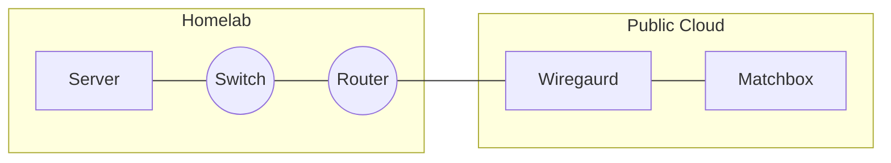

{}
Network booting only applies to following machines in the homelab:
- [hp-dl360]({})
{}

## Architecture

```mermaid
flowchart LR
    subgraph homelab [Homelab]
    server@{ label: "Server", shape: rect }
    switch@{ label: "Switch", shape: circle }
    router@{ label: "Router", shape: circle }
    end

    subgraph cloud [Public Cloud]
    wiregaurd@{ label: "Wiregaurd", shape: rect }
    matchbox@{ label: "Matchbox", shape: rect }
    end

    server --- switch
    switch --- router
    router --- wiregaurd
    wiregaurd --- matchbox
```