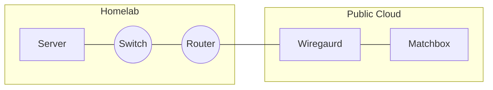
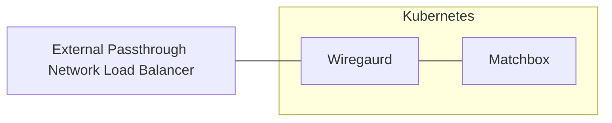
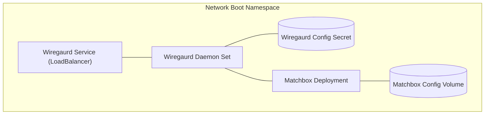
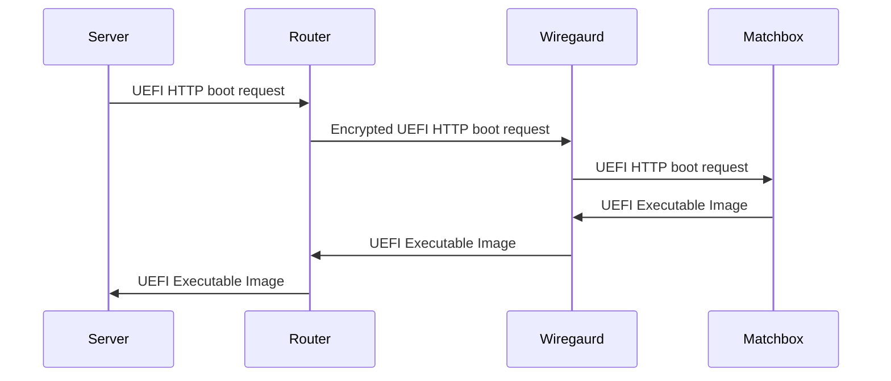

{}
Network booting only applies to following machines in the homelab:
- [hp-dl360]({})
{}

## Architecture

## Homelab

### Setting up Network Boot VLAN

We begin by creating a VLAN on the router and assign by [MAC address](https://en.wikipedia.org/wiki/MAC_address)
the first port of each server to it.

### Initializing Wiregaurd node

One feature of the [Router]({}) is that
it can act as either a [Wiregaurd](https://www.wireguard.com/) server or client.
In this instance, the client implementation is initialized and all traffic on
the Network Boot VLAN will be assigned to go through the [Wiregaurd](https://www.wireguard.com/)
connection.

## Public Cloud

Within a public cloud (e.g. [AWS](https://aws.amazon.com/), [Azure](https://azure.microsoft.com/), [GCP](https://cloud.google.com/)),
a [Kubernetes](https://kubernetes.io/) cluster will be instantiated.

### Kubernetes Architecture

## Boot Sequence

