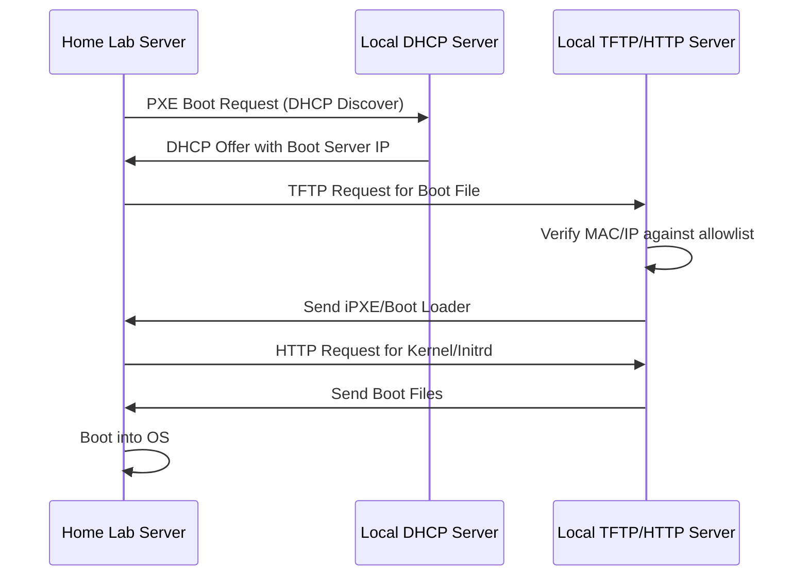
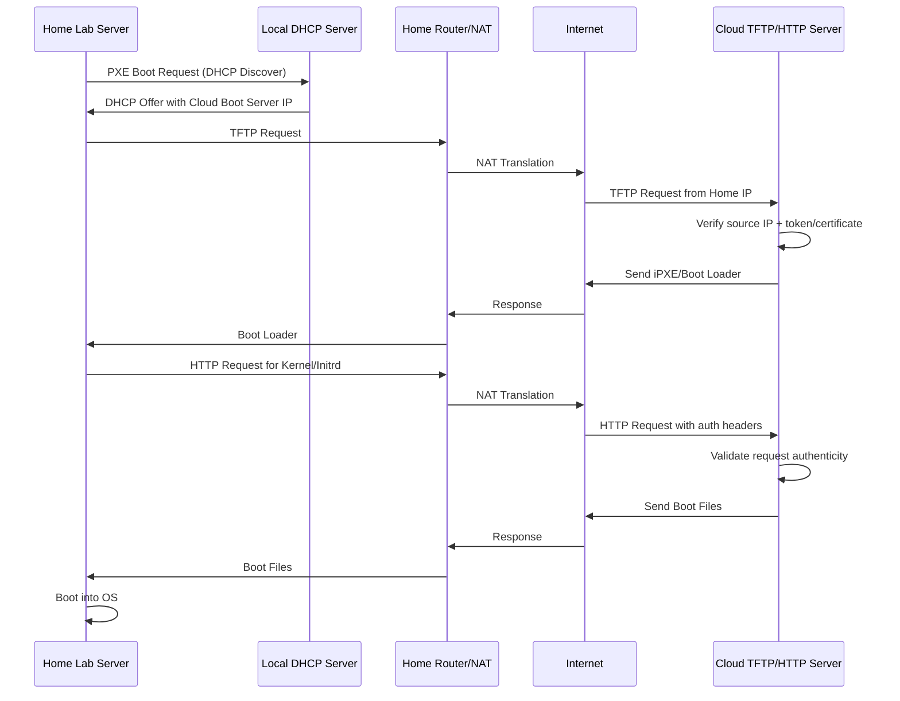
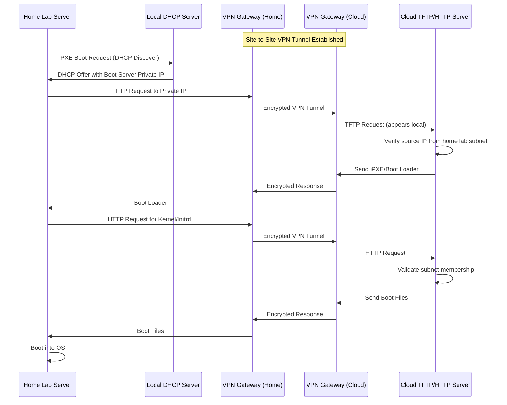

<!--
ADR Categories:
- strategic: High-level architectural decisions (frameworks, auth strategies, cross-cutting patterns)
- user-journey: Solutions for specific user journey problems (feature implementation approaches)
- api-design: API endpoint design decisions (pagination, filtering, bulk operations)
-->

## Context and Problem Statement

When setting up a home lab infrastructure, servers need to be provisioned and booted over the network using PXE (Preboot Execution Environment). This requires a TFTP/HTTP server to serve boot files to requesting machines. The question is: where should this boot server be hosted to balance security, reliability, cost, and operational complexity?

## Decision Drivers

* **Security**: Minimize attack surface and ensure only authorized servers receive boot files
* **Reliability**: Boot process should be resilient and not dependent on external network connectivity
* **Cost**: Minimize ongoing infrastructure costs
* **Complexity**: Keep the operational burden manageable
* **Trust Model**: Clear verification of requesting server identity

## Considered Options

* Option 1: TFTP/HTTP server locally on home lab network
* Option 2: TFTP/HTTP server on public cloud (without VPN)
* Option 3: TFTP/HTTP server on public cloud (with VPN)

## Decision Outcome

Chosen option: "TBD", because evaluation is in progress. This ADR documents the analysis to inform the final decision.

### Consequences

* Good, because [to be determined after option selection]
* Bad, because [to be determined after option selection]

### Confirmation

The implementation will be confirmed by:
- Successfully network booting a test server using the chosen architecture
- Validating the trust model prevents unauthorized boot requests
- Measuring actual costs against estimates

## Pros and Cons of the Options

### Option 1: TFTP/HTTP server locally on home lab network

Run the boot server on local infrastructure (e.g., Raspberry Pi, dedicated VM, or container) within the home lab network.

#### Boot Flow Sequence

#### Trust Model

- **MAC Address Allowlist**: Maintain a list of known server MAC addresses
- **Network Isolation**: Boot server only accessible from home lab VLAN
- **No external exposure**: Traffic never leaves local network
- **Physical security**: Relies on physical access control to home lab

#### Cost Estimate

- **Hardware**: ~$50-100 one-time (Raspberry Pi or repurposed hardware)
- **Power**: ~$5-10/year (low power consumption)
- **Total**: ~$55-110 initial + ~$10/year ongoing

#### Pros and Cons

* Good, because no dependency on internet connectivity for booting
* Good, because lowest latency for boot file transfers
* Good, because all data stays within local network (maximum privacy)
* Good, because lowest ongoing cost
* Good, because simple trust model based on network isolation
* Neutral, because requires dedicated local hardware or resources
* Bad, because single point of failure if boot server goes down
* Bad, because requires local maintenance and updates

### Option 2: TFTP/HTTP server on public cloud (without VPN)

Host the boot server on a cloud provider (AWS, GCP, Azure) and expose it directly to the internet.

#### Boot Flow Sequence

#### Trust Model

- **Source IP Validation**: Restrict to home lab's public IP (dynamic IP is problematic)
- **Certificate/Token Authentication**: Embed certificates in initial bootloader
- **TLS for HTTP**: All HTTP traffic encrypted
- **Challenge-Response**: Boot server can challenge requesting server
- **Risk**: TFTP typically unencrypted, vulnerable to interception

#### Cost Estimate

- **Cloud VM (t3.micro or equivalent)**: ~$10-15/month
- **Data Transfer**: ~$1-5/month (boot files are typically small)
- **Static IP**: ~$3-5/month
- **Total**: ~$170-300/year

#### Pros and Cons

* Good, because boot server remains available even if home lab has issues
* Good, because centralized management in cloud console
* Good, because easy to scale or replicate
* Neutral, because requires internet connectivity for every boot
* Bad, because significantly higher ongoing cost
* Bad, because TFTP protocol is inherently insecure over public internet
* Bad, because complex trust model required (IP validation, certificates)
* Bad, because boot process depends on internet availability
* Bad, because higher latency for boot file transfers
* Bad, because public exposure increases attack surface

### Option 3: TFTP/HTTP server on public cloud (with VPN)

Host the boot server in the cloud but connect the home lab to the cloud via a site-to-site VPN tunnel.

#### Boot Flow Sequence

#### Trust Model

- **VPN Tunnel Encryption**: All traffic encrypted end-to-end
- **Private IP Addressing**: Boot server only accessible via VPN
- **Subnet Validation**: Verify requests come from trusted home lab subnet
- **VPN Authentication**: Strong auth at tunnel level (certificates, pre-shared keys)
- **No public exposure**: Boot server has no public IP

#### Cost Estimate

- **Cloud VM (t3.micro or equivalent)**: ~$10-15/month
- **Data Transfer (VPN)**: ~$5-10/month
- **VPN Gateway Service (if using managed)**: ~$30-50/month OR
- **Self-managed VPN (WireGuard/OpenVPN)**: ~$0 additional
- **Total (self-managed VPN)**: ~$180-300/year
- **Total (managed VPN)**: ~$540-900/year

#### Pros and Cons

* Good, because all traffic encrypted through VPN tunnel
* Good, because boot server not exposed to public internet
* Good, because trust model similar to local option (subnet validation)
* Good, because centralized cloud management benefits
* Good, because boot server available if home lab storage fails
* Neutral, because moderate complexity (VPN setup and maintenance)
* Bad, because higher cost than local option
* Bad, because boot process still depends on internet + VPN availability
* Bad, because VPN adds latency to boot process
* Bad, because VPN gateway becomes additional failure point
* Bad, because most expensive option if using managed VPN service

## More Information

### Related Resources
- [PXE Boot Specification](https://en.wikipedia.org/wiki/Preboot_Execution_Environment)
- [iPXE - Open Source Boot Firmware](https://ipxe.org/)
- [TFTP Protocol (RFC 1350)](https://tools.ietf.org/html/rfc1350)

### Key Questions for Decision
1. How critical is boot availability during internet outages?
2. Is the home lab public IP static or dynamic?
3. What is the acceptable boot time latency?
4. How many servers need to be supported?
5. Is there existing VPN infrastructure?

### Related Issues
- [Issue #595](https://github.com/Zaba505/infra/issues/595) - story(docs): create adr for network boot architecture
