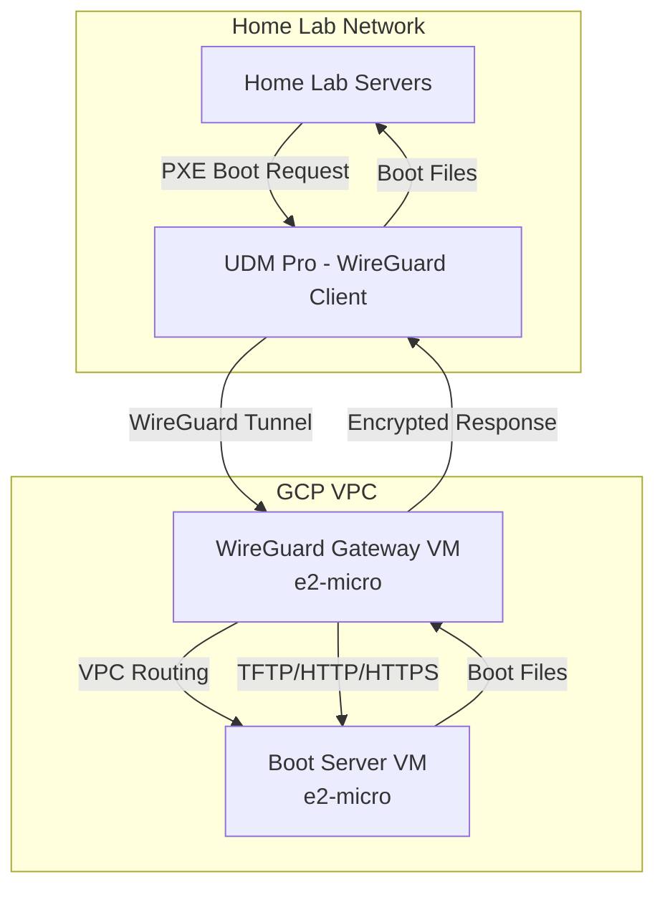
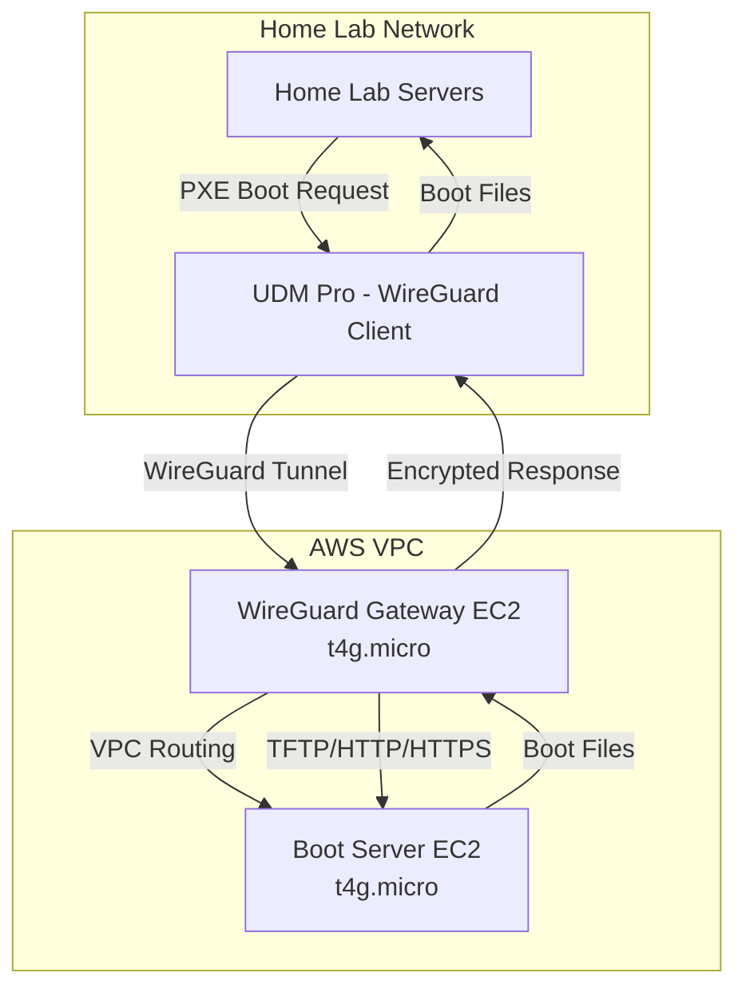

<!--
ADR Categories:
- strategic: High-level architectural decisions (frameworks, auth strategies, cross-cutting patterns)
- user-journey: Solutions for specific user journey problems (feature implementation approaches)
- api-design: API endpoint design decisions (pagination, filtering, bulk operations)
-->

## Context and Problem Statement

[ADR-0002](./0002-network-boot-architecture/) established that network boot infrastructure will be hosted on a cloud provider and accessed via VPN (specifically WireGuard from the UDM Pro). The decision to use cloud hosting provides resilience against local hardware failures while maintaining security through encrypted VPN tunnels.

The question now is: **Which cloud provider should host the network boot infrastructure?**

This decision will affect:
- **Cost**: Ongoing monthly/annual infrastructure costs
- **Protocol Support**: Ability to serve TFTP, HTTP, and HTTPS boot files
- **VPN Integration**: Ease of WireGuard deployment and management
- **Operational Complexity**: Management overhead and maintenance burden
- **Performance**: Boot file transfer latency and throughput
- **Vendor Lock-in**: Future flexibility to migrate or multi-cloud

## Decision Drivers

* **Cost Efficiency**: Minimize ongoing infrastructure costs for home lab scale
* **Protocol Support**: Must support TFTP (UDP/69), HTTP (TCP/80), and HTTPS (TCP/443) for network boot workflows
* **WireGuard Compatibility**: Must support self-managed WireGuard VPN with reasonable effort
* **UDM Pro Integration**: Should work seamlessly with UniFi Dream Machine Pro's native WireGuard client
* **Simplicity**: Minimize operational complexity for a single-person home lab
* **Existing Expertise**: Leverage existing team knowledge and infrastructure
* **Performance**: Sufficient throughput and low latency for boot file transfers (50-200MB per boot)

## Considered Options

* **Option 1**: Google Cloud Platform (GCP)
* **Option 2**: Amazon Web Services (AWS)

## Decision Outcome

Chosen option: "**Option 1: Google Cloud Platform (GCP)**", because:

1. **Existing Infrastructure**: The home lab already uses GCP extensively (Cloud Run services, load balancers, mTLS infrastructure per existing codebase), reducing operational overhead and leveraging existing expertise
2. **Comparable Costs**: Both providers offer similar costs for the required infrastructure (~$6-12/month for compute + VPN), with GCP's e2-micro being sufficient
3. **Equivalent Protocol Support**: Both support TFTP/HTTP/HTTPS via direct VM access (load balancers unnecessary for single boot server), meeting all protocol requirements
4. **WireGuard Compatibility**: Both require self-managed WireGuard deployment (neither has native WireGuard support), with nearly identical implementation complexity
5. **Unified Management**: Consolidating all cloud infrastructure on GCP simplifies monitoring, billing, IAM, and operational workflows

While AWS would be a viable alternative (especially with t4g.micro ARM instances offering slightly better price/performance), the **existing GCP investment** makes it the pragmatic choice to avoid multi-cloud complexity.

### Consequences

* Good, because consolidates all cloud infrastructure on a single provider (reduced operational complexity)
* Good, because leverages existing GCP expertise and IAM configurations
* Good, because unified Cloud Monitoring/Logging across all services
* Good, because single cloud bill simplifies cost tracking
* Good, because existing Terraform modules and patterns can be reused
* Good, because GCP's e2-micro instances (~$6.50/month) are cost-effective for the workload
* Good, because self-managed WireGuard provides flexibility and low cost (~$10/month total)
* Neutral, because both providers have comparable protocol support (TFTP/HTTP/HTTPS via VM)
* Neutral, because both require self-managed WireGuard (no native support)
* Bad, because creates vendor lock-in to GCP (migration would require relearning and reconfiguration)
* Bad, because foregoes AWS's slightly cheaper t4g.micro ARM instances (~$6/month vs GCP's ~$6.50/month)
* Bad, because multi-cloud strategy could provide redundancy (accepted trade-off for simplicity)

### Confirmation

The implementation will be confirmed by:
- Successfully deploying WireGuard VPN gateway on GCP Compute Engine
- Establishing site-to-site VPN tunnel between UDM Pro and GCP
- Network booting a test server via VPN using TFTP and HTTP protocols
- Measuring actual costs against estimates (~$10-15/month)
- Validating boot performance (transfer time < 30 seconds for typical boot)

## Pros and Cons of the Options

### Option 1: Google Cloud Platform (GCP)

Host network boot infrastructure on Google Cloud Platform.

#### Architecture Overview

#### Implementation Details

**Compute**:
- **WireGuard Gateway**: e2-micro VM (~$6.50/month) running Ubuntu 22.04
  - Self-managed WireGuard server
  - IP forwarding enabled
  - Static external IP (~$3.50/month if VM ever stops)
- **Boot Server**: e2-micro VM (same or consolidated with gateway)
  - TFTP server (`tftpd-hpa`)
  - HTTP server (nginx or simple Python server)
  - Optional HTTPS with self-signed cert or Let's Encrypt

**Networking**:
- **VPC**: Default VPC or custom VPC with private subnets
- **Firewall Rules**: 
  - Allow UDP/51820 from home lab public IP (WireGuard)
  - Allow UDP/69, TCP/80, TCP/443 from VPN subnet (boot protocols)
- **Routes**: Custom route to direct home lab subnet through WireGuard gateway
- **Cloud VPN**: Not used (self-managed WireGuard instead to save ~$65/month)

**WireGuard Setup**:
- Install WireGuard on Compute Engine VM
- Configure `wg0` interface with PostUp/PostDown iptables rules
- Store private key in Secret Manager
- UDM Pro connects as WireGuard peer

**Cost Breakdown** (US regions):
| Component | Monthly Cost |
|-----------|--------------|
| e2-micro VM (WireGuard + Boot) | ~$6.50 |
| Static External IP (if attached) | ~$3.50 |
| Egress (10 boots × 150MB) | ~$0.18 |
| **Total** | **~$10.18** |
| **Annual** | **~$122** |

#### Pros and Cons

* Good, because existing home lab infrastructure already uses GCP extensively
* Good, because consolidates all cloud resources on single provider (unified billing, IAM, monitoring)
* Good, because leverages existing GCP expertise and Terraform modules
* Good, because Cloud Monitoring/Logging already configured for other services
* Good, because Secret Manager integration for WireGuard key storage
* Good, because e2-micro instance size is sufficient for network boot workload
* Good, because low cost (~$10/month for self-managed WireGuard)
* Good, because VPC networking is familiar and well-documented
* Neutral, because requires self-managed WireGuard (no native support, same as AWS)
* Neutral, because TFTP/HTTP/HTTPS served directly from VM (no special GCP features needed)
* Bad, because slightly more expensive than AWS t4g.micro (~$6.50/month vs ~$6/month)
* Bad, because creates vendor lock-in to GCP ecosystem
* Bad, because Cloud VPN (managed IPsec) is expensive (~$73/month), so must use self-managed WireGuard

### Option 2: Amazon Web Services (AWS)

Host network boot infrastructure on Amazon Web Services.

#### Architecture Overview

#### Implementation Details

**Compute**:
- **WireGuard Gateway**: t4g.micro EC2 (~$6/month, ARM-based Graviton)
  - Self-managed WireGuard server
  - Source/Dest check disabled for IP forwarding
  - Elastic IP (free when attached to running instance)
- **Boot Server**: t4g.micro EC2 (same or consolidated with gateway)
  - TFTP server (`tftpd-hpa`)
  - HTTP server (nginx)
  - Optional HTTPS with Let's Encrypt or self-signed cert

**Networking**:
- **VPC**: Default VPC or custom VPC with private subnets
- **Security Groups**:
  - WireGuard SG: Allow UDP/51820 from home lab public IP
  - Boot Server SG: Allow UDP/69, TCP/80, TCP/443 from WireGuard SG
- **Route Table**: Add route for home lab subnet via WireGuard instance
- **Site-to-Site VPN**: Not used (self-managed WireGuard saves ~$30/month)

**WireGuard Setup**:
- Install WireGuard on Ubuntu 22.04 or Amazon Linux 2023 EC2
- Configure `wg0` with iptables MASQUERADE
- Store private key in Secrets Manager
- UDM Pro connects as WireGuard peer

**Cost Breakdown** (US East):
| Component | Monthly Cost |
|-----------|--------------|
| t4g.micro EC2 (WireGuard + Boot) | ~$6.00 |
| Elastic IP (attached) | $0.00 |
| Egress (10 boots × 150MB) | ~$0.09 |
| **Total (On-Demand)** | **~$6.09** |
| **Total (1-yr Reserved)** | **~$3.59** |
| **Annual (On-Demand)** | **~$73** |
| **Annual (Reserved)** | **~$43** |

#### Pros and Cons

* Good, because t4g.micro ARM instances offer best price/performance (~$6/month on-demand)
* Good, because Reserved Instances provide significant savings (~40% with 1-year commitment)
* Good, because Elastic IP is free when attached to running instance
* Good, because AWS has extensive documentation and community support
* Good, because potential for future multi-cloud strategy
* Good, because ACM provides free SSL certificates (if public domain used)
* Good, because Secrets Manager for WireGuard key storage
* Good, because low cost (~$6/month on-demand, ~$3.50/month with RI)
* Neutral, because requires self-managed WireGuard (no native support, same as GCP)
* Neutral, because TFTP/HTTP/HTTPS served directly from EC2 (no special AWS features)
* Bad, because introduces multi-cloud complexity (separate billing, IAM, monitoring)
* Bad, because no existing AWS infrastructure in home lab (new learning curve)
* Bad, because requires separate monitoring/logging setup (CloudWatch vs Cloud Monitoring)
* Bad, because separate Terraform state and modules needed
* Bad, because Site-to-Site VPN is expensive (~$36/month), so must use self-managed WireGuard

## More Information

### Detailed Analysis

For in-depth analysis of each provider's capabilities:

- [**Google Cloud Platform Analysis**](../analysis/google-cloud/)
  - [Network Boot Protocol Support (TFTP, HTTP, HTTPS)](../analysis/google-cloud/network-boot/)
  - [WireGuard VPN Support and Deployment](../analysis/google-cloud/wireguard/)

- [**Amazon Web Services Analysis**](../analysis/aws/)
  - [Network Boot Protocol Support (TFTP, HTTP, HTTPS)](../analysis/aws/network-boot/)
  - [WireGuard VPN Support and Deployment](../analysis/aws/wireguard/)

### Key Findings Summary

Both providers offer:
- ✅ **TFTP Support**: Via direct VM/EC2 access (load balancers don't support TFTP)
- ✅ **HTTP/HTTPS Support**: Full support via direct VM/EC2 or load balancers
- ✅ **WireGuard Compatibility**: Self-managed deployment on VM/EC2 (neither has native support)
- ✅ **UDM Pro Integration**: Native WireGuard client works with both
- ✅ **Low Cost**: $6-12/month for compute + VPN infrastructure
- ✅ **Sufficient Performance**: 100+ Mbps throughput on smallest instances

Key differences:
- **GCP**: Slightly higher cost (~$10/month), but consolidates with existing infrastructure
- **AWS**: Slightly lower cost (~$6/month on-demand, ~$3.50/month Reserved), but introduces multi-cloud complexity

### Cost Comparison Table

| Component | GCP (e2-micro) | AWS (t4g.micro On-Demand) | AWS (t4g.micro 1-yr RI) |
|-----------|----------------|---------------------------|-------------------------|
| Compute | $6.50/month | $6.00/month | $3.50/month |
| Static IP | $3.50/month | $0.00 (Elastic IP free when attached) | $0.00 |
| Egress (1.5GB) | $0.18/month | $0.09/month | $0.09/month |
| **Monthly** | **$10.18** | **$6.09** | **$3.59** |
| **Annual** | **$122** | **$73** | **$43** |

**Savings Analysis**: AWS is ~$49-79/year cheaper, but introduces operational complexity.

### Protocol Support Comparison

| Protocol | GCP Support | AWS Support | Implementation |
|----------|-------------|-------------|----------------|
| TFTP (UDP/69) | ⚠️ Via VM | ⚠️ Via EC2 | Direct VM/EC2 access (no LB support) |
| HTTP (TCP/80) | ✅ Full | ✅ Full | Direct VM/EC2 or Load Balancer |
| HTTPS (TCP/443) | ✅ Full | ✅ Full | Direct VM/EC2 or Load Balancer + cert |
| WireGuard | ⚠️ Self-managed | ⚠️ Self-managed | Install on VM/EC2 |

### WireGuard Deployment Comparison

| Aspect | GCP | AWS |
|--------|-----|-----|
| **Native Support** | ❌ No (IPsec Cloud VPN only) | ❌ No (IPsec Site-to-Site VPN only) |
| **Self-Managed** | ✅ Compute Engine | ✅ EC2 |
| **Setup Complexity** | Similar (install, configure, firewall) | Similar (install, configure, SG) |
| **IP Forwarding** | Enable on VM | Disable Source/Dest check |
| **Firewall** | VPC Firewall rules | Security Groups |
| **Key Storage** | Secret Manager | Secrets Manager |
| **Cost** | ~$10/month total | ~$6/month total |

### Trade-offs Analysis

**Choosing GCP**:
- **Wins**: Operational simplicity, unified infrastructure, existing expertise
- **Loses**: ~$50-80/year higher cost, vendor lock-in

**Choosing AWS**:
- **Wins**: Lower cost, Reserved Instance savings, multi-cloud optionality
- **Loses**: Multi-cloud complexity, separate monitoring/billing, new tooling

For a home lab prioritizing **simplicity over cost optimization**, GCP's consolidation benefits outweigh the modest cost difference.

### Related ADRs

- [ADR-0002: Network Boot Architecture](./0002-network-boot-architecture/) - Established requirement for cloud-hosted boot server with VPN
- [ADR-0001: Use MADR for Architecture Decision Records](./0001-use-madr-for-architecture-decision-records/) - MADR format used for this ADR

### Future Considerations

1. **Cost Reevaluation**: If annual costs become significant, reconsider AWS Reserved Instances
2. **Multi-Cloud**: If multi-cloud strategy emerges, migrate boot server to AWS
3. **Managed WireGuard**: If GCP or AWS adds native WireGuard support, reevaluate managed option
4. **High Availability**: If HA required, evaluate multi-region deployment costs on both providers

### Related Issues

- [Issue #597](https://github.com/Zaba505/infra/issues/597) - story(docs): create adr for cloud provider selection
