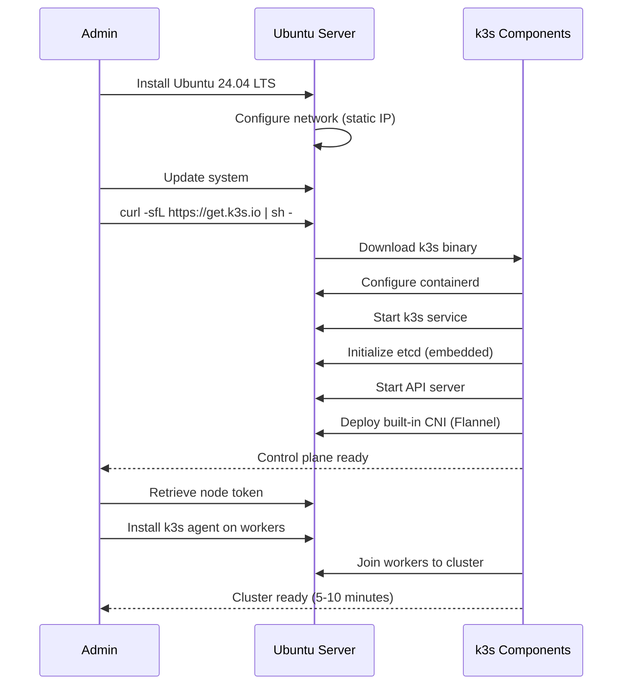
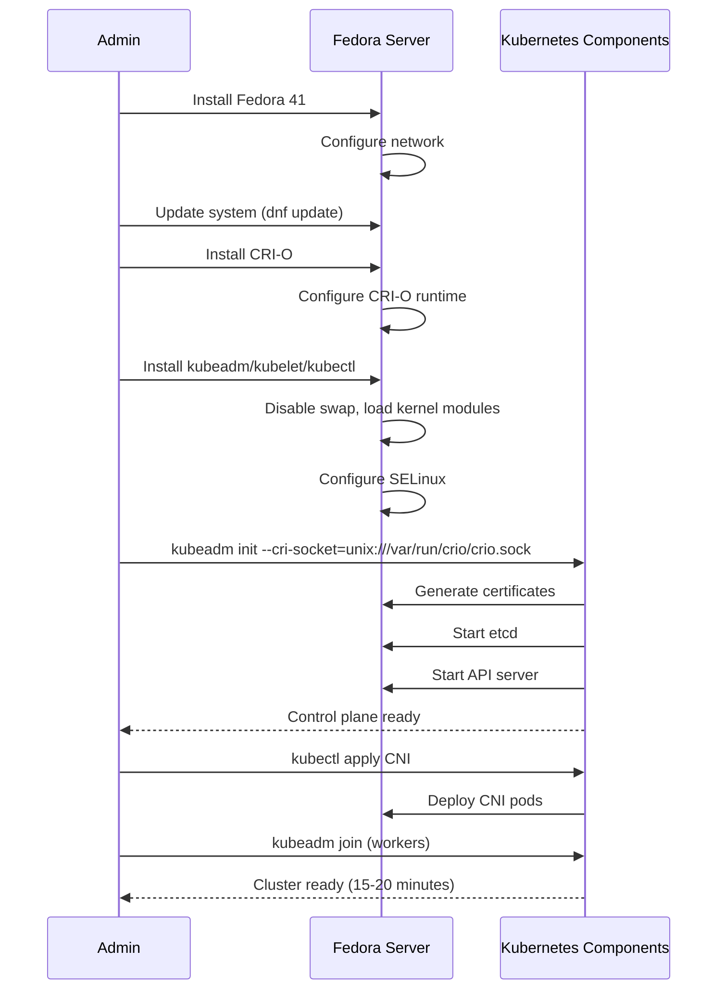
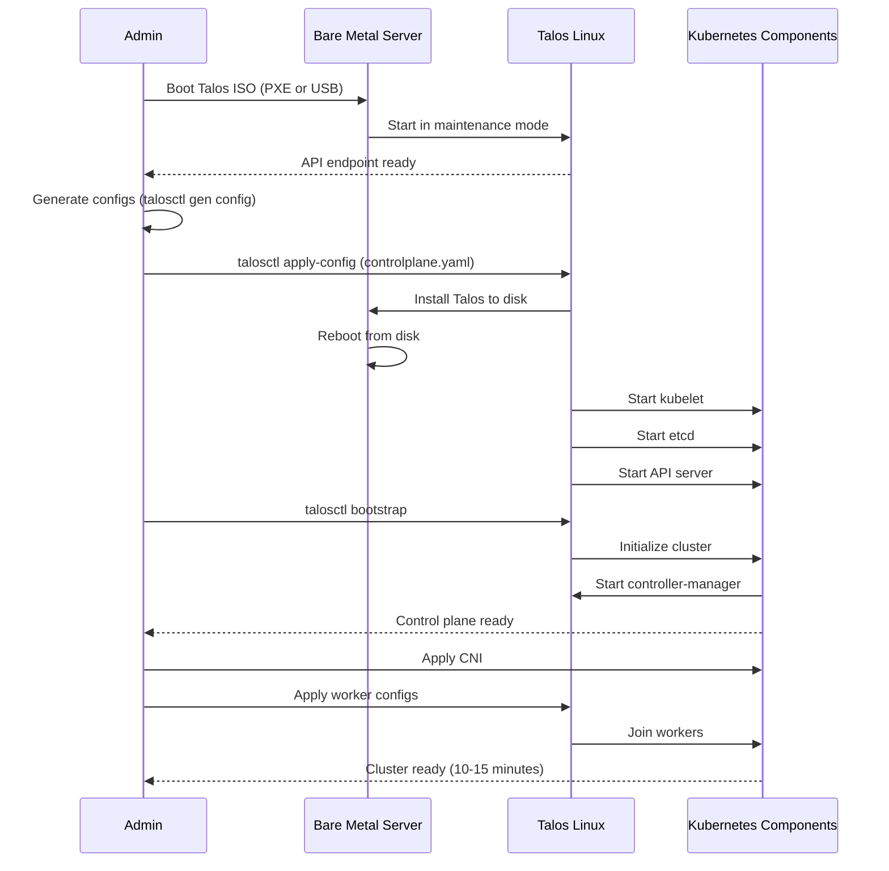
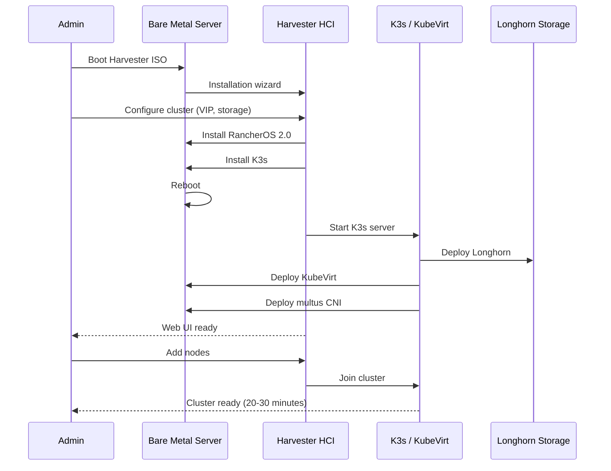

<!--
ADR Categories:
- strategic: High-level architectural decisions (frameworks, auth strategies, cross-cutting patterns)
- user-journey: Solutions for specific user journey problems (feature implementation approaches)
- api-design: API endpoint design decisions (pagination, filtering, bulk operations)
-->

## Context and Problem Statement

The homelab infrastructure requires a server operating system to run Kubernetes clusters for container workloads. The choice of operating system significantly impacts ease of cluster initialization, ongoing maintenance burden, security posture, and operational complexity.

The question is: **Which operating system should be used for homelab Kubernetes servers?**

This decision will affect:
- **Cluster Initialization**: Complexity and time required to bootstrap Kubernetes
- **Maintenance Burden**: Frequency and complexity of OS updates, Kubernetes upgrades, and patching
- **Security Posture**: Attack surface, built-in security features, and hardening requirements
- **Resource Efficiency**: RAM, CPU, and disk overhead
- **Operational Complexity**: Day-to-day management, troubleshooting, and debugging
- **Learning Curve**: Time required for team to become proficient

## Decision Drivers

* **Ease of Kubernetes Setup**: Minimize steps and complexity for cluster initialization
* **Maintenance Simplicity**: Reduce ongoing operational burden for updates and upgrades
* **Security-First Design**: Minimal attack surface and strong security defaults
* **Resource Efficiency**: Low RAM/CPU/disk overhead for cost-effective homelab
* **Learning Curve**: Reasonable adoption time for single-person homelab
* **Community Support**: Strong documentation and active community
* **Immutability**: Prefer declarative, version-controlled configuration (GitOps-friendly)
* **Purpose-Built**: OS optimized specifically for Kubernetes vs general-purpose

## Considered Options

* **Option 1**: Ubuntu Server with k3s
* **Option 2**: Fedora Server with kubeadm
* **Option 3**: Talos Linux (purpose-built Kubernetes OS)
* **Option 4**: Harvester HCI (hyperconverged platform)

## Decision Outcome

Chosen option: "**Option 3: Talos Linux**", because:

1. **Minimal Attack Surface**: No SSH, shell, or package manager eliminates entire classes of vulnerabilities, providing the strongest security posture
2. **Built-in Kubernetes**: No separate installation or configuration complexity - Kubernetes is included and optimized
3. **Declarative Configuration**: API-driven, immutable infrastructure aligns with GitOps principles and prevents configuration drift
4. **Lowest Resource Overhead**: ~768MB RAM vs 1-2GB+ for traditional distros, maximizing homelab hardware efficiency
5. **Simplified Maintenance**: Declarative upgrades (`talosctl upgrade`) for both OS and Kubernetes reduce operational burden
6. **Security by Default**: Immutable filesystem, no shell, KSPP compliance - secure without manual hardening

While the learning curve is steeper than traditional Linux distributions, the benefits of purpose-built Kubernetes infrastructure, minimal maintenance, and superior security outweigh the initial learning investment for a dedicated Kubernetes homelab.

### Consequences

* Good, because minimal attack surface (no SSH/shell) provides strongest security posture
* Good, because declarative configuration enables GitOps workflows and prevents drift
* Good, because lowest resource overhead (~768MB RAM) maximizes homelab efficiency
* Good, because built-in Kubernetes eliminates installation complexity
* Good, because immutable infrastructure prevents configuration drift
* Good, because simplified upgrades (single command for OS + K8s) reduce maintenance burden
* Good, because smallest disk footprint (~500MB) vs 10GB+ for traditional distros
* Good, because secure by default (no manual hardening required)
* Good, because purpose-built design optimized specifically for Kubernetes
* Good, because API-driven management (talosctl) enables automation
* Neutral, because steeper learning curve (paradigm shift from shell-based management)
* Neutral, because smaller community than Ubuntu/Fedora (but active and helpful)
* Bad, because limited to Kubernetes workloads only (not general-purpose)
* Bad, because no shell access requires different troubleshooting approach
* Bad, because newer platform (less mature than Ubuntu/Fedora)
* Bad, because no escape hatch for manual intervention when needed

### Confirmation

The implementation will be confirmed by:
- Successfully bootstrapping a Talos cluster using talosctl
- Deploying test workloads and validating functionality
- Performing declarative OS and Kubernetes upgrades
- Measuring actual resource usage (RAM < 1GB per node)
- Validating security posture (no SSH/shell, immutable filesystem)
- Testing GitOps workflow (machine configs in version control)

## Pros and Cons of the Options

### Option 1: Ubuntu Server with k3s

Host Kubernetes using Ubuntu Server 24.04 LTS with k3s lightweight Kubernetes distribution.

#### Architecture Overview



#### Implementation Details

**Installation**:
```bash
# Single-command k3s install
curl -sfL https://get.k3s.io | sh -

# Get token for workers
sudo cat /var/lib/rancher/k3s/server/node-token

# Install on workers
curl -sfL https://get.k3s.io | K3S_URL=https://control-plane:6443 K3S_TOKEN=<token> sh -
```

**Resource Requirements**:
- **RAM**: 1GB total (512MB OS + 512MB k3s)
- **CPU**: 1-2 cores
- **Disk**: 20GB (10GB OS + 10GB containers)

**Maintenance**:
```bash
# OS updates
sudo apt update && sudo apt upgrade

# k3s upgrade
curl -sfL https://get.k3s.io | INSTALL_K3S_VERSION=v1.32.0+k3s1 sh -

# Or automatic via system-upgrade-controller
```

#### Pros and Cons

* Good, because most familiar Linux distribution (easy adoption)
* Good, because 5-year LTS support (10 years with Ubuntu Pro)
* Good, because k3s provides single-command setup
* Good, because extensive documentation and community support
* Good, because compatible with all Kubernetes tooling
* Good, because automatic security updates available
* Good, because general-purpose (can run non-K8s workloads)
* Good, because low learning curve
* Neutral, because moderate resource overhead (1GB RAM)
* Bad, because general-purpose OS has larger attack surface
* Bad, because requires manual OS updates and reboots
* Bad, because managing OS + Kubernetes lifecycle separately
* Bad, because imperative configuration (not GitOps-native)
* Bad, because mutable filesystem (configuration drift possible)

### Option 2: Fedora Server with kubeadm

Host Kubernetes using Fedora Server with kubeadm (official Kubernetes tool) and CRI-O container runtime.

#### Architecture Overview



#### Implementation Details

**Installation**:
```bash
# Install CRI-O
sudo dnf install -y cri-o
sudo systemctl enable --now crio

# Install kubeadm components
sudo dnf install -y kubelet kubeadm kubectl

# Initialize cluster
sudo kubeadm init --pod-network-cidr=10.244.0.0/16 --cri-socket=unix:///var/run/crio/crio.sock

# Install CNI
kubectl apply -f https://raw.githubusercontent.com/projectcalico/calico/v3.28.0/manifests/calico.yaml
```

**Resource Requirements**:
- **RAM**: 2.2GB total (700MB OS + 1.5GB Kubernetes)
- **CPU**: 2+ cores
- **Disk**: 35GB (15GB OS + 20GB containers)

**Maintenance**:
```bash
# OS updates (every 13 months major upgrade)
sudo dnf update -y

# Kubernetes upgrade
sudo dnf update -y kubeadm
sudo kubeadm upgrade apply v1.32.0
sudo dnf update -y kubelet kubectl
```

#### Pros and Cons

* Good, because SELinux enabled by default (stronger than AppArmor)
* Good, because latest kernel and packages (bleeding edge)
* Good, because native CRI-O support (OpenShift compatibility)
* Good, because upstream for RHEL (enterprise patterns)
* Good, because kubeadm provides full control over cluster
* Neutral, because faster release cycle (latest features, but more upgrades)
* Bad, because short support cycle (13 months per release)
* Bad, because bleeding-edge can introduce instability
* Bad, because complex kubeadm setup (many manual steps)
* Bad, because higher resource overhead (2.2GB RAM)
* Bad, because SELinux configuration for Kubernetes is complex
* Bad, because frequent OS upgrades required (every 13 months)
* Bad, because managing OS + Kubernetes separately
* Bad, because imperative configuration (not GitOps-native)

### Option 3: Talos Linux (purpose-built Kubernetes OS)

Use Talos Linux, an immutable, API-driven operating system designed specifically for Kubernetes with built-in cluster management.

#### Architecture Overview



#### Implementation Details

**Installation**:
```bash
# Generate machine configs
talosctl gen config homelab https://192.168.1.10:6443

# Apply config to control plane (booted from ISO)
talosctl apply-config --insecure --nodes 192.168.1.10 --file controlplane.yaml

# Bootstrap Kubernetes
talosctl bootstrap --nodes 192.168.1.10 --endpoints 192.168.1.10

# Get kubeconfig
talosctl kubeconfig --nodes 192.168.1.10

# Add workers
talosctl apply-config --insecure --nodes 192.168.1.11 --file worker.yaml
```

**Machine Configuration** (declarative YAML):
```yaml
version: v1alpha1
machine:
  type: controlplane
  install:
    disk: /dev/sda
  network:
    hostname: control-plane-1
    interfaces:
      - interface: eth0
        addresses:
          - 192.168.1.10/24
cluster:
  clusterName: homelab
  controlPlane:
    endpoint: https://192.168.1.10:6443
  network:
    cni:
      name: custom
      urls:
        - https://raw.githubusercontent.com/projectcalico/calico/v3.28.0/manifests/calico.yaml
```

**Resource Requirements**:
- **RAM**: 768MB total (256MB OS + 512MB Kubernetes)
- **CPU**: 1-2 cores
- **Disk**: 10-15GB (500MB OS + 10GB containers)

**Maintenance**:
```bash
# Upgrade Talos (OS + Kubernetes)
talosctl upgrade --nodes 192.168.1.10 --image ghcr.io/siderolabs/installer:v1.9.0

# Upgrade Kubernetes version
talosctl upgrade-k8s --nodes 192.168.1.10 --to 1.32.0

# Apply config changes
talosctl apply-config --nodes 192.168.1.10 --file controlplane.yaml
```

#### Pros and Cons

* Good, because Kubernetes built-in (no separate installation)
* Good, because minimal attack surface (no SSH, shell, package manager)
* Good, because immutable infrastructure (config drift impossible)
* Good, because API-driven management (GitOps-friendly)
* Good, because lowest resource overhead (~768MB RAM)
* Good, because declarative configuration (YAML in version control)
* Good, because secure by default (no manual hardening)
* Good, because smallest disk footprint (~500MB OS)
* Good, because designed specifically for Kubernetes
* Good, because simple declarative upgrades (OS + K8s)
* Good, because UEFI Secure Boot support
* Neutral, because smaller community (but active and helpful)
* Bad, because steep learning curve (paradigm shift)
* Bad, because limited to Kubernetes workloads only
* Bad, because troubleshooting without shell requires different approach
* Bad, because relatively new (less mature than Ubuntu/Fedora)
* Bad, because no escape hatch for manual intervention

### Option 4: Harvester HCI (hyperconverged platform)

Use Harvester, a hyperconverged infrastructure platform built on K3s and KubeVirt for unified VM + container management.

#### Architecture Overview



#### Implementation Details

**Installation**: Interactive ISO wizard or cloud-init config

**Resource Requirements**:
- **RAM**: 8GB minimum per node (16GB+ recommended)
- **CPU**: 4+ cores per node
- **Disk**: 250GB+ per node (100GB OS + 150GB storage)
- **Nodes**: 3+ for production HA

**Features**:
- Web UI management
- Built-in storage (Longhorn)
- VM support (KubeVirt)
- Live migration
- Rancher integration

#### Pros and Cons

* Good, because unified VM + container platform
* Good, because built-in K3s (Kubernetes included)
* Good, because web UI simplifies management
* Good, because built-in persistent storage (Longhorn)
* Good, because VM live migration
* Good, because Rancher integration
* Neutral, because immutable OS layer
* Bad, because very heavy resource requirements (8GB+ RAM)
* Bad, because complex architecture (KubeVirt, Longhorn, multus)
* Bad, because overkill for container-only workloads
* Bad, because larger attack surface (web UI, VM layer)
* Bad, because requires 3+ nodes for HA (not single-node friendly)
* Bad, because steep learning curve for full feature set

## More Information

### Detailed Analysis

For in-depth analysis of each operating system:

- [**Ubuntu Server Analysis**](../analysis/server-os/ubuntu/)
  - Installation methods (kubeadm, k3s, MicroK8s)
  - Cluster initialization sequences
  - Maintenance requirements and upgrade procedures
  - Resource overhead and security posture
  
- [**Fedora Server Analysis**](../analysis/server-os/fedora/)
  - kubeadm with CRI-O installation
  - SELinux configuration for Kubernetes
  - Rapid release cycle implications
  - RHEL ecosystem compatibility

- [**Talos Linux Analysis**](../analysis/server-os/talos-linux/)
  - API-driven, immutable architecture
  - Declarative configuration model
  - Security-first design principles
  - Production readiness and advanced features

- [**Harvester HCI Analysis**](../analysis/server-os/harvester/)
  - Hyperconverged infrastructure capabilities
  - VM + container unified platform
  - KubeVirt and Longhorn integration
  - Multi-node cluster requirements

### Key Findings Summary

Resource efficiency comparison:
- ✅ **Talos**: 768MB RAM, 500MB disk (most efficient)
- ✅ **Ubuntu + k3s**: 1GB RAM, 20GB disk (efficient)
- ⚠️ **Fedora + kubeadm**: 2.2GB RAM, 35GB disk (moderate)
- ❌ **Harvester**: 8GB+ RAM, 250GB+ disk (heavy)

Security posture comparison:
- ✅ **Talos**: Minimal attack surface (no SSH/shell, immutable)
- ✅ **Fedora**: SELinux by default (strong MAC)
- ⚠️ **Ubuntu**: AppArmor (moderate security)
- ⚠️ **Harvester**: Larger attack surface (web UI, VM layer)

Operational complexity comparison:
- ✅ **Ubuntu + k3s**: Single command install, familiar management
- ✅ **Talos**: Declarative, automated (after learning curve)
- ⚠️ **Fedora + kubeadm**: Manual kubeadm steps, frequent OS upgrades
- ❌ **Harvester**: Complex HCI architecture, heavy requirements

### Decision Matrix

| Criterion | Ubuntu + k3s | Fedora + kubeadm | Talos Linux | Harvester |
|-----------|--------------|------------------|-------------|-----------|
| **Setup Simplicity** | ⭐⭐⭐⭐⭐ | ⭐⭐⭐ | ⭐⭐⭐⭐ | ⭐⭐⭐ |
| **Maintenance Burden** | ⭐⭐⭐⭐ | ⭐⭐ | ⭐⭐⭐⭐⭐ | ⭐⭐⭐⭐ |
| **Security Posture** | ⭐⭐⭐ | ⭐⭐⭐⭐ | ⭐⭐⭐⭐⭐ | ⭐⭐⭐ |
| **Resource Efficiency** | ⭐⭐⭐⭐ | ⭐⭐⭐ | ⭐⭐⭐⭐⭐ | ⭐ |
| **Learning Curve** | ⭐⭐⭐⭐⭐ | ⭐⭐⭐⭐ | ⭐⭐ | ⭐⭐⭐ |
| **Community Support** | ⭐⭐⭐⭐⭐ | ⭐⭐⭐⭐ | ⭐⭐⭐ | ⭐⭐⭐⭐ |
| **Immutability** | ⭐ | ⭐ | ⭐⭐⭐⭐⭐ | ⭐⭐⭐⭐ |
| **GitOps-Friendly** | ⭐⭐ | ⭐⭐ | ⭐⭐⭐⭐⭐ | ⭐⭐⭐ |
| **Purpose-Built** | ⭐⭐ | ⭐⭐ | ⭐⭐⭐⭐⭐ | ⭐⭐⭐⭐ |
| **Overall Score** | 29/45 | 24/45 | 38/45 | 28/45 |

**Talos Linux scores highest** for Kubernetes-dedicated homelab infrastructure prioritizing security, efficiency, and GitOps workflows.

### Trade-offs Analysis

**Choosing Talos Linux**:
- **Wins**: Best security, lowest overhead, declarative configuration, minimal maintenance
- **Loses**: Steeper learning curve, no shell access, smaller community

**Choosing Ubuntu + k3s**:
- **Wins**: Easiest adoption, largest community, general-purpose flexibility
- **Loses**: Higher attack surface, manual OS management, imperative config

**Choosing Fedora + kubeadm**:
- **Wins**: Latest features, SELinux, enterprise compatibility
- **Loses**: Frequent OS upgrades, complex setup, higher overhead

**Choosing Harvester**:
- **Wins**: VM + container unified platform, web UI
- **Loses**: Heavy resources, complex architecture, overkill for K8s-only

For a **Kubernetes-dedicated homelab prioritizing security and efficiency**, Talos Linux's benefits outweigh the learning curve investment.

### Related ADRs

- [ADR-0001: Use MADR for Architecture Decision Records](./0001-use-madr-for-architecture-decision-records/) - MADR format used for this ADR
- [ADR-0002: Network Boot Architecture](./0002-network-boot-architecture/) - Server provisioning architecture
- [ADR-0003: Cloud Provider Selection](./0003-cloud-provider-selection/) - Cloud infrastructure decisions

### Future Considerations

1. **Team Growth**: If team grows beyond single person, reassess Ubuntu for familiarity
2. **VM Requirements**: If VM workloads emerge, consider Harvester or KubeVirt on Talos
3. **Enterprise Patterns**: If RHEL compatibility needed, reconsider Fedora/CentOS Stream
4. **Maintenance Burden**: If Talos learning curve proves too steep, fallback to k3s
5. **Talos Maturity**: Monitor Talos ecosystem growth and production adoption

### Related Issues

- [Issue #598](https://github.com/Zaba505/infra/issues/598) - story(docs): create adr for server operating system
