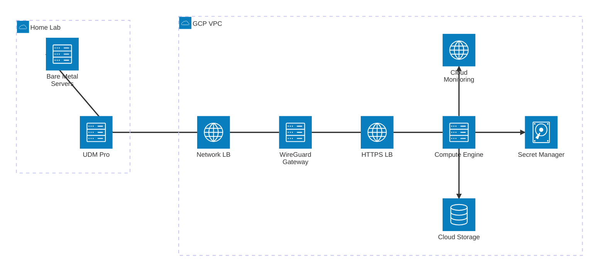
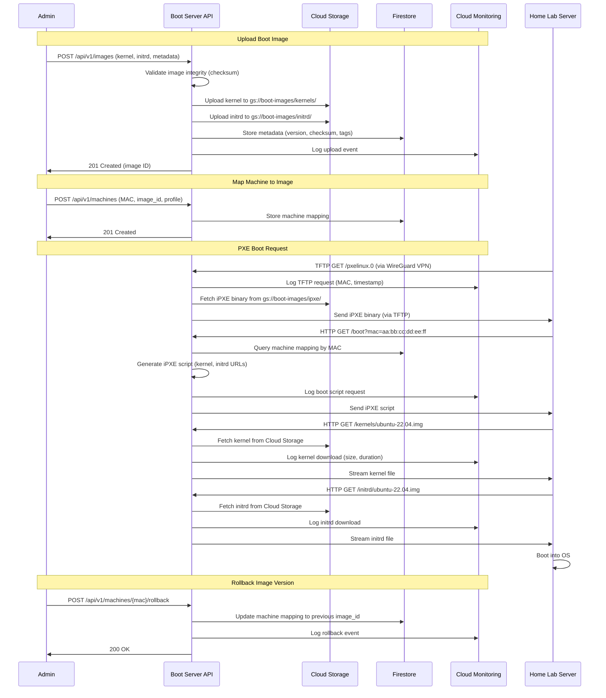
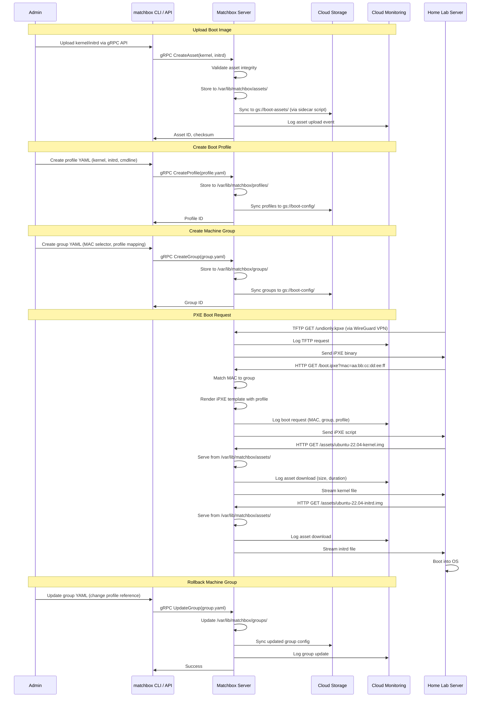

<!--
ADR Categories:
- strategic: High-level architectural decisions (frameworks, auth strategies, cross-cutting patterns)
- user-journey: Solutions for specific user journey problems (feature implementation approaches)
- api-design: API endpoint design decisions (pagination, filtering, bulk operations)
-->

## Context and Problem Statement

[ADR-0002](./0002-network-boot-architecture/) established that network boot infrastructure will be hosted on a cloud provider accessed via WireGuard VPN. [ADR-0003](./0003-cloud-provider-selection/) selected Google Cloud Platform as the hosting provider to consolidate infrastructure and leverage existing expertise.

The remaining question is: **How should the network boot server itself be implemented?**

This decision affects:
- **Development Effort**: Time required to build, test, and maintain the solution
- **Feature Completeness**: Capabilities for boot image management, machine mapping, and provisioning workflows
- **Operational Complexity**: Deployment, monitoring, and troubleshooting burden
- **Security**: Boot image integrity, access control, and audit capabilities
- **Scalability**: Ability to grow from single home lab to multiple environments

The boot server must handle:
1. **TFTP requests** for initial PXE boot loader (iPXE binary)
2. **HTTP/HTTPS requests** for iPXE scripts, kernels, initrd images, and cloud-init configurations
3. **Machine-to-image mapping** to serve appropriate boot files based on MAC address, hardware profile, or tags
4. **Boot image lifecycle management** including upload, versioning, and rollback capabilities

## Decision Drivers

* **Time to Production**: Minimize time to get a working network boot infrastructure
* **Feature Requirements**: Must support machine-specific boot configurations, image versioning, and cloud-init integration
* **Maintenance Burden**: Prefer solutions that minimize ongoing maintenance and updates
* **GCP Integration**: Should leverage GCP services (Cloud Storage, Secret Manager, IAM)
* **Security**: Boot images must be served securely with access control and integrity verification
* **Observability**: Comprehensive logging and monitoring for troubleshooting boot failures
* **Cost**: Minimize infrastructure costs while meeting functional requirements
* **Future Flexibility**: Ability to extend or customize as needs evolve

## Considered Options

* **Option 1**: Custom server implementation (Go-based)
* **Option 2**: Matchbox-based solution

## Decision Outcome

**Status**: Proposed (requires implementation proof-of-concept for final decision)

**Preliminary Recommendation**: "**Option 2: Matchbox-based solution**", because:

1. **Production-Ready**: Matchbox is battle-tested in production environments (CoreOS, Flatcar Linux deployments)
2. **Feature Complete**: Provides HTTP/gRPC APIs, machine grouping, templating, and ignition/cloud-init support out of the box
3. **Time Savings**: Avoids 2-4 weeks of development time for custom implementation
4. **GCP Compatible**: Runs as containerized service on Cloud Run or Compute Engine with Cloud Storage backend
5. **Proven Architecture**: Established patterns for boot image lifecycle and machine matching

However, a proof-of-concept should validate:
- GCP Cloud Storage integration for boot assets
- WireGuard VPN compatibility from UDM Pro
- Performance for home lab scale (< 50ms boot file request latency)
- Operational complexity of running Matchbox vs custom Go service

### Consequences

* Good, because Matchbox provides production-ready boot server with minimal development
* Good, because extensive documentation and community support available
* Good, because supports advanced features (machine grouping, templating, ignition/cloud-init)
* Good, because gRPC API enables programmatic boot configuration management
* Good, because HTTP API provides observability into boot requests and machine states
* Good, because runs as container, compatible with Cloud Run or GKE
* Good, because reduces development time from weeks to days
* Neutral, because introduces external dependency (Matchbox project maintenance)
* Neutral, because requires learning Matchbox configuration patterns
* Bad, because less control over boot server implementation details
* Bad, because may include features unnecessary for home lab scale
* Bad, because dependency on upstream Matchbox project for security patches

### Confirmation

The implementation will be confirmed by:
- Deploying proof-of-concept Matchbox server on GCP Cloud Run or Compute Engine
- Successfully network booting a test server via WireGuard VPN
- Validating boot image upload and versioning workflows
- Measuring boot file request latency (target: < 50ms for TFTP, < 100ms for HTTP)
- Confirming Cloud Storage integration for boot asset storage
- Testing machine-to-image mapping based on MAC address
- Evaluating operational complexity vs custom implementation

## Pros and Cons of the Options

### Option 1: Custom Server Implementation (Go-based)

Build a custom network boot server in Go, leveraging the existing `z5labs/humus` framework for HTTP services.

#### Architecture Overview



**Components**:
- **Boot Server**: Go service deployed to Cloud Run or Compute Engine VM
  - TFTP server (using `pin/tftp` or similar Go library)
  - HTTP/HTTPS server (using `z5labs/humus` framework with OpenAPI)
  - gRPC admin API for boot configuration management
- **Cloud Storage**: Buckets for boot images, iPXE scripts, kernels, initrd files
- **Firestore/Datastore**: Machine-to-image mapping database (MAC → boot profile)
- **Secret Manager**: WireGuard keys, TLS certificates
- **Cloud Monitoring**: Metrics for boot requests, success/failure rates, latency

#### Boot Image Lifecycle



#### Implementation Details

**Development Stack**:
- **Language**: Go 1.24 (leverage existing Go expertise)
- **HTTP Framework**: `z5labs/humus` (consistent with existing services)
- **TFTP Library**: `pin/tftp` or `pack.ag/tftp`
- **Storage Client**: `cloud.google.com/go/storage`
- **Database**: Firestore for machine mappings (or simple JSON config in Cloud Storage)
- **Observability**: OpenTelemetry (metrics, traces, logs to Cloud Monitoring/Trace)

**Deployment**:
- **Compute Engine VM** (Cloud Run doesn't support UDP for TFTP):
  - e2-micro instance ($6.50/month)
  - Container-Optimized OS with Docker
  - systemd service for boot server
  - Health checks: `/health/startup`, `/health/liveness`
- **Networking**:
  - VPC firewall: Allow UDP/69 (TFTP), TCP/80, TCP/443 from WireGuard subnet
  - Static internal IP for boot server
  - Cloud NAT for outbound connectivity (Cloud Storage access)

**Configuration Management**:
- Machine mappings stored in Firestore or Cloud Storage JSON files
- Boot profiles defined in YAML (similar to Matchbox groups):
  ```yaml
  profiles:
    - name: ubuntu-22.04-server
      kernel: gs://boot-images/kernels/ubuntu-22.04.img
      initrd: gs://boot-images/initrd/ubuntu-22.04.img
      cmdline: "console=tty0 console=ttyS0"
      cloud_init: gs://boot-images/cloud-init/ubuntu-base.yaml
  
  machines:
    - mac: "aa:bb:cc:dd:ee:ff"
      profile: ubuntu-22.04-server
      hostname: node-01
  ```

**Cost Breakdown**:
| Component | Monthly Cost |
|-----------|--------------|
| e2-micro VM (boot server) | $6.50 |
| Cloud Storage (50GB boot images) | $1.00 |
| Firestore (minimal reads/writes) | $0.50 |
| Egress (10 boots × 150MB) | $0.18 |
| **Total** | **~$8.18** |

#### Pros and Cons

* Good, because full control over boot server implementation and features
* Good, because leverages existing Go expertise and `z5labs/humus` framework patterns
* Good, because seamless GCP integration (Cloud Storage, Firestore, Secret Manager, IAM)
* Good, because minimal dependencies (no external projects to track)
* Good, because customizable to specific home lab requirements
* Good, because OpenTelemetry observability built-in from existing patterns
* Good, because can optimize for home lab scale (< 20 machines)
* Good, because lightweight implementation (no unnecessary features)
* Neutral, because development effort required (2-4 weeks for MVP)
* Neutral, because requires ongoing maintenance and security updates
* Bad, because reinvents established boot server patterns (TFTP, HTTP serving, machine matching)
* Bad, because testing complexity (TFTP, PXE workflows, network boot scenarios)
* Bad, because potential for bugs in custom TFTP/HTTP implementation
* Bad, because no community support or established best practices
* Bad, because delayed time to production (weeks vs days)

### Option 2: Matchbox-Based Solution

Deploy [Matchbox](https://matchbox.psdn.io/), an open-source network boot server developed by CoreOS (now part of Red Hat), to handle PXE/iPXE boot workflows.

#### Architecture Overview


**Components**:
- **Matchbox Server**: Container deployed to Compute Engine VM
  - HTTP/gRPC APIs for boot workflows and configuration
  - TFTP support via built-in server
  - Machine grouping and profile templating
  - Ignition, Cloud-Init, and generic boot support
- **Cloud Storage**: Backend for boot assets (mounted via gcsfuse or synced periodically)
- **Local Storage**: `/var/lib/matchbox` for assets and configuration (synced from Cloud Storage)
- **Secret Manager**: WireGuard keys, Matchbox TLS certificates
- **Cloud Monitoring**: Logs from Matchbox container, custom metrics via log parsing

#### Boot Image Lifecycle



#### Implementation Details

**Matchbox Deployment**:
- **Container**: `quay.io/poseidon/matchbox:latest` (official image)
- **Compute Engine VM**: e2-small instance ($14/month, 2GB RAM recommended for Matchbox)
- **Storage**:
  - `/var/lib/matchbox`: Persistent disk (10GB SSD, $1.70/month)
  - Cloud Storage sync: Periodic backup of assets/profiles/groups to `gs://matchbox-config/`
  - Option: Use `gcsfuse` to mount Cloud Storage directly (adds latency but simplifies backups)

**Configuration Structure**:
```
/var/lib/matchbox/
├── assets/           # Boot images (kernels, initrds, ISOs)
│   ├── ubuntu-22.04-kernel.img
│   ├── ubuntu-22.04-initrd.img
│   └── flatcar-stable.img.gz
├── profiles/         # Boot profiles (YAML)
│   ├── ubuntu-server.yaml
│   └── flatcar-container.yaml
└── groups/           # Machine groups (YAML)
    ├── default.yaml
    ├── node-01.yaml
    └── storage-nodes.yaml
```

**Example Profile** (`profiles/ubuntu-server.yaml`):
```yaml
id: ubuntu-22.04-server
name: Ubuntu 22.04 LTS Server
boot:
  kernel: /assets/ubuntu-22.04-kernel.img
  initrd:
    - /assets/ubuntu-22.04-initrd.img
  args:
    - console=tty0
    - console=ttyS0
    - ip=dhcp
ignition_id: ubuntu-base.yaml
```

**Example Group** (`groups/node-01.yaml`):
```yaml
id: node-01
name: Node 01 - Ubuntu Server
profile: ubuntu-22.04-server
selector:
  mac: "aa:bb:cc:dd:ee:ff"
metadata:
  hostname: node-01.homelab.local
  ssh_authorized_keys:
    - "ssh-ed25519 AAAA..."
```

**GCP Integration**:
- **Cloud Storage Sync**: Cron job or sidecar container to sync `/var/lib/matchbox` to Cloud Storage
  ```bash
  # Sync every 5 minutes
  */5 * * * * gsutil -m rsync -r /var/lib/matchbox gs://matchbox-config/
  ```
- **Secret Manager**: Store Matchbox TLS certificates for gRPC API authentication
- **Cloud Monitoring**: Ship Matchbox logs to Cloud Logging, parse for metrics:
  - Boot request count by MAC/group
  - Asset download success/failure rates
  - TFTP vs HTTP request distribution

**Networking**:
- VPC firewall: Allow UDP/69 (TFTP), TCP/8080 (HTTP), TCP/8081 (gRPC) from WireGuard subnet
- Optional: Internal load balancer if high availability required (adds ~$18/month)

**Cost Breakdown**:
| Component | Monthly Cost |
|-----------|--------------|
| e2-small VM (Matchbox server) | $14.00 |
| Persistent SSD (10GB) | $1.70 |
| Cloud Storage (50GB backups) | $1.00 |
| Egress (10 boots × 150MB) | $0.18 |
| **Total** | **~$16.88** |

**Note**: Higher cost than custom implementation due to Matchbox's recommended 2GB RAM (e2-small vs e2-micro).

#### Pros and Cons

* Good, because production-ready boot server with extensive real-world usage
* Good, because feature-complete with machine grouping, templating, and multi-OS support
* Good, because gRPC API for programmatic boot configuration management
* Good, because supports Ignition (Flatcar, CoreOS), Cloud-Init, and generic boot workflows
* Good, because well-documented with established best practices
* Good, because active community and upstream maintenance (Red Hat/CoreOS)
* Good, because reduces development time to days (deploy + configure vs weeks of coding)
* Good, because avoids reinventing network boot patterns (TFTP, iPXE, machine matching)
* Good, because proven security model (TLS for gRPC, asset integrity checks)
* Neutral, because requires learning Matchbox configuration patterns (YAML profiles/groups)
* Neutral, because containerized deployment (Docker on Compute Engine or Cloud Run)
* Bad, because introduces external dependency (Matchbox project maintenance)
* Bad, because higher resource requirements (2GB RAM recommended = e2-small at $14/month vs e2-micro at $6.50/month)
* Bad, because some features unnecessary for home lab scale (large-scale provisioning, etcd backend)
* Bad, because less control over implementation details (limited customization)
* Bad, because Cloud Storage integration requires custom sync scripts (Matchbox doesn't natively support GCS backend)
* Bad, because dependency on upstream for security patches and bug fixes

## Detailed Comparison

### Feature Comparison

| Feature | Custom Implementation | Matchbox |
|---------|----------------------|----------|
| **TFTP Support** | ✅ Via Go library | ✅ Built-in |
| **HTTP/HTTPS Boot** | ✅ Via z5labs/humus | ✅ Built-in |
| **iPXE Scripting** | ✅ Custom templates | ✅ Go templates |
| **Machine-to-Image Mapping** | ✅ Firestore/JSON | ✅ YAML groups with selectors |
| **Boot Profile Management** | ✅ Custom API | ✅ gRPC API + YAML |
| **Cloud-Init Support** | ⚠️ Requires implementation | ✅ Native support |
| **Ignition Support** | ❌ Not planned | ✅ Native support (Flatcar, CoreOS) |
| **Asset Versioning** | ⚠️ Requires implementation | ⚠️ Manual (via Cloud Storage versioning) |
| **Rollback Capability** | ⚠️ Requires implementation | ✅ Update group to previous profile |
| **OpenTelemetry Observability** | ✅ Built-in | ⚠️ Logs only (requires parsing) |
| **GCP Cloud Storage Integration** | ✅ Native SDK | ⚠️ Requires sync scripts |
| **gRPC Admin API** | ⚠️ Requires implementation | ✅ Built-in |
| **Multi-Environment Support** | ⚠️ Requires implementation | ✅ Groups + metadata |

### Development Effort Comparison

| Task | Custom Implementation | Matchbox |
|------|----------------------|----------|
| **Initial Setup** | 1-2 days (project scaffolding) | 4-8 hours (deployment + config) |
| **TFTP Server** | 3-5 days (library integration, testing) | ✅ Included |
| **HTTP Boot API** | 2-3 days (z5labs/humus endpoints) | ✅ Included |
| **Machine Matching Logic** | 2-3 days (database queries, selectors) | ✅ Included |
| **Boot Profile Templates** | 2-3 days (iPXE templating) | ✅ Included |
| **Cloud-Init Support** | 3-5 days (parsing, injection) | ✅ Included |
| **Asset Management** | 2-3 days (upload, storage) | ✅ Included |
| **gRPC Admin API** | 3-5 days (proto definitions, server) | ✅ Included |
| **Testing** | 5-7 days (unit, integration, E2E) | 2-3 days (integration only) |
| **Documentation** | 2-3 days | 1 day (reference existing docs) |
| **Total Effort** | **3-4 weeks** | **1 week** |

### Operational Complexity

| Aspect | Custom Implementation | Matchbox |
|--------|----------------------|----------|
| **Deployment** | Docker container on Compute Engine | Docker container on Compute Engine |
| **Configuration Updates** | API calls or Terraform updates | YAML file updates + API/filesystem sync |
| **Monitoring** | OpenTelemetry metrics to Cloud Monitoring | Log parsing + custom metrics |
| **Troubleshooting** | Full access to code, custom logging | Matchbox logs + gRPC API inspection |
| **Security Patches** | Manual code updates | Upstream container image updates |
| **Dependency Updates** | Manual Go module updates | Upstream Matchbox updates |
| **Backup/Restore** | Cloud Storage + Firestore backups | Sync `/var/lib/matchbox` to Cloud Storage |

### Cost Comparison Summary

| Item | Custom | Matchbox | Difference |
|------|--------|----------|------------|
| **Compute** | e2-micro ($6.50/month) | e2-small ($14/month) | +$7.50/month |
| **Storage** | Cloud Storage only ($1/month) | Persistent disk + Cloud Storage ($2.70/month) | +$1.70/month |
| **Development** | 3-4 weeks @ $100/hour = $12,000-16,000 | 1 week @ $100/hour = $4,000 | -$8,000-12,000 |
| **Annual Infrastructure** | ~$98 | ~$203 | +$105/year |
| **TCO (Year 1)** | ~$12,098-16,098 | ~$4,203 | **-$7,895-11,895** |
| **TCO (Year 3)** | ~$12,294-16,294 | ~$4,609 | **-$7,685-11,685** |

**Key Insight**: Even with higher ongoing infrastructure costs, Matchbox's total cost of ownership is significantly lower due to reduced development time.

### Risk Analysis

| Risk | Custom Implementation | Matchbox | Mitigation |
|------|----------------------|----------|------------|
| **Security Vulnerabilities** | High (custom TFTP/HTTP code) | Medium (upstream dependency) | Matchbox: Monitor upstream releases, automated updates |
| **Boot Failures** | High (untested edge cases) | Low (battle-tested) | Custom: Comprehensive E2E testing |
| **Maintenance Burden** | High (ongoing code maintenance) | Low (upstream handles updates) | Both: Automated deployment pipelines |
| **GCP Integration Issues** | Low (native SDK) | Medium (sync scripts) | Matchbox: Robust sync with error handling |
| **Scalability Limits** | Unknown (requires load testing) | Known (handles thousands of nodes) | Both: Monitor boot request latency |
| **Dependency Abandonment** | N/A (no external deps) | Low (Red Hat backing) | Matchbox: Can fork if necessary |

## Proof-of-Concept Plan

Before final decision, implement a basic proof-of-concept for both options:

### Custom Implementation POC (1 week)
1. Basic TFTP server serving iPXE binary (2 days)
2. HTTP endpoint serving iPXE script with static kernel/initrd URLs (1 day)
3. Simple MAC-based machine matching (1 day)
4. Deploy to Compute Engine VM, test via WireGuard VPN (1 day)
5. Measure: boot latency, development complexity, code quality

### Matchbox POC (3 days)
1. Deploy Matchbox container to Compute Engine (1 day)
2. Configure profile and group YAML for Ubuntu boot (1 day)
3. Test boot via WireGuard VPN, validate Cloud Storage sync (1 day)
4. Measure: boot latency, configuration complexity, operational overhead

### POC Success Criteria
- ✅ Successfully boot test server via PXE/iPXE
- ✅ Boot latency < 50ms for TFTP, < 100ms for HTTP
- ✅ Machine-to-image mapping works correctly
- ✅ Cloud Storage integration functional (upload, retrieve boot assets)
- ✅ Logs available in Cloud Monitoring for troubleshooting
- ✅ Configuration update workflow clear and documented

## More Information

### Related Resources
- [Matchbox Documentation](https://matchbox.psdn.io/)
- [Matchbox GitHub Repository](https://github.com/poseidon/matchbox)
- [iPXE Boot Process](https://ipxe.org/howto/chainloading)
- [PXE Boot Specification](https://en.wikipedia.org/wiki/Preboot_Execution_Environment)
- [Flatcar Linux Provisioning with Matchbox](https://www.flatcar.org/docs/latest/provisioning/network-boot/)
- [CoreOS Ignition Specification](https://coreos.github.io/ignition/)
- [Cloud-Init Documentation](https://cloudinit.readthedocs.io/)

### Related ADRs
- [ADR-0002: Network Boot Architecture](./0002-network-boot-architecture/) - Established cloud-hosted boot server with VPN
- [ADR-0003: Cloud Provider Selection](./0003-cloud-provider-selection/) - Selected GCP as hosting provider
- [ADR-0001: Use MADR for Architecture Decision Records](./0001-use-madr-for-architecture-decision-records/) - MADR format

### Future Considerations

1. **High Availability**: If boot server uptime becomes critical, evaluate multi-region deployment or failover strategies
2. **Multi-Cloud**: If multi-cloud strategy emerges, custom implementation may provide better portability
3. **Enterprise Features**: If advanced provisioning workflows required (bare metal Kubernetes, etc.), Matchbox provides stronger foundation
4. **Integration with Existing Services**: Custom implementation could leverage existing `z5labs/humus` patterns and shared infrastructure (monitoring, secrets, etc.)

### Related Issues

- [Issue #601](https://github.com/Zaba505/infra/issues/601) - story(docs): create adr for network boot infrastructure on google cloud
- [Issue #595](https://github.com/Zaba505/infra/issues/595) - story(docs): create adr for network boot architecture
- [Issue #597](https://github.com/Zaba505/infra/issues/597) - story(docs): create adr for cloud provider selection
