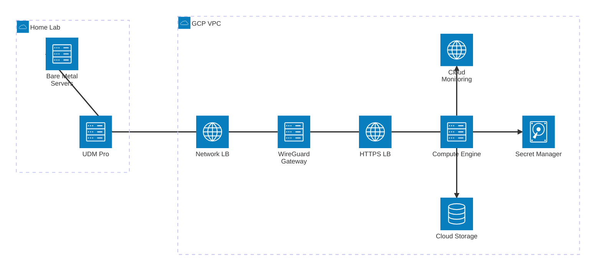
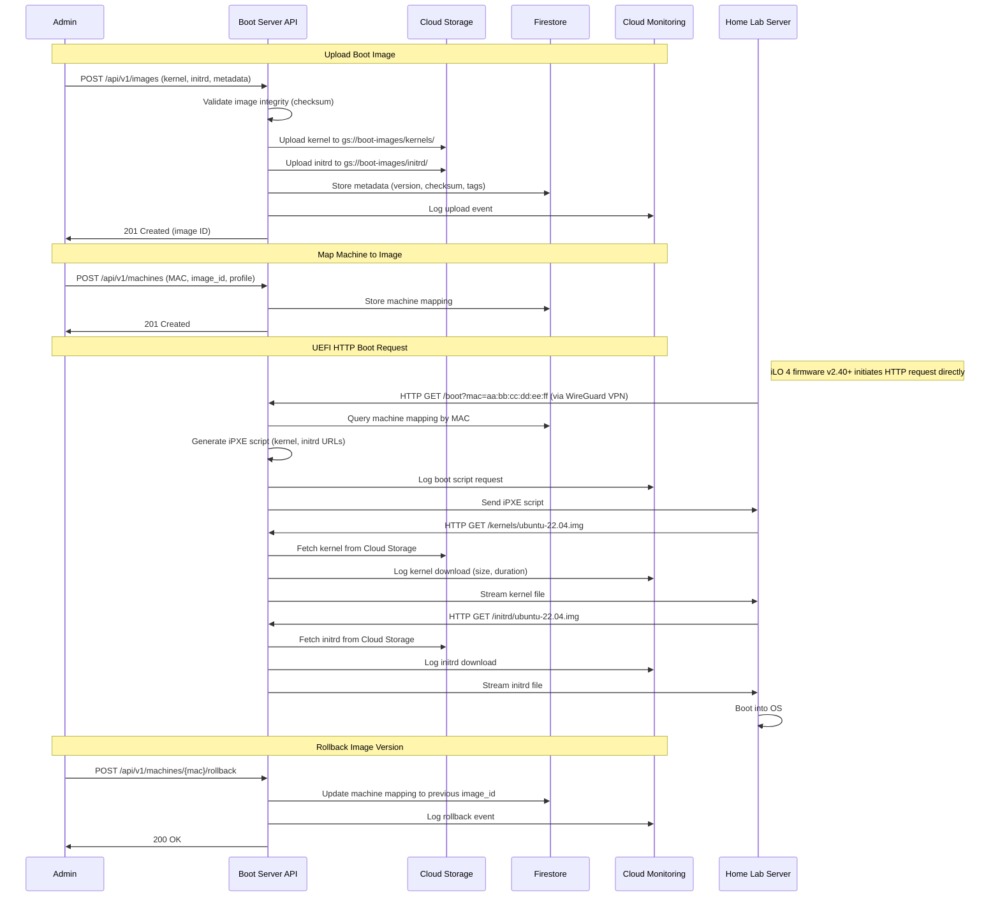
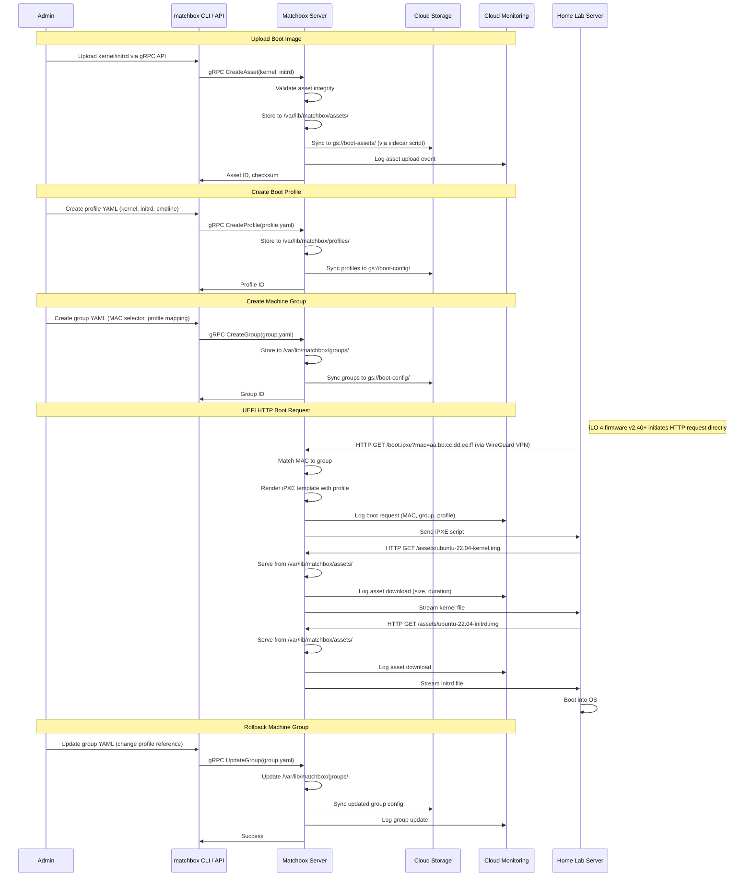
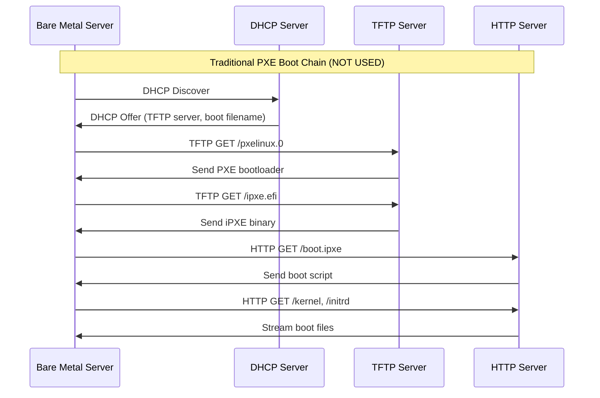
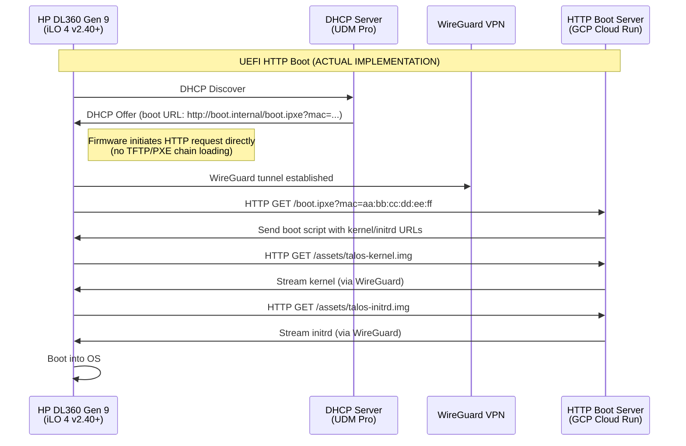
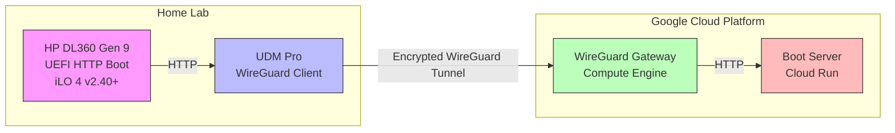

<!--
ADR Categories:
- strategic: High-level architectural decisions (frameworks, auth strategies, cross-cutting patterns)
- user-journey: Solutions for specific user journey problems (feature implementation approaches)
- api-design: API endpoint design decisions (pagination, filtering, bulk operations)
-->

## Context and Problem Statement

[ADR-0002](./0002-network-boot-architecture/) established that network boot infrastructure will be hosted on a cloud provider accessed via WireGuard VPN. [ADR-0003](./0003-cloud-provider-selection/) selected Google Cloud Platform as the hosting provider to consolidate infrastructure and leverage existing expertise.

The remaining question is: **How should the network boot server itself be implemented?**

This decision affects:
- **Development Effort**: Time required to build, test, and maintain the solution
- **Feature Completeness**: Capabilities for boot image management, machine mapping, and provisioning workflows
- **Operational Complexity**: Deployment, monitoring, and troubleshooting burden
- **Security**: Boot image integrity, access control, and audit capabilities
- **Scalability**: Ability to grow from single home lab to multiple environments

The boot server must handle:
1. **HTTP/HTTPS requests** for UEFI boot scripts, kernels, initrd images, and cloud-init configurations
2. **Machine-to-image mapping** to serve appropriate boot files based on MAC address, hardware profile, or tags
3. **Boot image lifecycle management** including upload, versioning, and rollback capabilities

### Hardware-Specific Context

The target bare metal servers (HP DL360 Gen 9) have the following network boot capabilities:

- **UEFI HTTP Boot**: Supported in iLO 4 firmware v2.40+ (released 2016)
- **TLS Support**: Server-side TLS only (no client certificate authentication)
- **Boot Process**: Firmware handles initial HTTP requests directly (no PXE/TFTP chain loading required)
- **Configuration**: Boot URL configured via iLO RBSU or UEFI System Utilities

**Security Implications**: Since the servers cannot present client certificates for mTLS authentication with Cloudflare, the WireGuard VPN serves as the secure transport layer for boot traffic. The HTTP boot server is only accessible through the VPN tunnel.

**Reference**: [HP DL360 Gen 9 Network Boot Analysis](../../analysis/hp_dl360_gen9/network-boot.md)

## Decision Drivers

* **Time to Production**: Minimize time to get a working network boot infrastructure
* **Feature Requirements**: Must support machine-specific boot configurations, image versioning, and cloud-init integration
* **Maintenance Burden**: Prefer solutions that minimize ongoing maintenance and updates
* **GCP Integration**: Should leverage GCP services (Cloud Storage, Secret Manager, IAM)
* **Security**: Boot images must be served securely with access control and integrity verification
* **Observability**: Comprehensive logging and monitoring for troubleshooting boot failures
* **Cost**: Minimize infrastructure costs while meeting functional requirements
* **Future Flexibility**: Ability to extend or customize as needs evolve

## Considered Options

* **Option 1**: Custom server implementation (Go-based)
* **Option 2**: Matchbox-based solution

## Decision Outcome

**Status**: Proposed (requires implementation proof-of-concept for final decision)

**Preliminary Recommendation**: "**Option 1: Custom implementation**", because:

1. **UEFI HTTP Boot Simplification**: Elimination of TFTP/PXE dramatically reduces implementation complexity
2. **Cloud Run Deployment**: HTTP-only boot enables serverless deployment (~$5/month vs $8-17/month)
3. **Development Time Reduced**: UEFI HTTP boot reduces custom development from 3-4 weeks to 2-3 weeks
4. **TCO Competitive**: Year 1 TCO gap narrowed significantly (see cost analysis below)
5. **Full Control**: Custom implementation maintains flexibility for future home lab requirements
6. **GCP Native Integration**: Direct Cloud Storage, Firestore, Secret Manager, and IAM integration
7. **Existing Framework**: Leverages `z5labs/humus` patterns already in use across services

**Note**: The decision is much closer than originally assessed. Without TFTP complexity:
- Custom implementation effort reduced by ~30% (1-2 weeks saved)
- Both options can use Cloud Run (cost parity improved)
- Testing complexity significantly reduced (HTTP-only vs TFTP + HTTP)

The recommendation could reasonably go either way. Final decision should be based on POC results measuring:
- Actual development time for custom HTTP-only implementation
- Cloud Run cold start latency for boot requests
- Operational complexity of Matchbox configuration vs custom API

However, a proof-of-concept should validate:
- Cloud Run cold start latency (< 100ms for boot requests)
- GCP Cloud Storage integration for boot assets
- WireGuard VPN compatibility from UDM Pro
- HTTP boot workflow simplicity vs Matchbox configuration overhead

### Consequences

* Good, because UEFI HTTP boot eliminates TFTP complexity entirely
* Good, because Cloud Run deployment reduces operational overhead and cost
* Good, because leverages existing `z5labs/humus` framework and Go expertise
* Good, because GCP native integration (Cloud Storage, Firestore, Secret Manager, IAM)
* Good, because full control over implementation enables future customization
* Good, because simplified testing (HTTP-only, no TFTP/PXE edge cases)
* Good, because OpenTelemetry observability built-in from existing patterns
* Neutral, because requires 2-3 weeks development time vs 1 week for Matchbox
* Neutral, because ongoing maintenance responsibility (no upstream project support)
* Bad, because custom implementation may miss edge cases that Matchbox handles
* Bad, because reinvents machine matching and boot configuration patterns
* Bad, because POC may reveal Cloud Run cold start latency issues

### Confirmation

The implementation will be confirmed by:
- Deploying proof-of-concept custom boot server on GCP Cloud Run
- Successfully network booting HP DL360 Gen 9 via UEFI HTTP boot through WireGuard VPN
- Confirming iLO 4 firmware v2.40+ compatibility with HTTP boot workflow
- Validating boot image upload and versioning workflows
- Measuring Cloud Run cold start latency for boot requests (target: < 100ms)
- Measuring boot file request latency for kernel/initrd downloads (target: < 100ms)
- Confirming Cloud Storage integration for boot asset storage
- Testing machine-to-image mapping based on MAC address
- Validating WireGuard VPN security for boot traffic (compensating for lack of client cert support)
- Comparing development time estimate (2-3 weeks) against actual implementation

## Pros and Cons of the Options

### Option 1: Custom Server Implementation (Go-based)

Build a custom network boot server in Go, leveraging the existing `z5labs/humus` framework for HTTP services.

#### Architecture Overview



**Components**:
- **Boot Server**: Go service deployed to Cloud Run (or Compute Engine VM as fallback)
  - HTTP/HTTPS server (using `z5labs/humus` framework with OpenAPI)
  - UEFI HTTP boot endpoint serving boot scripts and assets
  - gRPC admin API for boot configuration management
- **Cloud Storage**: Buckets for boot images, boot scripts, kernels, initrd files
- **Firestore/Datastore**: Machine-to-image mapping database (MAC → boot profile)
- **Secret Manager**: WireGuard keys, TLS certificates (optional for HTTPS boot)
- **Cloud Monitoring**: Metrics for boot requests, success/failure rates, latency

#### Boot Image Lifecycle



#### Implementation Details

**Development Stack**:
- **Language**: Go 1.24 (leverage existing Go expertise)
- **HTTP Framework**: `z5labs/humus` (consistent with existing services)
- **UEFI Boot**: Standard HTTP handlers (no special libraries needed)
- **Storage Client**: `cloud.google.com/go/storage`
- **Database**: Firestore for machine mappings (or simple JSON config in Cloud Storage)
- **Observability**: OpenTelemetry (metrics, traces, logs to Cloud Monitoring/Trace)

**Deployment**:
- **Cloud Run** (preferred - HTTP-only boot enables serverless deployment):
  - Min instances: 1 (ensures fast boot response, avoids cold start delays)
  - Max instances: 2 (home lab scale)
  - Memory: 512MB
  - CPU: 1 vCPU
  - Health checks: `/health/startup`, `/health/liveness`
  - Concurrency: 10 requests per instance
- **Alternative - Compute Engine VM** (if Cloud Run latency unacceptable):
  - e2-micro instance ($6.50/month)
  - Container-Optimized OS with Docker
  - systemd service for boot server
  - Health checks: `/health/startup`, `/health/liveness`
- **Networking**:
  - VPC firewall: Allow TCP/80, TCP/443 from WireGuard subnet (no UDP/69 needed)
  - Static internal IP for boot server (Compute Engine) or HTTPS Load Balancer (Cloud Run)
  - Cloud NAT for outbound connectivity (Cloud Storage access)

**Configuration Management**:
- Machine mappings stored in Firestore or Cloud Storage JSON files
- Boot profiles defined in YAML (similar to Matchbox groups):
  ```yaml
  profiles:
    - name: ubuntu-22.04-server
      kernel: gs://boot-images/kernels/ubuntu-22.04.img
      initrd: gs://boot-images/initrd/ubuntu-22.04.img
      cmdline: "console=tty0 console=ttyS0"
      cloud_init: gs://boot-images/cloud-init/ubuntu-base.yaml
  
  machines:
    - mac: "aa:bb:cc:dd:ee:ff"
      profile: ubuntu-22.04-server
      hostname: node-01
  ```

**Cost Breakdown**:

**Option A: Cloud Run Deployment** (Preferred):
| Component | Monthly Cost |
|-----------|--------------|
| Cloud Run (1 min instance, 512MB, always-on) | $3.50 |
| Cloud Storage (50GB boot images) | $1.00 |
| Firestore (minimal reads/writes) | $0.50 |
| Egress (10 boots × 150MB) | $0.18 |
| **Total** | **~$5.18** |

**Option B: Compute Engine Deployment** (If Cloud Run latency unacceptable):
| Component | Monthly Cost |
|-----------|--------------|
| e2-micro VM (boot server) | $6.50 |
| Cloud Storage (50GB boot images) | $1.00 |
| Firestore (minimal reads/writes) | $0.50 |
| Egress (10 boots × 150MB) | $0.18 |
| **Total** | **~$8.18** |

#### Pros and Cons

* Good, because UEFI HTTP boot eliminates TFTP complexity entirely
* Good, because Cloud Run deployment option reduces operational overhead and infrastructure cost
* Good, because full control over boot server implementation and features
* Good, because leverages existing Go expertise and `z5labs/humus` framework patterns
* Good, because seamless GCP integration (Cloud Storage, Firestore, Secret Manager, IAM)
* Good, because minimal dependencies (no external projects to track)
* Good, because customizable to specific home lab requirements
* Good, because OpenTelemetry observability built-in from existing patterns
* Good, because can optimize for home lab scale (< 20 machines)
* Good, because lightweight implementation (no unnecessary features)
* Good, because simplified testing (HTTP-only, no TFTP/PXE edge cases)
* Good, because standard HTTP serving is well-understood (lower risk than TFTP)
* Neutral, because development effort required (2-3 weeks for MVP, reduced from 3-4 weeks)
* Neutral, because requires ongoing maintenance and security updates
* Neutral, because Cloud Run cold start latency needs validation (POC required)
* Bad, because reinvents machine matching and boot configuration patterns
* Bad, because testing network boot scenarios still requires hardware
* Bad, because potential for bugs in custom implementation
* Bad, because no community support or established best practices
* Bad, because development time still longer than Matchbox (2-3 weeks vs 1 week)

### Option 2: Matchbox-Based Solution

Deploy [Matchbox](https://matchbox.psdn.io/), an open-source network boot server developed by CoreOS (now part of Red Hat), to handle UEFI HTTP boot workflows.

#### Architecture Overview


**Components**:
- **Matchbox Server**: Container deployed to Cloud Run or Compute Engine VM
  - HTTP/gRPC APIs for boot workflows and configuration
  - UEFI HTTP boot support (TFTP disabled)
  - Machine grouping and profile templating
  - Ignition, Cloud-Init, and generic boot support
- **Cloud Storage**: Backend for boot assets (mounted via gcsfuse or synced periodically)
- **Local Storage** (Compute Engine only): `/var/lib/matchbox` for assets and configuration (synced from Cloud Storage)
- **Secret Manager**: WireGuard keys, Matchbox TLS certificates
- **Cloud Monitoring**: Logs from Matchbox container, custom metrics via log parsing

#### Boot Image Lifecycle



#### Implementation Details

**Matchbox Deployment**:
- **Container**: `quay.io/poseidon/matchbox:latest` (official image)
- **Deployment Options**:
  - **Cloud Run** (preferred - HTTP-only boot enables serverless deployment):
    - Min instances: 1 (ensures fast boot response)
    - Memory: 1GB RAM (Matchbox recommendation)
    - CPU: 1 vCPU
    - Storage: Cloud Storage for assets/profiles/groups (via HTTP API)
  - **Compute Engine VM** (if persistent local storage preferred):
    - e2-small instance ($14/month, 2GB RAM recommended for Matchbox)
    - `/var/lib/matchbox`: Persistent disk (10GB SSD, $1.70/month)
    - Cloud Storage sync: Periodic backup of assets/profiles/groups to `gs://matchbox-config/`
    - Option: Use `gcsfuse` to mount Cloud Storage directly (adds latency but simplifies backups)

**Configuration Structure**:
```
/var/lib/matchbox/
├── assets/           # Boot images (kernels, initrds, ISOs)
│   ├── ubuntu-22.04-kernel.img
│   ├── ubuntu-22.04-initrd.img
│   └── flatcar-stable.img.gz
├── profiles/         # Boot profiles (YAML)
│   ├── ubuntu-server.yaml
│   └── flatcar-container.yaml
└── groups/           # Machine groups (YAML)
    ├── default.yaml
    ├── node-01.yaml
    └── storage-nodes.yaml
```

**Example Profile** (`profiles/ubuntu-server.yaml`):
```yaml
id: ubuntu-22.04-server
name: Ubuntu 22.04 LTS Server
boot:
  kernel: /assets/ubuntu-22.04-kernel.img
  initrd:
    - /assets/ubuntu-22.04-initrd.img
  args:
    - console=tty0
    - console=ttyS0
    - ip=dhcp
ignition_id: ubuntu-base.yaml
```

**Example Group** (`groups/node-01.yaml`):
```yaml
id: node-01
name: Node 01 - Ubuntu Server
profile: ubuntu-22.04-server
selector:
  mac: "aa:bb:cc:dd:ee:ff"
metadata:
  hostname: node-01.homelab.local
  ssh_authorized_keys:
    - "ssh-ed25519 AAAA..."
```

**GCP Integration**:
- **Cloud Storage Sync**: Cron job or sidecar container to sync `/var/lib/matchbox` to Cloud Storage
  ```bash
  # Sync every 5 minutes
  */5 * * * * gsutil -m rsync -r /var/lib/matchbox gs://matchbox-config/
  ```
- **Secret Manager**: Store Matchbox TLS certificates for gRPC API authentication
- **Cloud Monitoring**: Ship Matchbox logs to Cloud Logging, parse for metrics:
  - Boot request count by MAC/group
  - Asset download success/failure rates
  - TFTP vs HTTP request distribution

**Networking**:
- VPC firewall: Allow TCP/8080 (HTTP), TCP/8081 (gRPC) from WireGuard subnet (no UDP/69 needed)
- Optional: Internal load balancer if high availability required (adds ~$18/month)
- Note: Cloud Run deployment includes integrated HTTPS load balancing

**Cost Breakdown**:

**Option A: Cloud Run Deployment** (Preferred):
| Component | Monthly Cost |
|-----------|--------------|
| Cloud Run (1 min instance, 1GB RAM, always-on) | $7.00 |
| Cloud Storage (50GB boot images) | $1.00 |
| Egress (10 boots × 150MB) | $0.18 |
| **Total** | **~$8.18** |

**Option B: Compute Engine Deployment** (If persistent local storage preferred):
| Component | Monthly Cost |
|-----------|--------------|
| e2-small VM (Matchbox server) | $14.00 |
| Persistent SSD (10GB) | $1.70 |
| Cloud Storage (50GB backups) | $1.00 |
| Egress (10 boots × 150MB) | $0.18 |
| **Total** | **~$16.88** |

#### Pros and Cons

* Good, because HTTP-only boot enables Cloud Run deployment (reduces cost significantly)
* Good, because UEFI HTTP boot eliminates TFTP complexity and potential failure points
* Good, because production-ready boot server with extensive real-world usage
* Good, because feature-complete with machine grouping, templating, and multi-OS support
* Good, because gRPC API for programmatic boot configuration management
* Good, because supports Ignition (Flatcar, CoreOS), Cloud-Init, and generic boot workflows
* Good, because well-documented with established best practices
* Good, because active community and upstream maintenance (Red Hat/CoreOS)
* Good, because reduces development time to days (deploy + configure vs weeks of coding)
* Good, because avoids reinventing network boot patterns (machine matching, boot configuration)
* Good, because proven security model (TLS for gRPC, asset integrity checks)
* Neutral, because requires learning Matchbox configuration patterns (YAML profiles/groups)
* Neutral, because containerized deployment (Docker on Compute Engine or Cloud Run)
* Neutral, because Cloud Run deployment option competitive with custom implementation cost
* Bad, because introduces external dependency (Matchbox project maintenance)
* Bad, because some features unnecessary for home lab scale (large-scale provisioning, etcd backend)
* Bad, because less control over implementation details (limited customization)
* Bad, because Cloud Storage integration requires custom sync scripts (Matchbox doesn't natively support GCS backend)
* Bad, because dependency on upstream for security patches and bug fixes

## UEFI HTTP Boot Architecture

This section documents the UEFI HTTP boot capability that fundamentally changes the network boot infrastructure design.

### Boot Process Overview

**Traditional PXE Boot** (NOT USED - shown for comparison):



**UEFI HTTP Boot** (ACTUAL IMPLEMENTATION):



### Key Differences

| Aspect | Traditional PXE | UEFI HTTP Boot |
|--------|----------------|----------------|
| **Initial Protocol** | TFTP (UDP/69) | HTTP (TCP/80) or HTTPS (TCP/443) |
| **Boot Loader** | Requires TFTP transfer of iPXE binary | Firmware has HTTP client built-in |
| **Chain Loading** | PXE → TFTP → iPXE → HTTP | Direct HTTP boot (no chain) |
| **Firewall Rules** | UDP/69, TCP/80, TCP/443 | TCP/80, TCP/443 only |
| **Cloud Run Support** | ❌ (UDP not supported) | ✅ (HTTP-only) |
| **Transfer Speed** | ~1-5 Mbps (TFTP) | 10-100 Mbps (HTTP) |
| **Complexity** | High (multiple protocols) | Low (HTTP-only) |

### Security Architecture

**Challenge**: HP DL360 Gen 9 UEFI HTTP boot does not support client-side TLS certificates (mTLS).

**Solution**: WireGuard VPN provides transport-layer security:



**Why WireGuard instead of Cloudflare mTLS?**

- **Cloudflare mTLS Limitation**: Requires client certificates at TLS layer
- **UEFI Firmware Limitation**: Cannot present client certificates during TLS handshake
- **WireGuard Solution**: Provides mutual authentication at network layer (pre-shared keys)
- **Security Equivalent**: WireGuard offers same security properties as mTLS:
  - Mutual authentication (both endpoints authenticated)
  - Confidentiality (all traffic encrypted)
  - Integrity (authenticated encryption via ChaCha20-Poly1305)
  - No Internet exposure (boot server only accessible via VPN)

### Firmware Configuration

**HP iLO 4 UEFI HTTP Boot Setup**:

1. **Access Configuration**:
   - iLO web interface → Remote Console → Power On → Press F9 (RBSU)
   - Or: Direct RBSU access during POST (Press F9)

2. **Enable UEFI HTTP Boot**:
   - Navigate: `System Configuration → BIOS/Platform Configuration (RBSU) → Network Options`
   - Set `Network Boot` to `Enabled`
   - Set `Boot Mode` to `UEFI` (not Legacy BIOS)
   - Enable `UEFI HTTP Boot Support`

3. **Configure NIC**:
   - Navigate: `RBSU → Network Options → [FlexibleLOM/PCIe NIC]`
   - Set `Option ROM` to `Enabled` (required for UEFI boot option to appear)
   - Set `Network Boot` to `Enabled`
   - Configure IPv4/IPv6 settings (DHCP or static)

4. **Set Boot Order**:
   - Navigate: `RBSU → Boot Options → UEFI Boot Order`
   - Move network device to top priority

5. **Configure Boot URL** (via DHCP or static):
   - DHCP option 67: `http://10.x.x.x/boot.ipxe?mac=${net0/mac}`
   - Or: Static configuration in UEFI System Utilities

**Required Firmware Versions**:
- **iLO 4**: v2.40 or later (for UEFI HTTP boot support)
- **System ROM**: P89 v2.60 or later (recommended)

**Verification**:
```bash
# Check iLO firmware version via REST API
curl -k -u admin:password https://ilo-address/redfish/v1/Managers/1/ | jq '.FirmwareVersion'

# Expected output: "2.40" or higher
```

### Architectural Implications

**TFTP Elimination Impact**:

1. **Deployment**: Cloud Run becomes viable (no UDP/TFTP requirement)
2. **Cost**: Reduced infrastructure costs (~$5-8/month vs $8-17/month)
3. **Complexity**: Simplified networking (TCP-only firewall rules)
4. **Development**: Reduced effort (no TFTP library, testing, edge cases)
5. **Scalability**: Cloud Run autoscaling vs fixed VM capacity
6. **Maintenance**: Serverless reduces operational overhead

**Decision Impact**:

The removal of TFTP complexity fundamentally shifts the cost/benefit analysis:

- **Custom Implementation**: More attractive (Cloud Run, reduced development time)
- **Matchbox**: Still valid but cost/complexity advantage reduced
- **TCO Gap**: Narrowed from ~$8,000-12,000 to ~$4,000-8,000 (Year 1)
- **Development Gap**: Reduced from 2-3 weeks to 1-2 weeks

## Detailed Comparison

### Feature Comparison

| Feature | Custom Implementation | Matchbox |
|---------|----------------------|----------|
| **UEFI HTTP Boot** | ✅ Native (standard HTTP) | ✅ Built-in |
| **HTTP/HTTPS Boot** | ✅ Via z5labs/humus | ✅ Built-in |
| **Cloud Run Deployment** | ✅ Preferred option | ✅ Enabled by HTTP-only |
| **Boot Scripting** | ✅ Custom templates | ✅ Go templates |
| **Machine-to-Image Mapping** | ✅ Firestore/JSON | ✅ YAML groups with selectors |
| **Boot Profile Management** | ✅ Custom API | ✅ gRPC API + YAML |
| **Cloud-Init Support** | ⚠️ Requires implementation | ✅ Native support |
| **Ignition Support** | ❌ Not planned | ✅ Native support (Flatcar, CoreOS) |
| **Asset Versioning** | ⚠️ Requires implementation | ⚠️ Manual (via Cloud Storage versioning) |
| **Rollback Capability** | ⚠️ Requires implementation | ✅ Update group to previous profile |
| **OpenTelemetry Observability** | ✅ Built-in | ⚠️ Logs only (requires parsing) |
| **GCP Cloud Storage Integration** | ✅ Native SDK | ⚠️ Requires sync scripts |
| **gRPC Admin API** | ⚠️ Requires implementation | ✅ Built-in |
| **Multi-Environment Support** | ⚠️ Requires implementation | ✅ Groups + metadata |

### Development Effort Comparison

| Task | Custom Implementation | Matchbox |
|------|----------------------|----------|
| **Initial Setup** | 1-2 days (project scaffolding) | 4-8 hours (deployment + config) |
| **UEFI HTTP Boot** | 1-2 days (standard HTTP endpoints) | ✅ Included |
| **HTTP Boot API** | 2-3 days (z5labs/humus endpoints) | ✅ Included |
| **Machine Matching Logic** | 2-3 days (database queries, selectors) | ✅ Included |
| **Boot Script Templates** | 2-3 days (boot script templating) | ✅ Included |
| **Cloud-Init Support** | 3-5 days (parsing, injection) | ✅ Included |
| **Asset Management** | 2-3 days (upload, storage) | ✅ Included |
| **gRPC Admin API** | 3-5 days (proto definitions, server) | ✅ Included |
| **Cloud Run Deployment** | 1 day (Cloud Run config) | 1 day (Cloud Run config) |
| **Testing** | 3-5 days (unit, integration, E2E - simplified) | 2-3 days (integration only) |
| **Documentation** | 2-3 days | 1 day (reference existing docs) |
| **Total Effort** | **2-3 weeks** | **1 week** |

### Operational Complexity

| Aspect | Custom Implementation | Matchbox |
|--------|----------------------|----------|
| **Deployment** | Docker container on Compute Engine | Docker container on Compute Engine |
| **Configuration Updates** | API calls or Terraform updates | YAML file updates + API/filesystem sync |
| **Monitoring** | OpenTelemetry metrics to Cloud Monitoring | Log parsing + custom metrics |
| **Troubleshooting** | Full access to code, custom logging | Matchbox logs + gRPC API inspection |
| **Security Patches** | Manual code updates | Upstream container image updates |
| **Dependency Updates** | Manual Go module updates | Upstream Matchbox updates |
| **Backup/Restore** | Cloud Storage + Firestore backups | Sync `/var/lib/matchbox` to Cloud Storage |

### Cost Comparison Summary

**Comparing Cloud Run Deployments** (Preferred for both options):

| Item | Custom (Cloud Run) | Matchbox (Cloud Run) | Difference |
|------|--------|----------|------------|
| **Compute** | Cloud Run ($3.50/month) | Cloud Run ($7/month) | +$3.50/month |
| **Storage** | Cloud Storage ($1/month) | Cloud Storage ($1/month) | $0 |
| **Development** | 2-3 weeks @ $100/hour = $8,000-12,000 | 1 week @ $100/hour = $4,000 | -$4,000-8,000 |
| **Annual Infrastructure** | ~$54 | ~$96 | +$42/year |
| **TCO (Year 1)** | ~$8,054-12,054 | ~$4,096 | **-$3,958-7,958** |
| **TCO (Year 3)** | ~$8,162-12,162 | ~$4,288 | **-$3,874-7,874** |

**Key Insights**:
- UEFI HTTP boot enables Cloud Run deployment for both options, dramatically reducing infrastructure costs
- Custom implementation TCO gap narrowed from $7,895-11,895 to $3,958-7,958 (Year 1)
- Both options now cost ~$5-8/month for infrastructure (vs $8-17/month with TFTP)
- Development time difference reduced from 2-3 weeks to 1-2 weeks
- Decision is much closer than originally assessed

### Risk Analysis

| Risk | Custom Implementation | Matchbox | Mitigation |
|------|----------------------|----------|------------|
| **Security Vulnerabilities** | Medium (standard HTTP code, well-understood) | Medium (upstream dependency) | Both: Monitor for security updates, automated deployments |
| **Boot Failures** | Medium (HTTP-only reduces complexity) | Low (battle-tested) | Custom: Comprehensive E2E testing with real hardware |
| **Cloud Run Cold Starts** | Medium (needs validation) | Medium (needs validation) | Both: Min instances = 1 (always-on) |
| **Maintenance Burden** | Medium (ongoing code maintenance) | Low (upstream handles updates) | Both: Automated deployment pipelines |
| **GCP Integration Issues** | Low (native SDK) | Medium (sync scripts) | Matchbox: Robust sync with error handling |
| **Scalability Limits** | Low (Cloud Run autoscaling) | Low (handles thousands of nodes) | Both: Monitor boot request latency |
| **Dependency Abandonment** | N/A (no external deps) | Low (Red Hat backing) | Matchbox: Can fork if necessary |

## Proof-of-Concept Plan

Before final decision, implement a basic proof-of-concept for both options:

### Custom Implementation POC (3-5 days)
1. HTTP endpoint serving boot script with static kernel/initrd URLs (1 day)
2. Simple MAC-based machine matching (Firestore or JSON) (1 day)
3. Deploy to Cloud Run, test via WireGuard VPN (1 day)
4. Measure: Cloud Run cold start latency, boot workflow, development complexity
5. Test UEFI HTTP boot from HP DL360 Gen 9 (iLO 4 v2.40+) (1 day)

### Matchbox POC (2-3 days)
1. Deploy Matchbox container to Cloud Run (1 day)
2. Configure profile and group YAML for Ubuntu/Talos boot (1 day)
3. Test UEFI HTTP boot via WireGuard VPN, validate Cloud Storage sync (1 day)
4. Measure: Cloud Run cold start latency, configuration complexity, operational overhead

### POC Success Criteria
- ✅ Successfully boot test server via UEFI HTTP boot (HP DL360 Gen 9, iLO 4 v2.40+)
- ✅ Boot latency < 100ms for HTTP requests (kernel/initrd downloads)
- ✅ Cloud Run cold start latency < 100ms (with min instances = 1)
- ✅ Machine-to-image mapping works correctly based on MAC address
- ✅ Cloud Storage integration functional (upload, retrieve boot assets)
- ✅ WireGuard VPN secures boot traffic (no client cert issues)
- ✅ Logs available in Cloud Monitoring for troubleshooting
- ✅ Configuration update workflow clear and documented
- ✅ Firmware compatibility confirmed (no TFTP fallback needed)

## More Information

### Related Resources
- [Matchbox Documentation](https://matchbox.psdn.io/)
- [Matchbox GitHub Repository](https://github.com/poseidon/matchbox)
- [iPXE Boot Process](https://ipxe.org/howto/chainloading)
- [PXE Boot Specification](https://en.wikipedia.org/wiki/Preboot_Execution_Environment)
- [Flatcar Linux Provisioning with Matchbox](https://www.flatcar.org/docs/latest/provisioning/network-boot/)
- [CoreOS Ignition Specification](https://coreos.github.io/ignition/)
- [Cloud-Init Documentation](https://cloudinit.readthedocs.io/)

### Related ADRs
- [ADR-0002: Network Boot Architecture](./0002-network-boot-architecture/) - Established cloud-hosted boot server with VPN
- [ADR-0003: Cloud Provider Selection](./0003-cloud-provider-selection/) - Selected GCP as hosting provider
- [ADR-0001: Use MADR for Architecture Decision Records](./0001-use-madr-for-architecture-decision-records/) - MADR format

### Future Considerations

1. **High Availability**: If boot server uptime becomes critical, evaluate multi-region deployment or failover strategies
2. **Multi-Cloud**: If multi-cloud strategy emerges, custom implementation may provide better portability
3. **Enterprise Features**: If advanced provisioning workflows required (bare metal Kubernetes, etc.), Matchbox provides stronger foundation
4. **Integration with Existing Services**: Custom implementation could leverage existing `z5labs/humus` patterns and shared infrastructure (monitoring, secrets, etc.)

### Related Issues

- [Issue #601](https://github.com/Zaba505/infra/issues/601) - story(docs): create adr for network boot infrastructure on google cloud
- [Issue #595](https://github.com/Zaba505/infra/issues/595) - story(docs): create adr for network boot architecture
- [Issue #597](https://github.com/Zaba505/infra/issues/597) - story(docs): create adr for cloud provider selection
