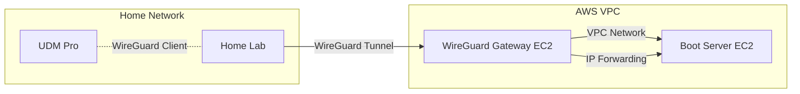

# WireGuard VPN Support on Amazon Web Services

This document analyzes options for deploying WireGuard VPN on AWS to establish secure site-to-site connectivity between the home lab and cloud-hosted network boot infrastructure.

## WireGuard Overview

WireGuard is a modern VPN protocol that provides:

- **Simplicity**: Minimal codebase (~4,000 lines vs 100,000+ for IPsec)
- **Performance**: High throughput with low overhead
- **Security**: Modern cryptography (Curve25519, ChaCha20, Poly1305, BLAKE2s)
- **Configuration**: Simple key-based configuration
- **Kernel Integration**: Mainline Linux kernel support since 5.6

## AWS Native VPN Support

### Site-to-Site VPN (IPsec)

**Status**: ❌ **WireGuard not natively supported**

AWS's managed Site-to-Site VPN supports:

- **IPsec VPN**: IKEv1, IKEv2 with pre-shared keys
- **Redundancy**: Two VPN tunnels per connection for high availability
- **BGP Support**: Dynamic routing via BGP
- **Transit Gateway**: Scalable multi-VPC VPN hub

**Limitation**: Site-to-Site VPN does **not** support WireGuard protocol natively.

### Cost: Site-to-Site VPN

- **VPN Connection**: ~$0.05/hour = ~$36/month
- **Data Transfer**: Standard data transfer out rates (~$0.09/GB for first 10TB)
- **Total Estimate**: ~$36-50/month for managed IPsec VPN

## Self-Managed WireGuard on EC2

### Implementation Approach

Since AWS doesn't offer managed WireGuard, deploy WireGuard on an EC2 instance:

**Status**: ✅ **Fully supported via EC2**

#### Architecture



#### EC2 Configuration

1. **WireGuard Gateway Instance**:
   - **Instance Type**: t4g.micro or t3.micro ($6-7.50/month)
   - **OS**: Ubuntu 22.04 LTS or Amazon Linux 2023 (native WireGuard support)
   - **Source/Dest Check**: **Disable** to allow IP forwarding
   - **Elastic IP**: Allocate Elastic IP for stable WireGuard endpoint
   - **Security Group**: Allow UDP port 51820 from home lab public IP

2. **Boot Server Instance**:
   - **Network**: Same VPC as WireGuard gateway
   - **Private IP Only**: No Elastic IP (accessed via VPN)
   - **Route Traffic**: Through WireGuard gateway instance

#### Installation Steps

```bash
# On EC2 Instance (Ubuntu 22.04+)
sudo apt update
sudo apt install wireguard wireguard-tools

# Generate server keys
wg genkey | tee /etc/wireguard/server_private.key | wg pubkey > /etc/wireguard/server_public.key
chmod 600 /etc/wireguard/server_private.key

# Configure WireGuard interface
sudo nano /etc/wireguard/wg0.conf
```

**Example `/etc/wireguard/wg0.conf` on AWS EC2**:

```ini
[Interface]
Address = 10.200.0.1/24
ListenPort = 51820
PrivateKey = <SERVER_PRIVATE_KEY>
PostUp = sysctl -w net.ipv4.ip_forward=1
PostUp = iptables -A FORWARD -i wg0 -j ACCEPT
PostUp = iptables -t nat -A POSTROUTING -o eth0 -j MASQUERADE
PostDown = iptables -D FORWARD -i wg0 -j ACCEPT
PostDown = iptables -t nat -D POSTROUTING -o eth0 -j MASQUERADE

[Peer]
# Home Lab (UDM Pro)
PublicKey = <CLIENT_PUBLIC_KEY>
AllowedIPs = 10.200.0.2/32, 192.168.1.0/24
```

**Corresponding config on UDM Pro**:

```ini
[Interface]
Address = 10.200.0.2/24
PrivateKey = <CLIENT_PRIVATE_KEY>

[Peer]
PublicKey = <SERVER_PUBLIC_KEY>
Endpoint = <AWS_ELASTIC_IP>:51820
AllowedIPs = 10.200.0.0/24, 10.0.0.0/16
PersistentKeepalive = 25
```

#### Enable and Start WireGuard

```bash
# Enable IP forwarding permanently
echo "net.ipv4.ip_forward=1" | sudo tee -a /etc/sysctl.conf
sudo sysctl -p

# Enable WireGuard interface
sudo systemctl enable wg-quick@wg0
sudo systemctl start wg-quick@wg0

# Verify status
sudo wg show
```

### AWS VPC Configuration

#### Security Groups

Create security group for WireGuard gateway:

```bash
aws ec2 create-security-group \
    --group-name wireguard-gateway-sg \
    --description "WireGuard VPN gateway" \
    --vpc-id vpc-xxxxxx

aws ec2 authorize-security-group-ingress \
    --group-id sg-xxxxxx \
    --protocol udp \
    --port 51820 \
    --cidr <HOME_LAB_PUBLIC_IP>/32
```

Allow SSH for management (optional, restrict to trusted IP):

```bash
aws ec2 authorize-security-group-ingress \
    --group-id sg-xxxxxx \
    --protocol tcp \
    --port 22 \
    --cidr <TRUSTED_IP>/32
```

#### Disable Source/Destination Check

Required for IP forwarding to work:

```bash
aws ec2 modify-instance-attribute \
    --instance-id i-xxxxxx \
    --no-source-dest-check
```

#### Elastic IP Allocation

Allocate and associate Elastic IP for stable endpoint:

```bash
aws ec2 allocate-address --domain vpc

aws ec2 associate-address \
    --instance-id i-xxxxxx \
    --allocation-id eipalloc-xxxxxx
```

**Cost**: Elastic IP is **free** when associated with running instance, but charged ~$3.60/month if unattached.

#### Route Table Configuration

Add route to direct home lab subnet traffic through WireGuard gateway:

```bash
aws ec2 create-route \
    --route-table-id rtb-xxxxxx \
    --destination-cidr-block 192.168.1.0/24 \
    --instance-id i-xxxxxx
```

This routes home lab subnet (192.168.1.0/24) through the WireGuard gateway instance.

## UDM Pro WireGuard Integration

### Native Support

**Status**: ✅ **WireGuard supported natively** (UniFi OS 1.12.22+)

The UniFi Dream Machine Pro includes native WireGuard VPN support:

- **GUI Configuration**: Web UI for WireGuard VPN setup
- **Site-to-Site**: Support for site-to-site VPN tunnels
- **Performance**: Hardware acceleration for encryption (if available)
- **Routing**: Automatic route injection for remote subnets

### Configuration Steps on UDM Pro

1. **Network Settings → VPN**:
   - Create new VPN connection
   - Select "WireGuard"
   - Generate key pair or import existing

2. **Peer Configuration**:
   - **Peer Public Key**: AWS EC2 WireGuard instance's public key
   - **Endpoint**: AWS Elastic IP address
   - **Port**: 51820
   - **Allowed IPs**: AWS VPC CIDR (e.g., 10.0.0.0/16)
   - **Persistent Keepalive**: 25 seconds

3. **Route Injection**:
   - UDM Pro automatically adds routes to AWS subnets
   - Home lab servers can reach AWS boot server via VPN

4. **Firewall Rules**:
   - Add firewall rule to allow boot traffic (TFTP, HTTP) from LAN to VPN

### Alternative: Manual WireGuard on UDM Pro

If native support is insufficient, use `wireguard-go` via `udm-utilities`:

- **Repository**: [boostchicken/udm-utilities](https://github.com/boostchicken/udm-utilities)
- **Script**: `on_boot.d` script to start WireGuard on boot
- **Persistence**: Survives firmware updates with on-boot script

## Performance Considerations

### Throughput

WireGuard on EC2 performance varies by instance type:

- **t4g.micro** (2 vCPU, ARM): ~100-300 Mbps
- **t3.micro** (2 vCPU, x86): ~100-300 Mbps
- **t3.small** (2 vCPU): ~500-800 Mbps
- **t3.medium** (2 vCPU): ~1+ Gbps

For network boot (typical boot = 50-200MB), even t4g.micro is sufficient:

- **Boot Time**: 150MB at 100 Mbps = ~12 seconds transfer time
- **Recommendation**: t4g.micro adequate and most cost-effective

### Latency

- **VPN Overhead**: WireGuard adds minimal latency (~1-5ms)
- **AWS Network**: Low-latency network infrastructure
- **Total Latency**: Primarily dependent on home ISP and AWS region proximity

### CPU Usage

- **Encryption**: ChaCha20 is CPU-efficient
- **Kernel Module**: Minimal CPU overhead in kernel space
- **t4g.micro**: Sufficient CPU for home lab VPN throughput
- **ARM Advantage**: t4g instances use Graviton processors (better price/performance)

## Security Considerations

### Key Management

- **Private Keys**: Store securely, never commit to version control
- **Key Rotation**: Rotate keys periodically (e.g., annually)
- **Secrets Manager**: Store WireGuard private keys in AWS Secrets Manager
  - Retrieve at instance startup via user data script
  - Avoid storing in AMIs or instance metadata
- **IAM Role**: Grant EC2 instance IAM role to read secret

### Firewall Hardening

- **Security Group Restriction**: Limit WireGuard port to home lab public IP only
- **Least Privilege**: Boot server security group allows only VPN security group
- **No Public Access**: Boot server has no Elastic IP or public route

### Monitoring and Alerts

- **CloudWatch Logs**: Stream WireGuard logs to CloudWatch
- **CloudWatch Alarms**: Alert on VPN tunnel down (no recent handshakes)
- **VPC Flow Logs**: Monitor VPN traffic patterns

### DDoS Protection

- **UDP Amplification**: WireGuard resistant to DDoS amplification attacks
- **AWS Shield**: Basic DDoS protection included free on all AWS resources
- **Shield Advanced**: Optional ($3,000/month - overkill for VPN endpoint)

## High Availability Options

### Multi-AZ Failover

Deploy WireGuard gateways in multiple Availability Zones:

- **Primary**: us-east-1a WireGuard instance
- **Secondary**: us-east-1b WireGuard instance
- **Failover**: UDM Pro switches endpoints if primary fails
- **Cost**: Doubles instance costs (~$12-15/month for 2 instances)

### Auto Scaling Group (Single Instance)

Use Auto Scaling Group with min=max=1 for auto-recovery:

- **Health Checks**: EC2 status checks
- **Auto-Recovery**: ASG replaces failed instance automatically
- **Elastic IP**: Reassociate Elastic IP to new instance via Lambda/script
- **Limitation**: Brief downtime during recovery (~2-5 minutes)

### Health Monitoring

Monitor WireGuard tunnel health with CloudWatch custom metrics:

```bash
# On EC2 instance, run periodically via cron
#!/bin/bash
HANDSHAKE=$(wg show wg0 latest-handshakes | awk '{print $2}')
NOW=$(date +%s)
AGE=$((NOW - HANDSHAKE))

aws cloudwatch put-metric-data \
    --namespace WireGuard \
    --metric-name TunnelAge \
    --value $AGE \
    --unit Seconds
```

Alert if handshake age exceeds threshold (e.g., 180 seconds).

### User Data Script for Auto-Configuration

EC2 user data script to configure WireGuard on launch:

```bash
#!/bin/bash
# Install WireGuard
apt update && apt install -y wireguard wireguard-tools

# Retrieve private key from Secrets Manager
aws secretsmanager get-secret-value \
    --secret-id wireguard-server-key \
    --query SecretString \
    --output text > /etc/wireguard/server_private.key
chmod 600 /etc/wireguard/server_private.key

# Configure interface (full config omitted for brevity)
# ...

# Enable and start WireGuard
systemctl enable wg-quick@wg0
systemctl start wg-quick@wg0
```

Requires IAM instance role with `secretsmanager:GetSecretValue` permission.

## Cost Analysis

### Self-Managed WireGuard on EC2

| Component | Cost (US East) |
|-----------|----------------|
| t4g.micro instance (730 hrs/month) | ~$6.00 |
| Elastic IP (attached) | $0.00 |
| Data transfer out (1GB/month) | ~$0.09 |
| **Monthly Total** | **~$6.09** |
| **Annual Total** | **~$73** |

With Reserved Instance (1-year, no upfront):

| Component | Cost |
|-----------|------|
| t4g.micro RI (1-year) | ~$3.50/month |
| Elastic IP | $0.00 |
| Data transfer | ~$0.09 |
| **Monthly Total** | **~$3.59** |
| **Annual Total** | **~$43** |

### Site-to-Site VPN (IPsec - if WireGuard not used)

| Component | Cost |
|-----------|------|
| VPN Connection (2 tunnels) | ~$36 |
| Data transfer (1GB/month) | ~$0.09 |
| **Monthly Total** | **~$36** |
| **Annual Total** | **~$432** |

**Cost Savings**: Self-managed WireGuard saves **~$360/year** vs Site-to-Site VPN (or **~$390/year** with Reserved Instance).

## Comparison with Requirements

| Requirement | AWS Support | Implementation |
|------------|-------------|----------------|
| WireGuard Protocol | ✅ Via EC2 | Self-managed on instance |
| Site-to-Site VPN | ✅ Yes | WireGuard tunnel |
| UDM Pro Integration | ✅ Native support | WireGuard peer config |
| Cost Efficiency | ✅ Very low cost | t4g.micro ~$6/month (on-demand) |
| Performance | ✅ Sufficient | 100+ Mbps on t4g.micro |
| Security | ✅ Modern crypto | ChaCha20, Curve25519 |
| HA (optional) | ⚠️ Manual setup | Multi-AZ or ASG |

## Recommendations

### For Home Lab VPN (per ADR-0002)

1. **Self-Managed WireGuard**: Deploy on EC2 t4g.micro instance
   - **Cost**: ~$6/month on-demand, ~$3.50/month with Reserved Instance
   - **Performance**: Sufficient for network boot traffic
   - **Simplicity**: Easy to configure and maintain

2. **Single AZ Deployment**: Unless HA required, single instance adequate
   - **Region Selection**: Choose region closest to home lab for lowest latency
   - **AZ**: Single AZ sufficient (boot server not mission-critical)

3. **UDM Pro Native WireGuard**: Use built-in WireGuard client
   - **Configuration**: Add AWS instance as WireGuard peer in UDM Pro UI
   - **Route Injection**: UDM Pro automatically routes AWS subnets

4. **Security Best Practices**:
   - Store WireGuard private key in Secrets Manager
   - Restrict security group to home lab public IP only
   - Use user data script to retrieve key and configure on boot
   - Enable CloudWatch logging for VPN events
   - Assign IAM instance role with minimal permissions

5. **Monitoring**: Set up CloudWatch alarms for:
   - Instance status check failures
   - High CPU usage
   - VPN tunnel age (custom metric)

### Cost Optimization

- **Reserved Instance**: Commit to 1-year Reserved Instance for ~40% savings
- **Spot Instance**: Consider Spot for even lower cost (~70% savings), but adds complexity (handle interruptions)
- **ARM Architecture**: Use t4g (Graviton) for 20% better price/performance vs t3

### Future Enhancements

- **HA Setup**: Deploy secondary WireGuard instance in different AZ
- **Automated Failover**: Lambda function to reassociate Elastic IP on failure
- **IPv6 Support**: Enable WireGuard over IPv6 if home ISP supports
- **Mesh VPN**: Expand to mesh topology if multiple sites added

## References

- [WireGuard Official Site](https://www.wireguard.com/)
- [WireGuard on Ubuntu](https://ubuntu.com/server/docs/wireguard-vpn)
- [AWS EC2 IP Forwarding (Disable Source/Dest Check)](https://docs.aws.amazon.com/vpc/latest/userguide/VPC_NAT_Instance.html#EIP_Disable_SrcDestCheck)
- [UniFi WireGuard VPN](https://help.ui.com/hc/en-us/articles/115015971688)
- [udm-utilities GitHub](https://github.com/boostchicken/udm-utilities)
- [AWS Secrets Manager](https://docs.aws.amazon.com/secretsmanager/)
