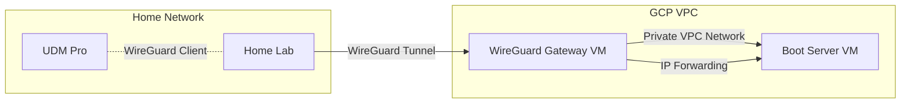

# WireGuard VPN Support on Google Cloud Platform

This document analyzes options for deploying WireGuard VPN on GCP to establish secure site-to-site connectivity between the home lab and cloud-hosted network boot infrastructure.

## WireGuard Overview

WireGuard is a modern VPN protocol that provides:

- **Simplicity**: Minimal codebase (~4,000 lines vs 100,000+ for IPsec)
- **Performance**: High throughput with low overhead
- **Security**: Modern cryptography (Curve25519, ChaCha20, Poly1305, BLAKE2s)
- **Configuration**: Simple key-based configuration
- **Kernel Integration**: Mainline Linux kernel support since 5.6

## GCP Native VPN Support

### Cloud VPN (IPsec)

**Status**: ❌ **WireGuard not natively supported**

GCP's managed Cloud VPN service supports:

- **IPsec VPN**: IKEv1, IKEv2 with PSK or certificate authentication
- **HA VPN**: Highly available VPN with 99.99% SLA
- **Classic VPN**: Single-tunnel VPN (deprecated)

**Limitation**: Cloud VPN does **not** support WireGuard protocol natively.

### Cost: Cloud VPN

- **HA VPN**: ~$0.05/hour per tunnel × 2 tunnels = ~$73/month
- **Egress**: Standard internet egress rates (~$0.12/GB for first 1TB)
- **Total Estimate**: ~$75-100/month for managed VPN

## Self-Managed WireGuard on Compute Engine

### Implementation Approach

Since GCP doesn't offer managed WireGuard, deploy WireGuard on a Compute Engine VM:

**Status**: ✅ **Fully supported via Compute Engine**

#### Architecture



#### VM Configuration

1. **WireGuard Gateway VM**:
   - **Instance Type**: e2-micro or f1-micro ($4-7/month)
   - **OS**: Ubuntu 22.04 LTS or Debian 12 (native WireGuard kernel support)
   - **IP Forwarding**: Enable IP forwarding to route traffic to other VMs
   - **External IP**: Static external IP for stable WireGuard endpoint
   - **Firewall**: Allow UDP port 51820 (WireGuard) from home lab public IP

2. **Boot Server VM**:
   - **Network**: Same VPC as WireGuard gateway
   - **Private IP Only**: No external IP (accessed via VPN)
   - **Route Traffic**: Through WireGuard gateway VM

#### Installation Steps

```bash
# On GCP Compute Engine VM (Ubuntu 22.04+)
sudo apt update
sudo apt install wireguard wireguard-tools

# Generate server keys
wg genkey | tee /etc/wireguard/server_private.key | wg pubkey > /etc/wireguard/server_public.key
chmod 600 /etc/wireguard/server_private.key

# Configure WireGuard interface
sudo nano /etc/wireguard/wg0.conf
```

**Example `/etc/wireguard/wg0.conf` on GCP VM**:

```ini
[Interface]
Address = 10.200.0.1/24
ListenPort = 51820
PrivateKey = <SERVER_PRIVATE_KEY>
PostUp = sysctl -w net.ipv4.ip_forward=1
PostUp = iptables -A FORWARD -i wg0 -j ACCEPT
PostUp = iptables -t nat -A POSTROUTING -o ens4 -j MASQUERADE
PostDown = iptables -D FORWARD -i wg0 -j ACCEPT
PostDown = iptables -t nat -D POSTROUTING -o ens4 -j MASQUERADE

[Peer]
# Home Lab (UDM Pro)
PublicKey = <CLIENT_PUBLIC_KEY>
AllowedIPs = 10.200.0.2/32, 192.168.1.0/24
```

**Corresponding config on UDM Pro**:

```ini
[Interface]
Address = 10.200.0.2/24
PrivateKey = <CLIENT_PRIVATE_KEY>

[Peer]
PublicKey = <SERVER_PUBLIC_KEY>
Endpoint = <GCP_VM_EXTERNAL_IP>:51820
AllowedIPs = 10.200.0.0/24, 10.128.0.0/20
PersistentKeepalive = 25
```

#### Enable and Start WireGuard

```bash
# Enable IP forwarding permanently
echo "net.ipv4.ip_forward=1" | sudo tee -a /etc/sysctl.conf
sudo sysctl -p

# Enable WireGuard interface
sudo systemctl enable wg-quick@wg0
sudo systemctl start wg-quick@wg0

# Verify status
sudo wg show
```

### GCP VPC Configuration

#### Firewall Rules

Create VPC firewall rule to allow WireGuard:

```bash
gcloud compute firewall-rules create allow-wireguard \
    --direction=INGRESS \
    --priority=1000 \
    --network=default \
    --action=ALLOW \
    --rules=udp:51820 \
    --source-ranges=<HOME_LAB_PUBLIC_IP>/32 \
    --target-tags=wireguard-gateway
```

Tag the WireGuard VM:

```bash
gcloud compute instances add-tags wireguard-gateway-vm \
    --tags=wireguard-gateway \
    --zone=us-central1-a
```

#### Static External IP

Reserve static IP for stable WireGuard endpoint:

```bash
gcloud compute addresses create wireguard-gateway-ip \
    --region=us-central1

gcloud compute instances delete-access-config wireguard-gateway-vm \
    --access-config-name="external-nat" \
    --zone=us-central1-a

gcloud compute instances add-access-config wireguard-gateway-vm \
    --access-config-name="external-nat" \
    --address=wireguard-gateway-ip \
    --zone=us-central1-a
```

**Cost**: Static IP ~$3-4/month if VM is always running (free if attached to running VM in some regions).

#### Route Configuration

For traffic from boot server to reach home lab via WireGuard VM:

```bash
gcloud compute routes create route-to-homelab \
    --network=default \
    --priority=100 \
    --destination-range=192.168.1.0/24 \
    --next-hop-instance=wireguard-gateway-vm \
    --next-hop-instance-zone=us-central1-a
```

This routes home lab subnet (192.168.1.0/24) through the WireGuard gateway VM.

## UDM Pro WireGuard Integration

### Native Support

**Status**: ✅ **WireGuard supported natively** (UniFi OS 1.12.22+)

The UniFi Dream Machine Pro includes native WireGuard VPN support:

- **GUI Configuration**: Web UI for WireGuard VPN setup
- **Site-to-Site**: Support for site-to-site VPN tunnels
- **Performance**: Hardware acceleration for encryption (if available)
- **Routing**: Automatic route injection for remote subnets

### Configuration Steps on UDM Pro

1. **Network Settings → VPN**:
   - Create new VPN connection
   - Select "WireGuard"
   - Generate key pair or import existing

2. **Peer Configuration**:
   - **Peer Public Key**: GCP WireGuard VM's public key
   - **Endpoint**: GCP VM's static external IP
   - **Port**: 51820
   - **Allowed IPs**: GCP VPC subnet (e.g., 10.128.0.0/20)
   - **Persistent Keepalive**: 25 seconds

3. **Route Injection**:
   - UDM Pro automatically adds routes to GCP subnets
   - Home lab servers can reach GCP boot server via VPN

4. **Firewall Rules**:
   - Add firewall rule to allow boot traffic (TFTP, HTTP) from LAN to VPN

### Alternative: Manual WireGuard on UDM Pro

If native support is insufficient, use `wireguard-go` via `udm-utilities`:

- **Repository**: [boostchicken/udm-utilities](https://github.com/boostchicken/udm-utilities)
- **Script**: `on_boot.d` script to start WireGuard
- **Persistence**: Survives firmware updates with on-boot script

## Performance Considerations

### Throughput

WireGuard on Compute Engine performance:

- **e2-micro** (2 vCPU, shared core): ~100-300 Mbps
- **e2-small** (2 vCPU): ~500-800 Mbps
- **e2-medium** (2 vCPU): ~1+ Gbps

For network boot (typical boot = 50-200MB), even e2-micro is sufficient:

- **Boot Time**: 150MB at 100 Mbps = ~12 seconds transfer time
- **Recommendation**: e2-micro adequate for home lab scale

### Latency

- **VPN Overhead**: WireGuard adds minimal latency (~1-5ms overhead)
- **GCP Network**: Low-latency network to most regions
- **Total Latency**: Primarily dependent on home ISP and GCP region proximity

### CPU Usage

- **Encryption**: ChaCha20 is CPU-efficient
- **Kernel Module**: Minimal CPU overhead in kernel space
- **e2-micro**: Sufficient CPU for home lab VPN throughput

## Security Considerations

### Key Management

- **Private Keys**: Store securely, never commit to version control
- **Key Rotation**: Rotate keys periodically (e.g., annually)
- **Secret Manager**: Store WireGuard private keys in GCP Secret Manager
  - Retrieve at VM startup via startup script
  - Avoid storing in VM metadata or disk images

### Firewall Hardening

- **Source IP Restriction**: Limit WireGuard port to home lab public IP only
- **Least Privilege**: Boot server firewall allows only VPN subnet
- **No Public Access**: Boot server has no external IP

### Monitoring and Alerts

- **Cloud Logging**: Log WireGuard connection events
- **Cloud Monitoring**: Alert on VPN tunnel down
- **Metrics**: Monitor handshake failures, data transfer

### DDoS Protection

- **UDP Amplification**: WireGuard resistant to DDoS amplification
- **Cloud Armor**: Optional layer for additional DDoS protection (overkill for VPN)

## High Availability Options

### Multi-Region Failover

Deploy WireGuard gateways in multiple regions:

- **Primary**: us-central1 WireGuard VM
- **Secondary**: us-east1 WireGuard VM
- **Failover**: UDM Pro switches endpoints if primary fails
- **Cost**: Doubles VM costs (~$8-14/month for 2 VMs)

### Health Checks

Monitor WireGuard tunnel health:

```bash
# On UDM Pro (via SSH)
wg show wg0 latest-handshakes

# If handshake timestamp old (>3 minutes), tunnel may be down
```

Automate failover with script on UDM Pro or external monitoring.

### Startup Scripts for Auto-Healing

GCP VM startup script to ensure WireGuard starts on boot:

```bash
#!/bin/bash
# /etc/startup-script.sh

# Retrieve WireGuard private key from Secret Manager
gcloud secrets versions access latest --secret="wireguard-server-key" > /etc/wireguard/server_private.key
chmod 600 /etc/wireguard/server_private.key

# Start WireGuard
systemctl enable wg-quick@wg0
systemctl start wg-quick@wg0
```

Attach as metadata:

```bash
gcloud compute instances add-metadata wireguard-gateway-vm \
    --metadata-from-file startup-script=/path/to/startup-script.sh \
    --zone=us-central1-a
```

## Cost Analysis

### Self-Managed WireGuard on Compute Engine

| Component | Cost |
|-----------|------|
| e2-micro VM (730 hrs/month) | ~$6.50 |
| Static External IP | ~$3.50 |
| Egress (1GB/month boot traffic) | ~$0.12 |
| **Monthly Total** | **~$10.12** |
| **Annual Total** | **~$121** |

### Cloud VPN (IPsec - if WireGuard not used)

| Component | Cost |
|-----------|------|
| HA VPN Gateway (2 tunnels) | ~$73 |
| Egress (1GB/month) | ~$0.12 |
| **Monthly Total** | **~$73** |
| **Annual Total** | **~$876** |

**Cost Savings**: Self-managed WireGuard saves **~$755/year** vs Cloud VPN.

## Comparison with Requirements

| Requirement | GCP Support | Implementation |
|------------|-------------|----------------|
| WireGuard Protocol | ✅ Via Compute Engine | Self-managed on VM |
| Site-to-Site VPN | ✅ Yes | WireGuard tunnel |
| UDM Pro Integration | ✅ Native support | WireGuard peer config |
| Cost Efficiency | ✅ Low cost | e2-micro ~$10/month |
| Performance | ✅ Sufficient | 100+ Mbps on e2-micro |
| Security | ✅ Modern crypto | ChaCha20, Curve25519 |
| HA (optional) | ⚠️ Manual setup | Multi-region VMs |

## Recommendations

### For Home Lab VPN (per ADR-0002)

1. **Self-Managed WireGuard**: Deploy on Compute Engine e2-micro VM
   - **Cost**: ~$10/month (vs ~$73/month for Cloud VPN)
   - **Performance**: Sufficient for network boot traffic
   - **Simplicity**: Easy to configure and maintain

2. **Single Region Deployment**: Unless HA required, single VM adequate
   - **Region Selection**: Choose region closest to home lab for lowest latency
   - **Zone**: Single zone sufficient (boot server not mission-critical)

3. **UDM Pro Native WireGuard**: Use built-in WireGuard client
   - **Configuration**: Add GCP VM as WireGuard peer in UDM Pro UI
   - **Route Injection**: UDM Pro automatically routes GCP subnets

4. **Security Best Practices**:
   - Store WireGuard private key in Secret Manager
   - Restrict WireGuard port to home public IP only
   - Use startup script to configure VM on boot
   - Enable Cloud Logging for VPN events

5. **Monitoring**: Set up Cloud Monitoring alerts for:
   - VM down
   - High CPU usage (indicates traffic spike or issue)
   - Firewall rule blocks (indicates misconfiguration)

### Future Enhancements

- **HA Setup**: Deploy secondary WireGuard VM in different region
- **Automated Failover**: Script on UDM Pro to switch endpoints
- **IPv6 Support**: Enable WireGuard over IPv6 if home ISP supports
- **Mesh VPN**: Expand to mesh topology if multiple sites added

## References

- [WireGuard Official Site](https://www.wireguard.com/)
- [WireGuard on Linux](https://wiki.archlinux.org/title/WireGuard)
- [GCP Compute Engine IP Forwarding](https://cloud.google.com/vpc/docs/using-routes#static-route-next-hop)
- [UniFi WireGuard VPN](https://help.ui.com/hc/en-us/articles/115015971688-UniFi-VPN-Server)
- [udm-utilities GitHub](https://github.com/boostchicken/udm-utilities)
- [GCP Secret Manager](https://cloud.google.com/secret-manager/docs)
