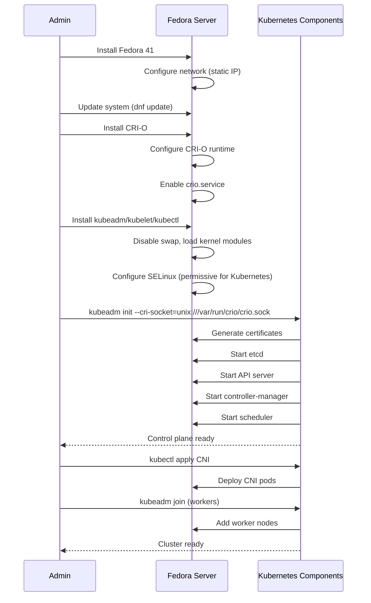
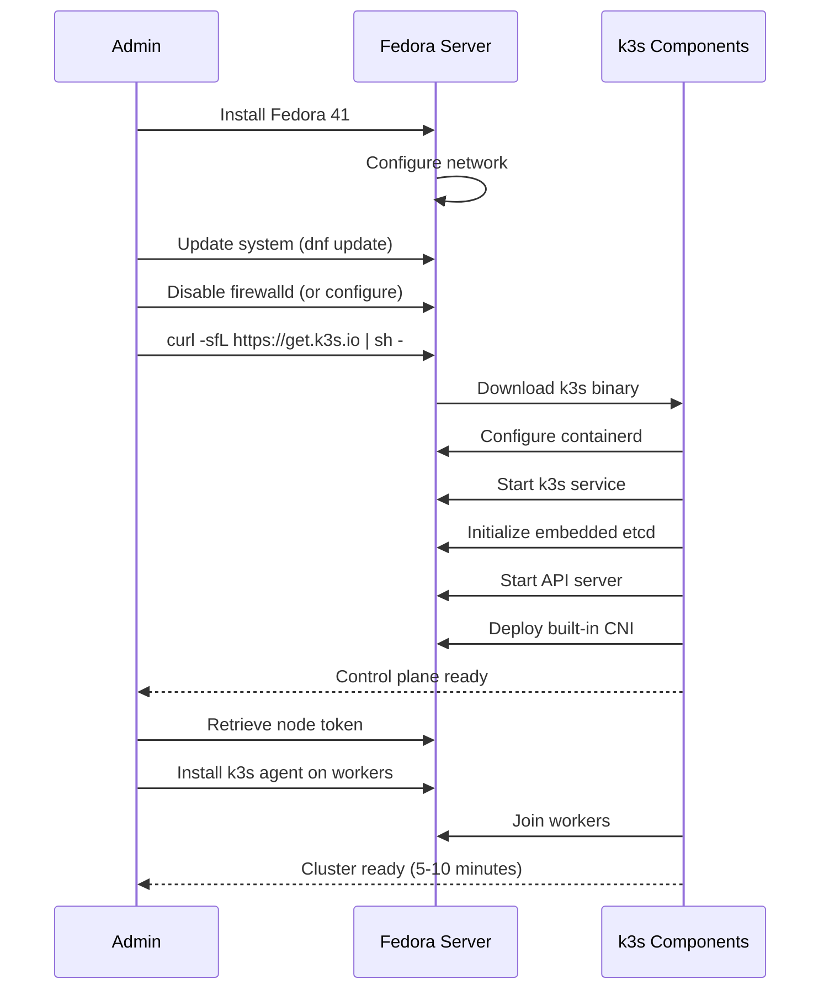

# Fedora Server for Kubernetes

## Overview

Fedora Server is a cutting-edge Linux distribution sponsored by Red Hat, serving as the upstream for Red Hat Enterprise Linux (RHEL). It emphasizes innovation with the latest software packages and kernel versions.

**Key Facts**:
- **Latest Version**: Fedora 41 (October 2024)
- **Support Period**: ~13 months per release (shorter than Ubuntu LTS)
- **Kernel**: Linux 6.11+ (latest stable)
- **Package Manager**: DNF/RPM, Flatpak
- **Init System**: systemd

## Kubernetes Installation Methods

Fedora supports standard Kubernetes installation approaches:

### 1. kubeadm (Official Kubernetes Tool)

**Installation**:
```bash
# Install container runtime (CRI-O preferred on Fedora)
sudo dnf install -y cri-o
sudo systemctl enable --now crio

# Add Kubernetes repository
cat <<EOF | sudo tee /etc/yum.repos.d/kubernetes.repo
[kubernetes]
name=Kubernetes
baseurl=https://pkgs.k8s.io/core:/stable:/v1.31/rpm/
enabled=1
gpgcheck=1
gpgkey=https://pkgs.k8s.io/core:/stable:/v1.31/rpm/repodata/repomd.xml.key
EOF

# Install kubeadm, kubelet, kubectl
sudo dnf install -y kubelet kubeadm kubectl
sudo systemctl enable --now kubelet
```

**Cluster Initialization**:
```bash
# Initialize control plane
sudo kubeadm init --pod-network-cidr=10.244.0.0/16 --cri-socket=unix:///var/run/crio/crio.sock

# Configure kubectl
mkdir -p $HOME/.kube
sudo cp -i /etc/kubernetes/admin.conf $HOME/.kube/config
sudo chown $(id -u):$(id -g) $HOME/.kube/config

# Install CNI
kubectl apply -f https://raw.githubusercontent.com/projectcalico/calico/v3.28.0/manifests/calico.yaml

# Join workers
kubeadm token create --print-join-command
```

**Pros**:
- CRI-O is native to Fedora ecosystem (same as RHEL/OpenShift)
- Latest Kubernetes versions available quickly
- Familiar to RHEL/CentOS users
- Fully upstream Kubernetes

**Cons**:
- Manual setup process (same as Ubuntu/kubeadm)
- Requires Kubernetes knowledge
- More complex than turnkey solutions

### 2. k3s (Lightweight Kubernetes)

**Installation**:
```bash
# Same single-command install
curl -sfL https://get.k3s.io | sh -

# Retrieve token
sudo cat /var/lib/rancher/k3s/server/node-token

# Install on workers
curl -sfL https://get.k3s.io | K3S_URL=https://control-plane:6443 K3S_TOKEN=<token> sh -
```

**Pros**:
- Simple installation (identical to Ubuntu)
- Lightweight and fast
- Well-tested on Fedora/RHEL family

**Cons**:
- Less customizable
- Not using native CRI-O by default (uses embedded containerd)

### 3. OKD (OpenShift Kubernetes Distribution)

**Installation** (Single-Node):
```bash
# Download and install OKD
wget https://github.com/okd-project/okd/releases/download/4.15.0-0.okd-2024-01-27-070424/openshift-install-linux-4.15.0-0.okd-2024-01-27-070424.tar.gz
tar -xvf openshift-install-linux-*.tar.gz
sudo mv openshift-install /usr/local/bin/

# Create install config
./openshift-install create install-config --dir=cluster

# Install cluster
./openshift-install create cluster --dir=cluster
```

**Pros**:
- Enterprise features (operators, web console, image registry)
- Built-in CI/CD and developer tools
- Based on Fedora CoreOS (immutable, auto-updating)

**Cons**:
- Very heavy resource requirements (16GB+ RAM)
- Complex installation and management
- Overkill for simple homelab use

## Cluster Initialization Sequence

### kubeadm with CRI-O



### k3s Approach



## Maintenance Requirements

### OS Updates

**Security and System Updates**:
```bash
# Automatic updates (dnf-automatic)
sudo dnf install -y dnf-automatic
sudo systemctl enable --now dnf-automatic.timer

# Manual updates
sudo dnf update -y
sudo reboot  # if kernel updated
```

**Frequency**:
- Security patches: Weekly to monthly
- Kernel updates: Monthly (frequent updates)
- **Major version upgrades**: Every ~13 months (Fedora releases)

**Version Upgrade**:
```bash
# Upgrade to next Fedora release
sudo dnf upgrade --refresh
sudo dnf install dnf-plugin-system-upgrade
sudo dnf system-upgrade download --releasever=42
sudo dnf system-upgrade reboot
```

### Kubernetes Upgrades

**kubeadm Upgrade**:
```bash
# Upgrade control plane
sudo dnf update -y kubeadm
sudo kubeadm upgrade apply v1.32.0
sudo dnf update -y kubelet kubectl
sudo systemctl restart kubelet

# Upgrade workers
kubectl drain <node> --ignore-daemonsets
sudo dnf update -y kubeadm kubelet kubectl
sudo kubeadm upgrade node
sudo systemctl restart kubelet
kubectl uncordon <node>
```

**k3s Upgrade**: Same as Ubuntu (curl script or system-upgrade-controller)

**Upgrade Frequency**: Kubernetes every 3-6 months, Fedora OS every ~13 months

## Resource Overhead

**Minimal Installation** (Fedora Server + k3s):
- **RAM**: ~600MB (OS) + 512MB (k3s) = 1.2GB total
- **CPU**: 1 core minimum, 2 cores recommended
- **Disk**: 12GB (OS) + 10GB (containers) = 22GB
- **Network**: 1 Gbps recommended

**Full Installation** (Fedora Server + kubeadm + CRI-O):
- **RAM**: ~700MB (OS) + 1.5GB (Kubernetes) = 2.2GB total
- **CPU**: 2 cores minimum
- **Disk**: 15GB (OS) + 20GB (containers) = 35GB
- **Network**: 1 Gbps recommended

**Note**: Slightly higher overhead than Ubuntu due to SELinux and newer components.

## Security Posture

**Strengths**:
- **SELinux enabled by default** (stronger than AppArmor)
- Latest security patches and kernel (bleeding edge)
- CRI-O container runtime (security-focused, used by OpenShift)
- Shorter support window = less legacy CVEs
- Active security team and rapid response

**Attack Surface**:
- General-purpose OS (larger surface than minimal OS)
- More installed packages than minimal server
- SELinux can be complex to configure for Kubernetes

**Hardening Steps**:
```bash
# Configure firewall (firewalld default on Fedora)
sudo firewall-cmd --permanent --add-port=6443/tcp  # API server
sudo firewall-cmd --permanent --add-port=10250/tcp # Kubelet
sudo firewall-cmd --reload

# SELinux configuration for Kubernetes
sudo setenforce 0  # Permissive (Kubernetes not fully SELinux-ready)
sudo sed -i 's/^SELINUX=enforcing$/SELINUX=permissive/' /etc/selinux/config

# Disable unnecessary services
sudo systemctl disable bluetooth.service
```

## Learning Curve

**Ease of Adoption**: ⭐⭐⭐⭐ (Good)

- Familiar for RHEL/CentOS/Alma/Rocky users
- DNF package manager (similar to APT)
- Excellent documentation
- SELinux learning curve can be steep

**Required Knowledge**:
- RPM-based system administration (dnf, systemd)
- SELinux basics (or willingness to use permissive mode)
- Kubernetes concepts
- Firewalld configuration

**Differences from Ubuntu**:
- DNF vs APT package manager
- SELinux vs AppArmor
- Firewalld vs UFW
- Faster release cycle (more frequent upgrades)

## Community Support

**Ecosystem Maturity**: ⭐⭐⭐⭐ (Good)

- **Documentation**: Excellent official docs, Red Hat resources
- **Community**: Large user base, active forums
- **Commercial Support**: RHEL support available (paid)
- **Third-Party Tools**: Good compatibility with Kubernetes tools
- **Tutorials**: Abundant resources, especially for RHEL ecosystem

**Resources**:
- [Fedora Server Documentation](https://docs.fedoraproject.org/en-US/fedora-server/)
- [Fedora Kubernetes SIG](https://fedoraproject.org/wiki/SIGs/Kubernetes)
- [CRI-O Documentation](https://cri-o.io/)
- [k3s on Fedora](https://docs.k3s.io/)

## Pros and Cons Summary

### Pros

* Good, because latest kernel and software packages (bleeding edge)
* Good, because SELinux enabled by default (stronger MAC than AppArmor)
* Good, because native CRI-O support (same as RHEL/OpenShift)
* Good, because upstream for RHEL (enterprise compatibility)
* Good, because multiple Kubernetes installation options
* Good, because k3s simplifies setup dramatically
* Good, because strong security focus and rapid CVE response
* Good, because familiar to RHEL/CentOS ecosystem
* Good, because automatic updates available (dnf-automatic)
* Neutral, because shorter support cycle (13 months) ensures latest features

### Cons

* Bad, because short support cycle requires frequent OS upgrades (every ~13 months)
* Bad, because bleeding-edge packages can introduce instability
* Bad, because SELinux configuration for Kubernetes is complex (often set to permissive)
* Bad, because smaller community than Ubuntu (though still large)
* Bad, because general-purpose OS has larger attack surface than minimal OS
* Bad, because more resource overhead than purpose-built Kubernetes OS
* Bad, because OS upgrade every 13 months adds maintenance burden
* Bad, because less beginner-friendly than Ubuntu
* Bad, because managing OS + Kubernetes lifecycle separately
* Neutral, because rapid release cycle can be pro or con depending on preference

## Recommendations

**Best for**:
- Users familiar with RHEL/CentOS/Rocky/Alma ecosystem
- Teams wanting latest kernel and software features
- Environments requiring SELinux (compliance, enterprise standards)
- Learning OpenShift/OKD ecosystem (Fedora CoreOS foundation)
- Users comfortable with frequent OS upgrades

**Best Installation Method**:
- **Homelab/Learning**: k3s (simplest, lightweight)
- **Enterprise-like**: kubeadm + CRI-O (OpenShift compatibility)
- **Advanced**: OKD (if resources available, 16GB+ RAM)

**Avoid if**:
- Prefer long-term stability (choose Ubuntu LTS)
- Want minimal maintenance (frequent Fedora upgrades required)
- Seeking minimal attack surface (consider Talos Linux)
- Uncomfortable with SELinux complexity
- Want infrastructure-as-code for OS (consider Talos Linux)

## Comparison with Ubuntu

| Aspect | Fedora | Ubuntu LTS |
|--------|--------|------------|
| **Support Period** | 13 months | 5 years (10 with Pro) |
| **Kernel** | Latest (6.11+) | LTS (6.8+) |
| **Security** | SELinux | AppArmor |
| **Package Manager** | DNF/RPM | APT/DEB |
| **Release Cycle** | 6 months | 2 years (LTS) |
| **Upgrade Frequency** | Every 13 months | Every 2-5 years |
| **Community Size** | Large | Very Large |
| **Enterprise Upstream** | RHEL | N/A |
| **Stability** | Bleeding edge | Stable/Conservative |
| **Learning Curve** | Moderate | Easy |

**Verdict**: Fedora is excellent for those wanting latest features and comfortable with frequent upgrades. Ubuntu LTS is better for long-term stability and minimal maintenance.
