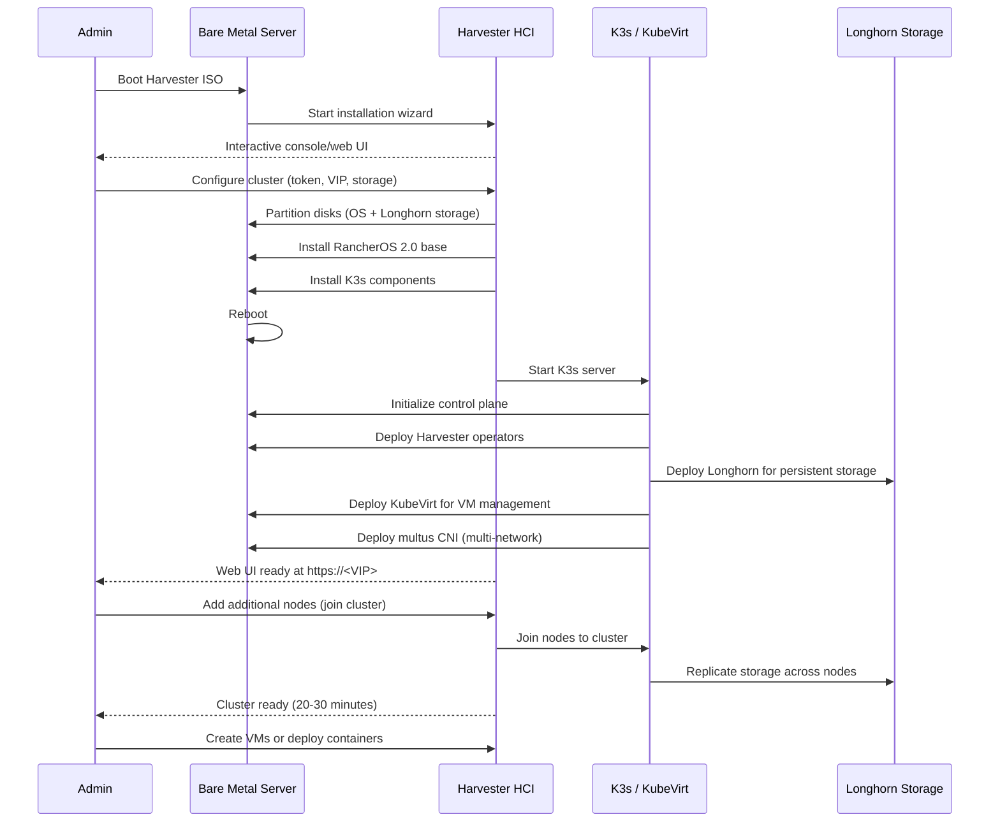

# Harvester HCI for Kubernetes

## Overview

Harvester is a Hyperconverged Infrastructure (HCI) platform built on Kubernetes, designed to provide VM and container management on a unified platform. It combines compute, storage, and networking with built-in K3s for orchestration.

**Key Facts**:
- **Latest Version**: Harvester 1.4 (based on K3s 1.30+)
- **Foundation**: Built on RancherOS 2.0, K3s, and KubeVirt
- **Support**: Supported by SUSE (acquired Rancher)
- **Architecture**: HCI platform with VM + container workloads
- **Management**: Web UI + kubectl + Rancher integration

## Kubernetes Installation Methods

Harvester **includes K3s as its foundation** - Kubernetes is built-in.

### Built-in K3s (Only Option)

**Installation Process**:

1. **Boot Harvester ISO** (interactive installer or PXE)
2. **Complete installation wizard** (web UI or console)
3. **Create cluster** (automatic K3s deployment)
4. **Access via web UI** or kubectl

**Interactive Installation**:
```
# Boot from Harvester ISO
1. Choose "Create a new Harvester cluster"
2. Configure:
   - Cluster token
   - Node role (management/worker/witness)
   - Network interface (management network)
   - VIP (Virtual IP for cluster access)
   - Storage disk (Longhorn persistent storage)
3. Install completes (15-20 minutes)
4. Access web UI at https://<VIP>
```

**Configuration** (cloud-init for automated install):
```yaml
# config.yaml
token: my-cluster-token
os:
  hostname: harvester-node-1
  modules:
    - kvm
  kernel_parameters:
    - intel_iommu=on
install:
  mode: create
  device: /dev/sda
  iso_url: https://releases.rancher.com/harvester/v1.4.0/harvester-v1.4.0-amd64.iso
  vip: 192.168.1.100
  vip_mode: static
  networks:
    harvester-mgmt:
      interfaces:
        - name: eth0
      default_route: true
      ip: 192.168.1.10
      subnet_mask: 255.255.255.0
      gateway: 192.168.1.1
```

**Pros**:
- Complete HCI solution (VMs + containers)
- Web UI for management (no CLI required)
- Built-in storage (Longhorn CSI)
- Built-in networking (multus, SR-IOV)
- VM live migration
- Rancher integration for multi-cluster management
- K3s built-in (no separate Kubernetes install)

**Cons**:
- Heavy resource requirements (8GB+ RAM per node)
- Complex architecture (steep learning curve)
- Larger attack surface than minimal OS
- Overkill for container-only workloads
- Requires 3+ nodes for production HA

## Cluster Initialization Sequence



## Maintenance Requirements

### OS Updates

**Harvester Upgrades** (includes OS + K3s):
```bash
# Via Web UI:
# Settings → Upgrade → Select version → Start upgrade

# Via kubectl (after downloading upgrade image):
kubectl apply -f https://releases.rancher.com/harvester/v1.4.0/version.yaml

# Monitor upgrade progress
kubectl get upgrades -n harvester-system
```

**Frequency**:
- Harvester releases: Every 2-3 months (minor versions)
- Security patches: Included in Harvester releases
- K3s upgrades: Bundled with Harvester upgrades
- **No separate OS patching** (managed by Harvester)

### Kubernetes Upgrades

**K3s is upgraded with Harvester** - no separate upgrade process.

**Version Compatibility**:
- Harvester 1.4.x → K3s 1.30+
- Harvester 1.3.x → K3s 1.28+
- Harvester 1.2.x → K3s 1.26+

**Upgrade Process**:
1. Web UI or kubectl to trigger upgrade
2. Rolling upgrade of nodes (one at a time)
3. VM live migration during node upgrades
4. Automatic rollback on failure

## Resource Overhead

**Single Node** (Harvester HCI):
- **RAM**: 8GB minimum (16GB recommended for VMs)
- **CPU**: 4 cores minimum (8 cores recommended)
- **Disk**: 250GB minimum (SSD recommended)
  - 100GB for OS/Harvester components
  - 150GB+ for Longhorn storage (VM disks)
- **Network**: 1 Gbps minimum (10 Gbps for production)

**Three-Node Cluster** (Production HA):
- **RAM**: 32GB per node (64GB for VM-heavy workloads)
- **CPU**: 8 cores per node minimum
- **Disk**: 500GB+ per node (NVMe SSD recommended)
- **Network**: 10 Gbps recommended (separate storage network ideal)

**Comparison**:
- Ubuntu + k3s: 1GB RAM
- Talos: 768MB RAM
- **Harvester: 8GB+ RAM** (much heavier)

**Note**: Harvester is designed for **multi-node HCI**, not single-node homelabs.

## Security Posture

**Strengths**:
- SELinux-based (RancherOS 2.0 foundation)
- Immutable OS layer (similar to Talos)
- RBAC built-in (Kubernetes + Rancher)
- Network segmentation (multus CNI)
- VM isolation (KubeVirt)
- Signed images and secure boot support

**Attack Surface**:
- **Larger than Talos/k3s**: Includes web UI, VM management, storage layer
- KubeVirt adds additional components
- Web UI is additional attack vector
- More processes than minimal OS (~50+ services)

**Security Features**:
```yaml
# VM network isolation example
apiVersion: network.harvesterhci.io/v1beta1
kind: VlanConfig
metadata:
  name: production-vlan
spec:
  vlanID: 100
  uplink:
    linkAttributes: 1500
```

**Hardening**:
- Firewall rules (web UI or kubectl)
- RBAC policies (restrict VM/namespace access)
- Network policies (isolate workloads)
- Rancher authentication integration (LDAP, SAML)

## Learning Curve

**Ease of Adoption**: ⭐⭐⭐ (Moderate)

- **Web UI simplifies management** (no CLI required for basic tasks)
- Requires understanding of VMs + containers
- Kubernetes knowledge helpful but not required initially
- Longhorn storage concepts (replicas, snapshots)
- KubeVirt for VM management (learning curve)

**Required Knowledge**:
- Basic Kubernetes concepts (pods, services)
- VM management (KubeVirt/libvirt)
- Storage concepts (Longhorn, CSI)
- Networking (VLANs, SR-IOV optional)
- Web UI navigation

**Debugging**:
```bash
# Access via kubectl (kubeconfig from web UI)
kubectl get nodes -n harvester-system

# View Harvester logs
kubectl logs -n harvester-system <pod-name>

# VM console access (via web UI or virtctl)
virtctl console <vm-name>

# Storage debugging
kubectl get volumes -A
```

## Community Support

**Ecosystem Maturity**: ⭐⭐⭐⭐ (Good)

- **Documentation**: Excellent official docs
- **Community**: Active Slack, GitHub Discussions, forums
- **Commercial Support**: Available from SUSE/Rancher
- **Third-Party Tools**: Rancher ecosystem integration
- **Tutorials**: Growing number of guides and videos

**Resources**:
- [Harvester Documentation](https://docs.harvesterhci.io/)
- [Harvester GitHub](https://github.com/harvester/harvester)
- [Rancher Community Slack](https://slack.rancher.io/)
- [SUSE Support](https://www.suse.com/support/)

## Pros and Cons Summary

### Pros

* Good, because unified platform for VMs + containers (no separate hypervisor)
* Good, because built-in K3s (Kubernetes included)
* Good, because web UI simplifies management (no CLI required)
* Good, because built-in persistent storage (Longhorn CSI)
* Good, because VM live migration (no downtime during maintenance)
* Good, because multi-network support (multus CNI, SR-IOV)
* Good, because Rancher integration (multi-cluster management)
* Good, because automatic upgrades (OS + K3s + components)
* Good, because commercial support available (SUSE)
* Good, because designed for bare-metal HCI (no cloud dependencies)
* Neutral, because immutable OS layer (similar to Talos benefits)

### Cons

* Bad, because very heavy resource requirements (8GB+ RAM minimum)
* Bad, because complex architecture (KubeVirt, Longhorn, multus, etc.)
* Bad, because overkill for container-only workloads (use k3s/Talos instead)
* Bad, because larger attack surface than minimal OS (web UI, VM layer)
* Bad, because requires 3+ nodes for production HA (not single-node friendly)
* Bad, because steep learning curve for full feature set (VMs + storage + networking)
* Bad, because relatively new platform (less mature than Ubuntu/Fedora)
* Bad, because limited to Rancher ecosystem (vendor lock-in)
* Bad, because slower to adopt latest Kubernetes versions (depends on K3s bundle)
* Neutral, because opinionated HCI design (pro for VM use cases, con for simplicity)

## Recommendations

**Best for**:
- **Hybrid workloads** (VMs + containers on same platform)
- Homelab users wanting to consolidate VM hypervisor + Kubernetes
- Teams familiar with Rancher ecosystem
- Multi-node clusters (3+ nodes)
- Environments requiring VM live migration
- Users wanting web UI for infrastructure management
- Replacing VMware/Proxmox + Kubernetes with unified platform

**Best Installation Method**:
- **Only option**: Interactive ISO install or PXE with cloud-init

**Avoid if**:
- Running container-only workloads (use k3s or Talos instead)
- Limited resources (< 8GB RAM per node)
- Single-node homelab (Harvester designed for multi-node)
- Want minimal attack surface (use Talos)
- Prefer traditional Linux shell access (use Ubuntu/Fedora)
- Need latest Kubernetes versions immediately (Harvester lags upstream)

## Comparison with Other Options

| Aspect | Harvester | Talos Linux | Ubuntu + k3s | Fedora + kubeadm |
|--------|-----------|-------------|--------------|------------------|
| **Primary Use Case** | VMs + Containers | Containers only | General-purpose | General-purpose |
| **Resource Overhead** | 8GB+ RAM | 768MB RAM | 1GB RAM | 2.2GB RAM |
| **Kubernetes** | Built-in K3s | Built-in | Install k3s | Install kubeadm |
| **Management** | Web UI + kubectl | API-only (talosctl) | SSH + kubectl | SSH + kubectl |
| **Storage** | Built-in Longhorn | External CSI | External CSI | External CSI |
| **VM Support** | Native (KubeVirt) | No | Via KubeVirt | Via KubeVirt |
| **Learning Curve** | Moderate | Steep | Easy | Moderate |
| **Attack Surface** | Large | Minimal | Medium | Medium |
| **Multi-Node** | Designed for | Supports | Supports | Supports |
| **Single-Node** | Not ideal | Excellent | Excellent | Good |
| **Best for** | VM + K8s hybrid | K8s-only | Homelab/learning | RHEL ecosystem |

**Verdict**: Harvester is excellent for **VM + container hybrid workloads** with 3+ nodes, but overkill for container-only infrastructure. Use Talos or k3s for Kubernetes-only clusters, Ubuntu/Fedora for general-purpose servers.

## Advanced Features

### VM Management (KubeVirt)

Create VMs via YAML:
```yaml
apiVersion: kubevirt.io/v1
kind: VirtualMachine
metadata:
  name: ubuntu-vm
spec:
  running: true
  template:
    spec:
      domain:
        devices:
          disks:
            - name: root
              disk:
                bus: virtio
        resources:
          requests:
            memory: 4Gi
            cpu: 2
      volumes:
        - name: root
          containerDisk:
            image: docker.io/harvester/ubuntu:22.04
```

### Live Migration

Move VMs between nodes:
```bash
# Via web UI: VM → Actions → Migrate

# Via kubectl
kubectl patch vm ubuntu-vm --type merge -p '{"spec":{"running":false}}'
kubectl patch vm ubuntu-vm --type merge -p '{"spec":{"running":true}}'
```

### Backup and Restore

Harvester supports VM backups:
```bash
# Configure S3 backup target (web UI)
# Create VM snapshot
# Restore from snapshot or backup
```

### Rancher Integration

Manage multiple clusters:
```bash
# Import Harvester cluster into Rancher
# Deploy workloads across clusters
# Central authentication and RBAC
```

## Use Case Examples

### Use Case 1: Replace VMware + Kubernetes

**Scenario**: Currently running VMware ESXi for VMs + separate Kubernetes cluster

**Harvester Solution**:
- Consolidate to 3-node Harvester cluster
- Migrate VMs to KubeVirt
- Deploy containers on same cluster
- Save VMware licensing costs

**Benefits**:
- Single platform for VMs + containers
- Unified management (web UI + kubectl)
- Built-in HA and live migration

### Use Case 2: Homelab with Mixed Workloads

**Scenario**: Need Windows VMs + Linux containers + storage server

**Harvester Solution**:
- Windows VMs via KubeVirt (GPU passthrough supported)
- Linux containers via K3s workloads
- Longhorn for persistent storage (NFS export supported)

**Benefits**:
- No need for separate Proxmox/ESXi
- Kubernetes-native management
- Learn enterprise HCI platform

### Use Case 3: Edge Computing

**Scenario**: Deploy compute at remote sites (3-5 nodes each)

**Harvester Solution**:
- Harvester cluster at each edge location
- Rancher for central management
- VM + container workloads

**Benefits**:
- Autonomous operation (no cloud dependency)
- Rancher multi-cluster management
- Built-in storage and networking

## Production Readiness

**Production Use**: ✅ Yes (used in enterprise environments)

**High Availability**:
- **3+ nodes required** for HA
- Witness node for even-node clusters
- VM live migration during maintenance
- Longhorn 3-replica storage

**Monitoring**:
- Built-in Prometheus + Grafana
- Rancher monitoring integration
- Alerting and notifications

**Disaster Recovery**:
- VM backups to S3
- Cluster backups (etcd + config)
- Restore to new cluster

**Enterprise Features**:
- Rancher authentication (LDAP, SAML, OAuth)
- Multi-tenancy (namespaces, RBAC)
- Audit logging
- Network policies
