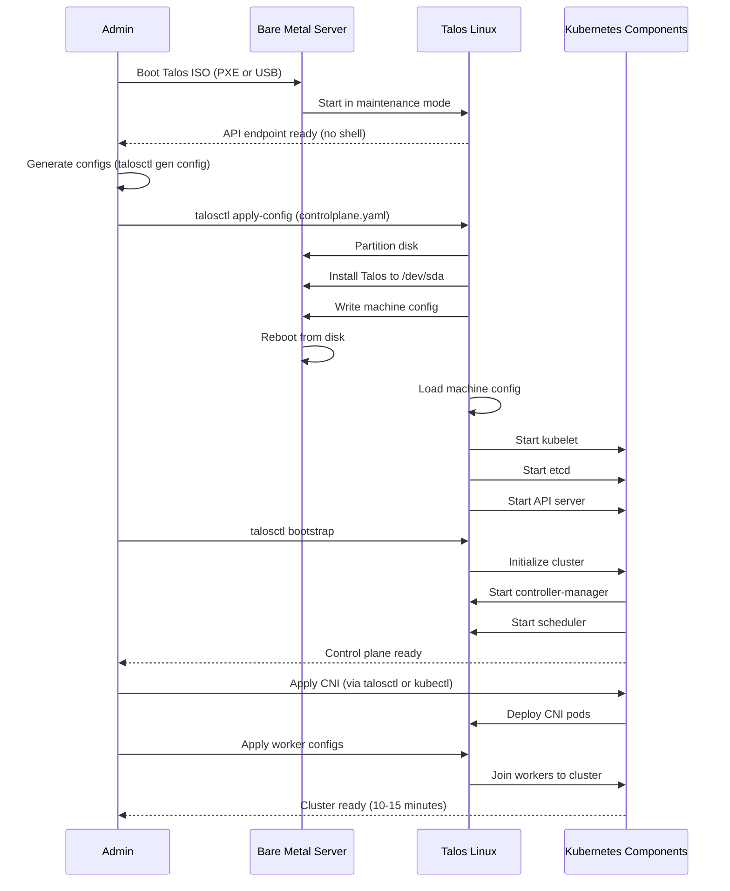

## Overview

Talos Linux is a modern operating system designed specifically for running Kubernetes. It is API-driven, immutable, and minimal, with no SSH access, shell, or package manager. All configuration is done via a declarative API.

**Key Facts**:
- **Latest Version**: Talos 1.9 (supports Kubernetes 1.31)
- **Support**: Community-driven, commercial support available from Sidero Labs
- **Kernel**: Linux 6.6+ LTS
- **Architecture**: Immutable, API-driven, no shell access
- **Management**: talosctl CLI + Kubernetes API

## Kubernetes Installation Methods

Talos Linux has **built-in Kubernetes** - there is only one installation method.

### Built-in Kubernetes (Only Option)

**Installation Process**:

1. **Boot Talos ISO/PXE** (maintenance mode)
2. **Apply machine configuration** via talosctl
3. **Bootstrap Kubernetes** via talosctl bootstrap

**Machine Configuration** (YAML):
```yaml
# controlplane.yaml
version: v1alpha1
machine:
  type: controlplane
  install:
    disk: /dev/sda
  network:
    hostname: control-plane-1
    interfaces:
      - interface: eth0
        dhcp: false
        addresses:
          - 192.168.1.10/24
        routes:
          - network: 0.0.0.0/0
            gateway: 192.168.1.1
cluster:
  clusterName: homelab
  controlPlane:
    endpoint: https://192.168.1.10:6443
  network:
    cni:
      name: custom
      urls:
        - https://raw.githubusercontent.com/projectcalico/calico/v3.28.0/manifests/calico.yaml
```

**Cluster Initialization**:
```bash
# Generate machine configs
talosctl gen config homelab https://192.168.1.10:6443

# Apply config to control plane node (booted from ISO)
talosctl apply-config --insecure --nodes 192.168.1.10 --file controlplane.yaml

# Wait for install to complete, then bootstrap
talosctl bootstrap --nodes 192.168.1.10 --endpoints 192.168.1.10

# Retrieve kubeconfig
talosctl kubeconfig --nodes 192.168.1.10 --endpoints 192.168.1.10

# Apply config to worker nodes
talosctl apply-config --insecure --nodes 192.168.1.11 --file worker.yaml
```

**Pros**:
- Kubernetes built-in, no separate installation
- Declarative configuration (GitOps-friendly)
- Extremely minimal attack surface (no shell, no SSH)
- Immutable infrastructure (config changes require reboot)
- Automatic updates via Talos controller
- Designed from ground up for Kubernetes

**Cons**:
- Steep learning curve (completely different paradigm)
- No SSH/shell access (all via API)
- Troubleshooting requires different mindset
- Limited to Kubernetes workloads only (not general-purpose)
- Smaller community than traditional distros

## Cluster Initialization Sequence



## Maintenance Requirements

### OS Updates

**Declarative Upgrades**:
```bash
# Upgrade Talos version (rolling upgrade)
talosctl upgrade --nodes 192.168.1.10 --image ghcr.io/siderolabs/installer:v1.9.0

# Kubernetes version upgrade (also declarative)
talosctl upgrade-k8s --nodes 192.168.1.10 --to 1.32.0
```

**Automatic Updates** (via Talos System Extensions):
```yaml
# machine config with auto-update extension
machine:
  install:
    extensions:
      - image: ghcr.io/siderolabs/system-upgrade-controller
```

**Frequency**:
- Talos releases: Every 2-3 months
- Kubernetes upgrades: Follow upstream cadence (quarterly)
- Security patches: Built into Talos releases
- **No traditional OS patching** (immutable system)

### Configuration Changes

**All changes via machine config**:
```bash
# Edit machine config YAML
vim controlplane.yaml

# Apply updated config (triggers reboot if needed)
talosctl apply-config --nodes 192.168.1.10 --file controlplane.yaml
```

**No manual package installs** - everything declarative.

## Resource Overhead

**Minimal Footprint** (Talos Linux + Kubernetes):
- **RAM**: ~256MB (OS) + 512MB (Kubernetes) = **768MB total**
- **CPU**: 1 core minimum, 2 cores recommended
- **Disk**: ~500MB (OS) + 10GB (container images/etcd) = **10-15GB total**
- **Network**: 1 Gbps recommended

**Comparison**: 
- Ubuntu + k3s: ~1GB RAM
- Talos: ~768MB RAM (lighter)
- Ubuntu + kubeadm: ~2GB RAM
- Talos: ~768MB RAM (much lighter)

**Minimal install size**: ~500MB (vs 10GB+ for Ubuntu/Fedora)

## Security Posture

**Strengths**: ⭐⭐⭐⭐⭐ (Excellent)

- **No SSH access** - attack surface eliminated
- **No shell** - cannot install malware
- **No package manager** - no additional software installation
- **Immutable filesystem** - rootfs read-only
- **Minimal components**: Only Kubernetes and essential services
- **API-only access** - mTLS-authenticated talosctl
- **KSPP compliance**: Kernel Self-Protection Project standards
- **Signed images**: Cryptographically signed Talos images
- **Secure Boot support**: UEFI Secure Boot compatible

**Attack Surface**:
- **Smallest possible**: Only Kubernetes API, kubelet, and Talos API
- ~30 running processes (vs 100+ on Ubuntu/Fedora)
- ~200MB filesystem (vs 5-10GB on Ubuntu/Fedora)

**No hardening needed** - secure by default.

**Security Features**:
```yaml
# Built-in security (example config)
machine:
  sysctls:
    kernel.kptr_restrict: "2"
    kernel.yama.ptrace_scope: "1"
  kernel:
    modules:
      - name: br_netfilter
  features:
    kubernetesTalosAPIAccess:
      enabled: true
      allowedRoles:
        - os:reader
```

## Learning Curve

**Ease of Adoption**: ⭐⭐ (Challenging)

- **Paradigm shift**: No shell/SSH, API-only management
- Requires understanding of declarative infrastructure
- Talosctl CLI has learning curve
- Excellent documentation helps
- Different troubleshooting approach (logs via API)

**Required Knowledge**:
- Kubernetes fundamentals (critical)
- YAML configuration syntax
- Networking basics (especially CNI)
- GitOps concepts helpful
- Comfort with "infrastructure as code"

**Debugging without shell**:
```bash
# View logs via API
talosctl logs --nodes 192.168.1.10 kubelet

# Get system metrics
talosctl dashboard --nodes 192.168.1.10

# Interactive mode (limited shell in emergency)
talosctl dashboard --nodes 192.168.1.10

# Service status
talosctl service --nodes 192.168.1.10
```

## Community Support

**Ecosystem Maturity**: ⭐⭐⭐ (Growing)

- **Documentation**: Excellent official docs
- **Community**: Smaller but very active (Slack, GitHub Discussions)
- **Commercial Support**: Available from Sidero Labs
- **Third-Party Tools**: Growing ecosystem (Cluster API, GitOps tools)
- **Tutorials**: Increasing number of community guides

**Resources**:
- [Talos Linux Documentation](https://www.talos.dev/v1.9/introduction/what-is-talos/)
- [Talos Community Slack](https://slack.dev.talos-systems.io/)
- [Sidero Labs GitHub](https://github.com/siderolabs/talos)
- [Awesome Talos](https://github.com/budimanjojo/awesome-talos)

**Community Size**: Smaller than Ubuntu/Fedora, but dedicated and helpful.

## Pros and Cons Summary

### Pros

* Good, because Kubernetes is built-in (no separate installation)
* Good, because minimal attack surface (no SSH, shell, or package manager)
* Good, because immutable infrastructure (config drift impossible)
* Good, because API-driven management (GitOps-friendly)
* Good, because extremely low resource overhead (~768MB RAM)
* Good, because automatic security patches via Talos upgrades
* Good, because declarative configuration (version-controlled)
* Good, because secure by default (no hardening required)
* Good, because smallest disk footprint (~500MB OS)
* Good, because designed specifically for Kubernetes (opinionated and optimized)
* Good, because UEFI Secure Boot support
* Good, because upgrades are simple and declarative (talosctl upgrade)

### Cons

* Bad, because steep learning curve (no shell/SSH paradigm shift)
* Bad, because limited to Kubernetes workloads only (not general-purpose)
* Bad, because troubleshooting without shell requires different approach
* Bad, because smaller community than Ubuntu/Fedora
* Bad, because relatively new (less mature than traditional distros)
* Bad, because no escape hatch for manual intervention
* Bad, because requires comfort with declarative infrastructure
* Bad, because debugging is harder for beginners
* Neutral, because opinionated design (pro for K8s-only, con for general use)

## Recommendations

**Best for**:
- Kubernetes-dedicated infrastructure (no general-purpose workloads)
- Security-focused environments (minimal attack surface)
- GitOps workflows (declarative configuration)
- Immutable infrastructure advocates
- Teams comfortable with API-driven management
- Production Kubernetes clusters (once team is trained)

**Best Installation Method**:
- **Only option**: Built-in Kubernetes via talosctl

**Avoid if**:
- Need general-purpose server functionality (SSH, cron jobs, etc.)
- Team unfamiliar with Kubernetes (too steep a learning curve)
- Require shell access for troubleshooting comfort
- Want traditional package management (apt, dnf)
- Prefer familiar Linux administration tools

## Comparison with Ubuntu and Fedora

| Aspect | Talos Linux | Ubuntu + k3s | Fedora + kubeadm |
|--------|-------------|--------------|------------------|
| **K8s Installation** | Built-in | Single command | Manual (kubeadm) |
| **Attack Surface** | Minimal (~30 processes) | Medium (~100) | Medium (~100) |
| **Resource Overhead** | 768MB RAM | 1GB RAM | 2.2GB RAM |
| **Disk Footprint** | 500MB | 10GB | 15GB |
| **Security Model** | Immutable, no shell | AppArmor, shell | SELinux, shell |
| **Management** | API-only (talosctl) | SSH + kubectl | SSH + kubectl |
| **Learning Curve** | Steep | Easy | Moderate |
| **Community Size** | Small (growing) | Very Large | Large |
| **Support Period** | Rolling releases | 5-10 years | 13 months |
| **Use Case** | Kubernetes only | General-purpose | General-purpose |
| **Upgrades** | Declarative, simple | Manual OS + K8s | Manual OS + K8s |
| **Configuration** | Declarative YAML | Imperative + YAML | Imperative + YAML |
| **Troubleshooting** | API logs/metrics | SSH + logs | SSH + logs |
| **GitOps-Friendly** | Excellent | Good | Good |
| **Best for** | K8s-dedicated infra | Homelabs, learning | RHEL ecosystem |

**Verdict**: Talos is the most secure and efficient option for Kubernetes-only infrastructure, but requires team buy-in to API-driven, immutable paradigm. Ubuntu/Fedora better for general-purpose servers or teams wanting shell access.

## Advanced Features

### Talos System Extensions

Extend Talos functionality with extensions:
```yaml
machine:
  install:
    extensions:
      - image: ghcr.io/siderolabs/intel-ucode:20240312
      - image: ghcr.io/siderolabs/iscsi-tools:v0.1.4
```

### Cluster API Integration

Talos works natively with Cluster API:
```bash
# Install Cluster API + Talos provider
clusterctl init --infrastructure talos

# Create cluster from template
clusterctl generate cluster homelab --infrastructure talos > cluster.yaml
kubectl apply -f cluster.yaml
```

### Image Factory

Custom Talos images with extensions:
```bash
# Build custom image
curl -X POST https://factory.talos.dev/image \
  -d '{"talos_version":"v1.9.0","extensions":["siderolabs/intel-ucode"]}'
```

### Disaster Recovery

Talos supports etcd backup/restore:
```bash
# Backup etcd
talosctl etcd snapshot --nodes 192.168.1.10

# Restore from snapshot
talosctl bootstrap --recover-from ./etcd-snapshot.db
```

## Production Readiness

**Production Use**: ✅ Yes (many companies run Talos in production)

**High Availability**:
- 3+ control plane nodes recommended
- External etcd supported
- Load balancer for API server

**Monitoring**:
- Prometheus metrics built-in
- Talos dashboard for health
- Standard Kubernetes observability tools

**Example Production Clusters**:
- Sidero Metal (bare metal provisioning)
- Various cloud providers (AWS, GCP, Azure)
- Edge deployments (minimal footprint)
