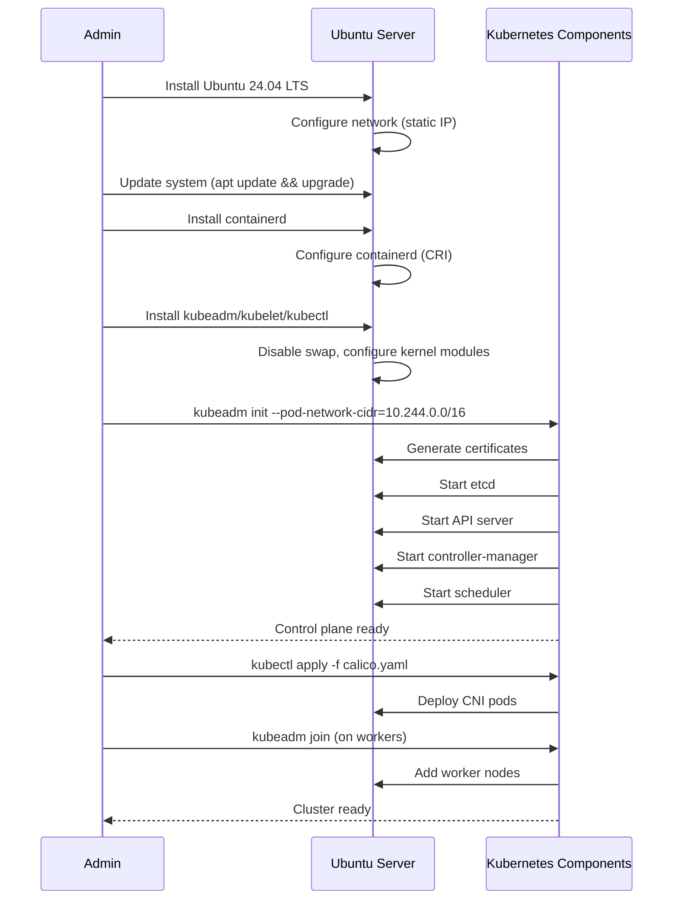
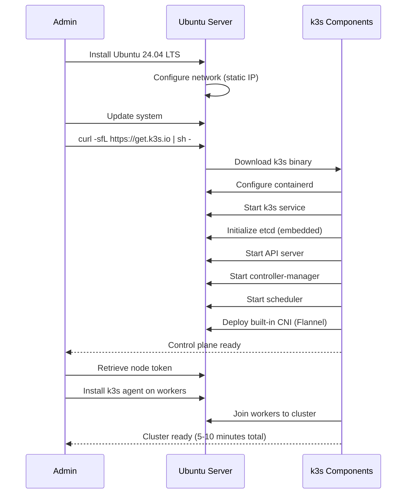

## Overview

Ubuntu Server is a popular general-purpose Linux distribution developed by Canonical. It provides Long Term Support (LTS) releases with 5 years of standard support and optional Extended Security Maintenance (ESM).

**Key Facts**:
- **Latest LTS**: Ubuntu 24.04 LTS (Noble Numbat)
- **Support Period**: 5 years standard, 10 years with Ubuntu Pro (free for personal use)
- **Kernel**: Linux 6.8+ (LTS), regular HWE updates
- **Package Manager**: APT/DPKG, Snap
- **Init System**: systemd

## Kubernetes Installation Methods

Ubuntu supports multiple Kubernetes installation approaches:

### 1. kubeadm (Official Kubernetes Tool)

**Installation**:
```bash
# Install container runtime (containerd)
sudo apt-get update
sudo apt-get install -y containerd

# Configure containerd
sudo mkdir -p /etc/containerd
containerd config default | sudo tee /etc/containerd/config.toml
sudo systemctl restart containerd

# Install kubeadm, kubelet, kubectl
sudo apt-get install -y apt-transport-https ca-certificates curl gpg
curl -fsSL https://pkgs.k8s.io/core:/stable:/v1.31/deb/Release.key | sudo gpg --dearmor -o /etc/apt/keyrings/kubernetes-apt-keyring.gpg
echo 'deb [signed-by=/etc/apt/keyrings/kubernetes-apt-keyring.gpg] https://pkgs.k8s.io/core:/stable:/v1.31/deb/ /' | sudo tee /etc/apt/sources.list.d/kubernetes.list
sudo apt-get update
sudo apt-get install -y kubelet kubeadm kubectl
sudo apt-mark hold kubelet kubeadm kubectl
```

**Cluster Initialization**:
```bash
# Initialize control plane
sudo kubeadm init --pod-network-cidr=10.244.0.0/16

# Configure kubectl for admin
mkdir -p $HOME/.kube
sudo cp -i /etc/kubernetes/admin.conf $HOME/.kube/config
sudo chown $(id -u):$(id -g) $HOME/.kube/config

# Install CNI (e.g., Calico, Flannel)
kubectl apply -f https://raw.githubusercontent.com/projectcalico/calico/v3.28.0/manifests/calico.yaml

# Join worker nodes
kubeadm token create --print-join-command
```

**Pros**:
- Official Kubernetes tooling, well-documented
- Full control over cluster configuration
- Supports latest Kubernetes versions
- Large community and extensive resources

**Cons**:
- More manual steps than turnkey solutions
- Requires understanding of Kubernetes architecture
- Manual upgrade process for each component
- More complex troubleshooting

### 2. k3s (Lightweight Kubernetes)

**Installation**:
```bash
# Single-command install on control plane
curl -sfL https://get.k3s.io | sh -

# Get node token for workers
sudo cat /var/lib/rancher/k3s/server/node-token

# Install on worker nodes
curl -sfL https://get.k3s.io | K3S_URL=https://control-plane:6443 K3S_TOKEN=<token> sh -
```

**Pros**:
- Extremely simple installation (single command)
- Lightweight (< 512MB RAM)
- Built-in container runtime (containerd)
- Automatic updates via Rancher System Upgrade Controller
- Great for edge and homelab use cases

**Cons**:
- Less customizable than kubeadm
- Some features removed (e.g., in-tree storage, cloud providers)
- Slightly different from upstream Kubernetes

### 3. MicroK8s (Canonical's Distribution)

**Installation**:
```bash
# Install via snap
sudo snap install microk8s --classic

# Join cluster
sudo microk8s add-node
# Run output command on worker nodes

# Enable addons
microk8s enable dns storage ingress
```

**Pros**:
- Zero-ops, single package install
- Snap-based automatic updates
- Addons for common services (DNS, storage, ingress)
- Canonical support available

**Cons**:
- Requires snap (not universally liked)
- Less ecosystem compatibility than vanilla Kubernetes
- Ubuntu-specific (less portable)

## Cluster Initialization Sequence

### kubeadm Approach



### k3s Approach



## Maintenance Requirements

### OS Updates

**Security Patches**:
```bash
# Automatic security updates (recommended)
sudo apt-get install unattended-upgrades
sudo dpkg-reconfigure -plow unattended-upgrades

# Manual updates
sudo apt-get update
sudo apt-get upgrade
```

**Frequency**:
- Security patches: Weekly to monthly
- Kernel updates: Monthly (may require reboot)
- Major version upgrades: Every 2 years (LTS to LTS)

### Kubernetes Upgrades

**kubeadm Upgrade**:
```bash
# Upgrade control plane
sudo apt-get update
sudo apt-get install -y kubeadm=1.32.0-*
sudo kubeadm upgrade apply v1.32.0
sudo apt-get install -y kubelet=1.32.0-* kubectl=1.32.0-*
sudo systemctl restart kubelet

# Upgrade workers
kubectl drain <node> --ignore-daemonsets
sudo apt-get install -y kubeadm=1.32.0-* kubelet=1.32.0-* kubectl=1.32.0-*
sudo kubeadm upgrade node
sudo systemctl restart kubelet
kubectl uncordon <node>
```

**k3s Upgrade**:
```bash
# Manual upgrade
curl -sfL https://get.k3s.io | INSTALL_K3S_VERSION=v1.32.0+k3s1 sh -

# Automatic upgrade via system-upgrade-controller
kubectl apply -f https://github.com/rancher/system-upgrade-controller/releases/latest/download/system-upgrade-controller.yaml
```

**Upgrade Frequency**: Every 3-6 months (Kubernetes minor versions)

## Resource Overhead

**Minimal Installation** (Ubuntu Server + k3s):
- **RAM**: ~512MB (OS) + 512MB (k3s) = 1GB total
- **CPU**: 1 core minimum, 2 cores recommended
- **Disk**: 10GB (OS) + 10GB (container images) = 20GB
- **Network**: 1 Gbps recommended

**Full Installation** (Ubuntu Server + kubeadm):
- **RAM**: ~512MB (OS) + 1-2GB (Kubernetes components) = 2GB+ total
- **CPU**: 2 cores minimum
- **Disk**: 15GB (OS) + 20GB (container images/etcd) = 35GB
- **Network**: 1 Gbps recommended

## Security Posture

**Strengths**:
- Regular security updates via Ubuntu Security Team
- AppArmor enabled by default
- SELinux support available
- Kernel hardening features (ASLR, stack protection)
- Ubuntu Pro ESM for extended CVE coverage (free for personal use)

**Attack Surface**:
- Full general-purpose OS (larger attack surface than minimal OS)
- Many installed packages by default (can be minimized)
- Requires manual hardening for production use

**Hardening Steps**:
```bash
# Disable unnecessary services
sudo systemctl disable snapd.service
sudo systemctl disable bluetooth.service

# Configure firewall
sudo ufw default deny incoming
sudo ufw default allow outgoing
sudo ufw allow 22/tcp
sudo ufw allow 6443/tcp  # Kubernetes API
sudo ufw allow 10250/tcp # Kubelet
sudo ufw enable

# CIS Kubernetes Benchmark compliance
# Use tools like kube-bench for validation
```

## Learning Curve

**Ease of Adoption**: ⭐⭐⭐⭐⭐ (Excellent)

- Most familiar Linux distribution for many users
- Extensive documentation and tutorials
- Large community support (forums, Stack Overflow)
- Straightforward package management
- Similar to Debian-based systems

**Required Knowledge**:
- Basic Linux system administration (apt, systemd, networking)
- Kubernetes concepts (pods, services, deployments)
- Container runtime basics (containerd, Docker)
- Text editor (vim, nano) for configuration

## Community Support

**Ecosystem Maturity**: ⭐⭐⭐⭐⭐ (Excellent)

- **Documentation**: Comprehensive official docs, community guides
- **Community**: Massive user base, active forums
- **Commercial Support**: Available from Canonical (Ubuntu Pro)
- **Third-Party Tools**: Excellent compatibility with all Kubernetes tools
- **Tutorials**: Abundant resources for Kubernetes on Ubuntu

**Resources**:
- [Ubuntu Server Documentation](https://ubuntu.com/server/docs)
- [Kubernetes on Ubuntu Guide](https://ubuntu.com/kubernetes)
- [k3s Documentation](https://docs.k3s.io/)
- [MicroK8s Documentation](https://microk8s.io/docs)

## Pros and Cons Summary

### Pros

* Good, because most familiar and well-documented Linux distribution
* Good, because 5-year LTS support (10 years with Ubuntu Pro)
* Good, because multiple Kubernetes installation options (kubeadm, k3s, MicroK8s)
* Good, because k3s provides extremely simple setup (single command)
* Good, because extensive package ecosystem (60,000+ packages)
* Good, because strong community support and resources
* Good, because automatic security updates available
* Good, because low learning curve for most administrators
* Good, because compatible with all Kubernetes tooling and addons
* Good, because Ubuntu Pro free for personal use (extended security)

### Cons

* Bad, because general-purpose OS has larger attack surface than minimal OS
* Bad, because more resource overhead than purpose-built Kubernetes OS (1-2GB RAM)
* Bad, because requires manual OS updates and reboots
* Bad, because kubeadm setup is complex with many manual steps
* Bad, because snap packages controversial (for MicroK8s)
* Bad, because Kubernetes upgrades require manual intervention (unless using k3s auto-upgrade)
* Bad, because managing OS + Kubernetes lifecycle separately increases complexity
* Neutral, because many preinstalled packages (can be removed, but require effort)

## Recommendations

**Best for**:
- Users familiar with Ubuntu/Debian ecosystem
- Homelabs requiring general-purpose server functionality (not just Kubernetes)
- Teams wanting multiple Kubernetes installation options
- Users prioritizing community support and documentation

**Best Installation Method**:
- **Homelab/Learning**: k3s (simplest, auto-updates, lightweight)
- **Production-like**: kubeadm (full control, upstream Kubernetes)
- **Ubuntu-specific**: MicroK8s (Canonical support, snap-based)

**Avoid if**:
- Seeking minimal attack surface (consider Talos Linux)
- Want infrastructure-as-code for OS layer (consider Talos Linux)
- Prefer hyperconverged platform (consider Harvester)
