The Admin API provides HTTP REST endpoints for managing boot images, machine mappings, and boot profiles. Since this is for a home lab environment, no authentication is required.

## Boot Image Management

### `POST /api/v1/images`

Upload a new boot image (kernel, initrd, and metadata).

#### Sequence Diagram

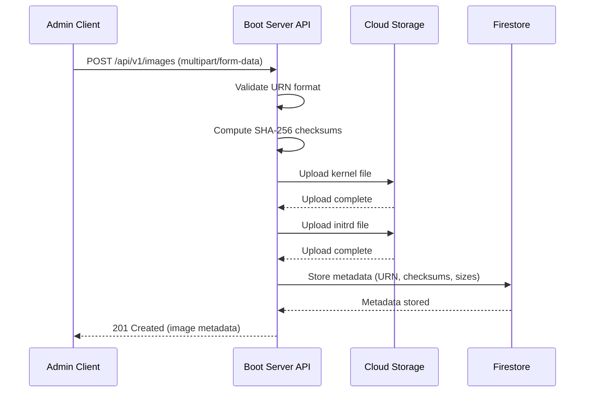

**Request Body (multipart/form-data):**

Form fields:
- `id` (text): Boot image URN (format: `urn:boot:image:{name}`)
- `name` (text): Human-readable name
- `version` (text): Semantic version
- `kernel` (file): Kernel image file
- `initrd` (file): Initrd image file
- `metadata` (JSON text): Metadata object

**Example Request:**

```http
POST /api/v1/images HTTP/1.1
Host: boot.example.com
Content-Type: multipart/form-data; boundary=----WebKitFormBoundary7MA4YWxkTrZu0gW

------WebKitFormBoundary7MA4YWxkTrZu0gW
Content-Disposition: form-data; name="id"

urn:boot:image:ubuntu-2204
------WebKitFormBoundary7MA4YWxkTrZu0gW
Content-Disposition: form-data; name="name"

Ubuntu 22.04 LTS Server
------WebKitFormBoundary7MA4YWxkTrZu0gW
Content-Disposition: form-data; name="version"

22.04.3
------WebKitFormBoundary7MA4YWxkTrZu0gW
Content-Disposition: form-data; name="kernel"; filename="vmlinuz"
Content-Type: application/octet-stream

<kernel binary data>
------WebKitFormBoundary7MA4YWxkTrZu0gW
Content-Disposition: form-data; name="initrd"; filename="initrd.img"
Content-Type: application/octet-stream

<initrd binary data>
------WebKitFormBoundary7MA4YWxkTrZu0gW
Content-Disposition: form-data; name="metadata"
Content-Type: application/json

{"os":"ubuntu","os_version":"22.04.3","architecture":"x86_64","tags":["lts","server"]}
------WebKitFormBoundary7MA4YWxkTrZu0gW--
```

**Request Headers:**

- `Content-Type: multipart/form-data`

**Response (201 Created):**

```json
{
  "id": "urn:boot:image:ubuntu-2204",
  "name": "Ubuntu 22.04 LTS Server",
  "version": "22.04.3",
  "kernel": {
    "sha256": "a1b2c3d4e5f6789...",
    "size_bytes": 8388608
  },
  "initrd": {
    "sha256": "f6e5d4c3b2a19876...",
    "size_bytes": 52428800
  },
  "metadata": {
    "os": "ubuntu",
    "os_version": "22.04.3",
    "architecture": "x86_64",
    "tags": ["lts", "server"]
  },
  "created_at": "2025-11-19T06:00:00Z"
}
```

**Error Responses:**

| Status Code | Description |
|-------------|-------------|
| 400 Bad Request | Invalid request body or missing required fields |
| 409 Conflict | Image with the same ID already exists |
| 422 Unprocessable Entity | Validation error (invalid URN format, file too large) |

---

### `GET /api/v1/images`

List all boot images.

#### Sequence Diagram

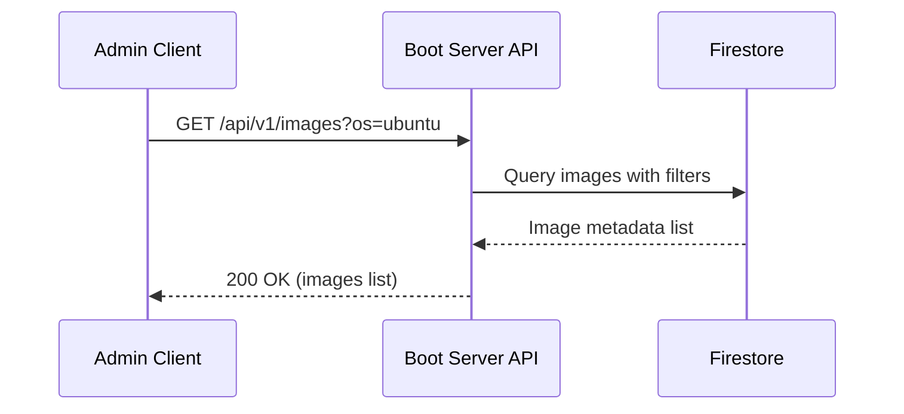

**Query Parameters:**

| Parameter | Type | Required | Description | Default |
|-----------|------|----------|-------------|---------|
| `page` | integer | No | Page number (1-indexed) | 1 |
| `per_page` | integer | No | Results per page (1-100) | 20 |
| `os` | string | No | Filter by operating system | - |
| `architecture` | string | No | Filter by architecture | - |
| `tags` | string | No | Filter by tags (comma-separated) | - |

**Request Example:**

```http
GET /api/v1/images?os=ubuntu&architecture=x86_64&page=1&per_page=20 HTTP/1.1
Host: boot.example.com
```

**Response (200 OK):**

```json
{
  "images": [
    {
      "id": "urn:boot:image:ubuntu-2204",
      "name": "Ubuntu 22.04 LTS Server",
      "version": "22.04.3",
      "kernel": {
        "sha256": "a1b2c3d4e5f6789...",
        "size_bytes": 8388608
      },
      "initrd": {
        "sha256": "f6e5d4c3b2a19876...",
        "size_bytes": 52428800
      },
      "metadata": {
        "os": "ubuntu",
        "os_version": "22.04.3",
        "architecture": "x86_64",
        "tags": ["lts", "server"]
      },
      "created_at": "2025-11-19T06:00:00Z"
    }
  ],
  "pagination": {
    "total": 1,
    "page": 1,
    "per_page": 20,
    "total_pages": 1
  }
}
```

---

### `GET /api/v1/images/{id}`

Retrieve a specific boot image by ID.

#### Sequence Diagram

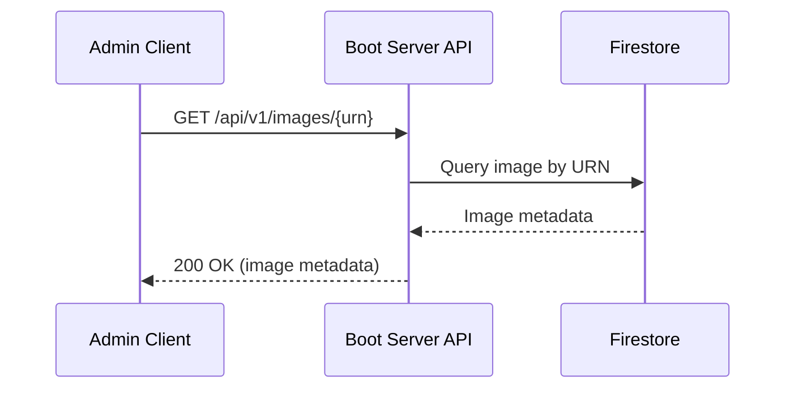

**Path Parameters:**

| Parameter | Type | Required | Description |
|-----------|------|----------|-------------|
| `id` | string (URN) | Yes | Boot image identifier (URN format: `urn:boot:image:{name}`) |

**Request Example:**

```http
GET /api/v1/images/urn:boot:image:ubuntu-2204 HTTP/1.1
Host: boot.example.com
```

**Response (200 OK):**

```json
{
  "id": "urn:boot:image:ubuntu-2204",
  "name": "Ubuntu 22.04 LTS Server",
  "version": "22.04.3",
  "kernel": {
    "sha256": "a1b2c3d4e5f6789...",
    "size_bytes": 8388608
  },
  "initrd": {
    "sha256": "f6e5d4c3b2a19876...",
    "size_bytes": 52428800
  },
  "metadata": {
    "os": "ubuntu",
    "os_version": "22.04.3",
    "architecture": "x86_64",
    "tags": ["lts", "server"]
  },
  "created_at": "2025-11-19T06:00:00Z"
}
```

**Error Responses:**

| Status Code | Description |
|-------------|-------------|
| 404 Not Found | Image with specified ID not found |

---

### `DELETE /api/v1/images/{id}`

Delete a boot image.

#### Sequence Diagram

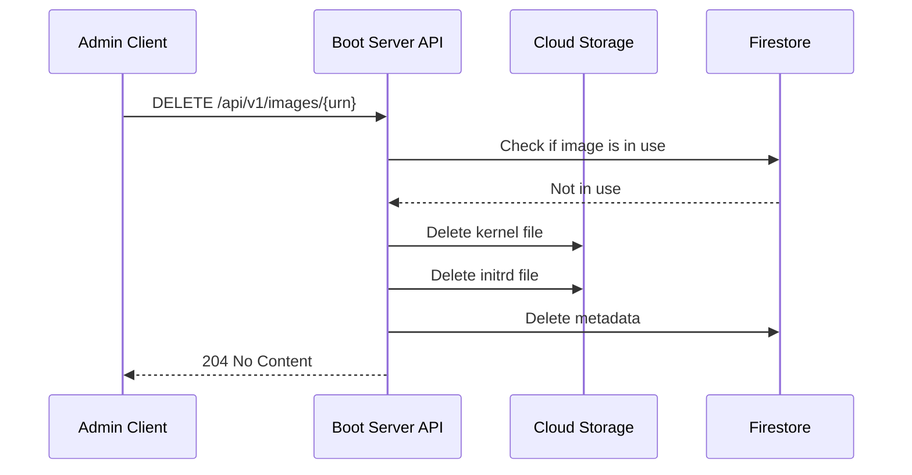

**Path Parameters:**

| Parameter | Type | Required | Description |
|-----------|------|----------|-------------|
| `id` | string (URN) | Yes | Boot image identifier (URN format: `urn:boot:image:{name}`) |

**Request Example:**

```http
DELETE /api/v1/images/urn:boot:image:ubuntu-2204 HTTP/1.1
Host: boot.example.com
```

**Response (204 No Content):**

Empty response body.

**Error Responses:**

| Status Code | Description |
|-------------|-------------|
| 404 Not Found | Image with specified ID not found |
| 409 Conflict | Image is currently in use by one or more machines |

---

## Machine Mapping Management

### `POST /api/v1/machines`

Register a new machine and map it to a boot profile.

#### Sequence Diagram

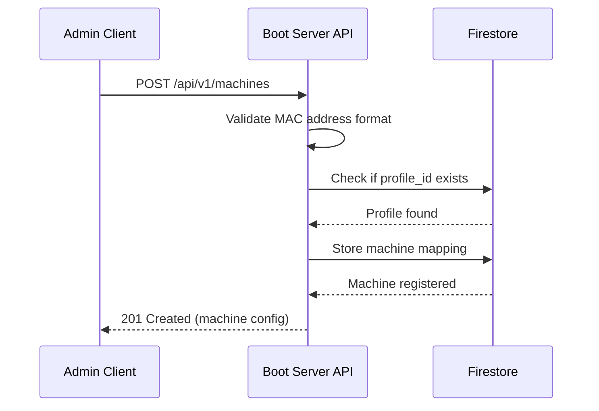

**Request Body:**

```json
{
  "mac_address": "52:54:00:12:34:56",
  "hostname": "node-01",
  "profile_id": "urn:boot:profile:ubuntu-server-base",
  "metadata": {
    "datacenter": "homelab",
    "rack": "A1",
    "role": "compute"
  },
  "network": {
    "ip_address": "10.0.1.10",
    "netmask": "255.255.255.0",
    "gateway": "10.0.1.1",
    "dns_servers": ["10.0.1.1", "8.8.8.8"]
  }
}
```

**Response (201 Created):**

```json
{
  "mac_address": "52:54:00:12:34:56",
  "hostname": "node-01",
  "profile_id": "urn:boot:profile:ubuntu-server-base",
  "metadata": {
    "datacenter": "homelab",
    "rack": "A1",
    "role": "compute"
  },
  "network": {
    "ip_address": "10.0.1.10",
    "netmask": "255.255.255.0",
    "gateway": "10.0.1.1",
    "dns_servers": ["10.0.1.1", "8.8.8.8"]
  },
  "created_at": "2025-11-19T06:00:00Z",
  "updated_at": "2025-11-19T06:00:00Z"
}
```

**Error Responses:**

| Status Code | Description |
|-------------|-------------|
| 400 Bad Request | Invalid MAC address format or missing required fields |
| 409 Conflict | Machine with the same MAC address already exists |
| 422 Unprocessable Entity | Referenced profile_id does not exist |

---

### `GET /api/v1/machines`

List all registered machines.

#### Sequence Diagram

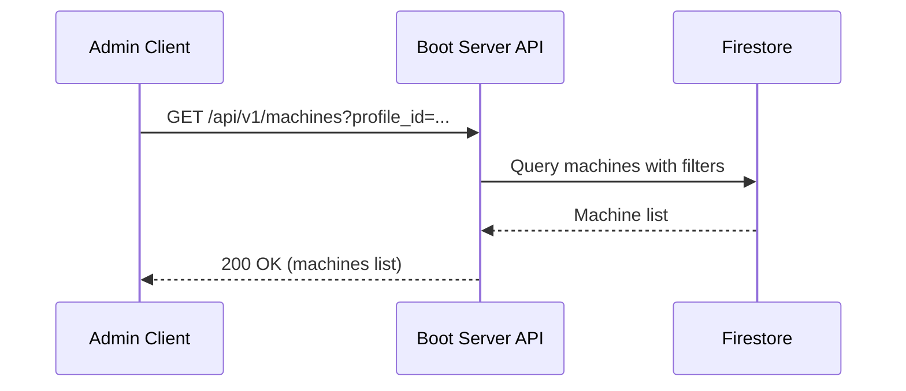

**Query Parameters:**

| Parameter | Type | Required | Description | Default |
|-----------|------|----------|-------------|---------|
| `page` | integer | No | Page number (1-indexed) | 1 |
| `per_page` | integer | No | Results per page (1-100) | 20 |
| `profile_id` | string | No | Filter by boot profile | - |
| `role` | string | No | Filter by machine role | - |

**Response (200 OK):**

```json
{
  "machines": [
    {
      "mac_address": "52:54:00:12:34:56",
      "hostname": "node-01",
      "profile_id": "urn:boot:profile:ubuntu-server-base",
      "metadata": {
        "datacenter": "homelab",
        "rack": "A1",
        "role": "compute"
      },
      "network": {
        "ip_address": "10.0.1.10",
        "netmask": "255.255.255.0",
        "gateway": "10.0.1.1",
        "dns_servers": ["10.0.1.1", "8.8.8.8"]
      },
      "created_at": "2025-11-19T06:00:00Z",
      "updated_at": "2025-11-19T06:00:00Z"
    }
  ],
  "pagination": {
    "total": 1,
    "page": 1,
    "per_page": 20,
    "total_pages": 1
  }
}
```

---

### `GET /api/v1/machines/{mac}`

Retrieve a specific machine configuration by MAC address.

#### Sequence Diagram

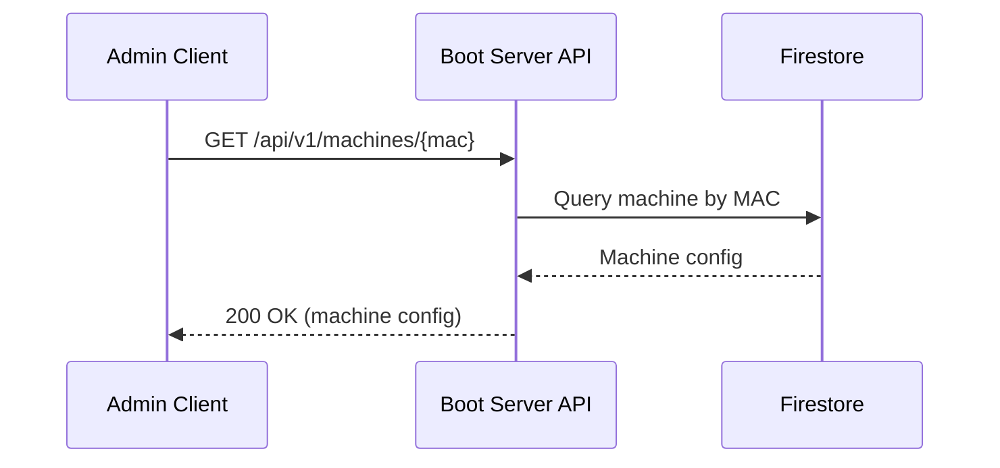

**Path Parameters:**

| Parameter | Type | Required | Description |
|-----------|------|----------|-------------|
| `mac` | string | Yes | MAC address (format: `aa:bb:cc:dd:ee:ff`) |

**Response (200 OK):**

Same as POST response.

**Error Responses:**

| Status Code | Description |
|-------------|-------------|
| 404 Not Found | Machine with specified MAC address not found |

---

### `PUT /api/v1/machines/{mac}`

Update a machine's configuration.

#### Sequence Diagram

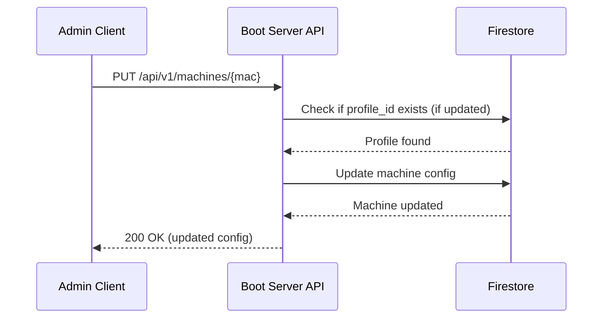

**Path Parameters:**

| Parameter | Type | Required | Description |
|-----------|------|----------|-------------|
| `mac` | string | Yes | MAC address (format: `aa:bb:cc:dd:ee:ff`) |

**Request Body:**

```json
{
  "profile_id": "urn:boot:profile:ubuntu-server-v2",
  "metadata": {
    "datacenter": "homelab",
    "rack": "A1",
    "role": "storage"
  }
}
```

**Response (200 OK):**

Full machine configuration with updated fields.

**Error Responses:**

| Status Code | Description |
|-------------|-------------|
| 404 Not Found | Machine with specified MAC address not found |
| 422 Unprocessable Entity | Referenced profile_id does not exist |

---

### `DELETE /api/v1/machines/{mac}`

Delete a machine registration.

#### Sequence Diagram

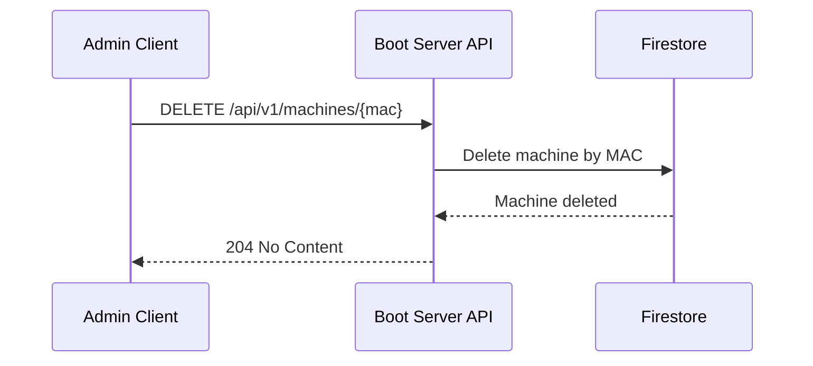

**Path Parameters:**

| Parameter | Type | Required | Description |
|-----------|------|----------|-------------|
| `mac` | string | Yes | MAC address (format: `aa:bb:cc:dd:ee:ff`) |

**Response (204 No Content):**

Empty response body.

**Error Responses:**

| Status Code | Description |
|-------------|-------------|
| 404 Not Found | Machine with specified MAC address not found |

---

## Boot Profile Management

### `POST /api/v1/profiles`

Create a new boot profile.

#### Sequence Diagram

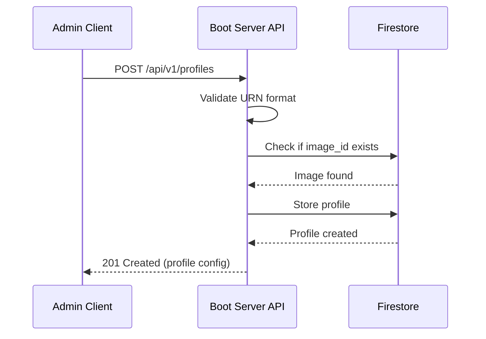

**Request Body:**

```json
{
  "id": "urn:boot:profile:ubuntu-server-base",
  "name": "Ubuntu Server Base Profile",
  "image_id": "urn:boot:image:ubuntu-2204",
  "kernel_args": [
    "console=tty0",
    "console=ttyS0",
    "ip=dhcp"
  ],
  "metadata": {
    "description": "Base Ubuntu server configuration with minimal packages",
    "tags": ["base", "minimal"]
  }
}
```

**Response (201 Created):**

```json
{
  "id": "urn:boot:profile:ubuntu-server-base",
  "name": "Ubuntu Server Base Profile",
  "image_id": "urn:boot:image:ubuntu-2204",
  "kernel_args": [
    "console=tty0",
    "console=ttyS0",
    "ip=dhcp"
  ],
  "metadata": {
    "description": "Base Ubuntu server configuration with minimal packages",
    "tags": ["base", "minimal"]
  },
  "created_at": "2025-11-19T06:00:00Z",
  "updated_at": "2025-11-19T06:00:00Z"
}
```

**Error Responses:**

| Status Code | Description |
|-------------|-------------|
| 409 Conflict | Profile with the same ID already exists |
| 422 Unprocessable Entity | Referenced image_id does not exist |

---

### `GET /api/v1/profiles`

List all boot profiles.

#### Sequence Diagram

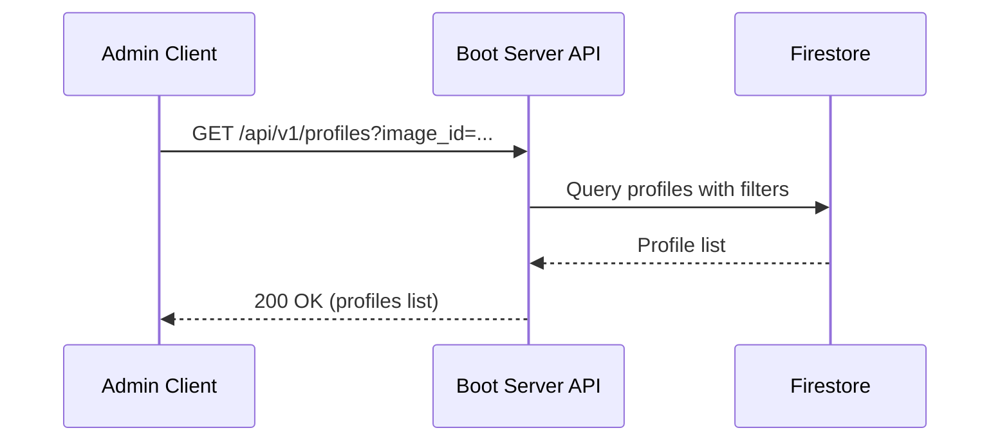

**Query Parameters:**

| Parameter | Type | Required | Description | Default |
|-----------|------|----------|-------------|---------|
| `page` | integer | No | Page number (1-indexed) | 1 |
| `per_page` | integer | No | Results per page (1-100) | 20 |
| `image_id` | string (URN) | No | Filter by boot image | - |

**Response (200 OK):**

```json
{
  "profiles": [
    {
      "id": "urn:boot:profile:ubuntu-server-base",
      "name": "Ubuntu Server Base Profile",
      "image_id": "urn:boot:image:ubuntu-2204",
      "kernel_args": [
        "console=tty0",
        "console=ttyS0",
        "ip=dhcp"
      ],
      "metadata": {
        "description": "Base Ubuntu server configuration with minimal packages",
        "tags": ["base", "minimal"]
      },
      "created_at": "2025-11-19T06:00:00Z",
      "updated_at": "2025-11-19T06:00:00Z"
    }
  ],
  "pagination": {
    "total": 1,
    "page": 1,
    "per_page": 20,
    "total_pages": 1
  }
}
```

---

### `GET /api/v1/profiles/{id}`

Retrieve a specific boot profile.

#### Sequence Diagram

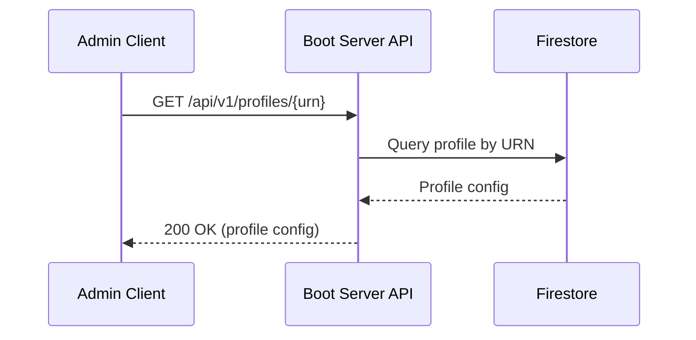

**Path Parameters:**

| Parameter | Type | Required | Description |
|-----------|------|----------|-------------|
| `id` | string (URN) | Yes | Boot profile identifier (URN format: `urn:boot:profile:{name}`) |

**Response (200 OK):**

Same as POST response.

**Error Responses:**

| Status Code | Description |
|-------------|-------------|
| 404 Not Found | Profile with specified ID not found |

---

### `PUT /api/v1/profiles/{id}`

Update a boot profile.

#### Sequence Diagram

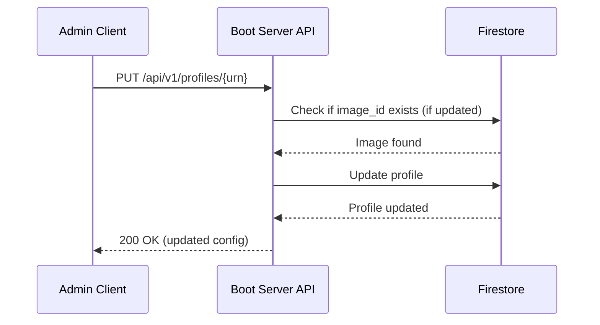

**Path Parameters:**

| Parameter | Type | Required | Description |
|-----------|------|----------|-------------|
| `id` | string (URN) | Yes | Boot profile identifier (URN format: `urn:boot:profile:{name}`) |

**Request Body:**

```json
{
  "kernel_args": [
    "console=tty0",
    "console=ttyS0",
    "ip=dhcp",
    "net.ifnames=0"
  ],
  "metadata": {
    "description": "Updated Ubuntu server configuration",
    "tags": ["base", "minimal", "updated"]
  }
}
```

**Response (200 OK):**

Full profile configuration with updated fields.

**Error Responses:**

| Status Code | Description |
|-------------|-------------|
| 404 Not Found | Profile with specified ID not found |
| 422 Unprocessable Entity | Referenced image_id does not exist (if updated) |

---

### `DELETE /api/v1/profiles/{id}`

Delete a boot profile.

#### Sequence Diagram

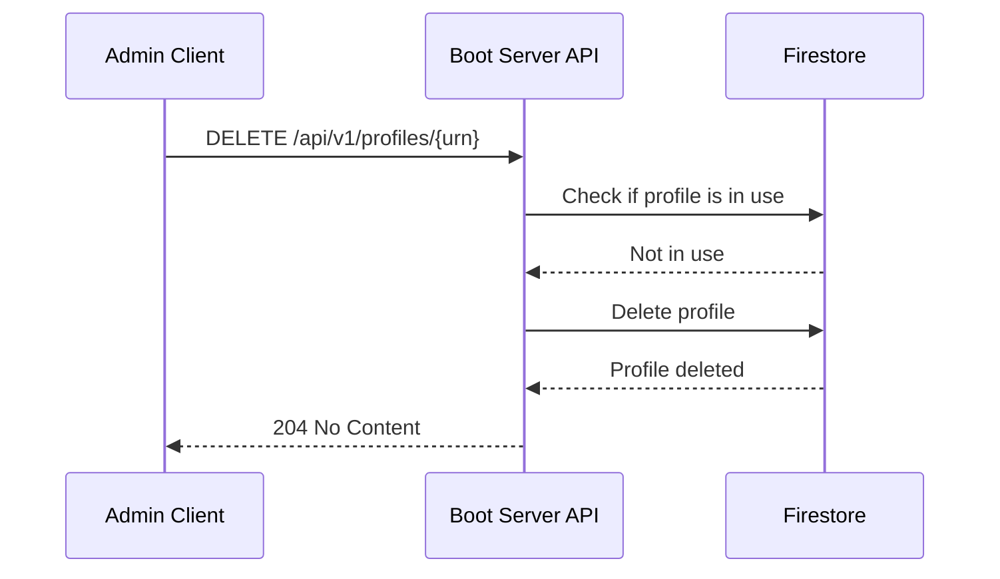

**Path Parameters:**

| Parameter | Type | Required | Description |
|-----------|------|----------|-------------|
| `id` | string (URN) | Yes | Boot profile identifier (URN format: `urn:boot:profile:{name}`) |

**Response (204 No Content):**

Empty response body.

**Error Responses:**

| Status Code | Description |
|-------------|-------------|
| 404 Not Found | Profile with specified ID not found |
| 409 Conflict | Profile is currently assigned to one or more machines |

---

## Machine Rollback

### `POST /api/v1/machines/{mac}/rollback`

Rollback a machine to its previous boot profile.

#### Sequence Diagram

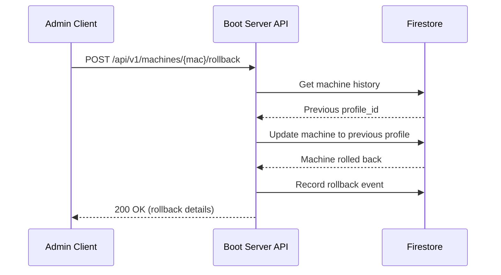

**Path Parameters:**

| Parameter | Type | Required | Description |
|-----------|------|----------|-------------|
| `mac` | string | Yes | MAC address (format: `aa:bb:cc:dd:ee:ff`) |

**Request Body:**

```json
{
  "reason": "Failed upgrade to new kernel version"
}
```

**Response (200 OK):**

```json
{
  "mac_address": "52:54:00:12:34:56",
  "hostname": "node-01",
  "profile_id": "urn:boot:profile:ubuntu-server-base",
  "previous_profile_id": "urn:boot:profile:ubuntu-server-v2",
  "rollback_reason": "Failed upgrade to new kernel version",
  "rollback_at": "2025-11-19T06:30:00Z"
}
```

**Error Responses:**

| Status Code | Description |
|-------------|-------------|
| 404 Not Found | Machine with specified MAC address not found |
| 409 Conflict | No previous profile available for rollback |

**Rollback History:**

The system maintains a history of profile changes to enable rollback:

- Up to 10 previous profile assignments per machine
- Rollback can be performed multiple times (limited by history depth)
- History includes timestamp, user, and reason for each change

---

## Data Models

### Boot Image

```typescript
interface BootImage {
  id: string;              // Unique identifier (e.g., "ubuntu-2204")
  name: string;            // Human-readable name
  version: string;         // Semantic version
  kernel: {
    url: string;           // Cloud Storage URL
    sha256: string;        // SHA-256 checksum
    size_bytes: number;    // File size in bytes
  };
  initrd: {
    url: string;           // Cloud Storage URL
    sha256: string;        // SHA-256 checksum
    size_bytes: number;    // File size in bytes
  };
  metadata: {
    os: string;            // Operating system (ubuntu, fedora, talos)
    os_version: string;    // OS version
    architecture: string;  // CPU architecture (x86_64, arm64)
    tags: string[];        // Custom tags
  };
  created_at: string;      // ISO 8601 timestamp
  created_by: string;      // User or service account email
}
```

### Machine

```typescript
interface Machine {
  mac_address: string;     // MAC address (primary key)
  hostname: string;        // Machine hostname
  profile_id: string;      // Reference to boot profile
  metadata: {
    datacenter?: string;
    rack?: string;
    role?: string;
    [key: string]: any;    // Custom metadata
  };
  network: {
    ip_address?: string;   // Static IP (optional)
    netmask?: string;
    gateway?: string;
    dns_servers?: string[];
  };
  created_at: string;      // ISO 8601 timestamp
  updated_at: string;      // ISO 8601 timestamp
}
```

### Boot Profile

```typescript
interface BootProfile {
  id: string;              // Unique identifier
  name: string;            // Human-readable name
  image_id: string;        // Reference to boot image
  kernel_args: string[];   // Kernel command-line arguments
  cloud_init_template: string; // Cloud-init template filename
  metadata: {
    description?: string;
    tags?: string[];
    [key: string]: any;    // Custom metadata
  };
  created_at: string;      // ISO 8601 timestamp
  updated_at: string;      // ISO 8601 timestamp
}
```

---

## Rate Limiting

Admin API endpoints are rate-limited to prevent abuse:

- **Per User/Service Account**: 100 requests/minute
- **Per IP Address**: 300 requests/minute
- **Global**: 1000 requests/minute

Rate limit headers are included in responses:

```
X-RateLimit-Limit: 100
X-RateLimit-Remaining: 95
X-RateLimit-Reset: 1700000000
```

When rate limit is exceeded, API returns `429 Too Many Requests`:

```json
{
  "error": {
    "code": "RATE_LIMIT_EXCEEDED",
    "message": "Rate limit exceeded. Try again in 30 seconds.",
    "details": {
      "retry_after": 30
    }
  }
}
```

---

## Versioning

The Admin API uses URL versioning (`/api/v1/`):

- **Current Version**: v1
- **Deprecation Policy**: Minimum 6 months notice before version deprecation
- **Version Header**: `X-API-Version: v1` included in all responses
