The Admin API provides HTTP REST endpoints for managing immutable boot profiles and machine mappings. Since this is for a home lab environment, no authentication is required.

## Boot Profile Management

Boot profiles are immutable resources that bundle kernel, initrd, kernel arguments, and metadata together. Once created, profiles cannot be modified - you must create a new profile for any changes.

### Cloud Storage Structure

Kernel and initrd binaries are stored in Google Cloud Storage using their UUIDv7 identifiers as object keys:

```
gs://{bucket}/blobs/{kernel_id}
gs://{bucket}/blobs/{initrd_id}
```

For example:
```
gs://boot-server-blobs/blobs/018c7dbd-b100-7000-8000-123456789abc
gs://boot-server-blobs/blobs/018c7dbd-b200-7000-8000-987654321fed
```

The UUIDv7 identifiers are generated server-side during upload, ensuring:
- Globally unique object keys
- Time-ordered storage (UUIDv7 timestamp prefix)
- Content-addressable storage pattern
- No namespace collisions between profiles

### `POST /api/v1/profiles`

Create a new immutable boot profile by uploading kernel, initrd, and configuration in a single request.

#### Sequence Diagram

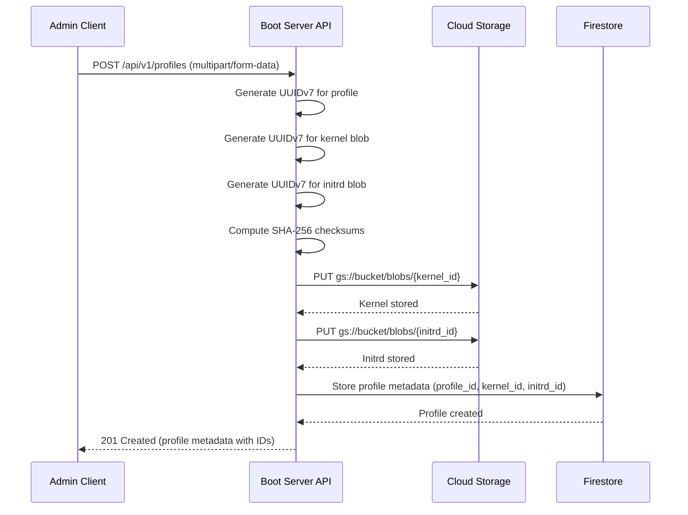

**Request Body (multipart/form-data):**

Form fields:
- `name` (text): Human-readable name
- `kernel` (file): Kernel image file
- `initrd` (file): Initrd image file
- `kernel_args` (JSON array): Kernel command-line arguments
- `metadata` (JSON object): Additional metadata (os, version, architecture, tags, etc.)

**Example Request:**

```http
POST /api/v1/profiles HTTP/1.1
Host: boot.example.com
Content-Type: multipart/form-data; boundary=----WebKitFormBoundary7MA4YWxkTrZu0gW

------WebKitFormBoundary7MA4YWxkTrZu0gW
Content-Disposition: form-data; name="name"

Ubuntu 22.04 LTS Server Base
------WebKitFormBoundary7MA4YWxkTrZu0gW
Content-Disposition: form-data; name="kernel"; filename="vmlinuz"
Content-Type: application/octet-stream

<kernel binary data>
------WebKitFormBoundary7MA4YWxkTrZu0gW
Content-Disposition: form-data; name="initrd"; filename="initrd.img"
Content-Type: application/octet-stream

<initrd binary data>
------WebKitFormBoundary7MA4YWxkTrZu0gW
Content-Disposition: form-data; name="kernel_args"
Content-Type: application/json

["console=tty0", "console=ttyS0", "ip=dhcp"]
------WebKitFormBoundary7MA4YWxkTrZu0gW
Content-Disposition: form-data; name="metadata"
Content-Type: application/json

{"os":"ubuntu","os_version":"22.04.3","architecture":"x86_64","tags":["lts","server"],"description":"Base Ubuntu server configuration"}
------WebKitFormBoundary7MA4YWxkTrZu0gW--
```

**Request Headers:**

- `Content-Type: multipart/form-data`

**Response (201 Created):**

```json
{
  "id": "018c7dbd-a000-7000-8000-abcdef123456",
  "name": "Ubuntu 22.04 LTS Server Base",
  "kernel": {
    "id": "018c7dbd-b100-7000-8000-123456789abc",
    "sha256": "a1b2c3d4e5f6789...",
    "size_bytes": 8388608
  },
  "initrd": {
    "id": "018c7dbd-b200-7000-8000-987654321fed",
    "sha256": "f6e5d4c3b2a19876...",
    "size_bytes": 52428800
  },
  "kernel_args": ["console=tty0", "console=ttyS0", "ip=dhcp"],
  "metadata": {
    "os": "ubuntu",
    "os_version": "22.04.3",
    "architecture": "x86_64",
    "tags": ["lts", "server"],
    "description": "Base Ubuntu server configuration"
  },
  "created_at": "2025-11-23T19:00:00Z"
}
```

**Error Responses:**

| Status Code | Description |
|-------------|-------------|
| 400 Bad Request | Invalid request body or missing required fields |
| 422 Unprocessable Entity | Validation error (file too large, invalid JSON) |

---

### `GET /api/v1/profiles`

List all boot profiles with metadata only (not binary content).

#### Sequence Diagram

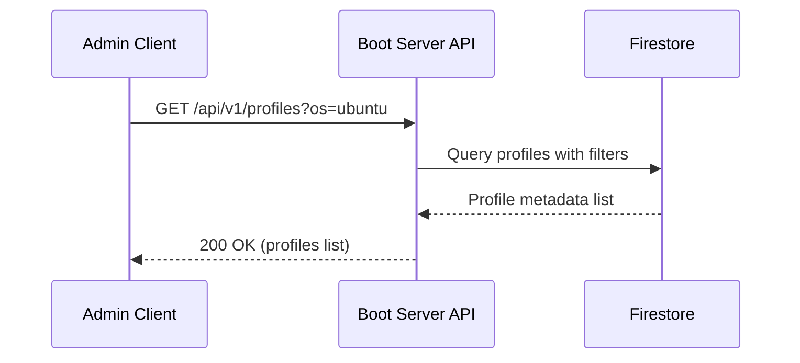

**Query Parameters:**

| Parameter | Type | Required | Description | Default |
|-----------|------|----------|-------------|---------|
| `page` | integer | No | Page number (1-indexed) | 1 |
| `per_page` | integer | No | Results per page (1-100) | 20 |
| `os` | string | No | Filter by operating system | - |
| `architecture` | string | No | Filter by architecture | - |
| `tags` | string | No | Filter by tags (comma-separated) | - |

**Response (200 OK):**

```json
{
  "profiles": [
    {
      "id": "018c7dbd-a000-7000-8000-abcdef123456",
      "name": "Ubuntu 22.04 LTS Server Base",
      "kernel": {
        "id": "018c7dbd-b100-7000-8000-123456789abc",
        "sha256": "a1b2c3d4e5f6789...",
        "size_bytes": 8388608
      },
      "initrd": {
        "id": "018c7dbd-b200-7000-8000-987654321fed",
        "sha256": "f6e5d4c3b2a19876...",
        "size_bytes": 52428800
      },
      "kernel_args": ["console=tty0", "console=ttyS0", "ip=dhcp"],
      "metadata": {
        "os": "ubuntu",
        "os_version": "22.04.3",
        "architecture": "x86_64",
        "tags": ["lts", "server"],
        "description": "Base Ubuntu server configuration"
      },
      "created_at": "2025-11-23T19:00:00Z"
    }
  ],
  "pagination": {
    "total": 1,
    "page": 1,
    "per_page": 20,
    "total_pages": 1
  }
}
```

---

### `GET /api/v1/profiles/{id}`

Retrieve metadata for a specific boot profile by ID (does not include binary content).

#### Sequence Diagram

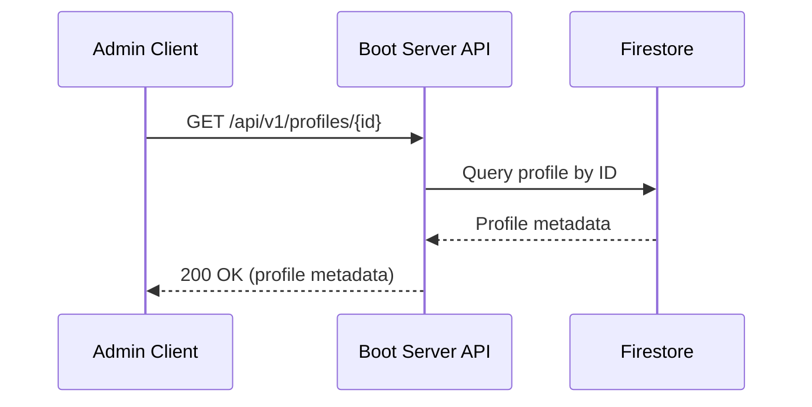

**Path Parameters:**

| Parameter | Type | Required | Description |
|-----------|------|----------|-------------|
| `id` | string | Yes | Boot profile identifier (UUIDv7 format) |

**Response (200 OK):**

```json
{
  "id": "018c7dbd-a000-7000-8000-abcdef123456",
  "name": "Ubuntu 22.04 LTS Server Base",
  "kernel": {
    "id": "018c7dbd-b100-7000-8000-123456789abc",
    "sha256": "a1b2c3d4e5f6789...",
    "size_bytes": 8388608
  },
  "initrd": {
    "id": "018c7dbd-b200-7000-8000-987654321fed",
    "sha256": "f6e5d4c3b2a19876...",
    "size_bytes": 52428800
  },
  "kernel_args": ["console=tty0", "console=ttyS0", "ip=dhcp"],
  "metadata": {
    "os": "ubuntu",
    "os_version": "22.04.3",
    "architecture": "x86_64",
    "tags": ["lts", "server"],
    "description": "Base Ubuntu server configuration"
  },
  "created_at": "2025-11-23T19:00:00Z"
}
```

**Error Responses:**

| Status Code | Description |
|-------------|-------------|
| 404 Not Found | Profile with specified ID not found |

---

### `GET /api/v1/profiles/{id}/kernel`

Download the kernel binary for a specific profile.

#### Sequence Diagram

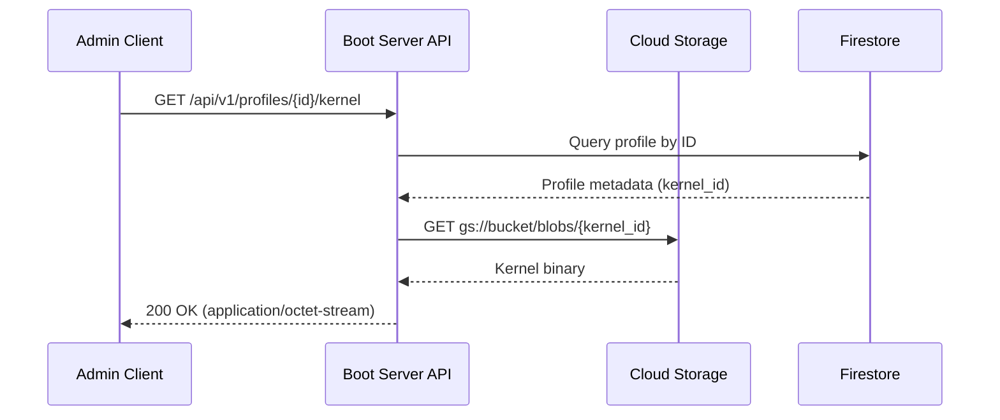

**Path Parameters:**

| Parameter | Type | Required | Description |
|-----------|------|----------|-------------|
| `id` | string | Yes | Boot profile identifier (UUIDv7 format) |

**Response (200 OK):**

- **Content-Type**: `application/octet-stream`
- **Body**: Binary kernel data

**Response Headers:**

```
Content-Type: application/octet-stream
Content-Length: 8388608
Content-Disposition: attachment; filename="vmlinuz"
X-Content-SHA256: a1b2c3d4e5f6789...
X-Blob-ID: 018c7dbd-b100-7000-8000-123456789abc
```

**Storage Path:**

The kernel is fetched from `gs://{bucket}/blobs/{kernel_id}` where `kernel_id` is the UUIDv7 identifier returned in the profile metadata.

**Error Responses:**

| Status Code | Description |
|-------------|-------------|
| 404 Not Found | Profile with specified ID not found |

---

### `GET /api/v1/profiles/{id}/initrd`

Download the initrd binary for a specific profile.

#### Sequence Diagram

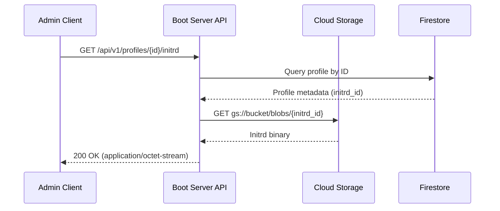

**Path Parameters:**

| Parameter | Type | Required | Description |
|-----------|------|----------|-------------|
| `id` | string | Yes | Boot profile identifier (UUIDv7 format) |

**Response (200 OK):**

- **Content-Type**: `application/octet-stream`
- **Body**: Binary initrd data

**Response Headers:**

```
Content-Type: application/octet-stream
Content-Length: 52428800
Content-Disposition: attachment; filename="initrd.img"
X-Content-SHA256: f6e5d4c3b2a19876...
X-Blob-ID: 018c7dbd-b200-7000-8000-987654321fed
```

**Storage Path:**

The initrd is fetched from `gs://{bucket}/blobs/{initrd_id}` where `initrd_id` is the UUIDv7 identifier returned in the profile metadata.

**Error Responses:**

| Status Code | Description |
|-------------|-------------|
| 404 Not Found | Profile with specified ID not found |

---

### `DELETE /api/v1/profiles/{id}`

Delete an immutable boot profile. Only allowed if no machines are currently using it.

#### Sequence Diagram

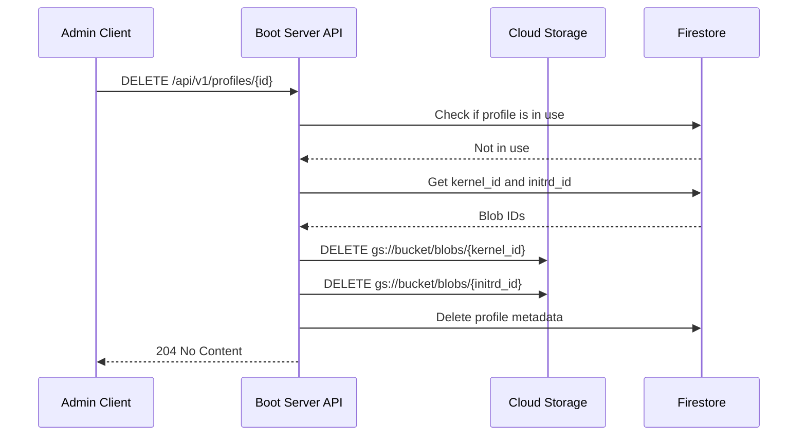

**Path Parameters:**

| Parameter | Type | Required | Description |
|-----------|------|----------|-------------|
| `id` | string | Yes | Boot profile identifier (UUIDv7 format) |

**Response (204 No Content):**

Empty response body.

**Error Responses:**

| Status Code | Description |
|-------------|-------------|
| 404 Not Found | Profile with specified ID not found |
| 409 Conflict | Profile is currently assigned to one or more machines |

---

## Machine Mapping Management

### `POST /api/v1/machines`

Register a new machine and map it to a boot profile.

#### Sequence Diagram

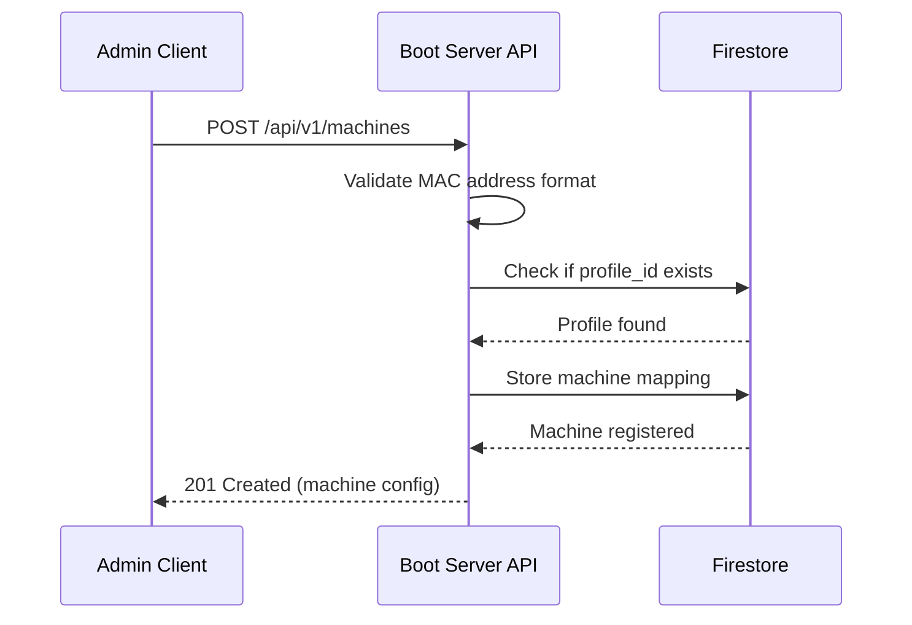

**Request Body:**

```json
{
  "mac_address": "52:54:00:12:34:56",
  "hostname": "node-01",
  "profile_id": "018c7dbd-a000-7000-8000-abcdef123456",
  "metadata": {
    "datacenter": "homelab",
    "rack": "A1",
    "role": "compute"
  },
  "network": {
    "ip_address": "10.0.1.10",
    "netmask": "255.255.255.0",
    "gateway": "10.0.1.1",
    "dns_servers": ["10.0.1.1", "8.8.8.8"]
  }
}
```

**Response (201 Created):**

```json
{
  "mac_address": "52:54:00:12:34:56",
  "hostname": "node-01",
  "profile_id": "018c7dbd-a000-7000-8000-abcdef123456",
  "metadata": {
    "datacenter": "homelab",
    "rack": "A1",
    "role": "compute"
  },
  "network": {
    "ip_address": "10.0.1.10",
    "netmask": "255.255.255.0",
    "gateway": "10.0.1.1",
    "dns_servers": ["10.0.1.1", "8.8.8.8"]
  },
  "created_at": "2025-11-23T19:00:00Z",
  "updated_at": "2025-11-23T19:00:00Z"
}
```

**Error Responses:**

| Status Code | Description |
|-------------|-------------|
| 400 Bad Request | Invalid MAC address format or missing required fields |
| 409 Conflict | Machine with the same MAC address already exists |
| 422 Unprocessable Entity | Referenced profile_id does not exist |

---

### `GET /api/v1/machines`

List all registered machines.

#### Sequence Diagram

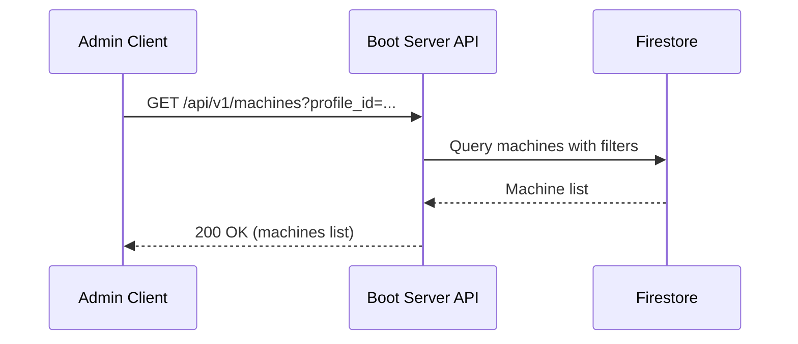

**Query Parameters:**

| Parameter | Type | Required | Description | Default |
|-----------|------|----------|-------------|---------|
| `page` | integer | No | Page number (1-indexed) | 1 |
| `per_page` | integer | No | Results per page (1-100) | 20 |
| `profile_id` | string | No | Filter by boot profile | - |
| `role` | string | No | Filter by machine role | - |

**Response (200 OK):**

```json
{
  "machines": [
    {
      "mac_address": "52:54:00:12:34:56",
      "hostname": "node-01",
      "profile_id": "018c7dbd-a000-7000-8000-abcdef123456",
      "metadata": {
        "datacenter": "homelab",
        "rack": "A1",
        "role": "compute"
      },
      "network": {
        "ip_address": "10.0.1.10",
        "netmask": "255.255.255.0",
        "gateway": "10.0.1.1",
        "dns_servers": ["10.0.1.1", "8.8.8.8"]
      },
      "created_at": "2025-11-23T19:00:00Z",
      "updated_at": "2025-11-23T19:00:00Z"
    }
  ],
  "pagination": {
    "total": 1,
    "page": 1,
    "per_page": 20,
    "total_pages": 1
  }
}
```

---

### `GET /api/v1/machines/{mac}`

Retrieve a specific machine configuration by MAC address.

#### Sequence Diagram

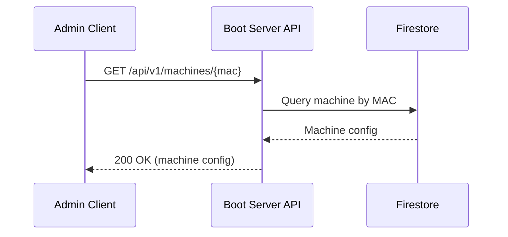

**Path Parameters:**

| Parameter | Type | Required | Description |
|-----------|------|----------|-------------|
| `mac` | string | Yes | MAC address (format: `aa:bb:cc:dd:ee:ff`) |

**Response (200 OK):**

Same as POST response.

**Error Responses:**

| Status Code | Description |
|-------------|-------------|
| 404 Not Found | Machine with specified MAC address not found |

---

### `PUT /api/v1/machines/{mac}`

Update a machine's configuration (primarily to change the assigned boot profile).

#### Sequence Diagram

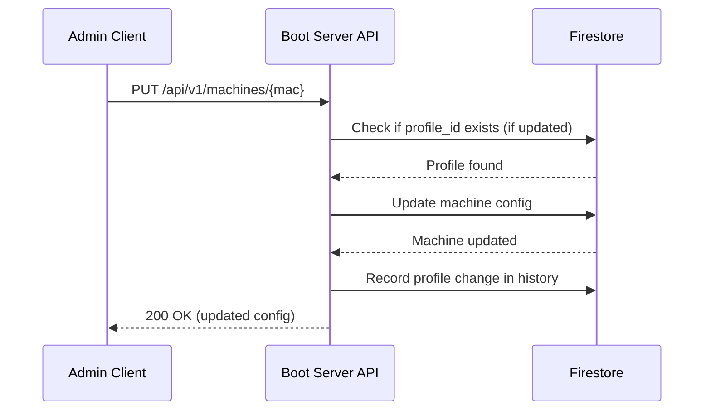

**Path Parameters:**

| Parameter | Type | Required | Description |
|-----------|------|----------|-------------|
| `mac` | string | Yes | MAC address (format: `aa:bb:cc:dd:ee:ff`) |

**Request Body:**

```json
{
  "profile_id": "018c7dbd-a000-7000-8000-000000000002",
  "metadata": {
    "datacenter": "homelab",
    "rack": "A1",
    "role": "storage"
  }
}
```

**Response (200 OK):**

Full machine configuration with updated fields.

**Error Responses:**

| Status Code | Description |
|-------------|-------------|
| 404 Not Found | Machine with specified MAC address not found |
| 422 Unprocessable Entity | Referenced profile_id does not exist |

---

### `DELETE /api/v1/machines/{mac}`

Delete a machine registration.

#### Sequence Diagram

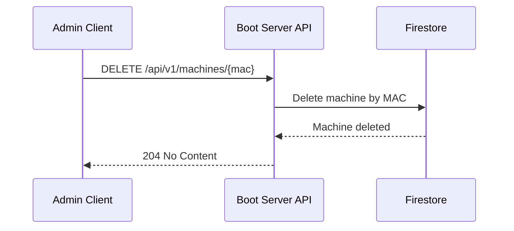

**Path Parameters:**

| Parameter | Type | Required | Description |
|-----------|------|----------|-------------|
| `mac` | string | Yes | MAC address (format: `aa:bb:cc:dd:ee:ff`) |

**Response (204 No Content):**

Empty response body.

**Error Responses:**

| Status Code | Description |
|-------------|-------------|
| 404 Not Found | Machine with specified MAC address not found |

---

## Machine Rollback

### `POST /api/v1/machines/{mac}/rollback`

Rollback a machine to its previous boot profile.

#### Sequence Diagram

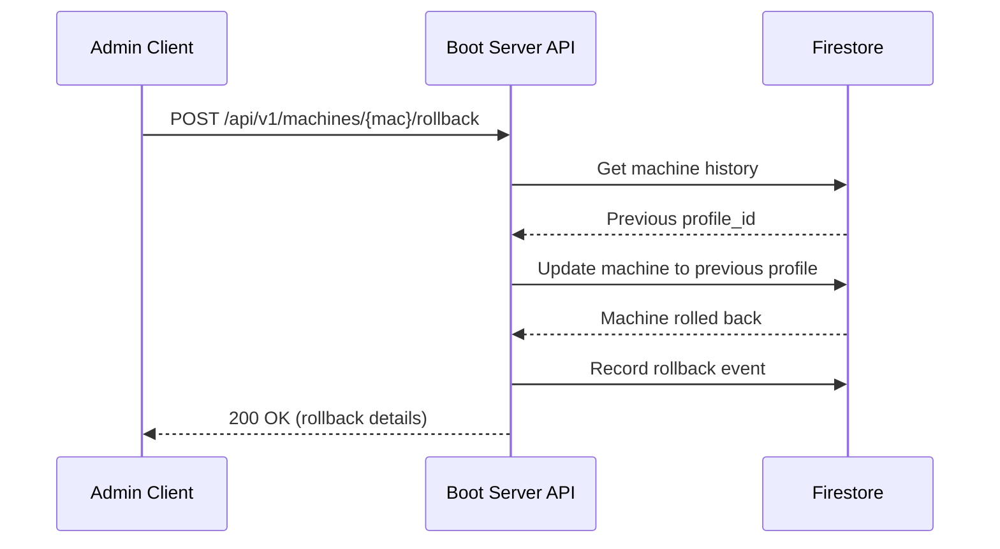

**Path Parameters:**

| Parameter | Type | Required | Description |
|-----------|------|----------|-------------|
| `mac` | string | Yes | MAC address (format: `aa:bb:cc:dd:ee:ff`) |

**Request Body:**

```json
{
  "reason": "Failed upgrade to new kernel version"
}
```

**Response (200 OK):**

```json
{
  "mac_address": "52:54:00:12:34:56",
  "hostname": "node-01",
  "profile_id": "018c7dbd-a000-7000-8000-abcdef123456",
  "previous_profile_id": "018c7dbd-a000-7000-8000-000000000002",
  "rollback_reason": "Failed upgrade to new kernel version",
  "rollback_at": "2025-11-23T19:30:00Z"
}
```

**Error Responses:**

| Status Code | Description |
|-------------|-------------|
| 404 Not Found | Machine with specified MAC address not found |
| 409 Conflict | No previous profile available for rollback |

**Rollback History:**

The system maintains a history of profile changes to enable rollback:

- Up to 10 previous profile assignments per machine
- Rollback can be performed multiple times (limited by history depth)
- History includes timestamp, user, and reason for each change

---

## Data Models

### Boot Profile

```typescript
interface BootProfile {
  id: string;              // UUIDv7 identifier
  name: string;            // Human-readable name
  kernel: {
    id: string;            // UUIDv7 blob identifier
    sha256: string;        // SHA-256 checksum
    size_bytes: number;    // File size in bytes
  };
  initrd: {
    id: string;            // UUIDv7 blob identifier
    sha256: string;        // SHA-256 checksum
    size_bytes: number;    // File size in bytes
  };
  kernel_args: string[];   // Kernel command-line arguments
  metadata: {
    os?: string;           // Operating system (ubuntu, fedora, talos)
    os_version?: string;   // OS version
    architecture?: string; // CPU architecture (x86_64, arm64)
    tags?: string[];       // Custom tags
    description?: string;  // Human-readable description
    [key: string]: any;    // Additional custom metadata
  };
  created_at: string;      // ISO 8601 timestamp (immutable)
}
```

### Machine

```typescript
interface Machine {
  mac_address: string;     // MAC address (primary key)
  hostname: string;        // Machine hostname
  profile_id: string;      // Reference to boot profile (UUIDv7)
  metadata: {
    datacenter?: string;
    rack?: string;
    role?: string;
    [key: string]: any;    // Custom metadata
  };
  network: {
    ip_address?: string;   // Static IP (optional)
    netmask?: string;
    gateway?: string;
    dns_servers?: string[];
  };
  created_at: string;      // ISO 8601 timestamp
  updated_at: string;      // ISO 8601 timestamp
}
```

---

## Rate Limiting

Admin API endpoints are rate-limited to prevent abuse:

- **Per User/Service Account**: 100 requests/minute
- **Per IP Address**: 300 requests/minute
- **Global**: 1000 requests/minute

Rate limit headers are included in responses:

```
X-RateLimit-Limit: 100
X-RateLimit-Remaining: 95
X-RateLimit-Reset: 1700000000
```

When rate limit is exceeded, API returns `429 Too Many Requests`:

```json
{
  "error": {
    "code": "RATE_LIMIT_EXCEEDED",
    "message": "Rate limit exceeded. Try again in 30 seconds.",
    "details": {
      "retry_after": 30
    }
  }
}
```

---

## Versioning

The Admin API uses URL versioning (`/api/v1/`):

- **Current Version**: v1
- **Deprecation Policy**: Minimum 6 months notice before version deprecation
- **Version Header**: `X-API-Version: v1` included in all responses
