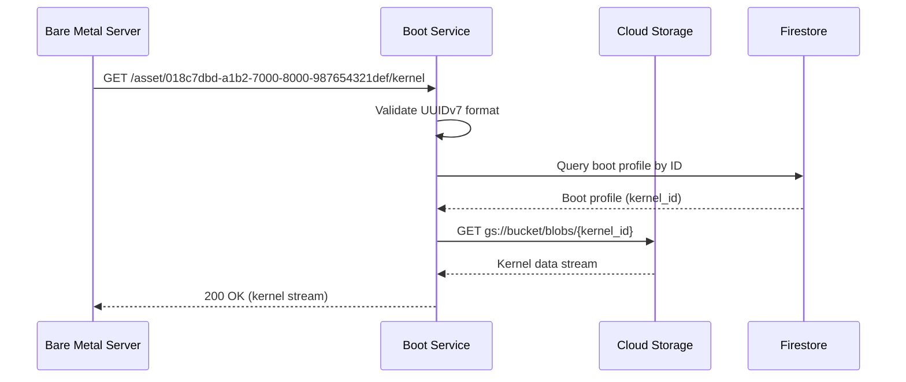

Streams kernel images from Cloud Storage for the boot process. This endpoint is accessed by bare metal servers during UEFI HTTP boot through the WireGuard VPN tunnel.

## Sequence Diagram



## Request

**Path Parameters:**

| Parameter | Type | Required | Description |
|-----------|------|----------|-------------|
| `boot_profile_id` | string (UUIDv7) | Yes | Boot profile identifier (UUIDv7 format: `018c7dbd-a1b2-7000-8000-987654321def`) |

**Request Example:**

```http
GET /asset/018c7dbd-a1b2-7000-8000-987654321def/kernel HTTP/1.1
Host: boot.internal
```

## Response

**Response Example (200 OK):**

Binary kernel image streamed from Cloud Storage.

**Response Headers:**

- `Content-Type: application/octet-stream`
- `Content-Length: 8388608` (actual kernel size in bytes)
- `Cache-Control: public, max-age=3600`
- `ETag: "abc123..."`

**Error Responses:**

| Status Code | Description | Example |
|-------------|-------------|---------|
| 404 Not Found | Kernel image not found | `{"error": {"code": "KERNEL_NOT_FOUND", "message": "Kernel image not found for boot profile"}}` |
| 500 Internal Server Error | Cloud Storage error | `{"error": {"code": "STORAGE_ERROR", "message": "Failed to retrieve kernel from storage"}}` |

## Performance Characteristics

- **Streaming**: File is streamed directly from Cloud Storage (no buffering in memory)
- **Target Latency**: < 100ms to first byte
- **Typical Size**: 8-15 MB for Linux kernels

## Security Considerations

### VPN Source IP Validation

All boot endpoints validate that requests originate from the WireGuard VPN subnet:

- **Allowed CIDR**: `10.x.x.0/24` (WireGuard VPN network)
- **Validation**: Performed at Cloud Run ingress or application layer
- **Rejection**: Requests from outside VPN return `403 Forbidden`

### Rate Limiting

To prevent abuse, asset download endpoints are rate-limited:

- **Asset Downloads**: 5 concurrent downloads per MAC address

### Asset Integrity

Boot assets are validated for integrity:

- **Checksums**: SHA-256 checksums stored in Firestore
- **Verification**: Computed on upload, verified on download (optional)
- **ETag Headers**: Enable client-side caching and integrity checks

## Observability

All boot endpoint requests are instrumented with OpenTelemetry following HTTP semantic conventions:

- **Metrics**: OpenTelemetry HTTP server metrics
  - `http.server.request.duration` - Request duration histogram
  - `http.server.response.body.size` - Response body size (tracks bytes transferred)
- **Traces**: End-to-end tracing from request to Cloud Storage retrieval
  - HTTP server span captures request details (method, route, status code)
  - Child spans for database queries and Cloud Storage operations
- **Logs**: Structured logs with boot profile ID, kernel ID, response status
