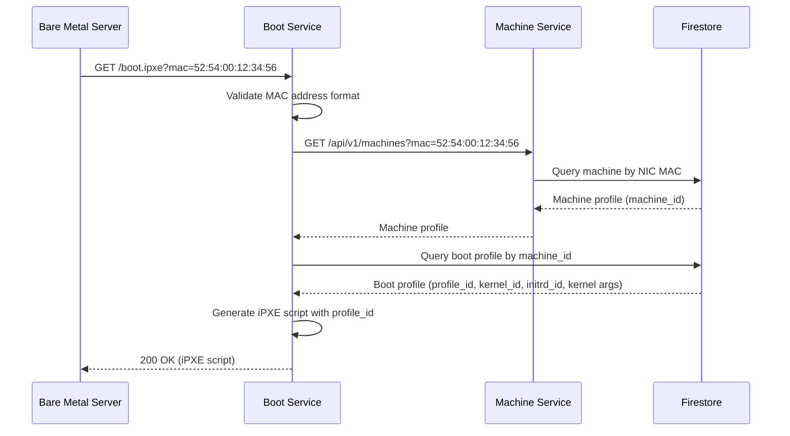

Serves iPXE boot scripts customized for the requesting machine based on its MAC address. This endpoint is accessed by bare metal servers (HP DL360 Gen 9) during the UEFI HTTP boot process through the WireGuard VPN tunnel.

## Sequence Diagram



## Request

**Query Parameters:**

| Parameter | Type | Required | Description |
|-----------|------|----------|-------------|
| `mac` | string | Yes | MAC address of the requesting machine (format: `aa:bb:cc:dd:ee:ff`) |

**Request Example:**

```http
GET /boot.ipxe?mac=52:54:00:12:34:56 HTTP/1.1
Host: boot.internal
```

## Response

**Response Example (200 OK):**

```text
#!ipxe

# Boot configuration for node-01 (52:54:00:12:34:56)
# Boot Profile ID: 018c7dbd-a1b2-7000-8000-987654321def
# Generated: 2025-11-19T06:00:00Z

kernel /asset/018c7dbd-a1b2-7000-8000-987654321def/kernel console=tty0 console=ttyS0 ip=dhcp
initrd /asset/018c7dbd-a1b2-7000-8000-987654321def/initrd
boot
```

**Response Headers:**

- `Content-Type: text/plain; charset=utf-8`
- `Cache-Control: no-cache, no-store, must-revalidate`

**Error Responses:**

| Status Code | Description | Example |
|-------------|-------------|---------|
| 400 Bad Request | Missing or invalid MAC address | `{"error": {"code": "INVALID_MAC_ADDRESS", "message": "MAC address must be in format aa:bb:cc:dd:ee:ff"}}` |
| 404 Not Found | No boot configuration found for MAC | `{"error": {"code": "MACHINE_NOT_CONFIGURED", "message": "No boot configuration found for MAC 52:54:00:12:34:56"}}` |
| 500 Internal Server Error | Database or template error | `{"error": {"code": "INTERNAL_ERROR", "message": "Failed to generate boot script"}}` |

## Boot Script Variables

The iPXE script may include the following dynamic values:

- Machine-specific kernel parameters
- Asset download URLs (using boot profile ID format)
- Network configuration parameters

## Security Considerations

### VPN Source IP Validation

All boot endpoints validate that requests originate from the WireGuard VPN subnet:

- **Allowed CIDR**: `10.x.x.0/24` (WireGuard VPN network)
- **Validation**: Performed at Cloud Run ingress or application layer
- **Rejection**: Requests from outside VPN return `403 Forbidden`

### Rate Limiting

To prevent abuse, boot endpoints are rate-limited:

- **Boot Script**: 10 requests/minute per MAC address

## Observability

All boot endpoint requests are instrumented with OpenTelemetry following HTTP semantic conventions:

- **Metrics**: OpenTelemetry HTTP server metrics (request count, duration, size)
  - `http.server.request.duration` - Request duration histogram
  - `http.server.request.body.size` - Request body size
  - `http.server.response.body.size` - Response body size
- **Traces**: End-to-end tracing from request to database retrieval
  - HTTP server span captures request details (method, route, status code)
  - Child spans for database queries and Machine Service API calls
- **Logs**: Structured logs with MAC address, boot profile ID, response status
