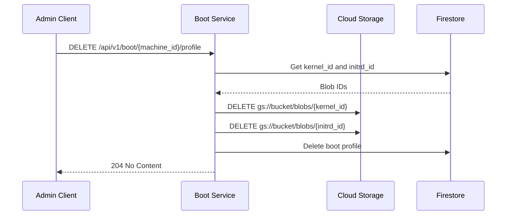

Delete a machine's boot profile and its associated blobs.

## Sequence Diagram



## Request

**Path Parameters:**

| Parameter | Type | Required | Description |
|-----------|------|----------|-------------|
| `machine_id` | string | Yes | Machine identifier (UUIDv7 format) |

**Example Request:**

```http
DELETE /api/v1/boot/018c7dbd-c000-7000-8000-fedcba987654/profile HTTP/1.1
Host: boot.example.com
```

## Response

**Response (204 No Content):**

Empty response body.

**Error Responses:**

| Status Code | Description |
|-------------|-------------|
| 404 Not Found | Machine not found or has no boot profile |
